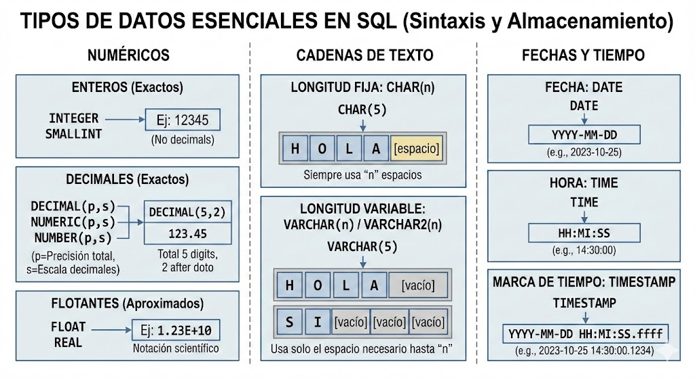

# Entrega 1: Introducción a SQL y Tipos de Datos Esenciales. (revisión de los tipos base: numéricos, cadenas y temporales).

---

# 🗄️ Introducción a SQL: DDL y Tipos de Datos

**SQL (Structured Query Language)** es el lenguaje estándar para interactuar con bases de datos relacionales.

---

## 📂 División del Lenguaje

SQL se divide en varios subgrupos según su función:

- **`DDL` (Data Definition Language):** Comandos para definir la **estructura** (crear tablas, alterar columnas, añadir restricciones).
    - *Ejemplos:* `CREATE`, `ALTER`, `DROP`.
- **`DML` (Data Manipulation Language):** Comandos para gestionar los **datos** dentro de esa estructura (insertar, actualizar, borrar, consultar).
    - *Ejemplos:* `INSERT`, `UPDATE`, `DELETE`, `SELECT`.

> ⚠️ REGLA DE ORO DEL DDL
Toda columna en una tabla debe tener obligatoriamente un nombre y un tipo de dato asociado.
> 

---

## 🔢 1. Tipos Numéricos

Se utilizan para operaciones matemáticas. La elección depende de si buscas **exactitud** o un **rango amplio**.

### **Enteros (Exactos)**

| Sintaxis | Uso | Límites |
| --- | --- | --- |
| `INTEGER` (o `INT`) | Números sin decimales estándar. | Hasta +/- 2 mil millones aprox. |
| `SMALLINT` | Números pequeños (ahorra espacio). | Rango menor que el `INT`. |
- **Ejemplo:** `edad INTEGER`

### **Decimales (Exactos) — ¡Sintaxis Crítica!**

Para valores donde no se permite redondeo impreciso (como el dinero).

- **Sintaxis Estándar:** `DECIMAL(p, s)` o `NUMERIC(p, s)`
- **Sintaxis Oracle:** `NUMBER(p, s)`

**Desglose de parámetros:**

- `p` (**Precisión**): Número **total** de dígitos permitidos (incluyendo decimales).
- `s` (**Escala**): Número de dígitos a la **derecha** del punto decimal.
- **Regla:** El número de dígitos enteros máximos es `p - s`.

> 💡 EJEMPLO DE CÁLCULO: precio DECIMAL(5, 2)
> 
> - ✅ **Correcto:** `123.45` (5 dígitos totales, 2 decimales).
> - ✅ **Correcto:** `12.3` (se guarda como `12.30`).
> - ❌ **Error de límite:** `1234.56` (Intenta guardar 6 dígitos totales, pero `p` es 5).
> - ⚠️ **Redondeo:** `123.456` → Se guarda como `123.46`.

---

## 🔤 2. Tipos de Cadenas de Texto

### **Longitud Fija**

- **Sintaxis:** `CHAR(n)`
- **Comportamiento:** Si la cadena es corta, Notion **rellena con espacios**.
- **Ejemplo:** `codigo_pais CHAR(3)`. Si guardas `'ES'`, se almacena `'ES '`.

### **Longitud Variable**

- **Sintaxis:** `VARCHAR(n)` (o `VARCHAR2(n)` en Oracle).
- **Comportamiento:** Solo usa el espacio necesario. Es más eficiente.
- **Ejemplo:** `nombre VARCHAR(50)`. Si guardas `'Ana'`, solo ocupa 3 caracteres.

---

## 📅 3. Tipos de Fecha y Tiempo

| Sintaxis | Almacena |
| --- | --- |
| `DATE` | Año, Mes, Día. (En Oracle incluye hora). |
| `TIME` | Solo la hora (HH:MM:SS). |
| `TIMESTAMP` | Fecha + Hora + Fracciones de segundo. |

