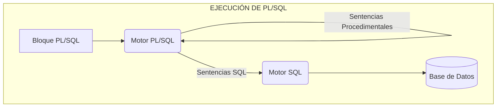
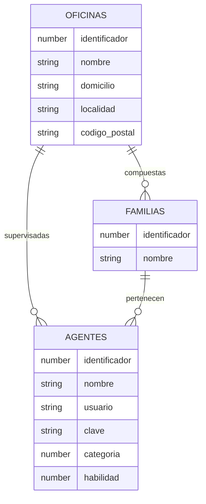
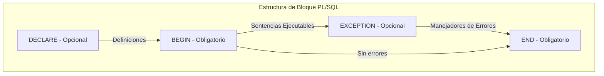
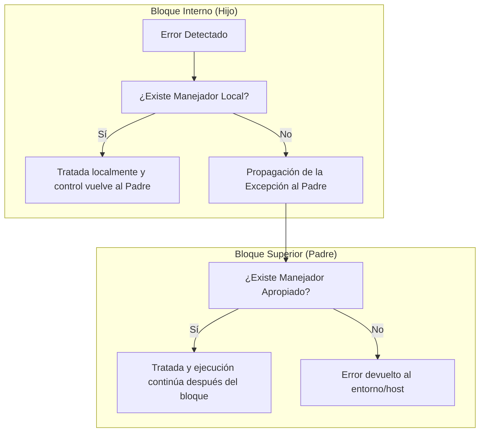

# 1. Introducción

Estarás pensado que si no tenemos bastante con aprender SQL, sino que ahora tenemos que aprender otro lenguaje más que lo único que va a hacer es complicarnos la vida. Verás que eso no es cierto ya que lo más importante, que es el conocimiento de SQL, ya lo tienes. PL/SQL tiene una sintaxis muy sencilla y verás como pronto te acostumbras y luego no podrás vivir sin él.

Pero, **¿qué es realmente PL/SQL?**, PL/SQL es un lenguaje procedimental estructurado en bloques que amplía la funcionalidad de SQL. Con PL/SQL podemos usar sentencias SQL para manipular datos y sentencias de control de flujo para procesar los datos. Por tanto, PL/SQL combina la potencia de SQL para la manipulación de datos, con la potencia de los lenguajes procedimentales para procesar los datos.

Aunque PL/SQL fue creado por Oracle, hoy día todos los gestores de bases de datos utilizan un lenguaje procedimental muy parecido al ideado por Oracle para poder programar las bases de datos.

Como veremos, en PL/SQL podemos definir variables, constantes, funciones, procedimientos, capturar errores en tiempo de ejecución, anidar cualquier número de bloques, etc., como solemos hacer en cualquier otro lenguaje de programación. Además, por medio de PL/SQL programaremos los disparadores de nuestra base de datos, tarea que no podríamos hacer sólo con SQL.

El motor de PL/SQL acepta como entrada bloques PL/SQL o subprogramas, ejecuta sentencias procedimentales y envía sentencias SQL al servidor de bases de datos. En el esquema adjunto puedes ver su funcionamiento.



Una de las grandes ventajas que nos ofrece PL/SQL es un mejor rendimiento en entornos de red cliente-servidor, ya que permite mandar bloques PL/SQL desde el cliente al servidor a través de la red, reduciendo de esta forma el tráfico y así no tener que mandar una a una las sentencias SQL correspondientes.
# 2. Caso de Estudio: Call Center

La mayoría de los ejemplos de la unidad están basados en este caso de estudio. Por lo tanto es recomendable la creación de las tablas y la inserción de datos que genera el siguiente script (CallCenter.sql). En el siguiente subcapítulo puedes ver cómo ejecutar el script con Oracle APEX.

**Enunciado:**

Una empresa de telefonía tiene sus centros de llamadas distribuidos por la geografía española en diferentes oficinas. Estas oficinas están jerarquizadas en familias de agentes telefónicos. Cada familia, por tanto, podrá contener agentes u otras familias. Los agentes telefónicos, según su categoría, además se encargarán de supervisar el trabajo de todos los agentes de una oficina o de coordinar el trabajo de los agentes de una familia dada. El único agente que pertenecerá directamente a una oficina y que no formará parte de ninguna familia será el supervisor de dicha oficina, cuya categoría es la 2. Los coordinadores de las familias deben pertenecer a dicha familia y su categoría será 1 (no todas las familias tienen por qué tener un coordinador y dependerá del tamaño de la oficina, ya que de ese trabajo también se puede encargar el supervisor de la oficina). Los demás agentes deberán pertenecer a una familia, su categoría será 0 y serán los que principalmente se ocupen de atender las llamadas.

*   De los agentes queremos conocer su nombre, su clave y contraseña para entrar al sistema, su categoría y su habilidad que será un número entre 0 y 9 indicando su habilidad para atender llamadas.
*   Para las familias sólo nos interesa conocer su nombre.
*   Finalmente, para las oficinas queremos saber su nombre, domicilio, localidad y código postal de la misma.

**Modelo Entidad-Relación:**



## 2.1. Ejecutando el script desde Oracle APEX

Aunque ya conocerás muchas maneras de ejecutar script vamos a ver aquí cómo realizarlo desde la opción Archivos de Comando SQL de Oracle APEX.

1º Una vez con la sesión iniciada en Oracle APEX accedemos a las opciones **Taller de SQL > Archivos de Comandos SQL**.

2º En esa pantalla hacemos clic sobre el botón **Cargar >**, a continuación se mostrará una ventana en la que se nos piden cumplimentar algunos datos sobre el archivo SQL que contiene el script. Tenemos que seleccionar el archivo indicando su ubicación en el disco y asignarle un nombre con el que quedará registrado en el sistema. También el juego de caracteres con el que se ha generado.

Al finalizar pulsaremos el botón azul que dice **Cargar**. Veremos que ahora el script aparece registrado en el sistema aunque por el momento no se ha ejecutado.

3º Ahora es el momento de hacer clic sobre el icono que se encuentra en la columna **Ejecutar**. El sistema nos pedirá confirmación.

Una vez que hagamos clic sobre **Ejecutar Ahora** el script será lanzado. Si todo es correcto obtendremos un resumen de ejecución como el que se ve en la imagen siguiente:
# 3. Conceptos básicos

En este apartado nos vamos a ir introduciendo poco a poco en los diferentes conceptos que debemos tener claros para programar en **PL/SQL**. Como para cualquier otro lenguaje de programación, debemos conocer las reglas de sintaxis que podemos utilizar, los diferentes elementos de que consta, los tipos de datos de los que disponemos, las estructuras de control que nos ofrece (tanto iterativas como condicionales) y cómo se realiza el manejo de los errores.

Como podrás comprobar, es todo muy sencillo y pronto estaremos escribiendo fragmentos de código que realizan alguna tarea particular. ¡Vamos a ello!

## 3.1. Unidades léxicas

En este apartado nos vamos a centrar en conocer cuáles son las unidades léxicas que podemos utilizar para escribir código en PL/SQL. Al igual que en nuestra lengua podemos distinguir diferentes unidades léxicas como palabras, signos de puntuación, etc. En los lenguajes de programación también existen diferentes unidades léxicas que definen los elementos más pequeños que tienen sentido propio y que al combinarlos de manera adecuada, siguiendo las reglas de sintaxis, dan lugar a sentencias válidas sintácticamente.

PL/SQL es un **lenguaje no sensible a las mayúsculas**, por lo que será equivalente escribir en mayúsculas o minúsculas, excepto cuando hablemos de literales de tipo cadena o de tipo carácter.

Cada unidad léxica puede estar separada por espacios (debe estar separada por espacios si se trata de 2 identificadores), por saltos de línea o por tabuladores para aumentar la legibilidad del código escrito.

`IF A=CLAVE THEN ENCONTRADO:=TRUE;ELSE ENCONTRADO:=FALSE;END IF;`

Sería equivalente a escribir la siguiente línea:

`if a=clave then encontrado:=true;else encontrado:=false;end if;`

Y también sería equivalente a este otro fragmento:

```sql
IF a = clave THEN
    encontrado := TRUE;
ELSE
    encontrado := FALSE;
END IF;
```

Las unidades léxicas se pueden clasificar en:

*   Delimitadores.
*   Identificadores.
*   Literales.
*   Comentarios.

Vamos a verlas más detenidamente.

### Delimitadores.

PL/SQL tiene un conjunto de símbolos denominados delimitadores utilizados para representar operaciones entre tipos de datos, delimitar comentarios, etc. En la siguiente tabla puedes ver un resumen de los mismos.

#### Delimitadores en PL/SQL.

| Delimitadores Simples. | | Delimitadores Compuestos. | |
| :--- | :--- | :--- | :--- |
| **Símbolo.** | **Significado.** | **Símbolo.** | **Significado.** |
| + | Suma. | ** | Exponenciación. |
| % | Indicador de atributo. | <> | Distinto. |
| . | Selector. | != | Distinto. |
| / | División. | <= | Menor o igual. |
| ( | Delimitador de lista. | >= | Mayor o igual. |
| ) | Delimitador de lista. | .. | Rango. |
| : | Variable host. | \|\| | Concatenación. |
| , | Separador de elementos. | << | Delimitador de etiquetas. |
| * | Producto. | >> | Delimitador de etiquetas. |
| " | Delimitador de identificador acotado. | -- | Comentario de una línea. |
| = | Igual relacional. | /* | Comentario de varias líneas. |
| < | Menor. | */ | Comentario de varias líneas. |
| > | Mayor. | := | Asignación. |
| @ | Indicador de acceso remoto. | => | Selector de nombre de parámetro. |
| ; | Terminador de sentencias. | | |
| - | Resta/negación. | | |

## 3.2. Unidades léxicas (II)

Ya hemos visto qué son los delimitadores. Ahora vamos a continuar viendo el resto de unidades léxicas que nos podemos encontrar en PL/SQL.

### Identificadores.

Los identificadores en PL/SQL, como en cualquier otro lenguaje de programación, son utilizados para nombrar elementos de nuestros programas. A la hora de utilizar los identificadores debemos tener en cuenta los siguientes aspectos:

*   Un identificador es una letra seguida opcionalmente de letras, números, $, _, #.
*   No podemos utilizar como identificador una palabra reservada.
    *   Ejemplos válidos: `X`, `A1`, `codigo_postal`.
    *   Ejemplos no válidos: `rock&roll`, `on/off`.
*   PL/SQL nos permite además definir los identificadores acotados, en los que podemos usar cualquier carácter con una longitud máxima de 30 y deben estar delimitados por ". Ejemplo: `"X*Y"`.
*   En PL/SQL existen algunos identificadores predefinidos y que tienen un significado especial ya que nos permitirán darle sentido sintáctico a nuestros programas. Estos identificadores son las palabras reservadas y no las podemos utilizar como identificadores en nuestros programas. Ejemplo: `IF`, `THEN`, `ELSE` ...
*   Algunas palabras reservadas para PL/SQL no lo son para SQL, por lo que podríamos tener una tabla con una columna llamada 'type' por ejemplo, que nos daría un error de compilación al referirnos a ella en PL/SQL. La solución sería acotarlos. `SELECT "TYPE" …`

### Literales.

Los literales se utilizan en las comparaciones de valores o para asignar valores concretos a los identificadores que actúan como variables o constantes. Para expresar estos literales tendremos en cuenta que:

*   Los literales numéricos se expresarán por medio de notación decimal o de notación exponencial. Ejemplos: `234`, `+341`, `2e3`, `-2E-3`, `7.45`, `8.1e3`.
*   Los literales tipo carácter y tipo cadena se deben delimitar con unas comillas simples.
*   Los literales lógicos son `TRUE` y `FALSE`.
*   El literal `NULL` que expresa que una variable no tiene ningún valor asignado.

### Comentarios.

En los lenguajes de programación es muy conveniente utilizar comentarios en mitad del código. Los comentarios no tienen ningún efecto sobre el código pero sí ayudan mucho al programador o la programadora a recordar qué se está intentando hacer en cada caso (más aún cuando el código es compartido entre varias personas que se dedican a mejorarlo o corregirlo).

En PL/SQL podemos utilizar dos tipos de comentarios:

*   Los comentarios de una línea se expresaran por medio del delimitador `--`. Ejemplo:
    `a:=b; --asignación`
*   Los comentarios de varias líneas se acotarán por medio de los delimitadores `/*` y `*/`. Ejemplo:
    ```sql
    /* Primera línea de comentarios.
       Segunda línea de comentarios. */
    ```

## 3.3. Tipos de datos simples, variables y constantes.

En cualquier lenguaje de programación, las variables y las constantes tienen un tipo de dato asignado (bien sea explícitamente o implícitamente). Dependiendo del tipo de dato el lenguaje de programación sabrá la estructura que utilizará para su almacenamiento, las restricciones en los valores que puede aceptar, la precisión del mismo, etc.

En PL/SQL contamos con todos los **tipos de datos simples** utilizados en SQL y algunos más. En este apartado vamos a enumerar los más utilizados.

### Numéricos.

*   `BINARY_INTEGER`: Tipo de dato numérico cuyo rango es de -2147483647 .. 2147483647. PL/SQL además define algunos subtipos de éste: `NATURAL`, `NATURALN`, `POSITIVE`, `POSITIVEN`, `SIGNTYPE`.
*   `NUMBER`: Tipo de dato numérico para almacenar números racionales. Podemos especificar su escala (-84 .. 127) y su precisión (1 .. 38). La escala indica cuándo se redondea y hacia dónde. Ejemplos. escala=2: 8.234 -> 8.23, escala=-3: 7689 -> 8000. PL/SQL también define algunos subtipos como: `DEC`, `DECIMAL`, `DOUBLE PRECISION`, `FLOAT`, `INTEGER`, `INT`, `NUMERIC`, `REAL`, `SMALLINT`.
*   `PLS_INTEGER`: Tipo de datos numérico cuyo rango es el mismo que el del tipo de dato `BINARY_INTEGER`, pero que su representación es distinta por lo que las operaciones aritméticas llevadas a cabo con los mismos serán más eficientes que en los dos casos anteriores.

### Alfanuméricos.

*   `CHAR(n)`: Array de n caracteres, máximo 2000 bytes. Si no especificamos longitud sería 1.
*   `LONG`: Array de caracteres con un máximo de 32760 bytes.
*   `RAW`: Array de bytes con un número máximo de 2000.
*   `LONG RAW`: Array de bytes con un máximo de 32760.
*   `VARCHAR2`: Tipo de dato para almacenar cadenas de longitud variable con un máximo de 32760.

### Grandes objetos.

*   `BFILE`: Puntero a un fichero del Sistema Operativo.
*   `BLOB`: Objeto binario con una capacidad de 4 GB (GigaByte.).
*   `CLOB`: Objeto carácter con una capacidad de 2 GB.

### Otros.

*   `BOOLEAN`: `TRUE/FALSE`.
*   `DATE`: Tipo de dato para almacenar valores día/hora desde el 1 enero de 4712 a.c. hasta el 31 diciembre de 4712 d.c.

Hemos visto los tipos de datos simples más usuales. Los tipos de datos compuestos los dejaremos para posteriores apartados.

## 3.4. Subtipos

Cuántas veces no has deseado cambiarle el nombre a las cosas por alguno más común para ti. Precisamente, esa es la posibilidad que nos ofrece PL/SQL con la utilización de los subtipos.

PL/SQL nos permite definir subtipos de tipos de datos para darles un nombre diferente y así aumentar la legibilidad de nuestros programas. Los tipos de operaciones aplicables a estos subtipos serán las mismas que los tipos de datos de los que proceden. La sintaxis será:

`SUBTYPE subtipo IS tipo_base;`

Donde `subtipo` será el nombre que le demos a nuestro subtipo y `tipo_base` será cualquier tipo de dato en PL/SQL.

A la hora de especificar el tipo base, podemos utilizar el modificador `%TYPE` para indicar el tipo de dato de una variable o de una columna de la base de datos y `%ROWTYPE` para especificar el tipo de un cursor o tabla de una base de datos.

```sql
SUBTYPE id_familia IS familias.identificador%TYPE;
SUBTYPE agente IS agentes%ROWTYPE;
```

Los subtipos no podemos restringirlos, pero podemos usar un truco para conseguir el mismo efecto y es por medio de una variable auxiliar:

```sql
SUBTYPE apodo IS varchar2(20); --ilegal
aux varchar2(20);
SUBTYPE apodo IS aux%TYPE; --legal
```

Los subtipos son intercambiables con su tipo base. También son intercambiables si tienen el mismo tipo base o si su tipo base pertenece a la misma familia:

```sql
DECLARE
    SUBTYPE numero IS NUMBER;
    numero_tres_digitos NUMBER(3);
    mi_numero_de_la_suerte numero;
    SUBTYPE encontrado IS BOOLEAN;
    SUBTYPE resultado IS BOOLEAN;
    lo_he_encontrado encontrado;
    resultado_busqueda resultado;
    SUBTYPE literal IS CHAR;
    SUBTYPE sentencia IS VARCHAR2;
    literal_nulo literal;
    sentencia_vacia sentencia;
BEGIN
    ...
    numero_tres_digitos := mi_numero_de_la_suerte; --legal
    ...
    lo_he_encontrado := resultado_busqueda; --legal
    ...
    sentencia_vacia := literal_nulo; --legal
    ...
END;
```

## 3.5. Variables

Llevamos un buen rato hablando de tipos de datos, variables e incluso de constantes y te estarás preguntando cuál es la forma adecuada de definirlas. En este apartado vamos a ver las diferentes posibilidades a la hora de definirlas y dejaremos para el apartado siguiente ver cuál es el lugar adecuado para hacerlo dentro de un bloque PL/SQL.

Para declarar variables o constantes pondremos el nombre de la variable, seguido del tipo de datos y opcionalmente una asignación. Si es una constante antepondremos la palabra `CONSTANT` al tipo de dato (lo que querrá decir que no podemos cambiar su valor). Podremos sustituir el operador de asignación en las declaraciones por la palabra reservada `DEFAULT`. También podremos forzar a que no sea nula utilizando la palabra `NOT NULL` después del tipo y antes de la asignación. Si restringimos una variable con `NOT NULL` deberemos asignarle un valor al declararla, de lo contrario PL/SQL lanzará la excepción `VALUE_ERROR` (no te asustes que más adelante veremos lo que son las excepciones, pero como adelanto te diré que es un error en tiempo de ejecución).

```sql
id SMALLINT;
hoy DATE := sysdate;
pi CONSTANT REAL:= 3.1415;
id SMALLINT NOT NULL; --ilegal, no está inicializada
id SMALLINT NOT NULL := 9999; --legal
```

El alcance y la visibilidad de las variables en PL/SQL será el típico de los lenguajes estructurados basados en bloques, aunque eso lo veremos más adelante.

### Conversión de tipos.

Aunque en PL/SQL existe la conversión implícita de tipos para tipos parecidos, siempre es aconsejable utilizar la conversión explícita de tipos por medio de funciones de conversión (`TO_CHAR`, `TO_DATE`, `TO_NUMBER`, …) y así evitar resultados inesperados.

### Precedencia de operadores.

Al igual que en nuestro lenguaje matemático se utiliza una precedencia entre operadores a la hora de realizar las operaciones aritméticas, en PL/SQL también se establece dicha precedencia para evitar confusiones. Si dos operadores tienen la misma precedencia lo aconsejable es utilizar los paréntesis (al igual que hacemos en nuestro lenguaje matemático) para alterar la precedencia de los mismos ya que las operaciones encerradas entre paréntesis tienen mayor precedencia. En la tabla siguiente se muestra la precedencia de los operadores de mayor a menor.

#### Precedencia de operadores.

| Operador. | Operación. |
| :--- | :--- |
| \*\*, NOT | Exponenciación, negación lógica. |
| +, - | Identidad, negación. |
| *, / | Multiplicación, división. |
| +, -, \|\| | Suma, resta y concatenación. |
| =, !=, <, >, <=, >=, IS NULL, LIKE, BETWEEN, IN | Comparaciones. |
| AND | Conjunción lógica |
| OR | Disyunción lógica. |

## 3.6. El bloque PL/SQL

Ya hemos visto las unidades léxicas que componen PL/SQL, los tipos de datos que podemos utilizar y cómo se definen las variables y las constantes. Ahora vamos a ver la unidad básica en PL/SQL que es el bloque.

Un bloque PL/SQL consta de tres zonas:

*   **Declaraciones**: definiciones de variables, constantes, cursores y excepciones.
*   **Proceso**: zona donde se realizará el proceso en sí, conteniendo las sentencias ejecutables.
*   **Excepciones**: zona de manejo de errores en tiempo de ejecución.



La sintaxis es la siguiente:

```sql
[DECLARE
    [Declaración de variables, constantes, cursores y excepciones]]
BEGIN
    [Sentencias ejecutables]
[EXCEPTION
    Manejadores de excepciones]
END;
```

Los bloques PL/SQL pueden anidarse a cualquier nivel. Como hemos comentado anteriormente el ámbito y la visibilidad de las variables es la normal en un lenguaje procedimental. Por ejemplo, en el siguiente fragmento de código se declara la variable `aux` en ambos bloques, pero en el bloque anidado `aux` con valor igual a 10 actúa de variable global y `aux` con valor igual a 5 actúa como variable local, por lo que en la comparación evaluaría a `FALSE`, ya que al tener el mismo nombre la visibilidad dominante sería la de la variable local.

```sql
DECLARE
    aux number := 10;
BEGIN
    DECLARE
        aux number := 5;
    BEGIN
        ...
        IF aux = 10 THEN --evalúa a FALSE, no entraría
            ...
        END IF;
    END;
END;
```

## 3.7. Estructuras de control: Alternativa IF

En la vida constantemente tenemos que tomar decisiones que hacen que llevemos a cabo unas acciones u otras dependiendo de unas circunstancias o repetir una serie de acciones un número dado de veces o hasta que se cumpla una condición. En PL/SQL también podemos imitar estas situaciones por medio de las estructuras de control que son sentencias que nos permiten manejar el flujo de control de nuestro programa, y éstas son dos: condicionales e iterativas.

### Control condicional.

Las estructuras de control condicional nos permiten llevar a cabo una acción u otra dependiendo de una condición. Vemos sus diferentes variantes:

*   **IF-THEN**: Forma más simple de las sentencias de control condicional. Si la evaluación de la condición es `TRUE`, entonces se ejecuta la secuencia de sentencias encerradas entre el `THEN` y el final de la sentencia.

| Sintaxis. | Ejemplo. |
| :--- | :--- |
| `IF condicion THEN` | `DECLARE` |
| `    secuencia_de_sentencias;` | `    a integer:=10;` |
| `END IF;` | `    B integer:=7;` |
| | `BEGIN` |
| | `    IF a>b THEN` |
| | `        dbms_output.put_line(a \|\| ' es mayor');` |
| | `    END IF;` |
| | `END;` |
| | `/` |

*   **IF-THEN-ELSE**: Con esta forma de la sentencia ejecutaremos la primera secuencia de sentencias si la condición evalúa a `TRUE` y en caso contrario ejecutaremos la segunda secuencia de sentencias.

| Sintaxis. | Ejemplo. |
| :--- | :--- |
| `IF condicion THEN` | `DECLARE` |
| `    Secuencia_de_sentencias1;` | `    a integer:=10;` |
| `ELSE` | `    b integer:=17;` |
| `    Secuencia_de_sentencias2;` | `BEGIN` |
| `END IF;` | `    IF a>b THEN` |
| | `        dbms_output.put_line(a \|\| ' es mayor');` |
| | `    ELSE` |
| | `        dbms_output.put_line(b \|\| ' es mayor o iguales');` |
| | `    END IF;` |
| | `END;` |
| | `/` |

*   **IF-THEN-ELSIF**: Con esta última forma de la sentencia condicional podemos hacer una selección múltiple. Si la evaluación de la condición 1 da `TRUE`, ejecutamos la secuencia de sentencias 1, sino evaluamos la condición 2. Si esta evalúa a `TRUE` ejecutamos la secuencia de sentencias 2 y así para todos los `ELSIF` que haya. El último `ELSE` es opcional y es por si no se cumple ninguna de las condiciones anteriores.

| Sintaxis. | Ejemplo. |
| :--- | :--- |
| `IF condicion THEN` | `DECLARE` |
| `    Secuencia_de_sentencias1;` | `    a integer:=17;` |
| `ELSIF condicion2 THEN` | `    b integer:=17;` |
| `    Secuencia_de_sentencias2;` | `BEGIN` |
| `...` | `    IF a>b THEN` |
| `[ELSE` | `        dbms_output.put_line(a \|\| ' es mayor');` |
| `    Secuencia_de_sentencias3;]` | `    ELSIF b>a THEN` |
| `END IF;` | `        dbms_output.put_line(b \|\| ' es mayor');` |
| | `    ELSE` |
| | `        dbms_output.put_line(a \|\| ' es igual a ' \|\| b);` |
| | `    END IF;` |
| | `END;` |
| | `/` |

## 3.8. Estructuras de control: bucles

Ya que hemos visto las estructuras de control condicional, veamos ahora las estructuras de control iterativo.

### Control iterativo.

Estas estructuras nos permiten ejecutar una secuencia de sentencias un determinado número de veces.

*   **LOOP**: La forma más simple es el bucle infinito, cuya sintaxis es:
    ```sql
    LOOP
        secuencia_de_sentencias;
    END LOOP;
    ```
*   **EXIT**: Con esta sentencia forzamos a un bucle a terminar y pasa el control a la siguiente sentencia después del bucle. Un `EXIT` no fuerza la salida de un bloque PL/SQL, sólo la salida del bucle.

#### Sentencia LOOP (EXIT EN IF).

| Sintaxis. | Ejemplo. |
| :--- | :--- |
| `LOOP;` | `DECLARE` |
| `...` | `    a integer :=1;` |
| `IF condición THEN` | `BEGIN` |
| `    EXIT;` | `    LOOP` |
| `END IF;` | `        dbms_output.put_line(a);` |
| `END LOOP;` | `        IF a>9 THEN` |
| | `            EXIT;` |
| | `        END IF;` |
| | `        a:=a+1;` |
| | `    END LOOP;` |
| | `END;` |
| | `/` |

*   **EXIT WHEN condicion**: Fuerza a salir del bucle cuando se cumple una determinada condición.
    `LOOP ... EXIT WHEN encontrado;`

#### Sentencia LOOP (EXIT EN WHEN).

| Sintaxis. | Ejemplo. |
| :--- | :--- |
| `LOOP` | `DECLARE` |
| `...` | `    a integer :=1;` |
| `EXIT WHEN condición;` | `BEGIN` |
| `...` | `    LOOP` |
| `END LOOP;` | `        dbms_output.put_line(a);` |
| | `        EXIT WHEN a>9;` |
| | `        a:=a+1;` |
| | `    END LOOP;` |
| | `END;` |
| | `/` |

*   **WHILE LOOP**: Este tipo de bucle ejecuta la secuencia de sentencias mientras la condición sea cierta.

#### Sentencia WHILE LOOP.

| Sintaxis. | Ejemplo. |
| :--- | :--- |
| `WHILE condicion LOOP` | `DECLARE` |
| `    Secuencia_de_sentencias;` | `    a integer :=1;` |
| `END LOOP;` | `BEGIN` |
| | `    WHILE a<10 LOOP` |
| | `        dbms_output.put_line(a);` |
| | `        a:=a+1;` |
| | `    END LOOP;` |
| | `END;` |
| | `/` |

*   **FOR LOOP**: Este bucle itera mientras el contador se encuentre en el rango definido.

#### Sentencia FOR LOOP.

| Sintaxis. | Ejemplo. |
| :--- | :--- |
| `FOR contador IN [REVERSE]` | `DECLARE` |
| `limite_inferior..limite_superior LOOP` | `    a integer;` |
| `    Secuencia_de_sentencias;` | `BEGIN` |
| `END LOOP;` | `    FOR a IN 1..10 LOOP -- ascendente de uno en uno` |
| | `        dbms_output.put_line(a);` |
| | `    END LOOP;` |
| | `    FOR a IN REVERSE 1..10 LOOP -- descendente de uno en uno` |
| | `        dbms_output.put_line(a);` |
| | `    END LOOP;` |
| | `END;` |
| | `/` |
# 4. Manejo de errores

Muchas veces te habrá pasado que surgen situaciones inesperadas con las que no contabas y a las que tienes que hacer frente. Pues cuando programamos con PL/SQL pasa lo mismo, que a veces tenemos que manejar errores debidos a situaciones diversas. Vamos a ver cómo tratarlos.

Cualquier situación de error es llamada **excepción** en PL/SQL. Cuando se detecta un error, una excepción es lanzada, es decir, la ejecución normal se para y el control se transfiere a la parte de manejo de excepciones. La parte de manejo de excepciones es la parte etiquetada como `EXCEPTION` y constará de sentencias para el manejo de dichas excepciones, llamadas **manejadores de excepciones**.

### Manejadores de excepciones.

| Sintaxis. | Ejemplo. |
| :--- | :--- |
| `WHEN nombre_excepcion THEN` | `DECLARE` |
| `<sentencias para su manejo>` | `    supervisor agentes%ROWTYPE;` |
| ` ....` | `BEGIN` |
| `WHEN OTHERS THEN` | `    SELECT * INTO supervisor FROM agentes WHERE categoria = 2 AND oficina = 3;` |
| `<sentencias para su manejo>` | `    ...` |
| | `EXCEPTION` |
| | `    WHEN NO_DATA_FOUND THEN` |
| | `        --Manejamos el no haber encontrado datos` |
| | `    WHEN OTHERS THEN` |
| | `        --Manejamos cualquier error inesperado` |
| | `END;` |

La parte `OTHERS` captura cualquier excepción no capturada.

Las excepciones pueden estar definidas por el usuario o definidas internamente. Las excepciones predefinidas se lanzarán automáticamente asociadas a un error de Oracle. Las excepciones definidas por el usuario deberán definirse y lanzarse explícitamente.

En PL/SQL nosotros podemos definir nuestras propias excepciones en la parte `DECLARE` de cualquier bloque. Estas excepciones podemos lanzarlas explícitamente por medio de la sentencia `RAISE nombre_excepción`.

### Excepciones definidas por el usuario.

| Sintaxis. | Ejemplo. |
| :--- | :--- |
| `DECLARE` | `DECLARE` |
| `    nombre_excepcion EXCEPTION;` | `    categoria_erronea EXCEPTION;` |
| `BEGIN` | `BEGIN` |
| `    ...` | `    ...` |
| `    RAISE nombre_excepcion;` | `    IF categoria<0 OR categoria>3 THEN` |
| `    ...` | `        RAISE categoria_erronea;` |
| `END;` | `    END IF;` |
| | `    ...` |
| | `    EXCEPTION WHEN categoria_erronea THEN` |
| | `        --manejamos la categoria errónea` |
| | `END;` |

Puedes ver algunas de las excepciones predefinidas de Oracle en el Anexo I de esta unidad.

## 4.1. Manejo de excepciones (I)

Ahora que ya sabemos lo que son las excepciones, cómo capturarlas y manejarlas y cómo definir y lanzar las nuestras propias. Es la hora de comentar algunos detalles sobre el uso de las mismas.

*   El alcance de una excepción sigue las mismas reglas que el de una variable, por lo que si nosotros redefinimos una excepción que ya es global para el bloque, la definición local prevalecerá y no podremos capturar esa excepción a menos que el bloque en la que estaba definida esa excepción fuese un bloque nombrado, y podremos capturarla usando la sintaxis: `nombre_bloque.nombre_excepcion`.
*   Las excepciones predefinidas están definidas globalmente. No necesitamos (ni debemos) redefinir las excepciones predefinidas.

```sql
DECLARE no_data_found EXCEPTION;
BEGIN
    SELECT * INTO ...
EXCEPTION
    WHEN no_data_found THEN --captura la excepción local, no la global
END;
```

*   Cuando manejamos una excepción no podemos continuar por la siguiente sentencia a la que la lanzó.

```sql
DECLARE
   ...
BEGIN
   ...
    INSERT INTO familias VALUES (id_fam, nom_fam, NULL, oficina);
    INSERT INTO agentes VALUES (id_ag, nom_ag, login, password, 0, 0, id_fam, NULL);
    ...
EXCEPTION WHEN DUP_VAL_ON_INDEX THEN --manejamos la excepción debida a que el nombre de
 --la familia ya existe, pero no podemos continuar por
 --el INSERT INTO agentes, a no ser que lo pongamos
 --explícitamente en el manejador
END;
```

*   Pero sí podemos encerrar la sentencia dentro de un bloque, y ahí capturar las posibles excepciones, para continuar con las siguientes sentencias.

```sql
DECLARE
    id_fam NUMBER;
    nom_fam VARCHAR2(40);
    oficina NUMBER;
    id_ag NUMBER;
    nom_ag VARCHAR2(60);
    usuario VARCHAR2(20);
    clave VARCHAR2(20);
BEGIN
    ...
    BEGIN
        INSERT INTO familias VALUES (id_fam, nom_fam, NULL, oficina);
    EXCEPTION
        WHEN DUP_VAL_ON_INDEX THEN
            SELECT identificador INTO id_fam FROM familias WHERE nombre = nom_fam;
    END;
    INSERT INTO agentes VALUES (id_ag, nom_ag, login, password, 1, 1, id_fam, null);
    ...
END;
```

## 4.2. Ejemplo: Excepción y transacción

Supongamos que queremos reintentar una transacción hasta que no nos dé ningún error. Para ello deberemos encapsular la transacción en un bloque y capturar en éste las posibles excepciones. El bloque lo metemos en un bucle y así se reintentará la transacción hasta que sea posible llevarla a cabo. Un posible código sería:

```sql
DECLARE
    id_fam NUMBER;
    nombre VARCHAR2(40);
    oficina NUMBER;
BEGIN
    ...
    LOOP
        BEGIN
            SAVEPOINT inicio;
            INSERT INTO familias VALUES (id_fam, nombre, NULL, oficina);
            ...
            COMMIT;
            EXIT;
        EXCEPTION
            WHEN DUP_VAL_ON_INDEX THEN ROLLBACK TO inicio;
            id_fam := id_fam + 1;
        END;
    END LOOP;
    ...
END;
```

## 4.3. Manejo de excepciones (II)

Continuemos viendo algunos detalles a tener en cuenta, relativos al uso de las excepciones.

*   Cuando ejecutamos varias sentencias seguidas del mismo tipo y queremos capturar alguna posible excepción debida al tipo de sentencia, podemos encapsular cada sentencia en un bloque y manejar en cada bloque la excepción, o podemos utilizar una variable localizadora para saber qué sentencia ha sido la que ha lanzado la excepción (aunque de esta manera no podremos continuar por la siguiente sentencia).

```sql
DECLARE
    sentencia NUMBER := 0;
BEGIN
    ...
    SELECT * FROM agentes ...
    sentencia := 1;
    SELECT * FROM familias ...
    sentencia := 2;
    SELECT * FROM oficinas ... ...
EXCEPTION WHEN NO_DATA_FOUND THEN
    IF sentencia = 0 THEN
        RAISE agente_no_encontrado;
    ELSIF sentencia = 1 THEN
        RAISE familia_no_encontrada;
    ELSIF sentencia = 2 THEN
        RAISE oficina_no_encontrada;
    END IF;
END;
```

*   Si la excepción es capturada por un manejador de excepción apropiado, ésta es tratada y posteriormente el control es devuelto al bloque superior. Si la excepción no es capturada y no existe bloque superior, el control se devolverá al entorno. También puede darse que la excepción sea manejada en un bloque superior a falta de manejadores para ella en los bloques internos, la excepción se propaga de un bloque al superior y así hasta que sea manejada o no queden bloques superiores con lo que el control se devuelve al entorno. Una excepción también puede ser relanzada en un manejador. En la siguiente presentación puedes ver cómo se propagan diferentes excepciones entre diferentes bloques.



## 4.4. Manejo de excepciones (III)

Oracle también permite que nosotros lancemos nuestros propios mensajes de error a las aplicaciones y asociarlos a un código de error que Oracle reserva, para no interferir con los demás códigos de error. Lo hacemos por medio del procedimiento:

`RAISE_APPLICATION_ERROR(error_number, message [, (TRUE|FALSE)]);`

Donde `error_number` es un entero negativo comprendido entre –20000..-20999 y `message` es una cadena que devolvemos a la aplicación. El tercer parámetro especifica si el error se coloca en la pila de errores (`TRUE`) o se vacía la pila y se coloca únicamente el nuestro (`FALSE`). Sólo podemos llamar a este procedimiento desde un subprograma.

No hay excepciones predefinidas asociadas a todos los posibles errores de Oracle, por lo que nosotros podremos asociar excepciones definidas por nosotros a errores Oracle, por medio de la directiva al compilador (o pseudoinstrucción):

`PRAGMA_INIT( nombre_excepcion, error_Oracle )`

Donde `nombre_excepcion` es el nombre de una excepción definida anteriormente, y `error_Oracle` es el número negativo asociado al error.

```sql
DECLARE
    no_null EXCEPTION;
    PRAGMA EXCEPTION_INIT(no_null, -1400);
    id familias.identificador%TYPE;
    nombre familias.nombre%TYPE;
BEGIN
    ...
    nombre := NULL;
    ...
    INSERT INTO familias VALUES (id, nombre, null, null);
EXCEPTION WHEN no_null THEN
    ...
END;
```

Oracle asocia 2 funciones para comprobar la ejecución de cualquier sentencia. `SQLCODE` nos devuelve el código de error y `SQLERRM` devuelve el mensaje de error asociado. Si una sentencia es ejecutada correctamente, `SQLCODE` nos devuelve 0 y en caso contrario devolverá un número negativo asociado al error (excepto `NO_DATA_FOUND` que tiene asociado el +100).

```sql
DECLARE
    cod number;
    msg varchar2(100);
BEGIN
    ...
EXCEPTION
    WHEN OTHERS THEN
        cod := SQLCODE;
        msg := SUBSTR(SQLERRM, 1, 1000);
        INSERT INTO errores VALUES (cod, msg);
END;
```