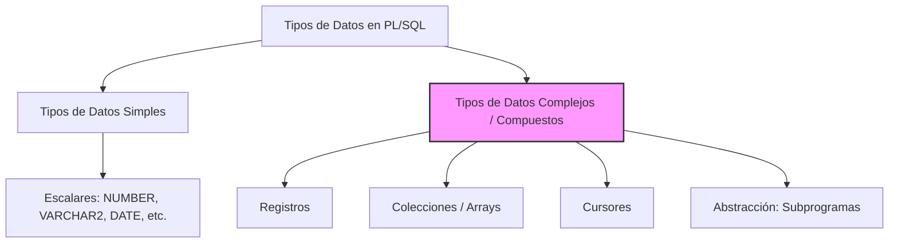
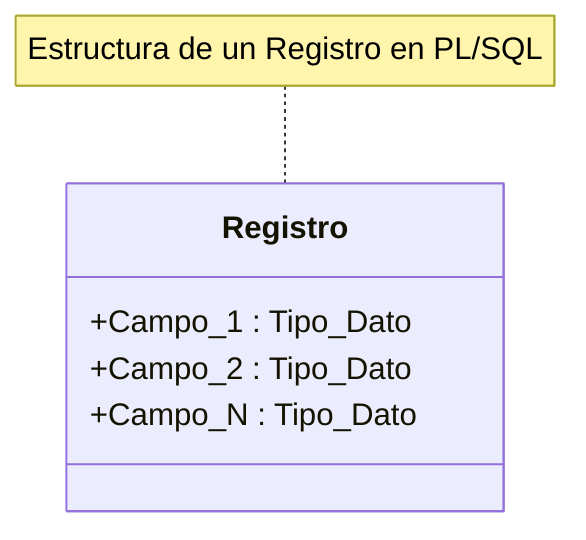
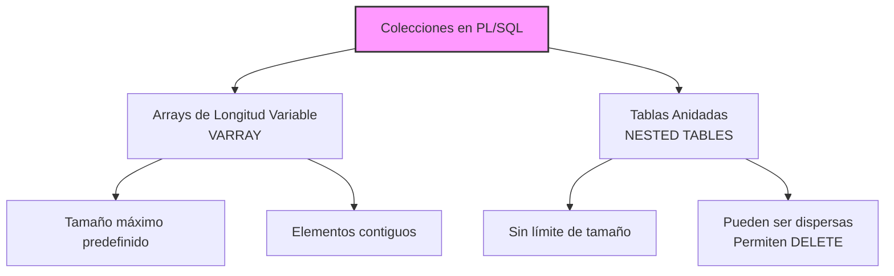
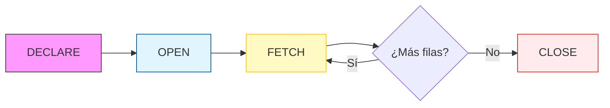
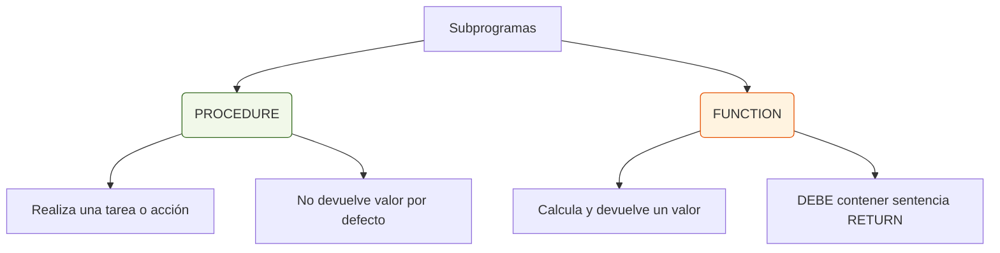

# 6.B. Tipos de datos compuestos, abstracción (copia)

## 1. Introducción

En el capítulo anterior, entre otras cosas, hemos conocido los tipos de datos simples con los que cuenta **PL/SQL**. Pero dependiendo de la complejidad de los problemas, necesitamos disponer de otras estructuras en las que apoyarnos para poder modelar nuestro problema. En este capítulo nos vamos a centrar en conocer los tipos de datos complejos que nos ofrece **PL/SQL** y cómo utilizarlos para así poder sacarle el mayor partido posible.


## 2. Registros

El uso de los registros es algo muy común en los lenguajes de programación. PL/SQL también nos ofrece este tipo de datos. En este apartado veremos qué son y cómo definirlos y utilizarlos.
Un registro es un grupo de elementos relacionados almacenados en campos, cada uno de los cuales tiene su propio nombre y tipo de dato.

Por ejemplo, una dirección podría ser un registro con campos como calle, número, piso, puerta, código postal, ciudad, provincia y país. Los registros hacen que la información sea más fácil de organizar y representar. Para declarar un registro seguiremos la siguiente sintaxis:

```sql
TYPE nombre_tipo IS RECORD (decl_campo[, decl_campo] ...);
```

donde:

```sql
decl_campo := nombre tipo [[NOT NULL] {:=|DEFAULT} expresion]
```

El tipo del campo será cualquier tipo de dato válido en PL/SQL excepto `REF CURSOR`. La expresión será cualquier expresión que evalúe al tipo de dato del campo.

```sql
TYPE direccion IS RECORD
(
  calle VARCHAR2(50),
  numero INTEGER(4),
  piso INTEGER(4),
  puerta VARCHAR2(2),
  codigo_postal INTEGER(5),
  ciudad VARCHAR2(30),
  provincia VARCHAR2(20),
  pais VARCHAR2(20) := 'España'
);

mi_direccion direccion;
```

Para acceder a los campos usaremos la notación del punto.

```sql
...
mi_direccion.calle := 'Ramirez Arellano';
mi_direccion.numero := 15;
...
```

Para asignar un registro a otro, éstos deben ser del mismo tipo, no basta que tengan el mismo número de campos y éstos emparejen uno a uno. Tampoco podemos comparar registros aunque sean del mismo tipo, ni tampoco comprobar si éstos son nulos. Podemos hacer `SELECT` en registros, pero no podemos hacer `INSERT` desde registros.

```sql
DECLARE
  TYPE familia IS RECORD
  (
    identificador NUMBER,
    nombre VARCHAR2(40),
    padre NUMBER,
    oficina NUMBER
  );

  TYPE familia_aux IS RECORD
  (
    identificador NUMBER,
    nombre VARCHAR2(40),
    padre NUMBER,
    oficina NUMBER
  );

  SUBTYPE familia_fila IS familias%ROWTYPE;
  mi_fam familia;
  mi_fam_aux familia_aux;
  mi_fam_fila familia_fila;

BEGIN
  ...
  mi_fam := mi_fam_aux; --illegal
  mi_fam := mi_fam_fila; --legal
  IF mi_fam IS NULL THEN ... --illegal
  IF mi_fam = mi_fam_fila THEN ... --illegal
  SELECT * INTO mi_fam FROM familias ... --legal
  INSERT INTO familias VALUES (mi_fam_fila); --illegal
  ...
END;
```



## 3. Colecciones

Una colección es un grupo ordenado de elementos, todos del mismo tipo. Cada elemento tiene un subíndice único que determina su posición en la colección. En PL/SQL las colecciones sólo pueden tener una dimensión. PL/SQL ofrece 2 clases de colecciones: arrays de longitud variable (`VARRAY`) y tablas anidadas.



### 3.1. Arrays de longitud variable (VARRAY)

Los elementos del tipo `VARRAY` son los llamados arrays de longitud variable. Son como los arrays de cualquier otro lenguaje de programación, pero con la salvedad de que a la hora de declararlos, nosotros indicamos su tamaño máximo y el array podrá ir creciendo dinámicamente hasta alcanzar ese tamaño. Un `VARRAY` siempre tiene un límite inferior igual a 1 y un límite superior igual al tamaño máximo.

Para declarar un `VARRAY` usaremos la sintaxis:

```sql
TYPE nombre IS {VARRAY | VARYING} (tamaño_máximo) OF tipo_elementos [NOT NULL];
```

Donde `tamaño_máximo` será un entero positivo y `tipo_elementos` será cualquier tipo de dato válido en PL/SQL, excepto `BINARY_INTEGER`, `BOOLEAN`, `LONG`, `LONG RAW`, `NATURAL`, `NATURALN`, `NCHAR`, `NCLOB`, `NVARCHAR2`, objetos que tengan como atributos `TABLE` o `VARRAY`, `PLS_INTEGER`, `POSITIVE`, `POSITIVEN`, `SIGNTYPE`, `STRING`, `TABLE`, `VARRAY`. Si `tipo_elementos` es un registro, todos los campos deberían ser de un tipo escalar.

Cuando definimos un `VARRAY`, éste es automáticamente nulo, por lo que para empezar a utilizarlo deberemos inicializarlo. Para ello podemos usar un constructor:

```sql
TYPE familias_hijas IS VARRAY(100) OF familia;
familias_hijas1 familias_hijas := familias_hijas( familia(100, 'Fam100', 10, null), ..., familia(105, 'Fam105', 10, null));
```

También podemos usar constructores vacíos:

```sql
familias_hijas2 familias_hijas := familias_hijas();
```

Para referenciar elementos en un `VARRAY` utilizaremos la sintaxis `nombre_colección(subíndice)`. Si una función devuelve un `VARRAY`, podemos usar la sintaxis:
`nombre_funcion(lista_parametros)(subindice)`.

```sql
IF familias_hijas1(i).identificador = 100 THEN ...
IF dame_familias_hijas(10)(i).identificador = 100 THEN ...
```

Un `VARRAY` puede ser asignado a otro si ambos son del mismo tipo.

```sql
DECLARE
  TYPE tabla1 IS VARRAY(10) OF NUMBER;
  TYPE tabla2 IS VARRAY(10) OF NUMBER;
  mi_tabla1 tabla1 := tabla1();
  mi_tabla2 tabla2 := tabla2();
  mi_tabla tabla1 := tabla1();
BEGIN
  ...
  mi_tabla := mi_tabla1; -- legal
  mi_tabla1 := mi_tabla2; -- ilegal
  ...
END;
```

#### Métodos de VARRAY

Para extender un `VARRAY` usaremos el método `EXTEND`.
- `EXTEND` sin parámetros: extendemos en 1 elemento nulo el `VARRAY`.
- `EXTEND(n)`: añade `n` elementos nulos al `VARRAY`.
- `EXTEND(n, i)`: añade `n` copias del i-ésimo elemento.

Otras funciones y propiedades útiles:
- `COUNT` nos dirá el número de elementos del `VARRAY`.
- `LIMIT` nos dice el tamaño máximo del `VARRAY`.
- `FIRST` siempre será 1.
- `LAST` siempre será igual a `COUNT`.
- `PRIOR` y `NEXT` devolverá el antecesor y el sucesor del elemento.

Al trabajar con `VARRAY` podemos hacer que salte alguna de las siguientes excepciones, debidas a un mal uso de los mismos: `COLECTION_IS_NULL`, `SUBSCRIPT_BEYOND_COUNT`, `SUBSCRIPT_OUTSIDE_LIMIT` y `VALUE_ERROR`.

#### Ejemplos de uso de los VARRAY

**Extender un VARRAY:**
```sql
DECLARE
  TYPE tab_num IS VARRAY(10) OF NUMBER;
  mi_tab tab_num;
BEGIN
  mi_tab := tab_num();
  FOR i IN 1..10 LOOP 
    mi_tab.EXTEND;
    mi_tab(i) := calcular_elemento(i);
  END LOOP;
  ...
END;
```

**Consultar propiedades VARRAY:**
```sql
DECLARE
  TYPE numeros IS VARRAY(20) OF NUMBER;
  tabla_numeros numeros := numeros();
  num NUMBER;
BEGIN
  num := tabla_numeros.COUNT; -- num := 0
  FOR i IN 1..10 LOOP
    tabla_numeros.EXTEND; 
    tabla_numeros(i) := i;
  END LOOP;
  num := tabla_numeros.COUNT; -- num := 10
  num := tabla_numeros.LIMIT; -- num := 20
  num := tabla_numeros.FIRST; -- num := 1;
  num := tabla_numeros.LAST;  -- num := 10;
  ...
END;
```

**Posibles excepciones:**
```sql
DECLARE
  TYPE numeros IS VARRAY(20) OF INTEGER; 
  v_numeros numeros := numeros( 10, 20, 30, 40 );
  v_enteros numeros;
BEGIN
  v_enteros(1) := 15; -- lanzaría COLECTION_IS_NULL
  v_numeros(5) := 20; -- lanzaría SUBSCRIPT_BEYOND_COUNT
  v_numeros(-1) := 5; -- lanzaría SUBSCRIPT_OUTSIDE_LIMIT 
  v_numeros('A') := 25; -- lanzaría VALUE_ERROR
  ...
END;
```

### 3.2. Tablas anidadas

Las tablas anidadas son colecciones de elementos, que no tienen límite superior fijo, y pueden aumentar dinámicamente su tamaño. Además podemos borrar elementos individuales.

Para declararlos utilizaremos la siguiente sintaxis:

```sql
TYPE nombre IS TABLE OF tipo_elementos [NOT NULL];
```

Donde `tipo_elementos` tendrá las mismas restricciones que para los `VARRAY`.

Al igual que pasaba con los `VARRAY`, al declarar una tabla anidada, ésta es automáticamente nula, por lo que deberemos inicializarla antes de usarla.

```sql
TYPE hijos IS TABLE OF agente;
hijos_fam hijos := hijos( agente(...) ...);
```

También podemos usar un constructor nulo. Para referenciar elementos usamos la misma sintaxis que para los `VARRAY`.

#### Métodos de Tablas Anidadas

Para extender una tabla usamos `EXTEND` exactamente igual que para los `VARRAY`.

Otras funciones y propiedades útiles:
- `COUNT`: nos dirá el número de elementos, que no tiene por qué coincidir con `LAST`.
- `LIMIT`: no tiene sentido y devuelve `NULL`.
- `EXISTS(n)`: devuelve `TRUE` si el elemento existe, y `FALSE` en otro caso (el elemento ha sido borrado).
- `FIRST`: devuelve el primer elemento que no siempre será 1, ya que hemos podido borrar elementos del principio.
- `LAST`: devuelve el último elemento.
- `PRIOR` y `NEXT`: nos dicen el antecesor y sucesor del elemento (ignorando elementos borrados).
- `TRIM`: sin argumentos borra un elemento del final de la tabla.
- `TRIM(n)`: borra `n` elementos del final de la tabla. `TRIM` opera en el tamaño interno, por lo que si encuentra un elemento borrado con `DELETE`, lo incluye para ser eliminado de la colección.
- `DELETE(n)`: borra el n-ésimo elemento.
- `DELETE(n, m)`: borra del elemento `n` al `m`. Si después de hacer `DELETE`, consultamos si el elemento existe nos devolverá `FALSE`.

Al trabajar con tablas anidadas podemos hacer que salte alguna de las siguientes excepciones, debidas a un mal uso de las mismas: `COLECTION_IS_NULL`, `NO_DATA_FOUND`, `SUBSCRIPT_BEYOND_COUNT` y `VALUE_ERROR`.

#### Ejemplos de uso de las tablas anidadas

**Diferentes operaciones sobre tablas anidadas:**
```sql
DECLARE
  TYPE numeros IS TABLE OF NUMBER;
  tabla_numeros numeros := numeros();
  num NUMBER;
BEGIN
  num := tabla_numeros.COUNT; -- num := 0
  FOR i IN 1..10 LOOP
    tabla_numeros.EXTEND;
    tabla_numeros(i) := i;
  END LOOP;
  num := tabla_numeros.COUNT; -- num := 10
  tabla_numeros.DELETE(10);
  num := tabla_numeros.LAST;  -- num := 9
  num := tabla_numeros.FIRST; -- num := 1
  tabla_numeros.DELETE(1);
  num := tabla_numeros.FIRST; -- num := 2
  FOR i IN 1..4 LOOP
    tabla_numeros.DELETE(2*i);
  END LOOP;
  num := tabla_numeros.COUNT; -- num := 4
  num := tabla_numeros.LAST;  -- num := 9
  ...
END;
```

**Posibles excepciones en su uso:**
```sql
DECLARE
  TYPE numeros IS TABLE OF NUMBER;
  tabla_num numeros := numeros();
  tabla1 numeros;
BEGIN
  tabla1(5) := 0;      -- lanzaría COLECTION_IS_NULL
  tabla_num.EXTEND(5);
  tabla_num.DELETE(4);
  tabla_num(4) := 3;   -- lanzaría NO_DATA_FOUND
  tabla_num(6) := 10;  -- lanzaría SUBSCRIPT_BEYOND_COUNT
  tabla_num(-1) := 0;  -- lanzaría SUBSCRIPT_OUTSIDE_LIMIT
  tabla_num('y') := 5; -- lanzaría VALUE_ERROR
END;
```
## 4. Cursores

En los apartados anteriores hemos visto tipos de datos compuestos cuyo uso es común en otros lenguajes de programación. Sin embargo, en PL/SQL contamos con un tipo de dato que, aunque se asemeje a otros, es exclusivo de la gestión de bases de datos: el **cursor**.

Un cursor es una estructura que apunta a un área de memoria (PGA) donde Oracle almacena el resultado de una consulta SQL. Permite procesar fila a fila el conjunto de resultados devuelto por una sentencia `SELECT`.

Existen dos tipos de cursores:
1.  **Cursores implícitos:** Oracle los abre automáticamente para cualquier sentencia SQL individual (`INSERT`, `UPDATE`, `DELETE` o `SELECT INTO`).
2.  **Cursores explícitos:** El programador los declara y controla manualmente para procesar consultas que devuelven múltiples filas.

### Atributos de un cursor

Oracle nos permite conocer el estado de un cursor (ya sea implícito o explícito) a través de sus atributos:

| Atributo | Descripción |
| :--- | :--- |
| `%FOUND` | Devuelve `TRUE` si la última sentencia afectó a alguna fila (DML) o si el último `FETCH` recuperó una fila. |
| `%NOTFOUND` | Es el inverso de `%FOUND`. `TRUE` si no se recuperaron filas o no hubo filas afectadas. |
| `%ISOPEN` | `TRUE` si el cursor está abierto. En cursores implícitos siempre es `FALSE` tras la ejecución. |
| `%ROWCOUNT` | Devuelve el número total de filas procesadas o recuperadas hasta ese momento. |

---

### 4.1. Cursores explícitos

Para utilizar un cursor explícito, debemos seguir un ciclo de vida específico de cuatro pasos:



1.  **DECLARE:** Se define la consulta SQL.
    ```sql
    CURSOR nombre_cursor [(parámetros)] IS sentencia_select;
    ```
2.  **OPEN:** Se ejecuta la consulta y se identifica el conjunto de resultados.
    ```sql
    OPEN nombre_cursor [(parámetros)];
    ```
3.  **FETCH:** Se recupera la fila actual en variables y se avanza el puntero.
    ```sql
    FETCH nombre_cursor INTO variable1, variable2...;
    ```
4.  **CLOSE:** Se libera el área de memoria utilizada.
    ```sql
    CLOSE nombre_cursor;
    ```

#### Ejemplo de procesamiento manual vs Bucle FOR
El bucle `FOR` de cursor simplifica enormemente el código al realizar el `OPEN`, `FETCH` y `CLOSE` de forma automática.

```sql
-- Procesamiento con bucle LOOP simple
BEGIN
  OPEN c_familias;
  LOOP
    FETCH c_familias INTO mi_id, mi_nom;
    EXIT WHEN c_familias%NOTFOUND;
    -- procesar datos...
  END LOOP;
  CLOSE c_familias;
END;

-- Procesamiento con bucle FOR (Recomendado)
BEGIN
  FOR registro IN c_familias LOOP
    -- El registro se declara implícitamente
    DBMS_OUTPUT.PUT_LINE(registro.nombre);
  END LOOP;
END;
```

---

### 4.2. Cursores variables (REF CURSOR)

A diferencia de los cursores estáticos, un **cursor variable** puede asociarse a diferentes consultas en tiempo de ejecución. Se utilizan como punteros dinámicos.

1.  **Definir el tipo:**
    ```sql
    TYPE tipo_cursor IS REF CURSOR [RETURN tipo_registro];
    ```
2.  **Declarar la variable y abrir:**
    ```sql
    v_cursor tipo_cursor;
    OPEN v_cursor FOR sentencia_select;
    ```

Este tipo de cursores es ideal para pasar conjuntos de resultados entre subprogramas.

---

## 5. Abstracción en PL/SQL

La abstracción es la capacidad de aislar la lógica compleja y darle un nombre. En PL/SQL esto se consigue mediante **subprogramas**: bloques de código nombrados que pueden recibir parámetros y ser invocados múltiples veces.

### 5.1. Subprogramas: Funciones y Procedimientos

Existen dos tipos principales de subprogramas:



#### Sintaxis de declaración
```sql
-- PROCEDIMIENTO
PROCEDURE nombre [(parámetros)] IS
  [declaraciones_locales]
BEGIN
  -- sentencias ejecutables
END;

-- FUNCIÓN
FUNCTION nombre [(parámetros)] RETURN tipo_dato IS
  [declaraciones_locales]
BEGIN
  -- sentencias ejecutables
  RETURN valor;
END;
```

#### Subprogramas Locales (Anidados)
Podemos definir subprogramas dentro de la sección de declaraciones de otro bloque. Estos solo serán visibles dentro de dicho bloque.

```sql
DECLARE
  hijos NUMBER;
  -- Definición local
  FUNCTION contar_hijos(id NUMBER) RETURN NUMBER IS
    v_count NUMBER;
  BEGIN
    SELECT COUNT(*) INTO v_count FROM agentes WHERE familia = id;
    RETURN v_count;
  END;
BEGIN
  hijos := contar_hijos(10);
  ...
END;
```

---

### 5.2. Almacenar subprogramas en la base de datos

Para que un subprograma sea permanente y accesible por otros procesos, se utiliza la cláusula `CREATE [OR REPLACE]`. Esto lo convierte en un objeto de esquema.

```sql
CREATE OR REPLACE FUNCTION calcular_impuestos(precio NUMBER) RETURN NUMBER IS
BEGIN
  RETURN precio * 0.21;
END;
/
```

#### Diccionario de Datos
Podemos consultar la metainformación de nuestros subprogramas almacenados:
- `USER_SOURCE`: Para recuperar el código fuente.
- `USER_ERRORS`: Para ver errores de compilación tras un `SHOW ERRORS`.
- `USER_OBJECTS`: Para ver el estado (`VALID`/`INVALID`) y fechas.

---

### 5.3. Parámetros de los subprogramas

Los parámetros permiten el intercambio de datos entre el bloque que llama y el subprograma.

#### Modos de parámetros
1.  **`IN` (por defecto):** El valor entra al subprograma pero no puede ser modificado dentro de él (es de solo lectura).
2.  **`OUT`:** El subprograma asigna un valor al parámetro para "devolverlo" al llamador.
3.  **`IN OUT`:** El valor entra, puede ser modificado y el resultado final se devuelve al llamador.

#### Invocación (Notación)
Al llamar a un subprograma con parámetros, podemos usar:
- **Posicional:** Los argumentos se pasan en el mismo orden que en la declaración.
- **Nombrada:** Se indica el nombre del parámetro formal (`p_id => 100`).
- **Mixta:** Los primeros se pasan por posición y el resto por nombre.

---

### 5.4. Sobrecarga y Recursividad

- **Sobrecarga (Overloading):** PL/SQL permite que dos o más subprogramas tengan el mismo nombre dentro de un mismo bloque o paquete, siempre que sus parámetros sean diferentes en número, orden o tipo.
- **Recursividad:** Ocurre cuando un subprograma se llama a sí mismo. Es útil para algoritmos que pueden definirse en términos de versiones más simples de sí mismos (como el cálculo del factorial).

```sql
-- Ejemplo conceptual de recursividad
FUNCTION factorial(n NUMBER) RETURN NUMBER IS
BEGIN
  IF n = 1 THEN
    RETURN 1;
  ELSE
    RETURN n * factorial(n - 1); -- Llamada recursiva
  END IF;
END;
```
