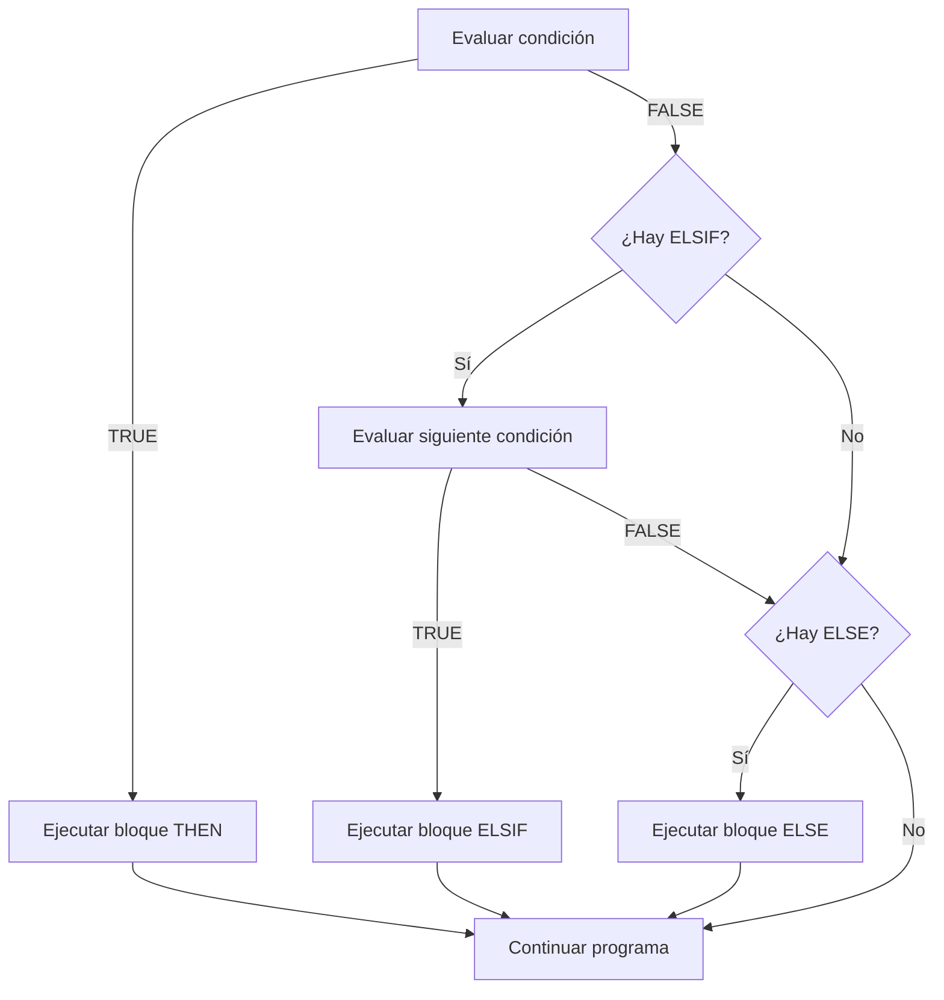

# 📘 Bloque 1 — Fundamentos: Variables, Tipos y Condicionales

[← Volver al Syllabus](../SYLLABUS.md)

---

## Anatomía de un bloque PL/SQL

Todo programa PL/SQL sigue esta estructura fija:

```sql
DECLARE   -- (opcional) declaración de variables, tipos, cursores
BEGIN     -- (obligatorio) lógica del programa
EXCEPTION -- (opcional) captura de errores
END;      -- cierre del bloque
```

> **Regla de oro:** `BEGIN` y `END;` son obligatorios. `DECLARE` y `EXCEPTION` son opcionales.

---

## Variables y tipos básicos

| Tipo | Uso | Ejemplo |
|------|-----|---------|
| `NUMBER` | Cualquier número | `NUMBER`, `NUMBER(5)`, `NUMBER(6,2)` |
| `VARCHAR2(n)` | Texto de hasta n caracteres | `VARCHAR2(30)` |
| `BOOLEAN` | Verdadero / falso | Solo en PL/SQL, NO en SQL puro |
| `DATE` | Fecha y hora | Se opera con `SYSDATE` |

### Precisión de NUMBER

```
NUMBER       → hasta 38 dígitos (sin restricción)
NUMBER(5)    → máximo 5 dígitos enteros (0-99999)
NUMBER(6,2)  → 4 enteros + 2 decimales (máx 9999.99)
```

---

## Operadores clave

| Operador | Significado | Ejemplo |
|----------|-------------|---------|
| `:=` | **Asignación** | `x := 5;` |
| `=` | **Comparación** | `IF x = 5 THEN` |
| `||` | **Concatenación** de cadenas | `'Hola' || ' ' || nombre` |

> ⚠️ **Error frecuente:** confundir `:=` con `=`. En PL/SQL, `=` NUNCA asigna.

---

## Variables de sustitución (&)

Las variables con `&` piden input al usuario en SQL*Plus / SQL Developer / DBeaver:

```sql
num1 NUMBER := &num1;           -- para números
apellido VARCHAR2(20) := '&apellido';  -- para texto (con comillas)
```

> ⚠️ `BOOLEAN` **no se puede leer con `&`**. Truco: lee un `NUMBER` (1 = TRUE, 0 = FALSE) y evalúa con IF.

---

## Condicional IF



```sql
IF (condicion) THEN
  -- se ejecuta si es verdad
ELSIF (otra_condicion) THEN  -- ¡OJO! ELSIF, no ELSEIF
  -- segunda condición
ELSE
  -- si ninguna anterior se cumple
END IF;
```

---

## Salida por pantalla

```sql
DBMS_OUTPUT.PUT_LINE('Texto a imprimir');
DBMS_OUTPUT.PUT_LINE('Resultado: ' || variable);
DBMS_OUTPUT.PUT_LINE('Suma: ' || (a + b));  -- paréntesis si hay operación
```

> **Requisito previo:** ejecutar `SET SERVEROUTPUT ON;` antes del bloque.

---

## Funciones matemáticas útiles

| Función | Qué hace | Ejemplo |
|---------|----------|---------|
| `POWER(base, exp)` | Potencia | `POWER(4, 2)` → 16 |
| `SQRT(n)` | Raíz cuadrada | `SQRT(25)` → 5 |
| `MOD(n, m)` | Resto de dividir n/m | `MOD(10, 3)` → 1 |

---

## Cheat Sheet — Bloque 1

```
┌───────────────────────────────────────┐
│  DECLARE                              │
│    variable TIPO [:= valor_inicial];  │
│  BEGIN                                │
│    variable := expresión;             │
│    IF (cond) THEN ... END IF;         │
│    DBMS_OUTPUT.PUT_LINE(...);         │
│  END;                                │
└───────────────────────────────────────┘
```

[← Volver al Syllabus](../SYLLABUS.md)
