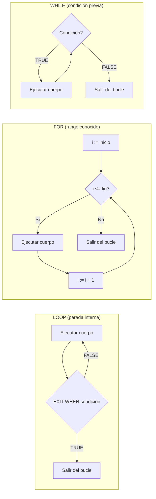

# 📘 Bloque 2 — Estructuras de Control: Bucles

[← Volver al Syllabus](../SYLLABUS.md)

---

## Los tres bucles de PL/SQL



| Bucle | Cuándo usarlo | Estructura |
|-------|--------------|------------|
| `LOOP` | No sabes cuántas iteraciones. La condición está **dentro**. | `LOOP ... EXIT WHEN cond; ... END LOOP;` |
| `FOR` | Sabes exactamente el número de iteraciones o el rango. | `FOR i IN inicio..fin LOOP ... END LOOP;` |
| `WHILE` | La condición se evalúa **antes** de cada iteración. | `WHILE cond LOOP ... END LOOP;` |

---

## Regla de decisión rápida

- El enunciado dice **"mientras que..."** → `WHILE`
- El enunciado dice **"n veces"** o **"del 1 al n"** → `FOR`
- El enunciado dice **"hasta que..."** o la condición depende del resultado → `LOOP`

---

## Patrón acumulador

La forma más habitual de sumar valores en un bucle:

```sql
DECLARE
  suma NUMBER := 0;  -- SIEMPRE inicializar a 0
BEGIN
  FOR i IN 1..10 LOOP
    suma := suma + i;  -- acumula en cada iteración
  END LOOP;
  DBMS_OUTPUT.PUT_LINE('Total: ' || suma);
END;
```

---

## Sintaxis de cada bucle

### LOOP (parada condicional)

```sql
DECLARE
  i NUMBER := 1;
BEGIN
  LOOP
    -- lógica
    EXIT WHEN i > 10;  -- condición de salida
    i := i + 1;
  END LOOP;
END;
```

### FOR (rango conocido)

```sql
BEGIN
  FOR i IN 1..10 LOOP
    -- i se declara sola, NO la pongas en DECLARE
    DBMS_OUTPUT.PUT_LINE(i);
  END LOOP;
END;
```

> ⚠️ La variable `i` del FOR es **implícita**. Si la declaras también en DECLARE, habrá conflicto.

### WHILE (condición previa)

```sql
DECLARE
  i NUMBER := 1;
BEGIN
  WHILE i <= 10 LOOP
    DBMS_OUTPUT.PUT_LINE(i);
    i := i + 1;  -- ¡No olvides incrementar!
  END LOOP;
END;
```

> ⚠️ Si `i` empezara en 11, WHILE **no entraría** al bucle. LOOP **sí** entraría una vez.

---

## Funciones matemáticas para bucles

| Función | Qué hace | Ejemplo |
|---------|----------|---------|
| `MOD(n, m)` | Resto de dividir n entre m | `MOD(9, 3) = 0` → es múltiplo |
| `SQRT(n)` | Raíz cuadrada | `SQRT(16)` → 4 |
| `POWER(b, e)` | Potencia | `POWER(2, 3)` → 8 |

---

## Cheat Sheet — Bloque 2

```
┌─────────────────────────────────────────────┐
│  LOOP ... EXIT WHEN condicion; END LOOP;    │
│  FOR i IN a..b LOOP ... END LOOP;           │
│  WHILE condicion LOOP ... END LOOP;         │
│                                             │
│  Acumulador: suma := suma + valor;          │
│  Múltiplo:   MOD(n, divisor) = 0            │
└─────────────────────────────────────────────┘
```

[← Volver al Syllabus](../SYLLABUS.md)
