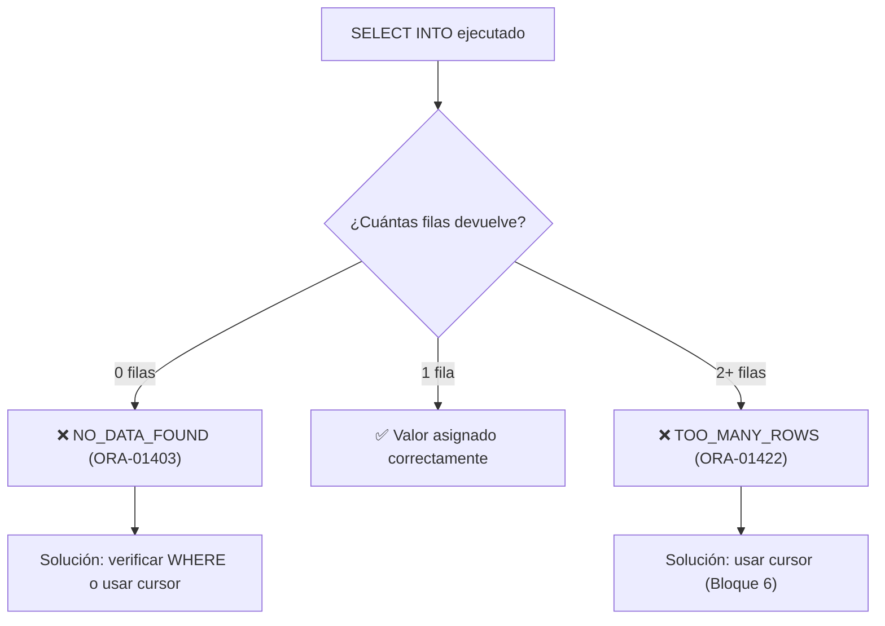

# 📘 Bloque 3 — Interacción con la BD: SELECT INTO, %TYPE, %ROWTYPE

[← Volver al Syllabus](../SYLLABUS.md)

---

## El problema de SELECT en PL/SQL

En SQL puro, un `SELECT` devuelve filas al cliente. En PL/SQL, necesitas **almacenar** el resultado en variables. Para eso existe `SELECT ... INTO`.

```sql
SELECT columna INTO variable FROM tabla WHERE condicion;
```

---

## Regla crítica de SELECT INTO



> **Exactamente 1 fila.** Esta restricción es lo que obliga a usar cursores cuando hay múltiples filas.

### Excepción segura: funciones de agregado

`COUNT(*)`, `SUM()`, `MAX()`, `MIN()`, `AVG()` **siempre devuelven 1 fila** (aunque sea NULL o 0). Son seguras con `SELECT INTO`.

---

## Anclar tipos con %TYPE

Declara la variable con el **mismo tipo que una columna de tabla**:

```sql
vnombre sedes.nombre%TYPE;
-- Si nombre es VARCHAR2(30), vnombre también lo será
```

**Ventaja:** si el DBA cambia `VARCHAR2(30)` a `VARCHAR2(50)`, tu código se adapta solo.

---

## Anclar tipos con %ROWTYPE

Declara una variable que tiene **un campo por cada columna** de la tabla:

```sql
fila_dep sedes%ROWTYPE;
-- fila_dep.depnu, fila_dep.nombre, fila_dep.localidad
```

Se carga con `SELECT * INTO fila_dep FROM tabla WHERE ...;`

---

## ¿Cuándo usar cada uno?

| Situación | Herramienta |
|-----------|-------------|
| Necesitas **una columna** | `%TYPE` |
| Necesitas **toda la fila** | `%ROWTYPE` |
| La variable no corresponde a ninguna columna | Tipo manual (`NUMBER`, `VARCHAR2`, etc.) |

---

## DBMS_RANDOM — Números aleatorios

| Expresión | Resultado |
|-----------|-----------|
| `DBMS_RANDOM.VALUE(a, b)` | Real en `[a, b)` (b **no** incluido) |
| `TRUNC(DBMS_RANDOM.VALUE(1, 11))` | Entero entre 1 y 10 |
| `TRUNC(DBMS_RANDOM.VALUE(10, 101))` | Entero entre 10 y 100 |

> **TRUNC vs ROUND:** usa `TRUNC` para truncar hacia abajo. Con `ROUND` podrías obtener el extremo superior (ej. 101 si el valor es 100.5).

---

## Formato de fechas

```sql
TO_CHAR(SYSDATE, 'DAY', 'NLS_DATE_LANGUAGE=SPANISH')  -- nombre del día
TO_CHAR(SYSDATE, 'D')     -- número del día de la semana
TO_CHAR(SYSDATE, 'DD')    -- día del mes
TO_CHAR(SYSDATE, 'MM')    -- mes numérico
TO_CHAR(SYSDATE, 'YYYY')  -- año
```

> **TRIM** es necesario con `'DAY'` porque Oracle rellena con espacios hasta la longitud del día más largo.

---

## Cheat Sheet — Bloque 3

```
┌──────────────────────────────────────────────────┐
│  SELECT col INTO var FROM tabla WHERE cond;      │
│  → Exactamente 1 fila o EXCEPCIÓN               │
│                                                  │
│  var tabla.col%TYPE;    → tipo de una columna    │
│  var tabla%ROWTYPE;     → tipo de toda la fila   │
│                                                  │
│  TRUNC(DBMS_RANDOM.VALUE(min, max_excl))         │
│  → Entero aleatorio en [min, max_excl - 1]       │
└──────────────────────────────────────────────────┘
```

[← Volver al Syllabus](../SYLLABUS.md)
