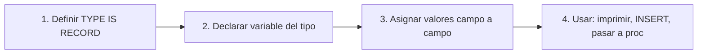

# 📘 Bloque 4 — Tipos Compuestos: Registros (RECORD)

[← Volver al Syllabus](../SYLLABUS.md)

---

## ¿Qué es un RECORD?

Un `RECORD` es un tipo de dato compuesto que agrupa varios campos de **distintos tipos** bajo un mismo nombre. Es equivalente a un `struct` en C o una clase de datos en Java.

```sql
TYPE nombre_tipo IS RECORD (
  campo1 tipo1,
  campo2 tipo2,
  campo3 tipo3
);
variable nombre_tipo;
```

---

## Flujo de trabajo con RECORD



---

## RECORD vs %ROWTYPE

| Característica | `RECORD` | `%ROWTYPE` |
|---------------|----------|------------|
| Definición | Manual (tú defines campos) | Automática (copia de tabla) |
| Acoplamiento | **Independiente** de la tabla | **Acoplado** a la tabla |
| Flexibilidad | Campos personalizados | Solo los de la tabla |
| Mantenimiento | Manual si cambia la estructura | Automático |

> **Regla:** usa `%ROWTYPE` si tus campos coinciden exactamente con una tabla. Usa `RECORD` si necesitas una estructura personalizada.

---

## Asignación de valores

```sql
-- Campo a campo (siempre funciona)
vtipopro.campo1 := 100;
vtipopro.campo2 := 'MARTILLO';

-- Desde SELECT INTO (asigna por posición)
SELECT productonu, nombre, precio, stock
INTO   vtipopro
FROM   items
WHERE  productonu = 30;
-- campo1 = productonu, campo2 = nombre, etc.
```

---

## DML con RECORD

```sql
-- INSERT: especificar campo a campo en VALUES
INSERT INTO items (productonu, nombre, precio, stock)
VALUES (r.campo1, r.campo2, r.campo3, r.campo4);

-- DELETE usando un campo del registro
DELETE FROM items
WHERE productonu = r.campo1;
```

> ⚠️ Oracle **no soporta** `INSERT INTO tabla VALUES registro` directamente (en versiones estándar).

---

## SQL%ROWCOUNT

Atributo implícito que devuelve el **número de filas afectadas** por la última sentencia DML:

```sql
DELETE FROM items WHERE productonu = vtipopro.campo1;
DBMS_OUTPUT.PUT_LINE('Filas borradas: ' || SQL%ROWCOUNT);
-- Si devuelve 0, el registro no existía
```

---

## Cheat Sheet — Bloque 4

```
┌───────────────────────────────────────────────┐
│  TYPE tipo IS RECORD (                        │
│    campo1 tipo1,                              │
│    campo2 tipo2                               │
│  );                                           │
│  var tipo;                                    │
│                                               │
│  var.campo1 := valor;  → asignación manual    │
│  SELECT ... INTO var;  → asignación por pos.  │
│  SQL%ROWCOUNT          → filas DML afectadas  │
└───────────────────────────────────────────────┘
```

[← Volver al Syllabus](../SYLLABUS.md)
