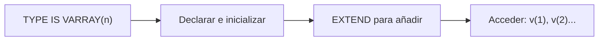

# 📘 Bloque 5 — Tipos Compuestos: Arrays (VARRAY)

[← Volver al Syllabus](../SYLLABUS.md)

---

## ¿Qué es un VARRAY?

Colección **ordenada** y **acotada**. Índices desde **1** (no desde 0).

```sql
TYPE nombre IS VARRAY(max) OF tipo_elemento;
variable nombre := nombre();  -- inicializar SIEMPRE
```

---

## Ciclo de vida



---

## Inicialización obligatoria

Sin inicializar → `ORA-06531`. Dos formas:

```sql
v tvarray := tvarray('A','B');  -- con valores
v tvarray := tvarray();         -- vacío pero listo
```

## EXTEND

```sql
v.EXTEND;      -- +1 posición NULL
v.EXTEND(3);   -- +3 posiciones NULL
```

## Métodos

| Método | Devuelve |
|--------|----------|
| `v.FIRST` | Índice del primero (siempre 1) |
| `v.LAST` | Índice del último (= COUNT) |
| `v.COUNT` | Elementos actuales |
| `v.LIMIT` | Máximo definido en TYPE |

## Recorrer

```sql
FOR i IN v.FIRST..v.LAST LOOP
  DBMS_OUTPUT.PUT_LINE(v(i));
END LOOP;
```

## VARRAY de RECORDS

```sql
TYPE tpersona IS RECORD (edad NUMBER, nombre VARCHAR2(30));
TYPE tapersona IS VARRAY(10) OF tpersona;
vt tapersona := tapersona();
vt.EXTEND;
vt(1).edad := 25;
vt(1).nombre := 'ANA';
```

[← Volver al Syllabus](../SYLLABUS.md)
