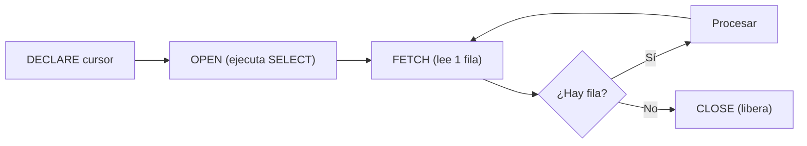

# 📘 Bloque 6 — Cursores

[← Volver al Syllabus](../SYLLABUS.md)

---

## ¿Por qué cursores?

`SELECT INTO` falla con más de 1 fila. Los **cursores** son punteros a un conjunto de resultados que recorres fila a fila.

## Ciclo de vida



## Atributos de cursor

| Atributo | Significado |
|----------|-------------|
| `%FOUND` | TRUE si el último FETCH obtuvo fila |
| `%NOTFOUND` | TRUE si no obtuvo fila (fin) |
| `%ROWCOUNT` | Filas leídas hasta ahora |
| `%ISOPEN` | TRUE si está abierto |

## FORMA 1 — Cursor explícito con WHILE

```sql
OPEN c1;
FETCH c1 INTO var;          -- "cebar" el bucle
WHILE c1%FOUND LOOP
  -- procesar var
  FETCH c1 INTO var;        -- avanzar (¡obligatorio!)
END LOOP;
CLOSE c1;
```

> ⚠️ Olvidar el segundo FETCH = **bucle infinito**.

## FORMA 2 — FOR implícito

```sql
FOR reg IN c1 LOOP
  -- reg tiene los campos de cada fila
  DBMS_OUTPUT.PUT_LINE(reg.nombre);
END LOOP;
-- Oracle abre, hace FETCH y cierra automáticamente
```

## FORMA 3 — LOOP + EXIT WHEN

```sql
OPEN c1;
LOOP
  FETCH c1 INTO var;
  EXIT WHEN c1%NOTFOUND;
  -- procesar var
END LOOP;
CLOSE c1;
```

## Cursor con parámetros

```sql
CURSOR c1(param NUMBER) IS
  SELECT nombre FROM items WHERE productonu = param;
-- Se pasa el valor al abrir:
OPEN c1(20);
```

## REF CURSOR (cursor variable)

No apunta a una consulta fija. Se puede reutilizar con distintas consultas:

```sql
TYPE ref_cur IS REF CURSOR;
c ref_cur;
OPEN c FOR SELECT nombre FROM items;        -- 1ª consulta
-- ... FETCH, CLOSE ...
OPEN c FOR SELECT nombre FROM sedes;     -- 2ª consulta (otra tabla)
```

[← Volver al Syllabus](../SYLLABUS.md)
