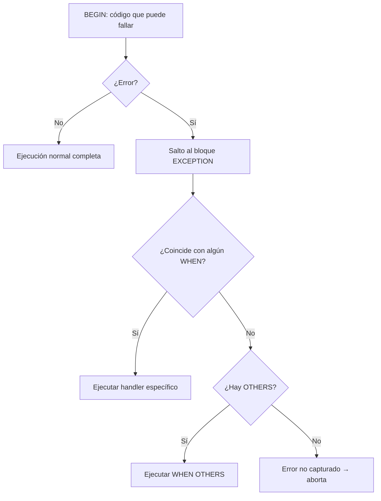

# 📘 Bloque 7 — Excepciones

[← Volver al Syllabus](../SYLLABUS.md)

---

## ¿Qué son las excepciones?

Eventos de error que interrumpen el flujo. Sin bloque `EXCEPTION`, el error aborta la ejecución.

## Flujo de una excepción



## Estructura

```sql
BEGIN
  -- código que puede fallar
EXCEPTION
  WHEN excepcion1 THEN ...
  WHEN excepcion2 THEN ...
  WHEN OTHERS THEN ...     -- captura todo lo demás
END;
```

## Excepciones predefinidas

| Nombre | Código Oracle | Cuándo ocurre |
|--------|--------------|---------------|
| `NO_DATA_FOUND` | ORA-01403 | SELECT INTO → 0 filas |
| `TOO_MANY_ROWS` | ORA-01422 | SELECT INTO → 2+ filas |
| `ZERO_DIVIDE` | ORA-01476 | División entre cero |
| `VALUE_ERROR` | ORA-06502 | Conversión o truncamiento |
| `DUP_VAL_ON_INDEX` | ORA-00001 | Violación UNIQUE |

## Variables de diagnóstico

- `SQLCODE` → código numérico del error
- `SQLERRM` → mensaje de texto del error

## Excepción de usuario

```sql
DECLARE
  mi_error EXCEPTION;
BEGIN
  IF condicion THEN RAISE mi_error; END IF;
EXCEPTION
  WHEN mi_error THEN
    DBMS_OUTPUT.PUT_LINE('Error personalizado');
END;
```

## PRAGMA EXCEPTION_INIT

Liga una excepción a un código Oracle del rango `-20000` a `-20999`:

```sql
mi_error EXCEPTION;
PRAGMA EXCEPTION_INIT(mi_error, -20015);
```

[← Volver al Syllabus](../SYLLABUS.md)
