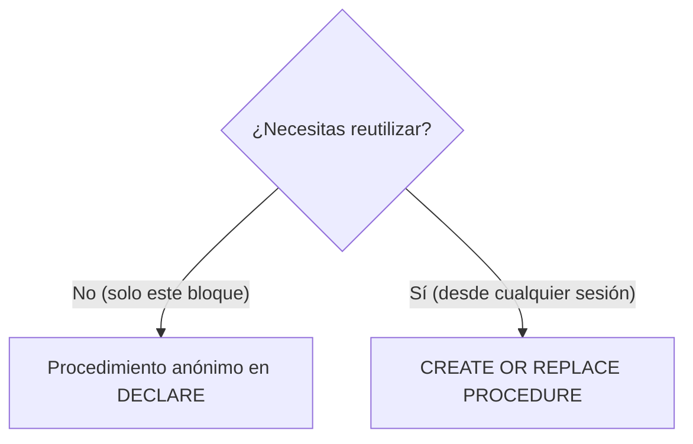

# 📘 Bloque 8 — Procedimientos

[← Volver al Syllabus](../SYLLABUS.md)

---

## ¿Qué es un procedimiento?

Bloque PL/SQL con nombre que recibe parámetros y ejecuta lógica. **No devuelve valor directamente** (para eso están las funciones), pero puede devolver valores por parámetros `OUT`.

## Modos de parámetro

| Modo | Dirección | Lectura | Escritura | Se pasa como |
|------|-----------|---------|-----------|--------------|
| `IN` | Entrada | Sí | No | Valor o expresión |
| `OUT` | Salida | No | Sí | **Variable** obligatoria |
| `IN OUT` | Ambos | Sí | Sí | **Variable** obligatoria |

> ⚠️ Parámetros OUT/IN OUT **solo aceptan variables**, nunca literales. `p(20, 0)` → ERROR si el segundo es OUT.

## Anónimo vs Almacenado



### Anónimo (local al bloque)

```sql
DECLARE
  PROCEDURE mi_proc(x IN NUMBER) IS
  BEGIN
    DBMS_OUTPUT.PUT_LINE(x);
  END mi_proc;
BEGIN
  mi_proc(5);  -- solo llamable aquí
END;
```

### Almacenado (persistente)

```sql
CREATE OR REPLACE PROCEDURE mi_proc(x IN NUMBER) IS
BEGIN
  DBMS_OUTPUT.PUT_LINE(x);
END mi_proc;

-- Llamada desde cualquier bloque:
BEGIN
  mi_proc(5);
END;
```

## Convención de nombres de parámetros

Usar prefijo `p_` para evitar ambigüedad con columnas:

```sql
-- ❌ Ambiguo: ¿unidades es la columna o el parámetro?
PROCEDURE p(unidades OUT NUMBER) IS ...
  SELECT unidades INTO unidades ...

-- ✅ Claro
PROCEDURE p(p_unidades OUT NUMBER) IS ...
  SELECT unidades INTO p_unidades ...
```

[← Volver al Syllabus](../SYLLABUS.md)
