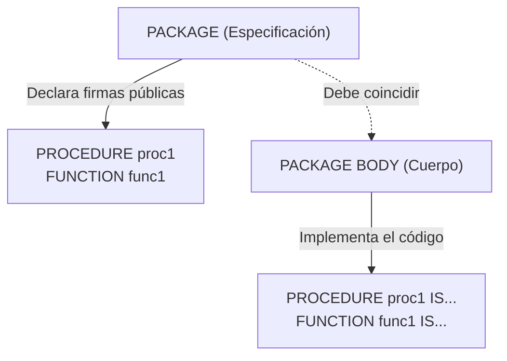

# 📘 Bloque 10 — Paquetes

[← Volver al Syllabus](../SYLLABUS.md)

---

## ¿Qué es un paquete?

Agrupa procedimientos, funciones, tipos y variables bajo un **espacio de nombres**. Equivalente a un módulo/librería.

## Estructura en dos partes



### Especificación (cabecera pública)

```sql
CREATE OR REPLACE PACKAGE mi_paquete AS
  PROCEDURE proc1(x NUMBER);
  FUNCTION func1 RETURN NUMBER;
END mi_paquete;
```

### Cuerpo (implementación)

```sql
CREATE OR REPLACE PACKAGE BODY mi_paquete AS
  PROCEDURE proc1(x NUMBER) IS
  BEGIN ... END proc1;

  FUNCTION func1 RETURN NUMBER IS
  BEGIN ... RETURN valor; END func1;
END mi_paquete;
```

## Llamada

```sql
mi_paquete.proc1(20);
resultado := mi_paquete.func1;
```

## Ventajas

- **Encapsulamiento:** elementos privados en el cuerpo
- **Rendimiento:** Oracle carga todo el paquete en memoria
- **Organización:** agrupa lógica relacionada
- **Estado:** variables de la especificación persisten en sesión

## Orden de compilación

> ⚠️ **Siempre:** especificación PRIMERO, cuerpo DESPUÉS. Si no coinciden las firmas → error.

[← Volver al Syllabus](../SYLLABUS.md)
