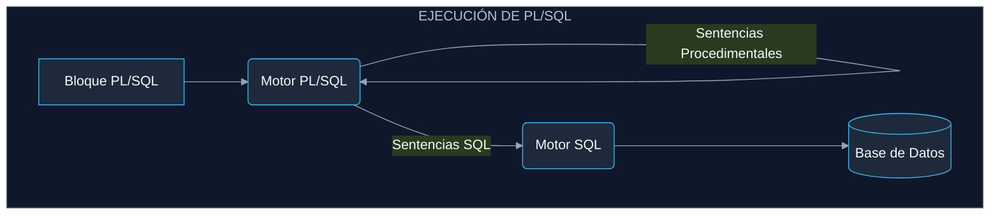
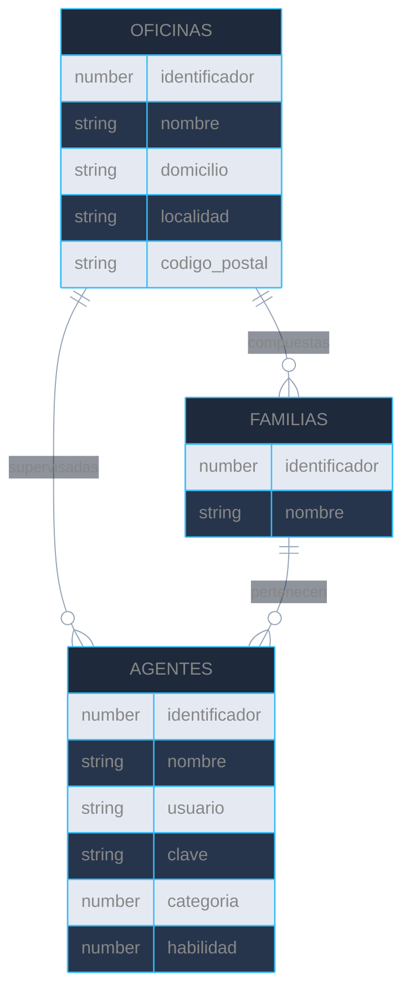
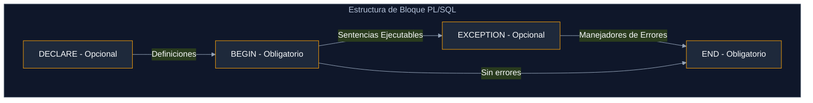
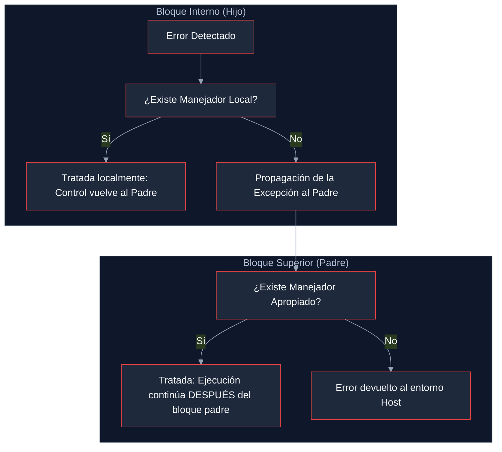

<div id="indice"></div>

# 📑 Índice del Temario PL/SQL

1. [Introducción](#cap1)
2. [Caso de Estudio: Call Center](#cap2)
   - [2.1. Ejecutando el script desde Oracle APEX](#cap21)
3. [Conceptos básicos](#cap3)
   - [3.1. Unidades léxicas y Delimitadores](#cap31)
   - [3.2. Identificadores, Literales y Comentarios](#cap32)
   - [3.3. Tipos de datos simples](#cap33)
   - [3.4. Subtipos](#cap34)
   - [3.5. Variables, Constantes y Precedencia](#cap35)
   - [3.6. El bloque PL/SQL](#cap36)
   - [3.7. Estructuras de control: Alternativa IF](#cap37)
   - [3.8. Estructuras de control: bucles](#cap38)
4. [Manejo de errores](#cap4)
   - [4.1. Conceptos generales y Manejo de excepciones (I)](#cap41)
   - [4.2. Ejemplo: Excepción y transacción](#cap42)
   - [4.3. Manejo de excepciones (II): Localización y Propagación](#cap43)
   - [4.4. Manejo de excepciones (III): RAISE_APPLICATION_ERROR y Pragmas](#cap44)

---

<div id="cap1"></div>

# 1. Introducción

Estarás pensado que si no tenemos bastante con aprender SQL, sino que ahora tenemos que aprender otro lenguaje más que lo único que va a hacer es complicarnos la vida. Verás que eso no es cierto ya que lo más importante, que es el conocimiento de SQL, ya lo tienes. PL/SQL tiene una sintaxis muy sencilla y verás como pronto te acostumbras y luego no podrás vivir sin él.

Pero, **¿qué es realmente PL/SQL?**, PL/SQL es un lenguaje procedimental estructurado en bloques que amplía la funcionalidad de SQL. Con PL/SQL podemos usar sentencias SQL para manipular datos y sentencias de control de flujo para procesar los datos. Por tanto, PL/SQL combina la potencia de SQL para la manipulación de datos, con la potencia de los lenguajes procedimentales para procesar los datos.

Aunque PL/SQL fue creado por Oracle, hoy día todos los gestores de bases de datos utilizan un lenguaje procedimental muy parecido al ideado por Oracle para poder programar las bases de datos.

Como veremos, en PL/SQL podemos definir variables, constantes, funciones, procedimientos, capturar errores en tiempo de ejecución, anidar cualquier número de bloques, etc., como solemos hacer en cualquier otro lenguaje de programación. Además, por medio de PL/SQL programaremos los disparadores de nuestra base de datos, tarea que no podríamos hacer sólo con SQL.

El motor de PL/SQL acepta como entrada bloques PL/SQL o subprogramas, ejecuta sentencias procedimentales y envía sentencias SQL al servidor de bases de datos. En el esquema adjunto puedes ver su funcionamiento.



Una de las grandes ventajas que nos ofrece PL/SQL es un mejor rendimiento en entornos de red cliente-servidor, ya que permite mandar bloques PL/SQL desde el cliente al servidor a través de la red, reduciendo de esta forma el tráfico y así no tener que mandar una a una las sentencias SQL correspondientes.

> 🚀 **COMPLEMENTO (Fuera de temario): Rendimiento extra**
> Además de reducir el tráfico de red, enviar un bloque entero permite a Oracle compilar el código y guardarlo en memoria caché. Si se vuelve a ejecutar un bloque similar, el motor no tiene que volver a analizarlo, lo que dispara la velocidad de ejecución.

[⬆️ Volver al Índice](#indice)

---

<div id="cap2"></div>

# 2. Caso de Estudio: Call Center

La mayoría de los ejemplos de la unidad están basados en este caso de estudio. Por lo tanto es recomendable la creación de las tablas y la inserción de datos que genera el script `CallCenter.sql`. 

**Enunciado:**

Una empresa de telefonía tiene sus centros de llamadas distribuidos por la geografía española en diferentes oficinas. Estas oficinas están jerarquizadas en familias de agentes telefónicos. Cada familia, por tanto, podrá contener agentes u otras familias. Los agentes telefónicos, según su categoría, además se encargarán de supervisar el trabajo de todos los agentes de una oficina o de coordinar el trabajo de los agentes de una familia dada. 

El único agente que pertenecerá directamente a una oficina y que no formará parte de ninguna familia será el supervisor de dicha oficina, cuya **categoría es la 2**. Los coordinadores de las familias deben pertenecer a dicha familia y su **categoría será 1** (no todas las familias tienen por qué tener un coordinador y dependerá del tamaño de la oficina, ya que de ese trabajo también se puede encargar el supervisor de la oficina). Los demás agentes deberán pertenecer a una familia, su **categoría será 0** y serán los que principalmente se ocupen de atender las llamadas.

*   **Agentes:** nombre, clave y contraseña, categoría y habilidad (número entre 0 y 9).
*   **Familias:** nombre.
*   **Oficinas:** nombre, domicilio, localidad y código postal.

**Modelo Entidad-Relación:**



> 💡 **TIPS Prácticos:**
> * Al realizar ejercicios, ten siempre en cuenta la regla de las categorías (`0=Operador`, `1=Coordinador`, `2=Supervisor`). Te servirá para resolver los típicos problemas de inserción condicionada.
> * Las relaciones del ER te indican el orden de creación/borrado: para borrar una oficina, primero deben eliminarse sus agentes dependientes y familias (debido a las *Foreign Keys*).

<div id="cap21"></div>

## 2.1. Ejecutando el script desde Oracle APEX

Para cargar los datos base del *Call Center* desde la opción Archivos de Comando SQL de Oracle APEX:

1. Inicia sesión en Oracle APEX y accede a **Taller de SQL > Archivos de Comandos SQL**.
2. Haz clic sobre el botón **Cargar >**. En la ventana emergente:
   * Selecciona el archivo SQL indicando su ubicación en disco.
   * Asígnale un nombre para registrarlo.
   * Haz clic en **Cargar**.
3. Haz clic sobre el icono en la columna **Ejecutar**.
4. Pulsa **Ejecutar Ahora** y verifica en el resumen de ejecución que no existan errores.

> 🚀 **COMPLEMENTO (Fuera de temario): Alternativa a APEX**
> Si en lugar de APEX utilizas herramientas de escritorio como *SQL Developer* o *DBeaver*, puedes simplemente arrastrar el archivo `.sql` a la ventana principal y pulsar la tecla `F5` (Ejecutar como Script). Es mucho más rápido si realizas modificaciones locales.

[⬆️ Volver al Índice](#indice)
<div id="cap3"></div>

# 3. Conceptos básicos

En este apartado nos vamos a ir introduciendo poco a poco en los diferentes conceptos que debemos tener claros para programar en **PL/SQL**. Debemos conocer las reglas de sintaxis, los diferentes elementos, los tipos de datos, las estructuras de control (iterativas y condicionales) y el manejo de errores.

<div id="cap31"></div>

## 3.1. Unidades léxicas y Delimitadores

PL/SQL es un **lenguaje no sensible a las mayúsculas**, por lo que será equivalente escribir en mayúsculas o minúsculas, excepto cuando hablemos de literales de tipo cadena o de tipo carácter.

Cada unidad léxica puede estar separada por espacios, por saltos de línea o por tabuladores para aumentar la legibilidad del código escrito.

`IF A=CLAVE THEN ENCONTRADO:=TRUE;ELSE ENCONTRADO:=FALSE;END IF;`

Sería equivalente a escribir este fragmento formateado:

```sql
IF a = clave THEN
    encontrado := TRUE;
ELSE
    encontrado := FALSE;
END IF;
```

Las unidades léxicas se clasifican en: Delimitadores, Identificadores, Literales y Comentarios.

### Delimitadores en PL/SQL.

| Delimitadores Simples | Significado | Delimitadores Compuestos | Significado |
| :--- | :--- | :--- | :--- |
| `+` | Suma. | `**` | Exponenciación. |
| `%` | Indicador de atributo. | `<>` o `!=` | Distinto. |
| `.` | Selector. | `<=` | Menor o igual. |
| `/` | División. | `>=` | Mayor o igual. |
| `(`, `)` | Delimitador de lista. | `..` | Rango. |
| `:` | Variable host. | `\|\|` | Concatenación. |
| `,` | Separador de elementos. | `<<`, `>>` | Delimitador de etiquetas. |
| `*` | Producto. | `--` | Comentario de una línea. |
| `"` | Delimitador de identificador acotado. | `/*`, `*/` | Comentario de varias líneas. |
| `=` | Igual relacional. | `:=` | Asignación. |
| `<`, `>` | Menor, Mayor. | `=>` | Selector de nombre de parámetro. |
| `@` | Indicador de acceso remoto. | | |
| `;` | Terminador de sentencias. | | |
| `-` | Resta/negación. | | |

> 💡 **TIPS Prácticos:**
> * Acostúmbrate a escribir las **palabras reservadas en MAYÚSCULAS** (`IF`, `THEN`, `SELECT`) y tus **variables en minúsculas** (`v_contador`). No es obligatorio, pero es el estándar en la industria para leer código rápido.
> * ¡Cuidado! En PL/SQL la comparación de igualdad es solo `=` (no `==` como en Java/C), y la asignación de variables es `:=` (obligatorio los dos puntos).

[⬆️ Volver al Índice](#indice)

---

<div id="cap32"></div>

## 3.2. Identificadores, Literales y Comentarios

### Identificadores
Los identificadores nombran elementos de nuestros programas. Reglas a tener en cuenta:
* Deben empezar por una letra seguida opcionalmente de letras, números, `$`, `_`, `#`. (Ej. válidos: `X`, `A1`, `codigo_postal`).
* No se pueden usar palabras reservadas (`IF`, `THEN`, `ELSE`), salvo si las acotamos entre comillas dobles `"TYPE"` (Identificadores acotados, longitud máxima 30).

### Literales
Se utilizan para asignar valores concretos a variables:
* **Numéricos:** `234`, `+341`, `2e3`, `7.45`.
* **Carácter/Cadena:** Se delimitan con **comillas simples** `'Texto'`.
* **Lógicos:** `TRUE` y `FALSE`.
* **El literal `NULL`:** Expresa que una variable no tiene valor.

### Comentarios
No tienen ningún efecto sobre el código pero ayudan a documentar.
* **Una línea:** `--asignación`
* **Varias líneas:** `/* Primera línea ... Segunda línea */`

> 🚀 **COMPLEMENTO (Fuera de temario): Escape de comillas simples**
> ¿Qué pasa si necesitas guardar un texto que contiene una comilla simple, como el apellido *O'Connor*? En la práctica se resuelve poniendo dos comillas simples seguidas: `'O''Connor'`. ¡No confundir con comillas dobles!

[⬆️ Volver al Índice](#indice)

---

<div id="cap33"></div>

## 3.3. Tipos de datos simples

En PL/SQL contamos con los tipos de SQL y algunos propios.

* **Numéricos:**
  * `NUMBER`: Almacena números racionales. Permite especificar precisión y escala. Ej: escala=2: `8.234 -> 8.23`. Subtipos: `DEC`, `FLOAT`, `INTEGER`.
  * `BINARY_INTEGER` / `PLS_INTEGER`: Tipos numéricos enteros (-2147483647 .. 2147483647). El `PLS_INTEGER` tiene una representación distinta que hace sus operaciones aritméticas mucho más eficientes.
* **Alfanuméricos:**
  * `VARCHAR2(n)`: Cadenas de longitud variable (max. 32760 bytes en PL/SQL).
  * `CHAR(n)`: Array de longitud fija (max. 2000 bytes).
  * `LONG`, `RAW`, `LONG RAW`.
* **Grandes objetos:**
  * `BFILE` (Puntero a fichero SO), `BLOB` (Binario 4GB), `CLOB` (Carácter 2GB).
* **Otros:**
  * `BOOLEAN`: `TRUE/FALSE`.
  * `DATE`: Día/hora desde 4712 a.c. a 4712 d.c.

[⬆️ Volver al Índice](#indice)

---

<div id="cap34"></div>

## 3.4. Subtipos

PL/SQL permite definir subtipos para dar nombres diferentes a los tipos existentes y aumentar la legibilidad de los programas.

`SUBTYPE subtipo IS tipo_base;`

Al especificar el tipo base, podemos utilizar modificadores dinámicos (muy útiles para el diseño robusto de BBDD):
* `%TYPE`: Indica el tipo de dato de una variable o de una columna de tabla.
* `%ROWTYPE`: Especifica el tipo de un cursor o tabla (fila completa).

```sql
SUBTYPE id_familia IS familias.identificador%TYPE;
SUBTYPE agente IS agentes%ROWTYPE;
```

Los subtipos no pueden restringirse (ej. `SUBTYPE apodo IS varchar2(20);` es ilegal), pero el truco es usar una variable auxiliar:

```sql
DECLARE
    aux varchar2(20);
    SUBTYPE apodo IS aux%TYPE; -- Truco legal
BEGIN
    NULL;
END;
```

> 💡 **TIPS Prácticos:**
> * Usa siempre `%TYPE` y `%ROWTYPE` cuando declares variables que vayan a interactuar con tablas. Si mañana el administrador de BBDD cambia `VARCHAR2(50)` a `VARCHAR2(100)` en la tabla `AGENTES`, tu código PL/SQL **se adaptará automáticamente** sin dar errores de compilación.

[⬆️ Volver al Índice](#indice)
<div id="cap35"></div>

## 3.5. Variables, Constantes y Precedencia

Para declarar variables o constantes, se indica el nombre, el tipo de datos y opcionalmente una asignación inicial (`:=` o `DEFAULT`). 

**Características clave:**
*   **Constantes:** Usan la palabra `CONSTANT`. Su valor no puede cambiar tras la declaración.
*   **Restricción NOT NULL:** Si se usa, la variable debe inicializarse obligatoriamente.
*   **Conversión de tipos:** Aunque existe la conversión implícita, se recomienda la **explícita** (`TO_CHAR`, `TO_DATE`, `TO_NUMBER`) para evitar errores.

```sql
DECLARE
    id      SMALLINT;
    hoy     DATE := sysdate;
    pi      CONSTANT REAL := 3.1415;
    id_fijo SMALLINT NOT NULL := 9999; -- Obligatorio inicializar
BEGIN
    NULL;
END;
```

### Precedencia de Operadores (De mayor a menor)

| Nivel | Operadores | Operación |
| :--- | :--- | :--- |
| 1 | `**`, `NOT` | Exponenciación, negación lógica. |
| 2 | `+`, `-` | Identidad, negación. |
| 3 | `*`, `/` | Multiplicación, división. |
| 4 | `+`, `-`, `\|\|` | Suma, resta y concatenación. |
| 5 | `=`, `!=`, `<`, `>`, `<=`, `>=`, `IS NULL`, `LIKE`, `BETWEEN`, `IN` | Comparaciones. |
| 6 | `AND` | Conjunción lógica. |
| 7 | `OR` | Disyunción lógica. |

> 💡 **TIPS Prácticos:**
> * **Inicialización por defecto:** Aunque puedes usar `DEFAULT`, el operador `:=` es mucho más común y rápido de escribir. Úsalo por consistencia.
> * **Uso de Paréntesis:** Independientemente de la tabla de precedencia, usa siempre paréntesis para agrupar operaciones lógicas complejas. Esto hace que el código sea legible para otros humanos (y para ti mismo en el futuro).

> 🚀 **COMPLEMENTO (Fuera de temario): Inicialización de variables tipo Record**
> Cuando declaras una variable con `%ROWTYPE`, no puedes inicializarla en la sección `DECLARE` directamente con valores. Debes asignar los valores campo a campo dentro del `BEGIN` o mediante un `SELECT INTO`.

[⬆️ Volver al Índice](#indice)

---

<div id="cap36"></div>

## 3.6. El bloque PL/SQL

El bloque es la unidad básica de PL/SQL y consta de tres zonas bien diferenciadas:



### Ámbito y Visibilidad
Los bloques pueden anidarse. Una variable local en un bloque interno "oculta" a una variable global con el mismo nombre en el bloque externo.

```sql
DECLARE
    aux number := 10; -- Global para este bloque
BEGIN
    DECLARE
        aux number := 5; -- Local, oculta a la global
    BEGIN
        IF aux = 10 THEN -- Evalúa a FALSE, porque usa la de valor 5
            NULL;
        END IF;
    END;
END;
```

> 💡 **TIPS Prácticos:**
> * **Depuración rápida:** Para ver resultados por pantalla en Oracle APEX o SQL Developer, usa `DBMS_OUTPUT.PUT_LINE('Texto: ' || v_variable);`. ¡Asegúrate de tener activada la salida DBMS!

> 🚀 **COMPLEMENTO (Fuera de temario): Etiquetas de Bloque**
> Puedes poner nombre a tus bloques usando etiquetas como `<<nombre_bloque>>`. Esto permite referenciar variables del bloque padre aunque estén ocultas: `nombre_padre.aux := 20;`. Es una práctica excelente para evitar confusiones en bloques muy largos.

[⬆️ Volver al Índice](#indice)

---

<div id="cap37"></div>

## 3.7. Estructuras de control: Alternativa IF

Permiten manejar el flujo de control del programa mediante condiciones.

*   **IF-THEN**: Ejecuta si la condición es `TRUE`.
*   **IF-THEN-ELSE**: Ejecuta un bloque si es `TRUE` y otro si es `FALSE`.
*   **IF-THEN-ELSIF**: Selección múltiple. 

> ⚠️ **¡CUIDADO EXAMEN!**: Fíjate que se escribe **`ELSIF`** (sin la letra 'E' después de la 'S'). Escribir `ELSEIF` es un error de sintaxis común.

### Ejemplo de Selección Múltiple:
```sql
IF a > b THEN
    dbms_output.put_line(a || ' es mayor');
ELSIF b > a THEN
    dbms_output.put_line(b || ' es mayor');
ELSE
    dbms_output.put_line('Son iguales');
END IF;
```

> 💡 **TIPS Prácticos:**
> * **Manejo de NULLs:** Recuerda que en PL/SQL una condición que involucra un `NULL` no es ni `TRUE` ni `FALSE`, es nula. Si comparas `if v_num = NULL`, la condición **nunca** se cumplirá. Usa siempre `if v_num IS NULL`.

> 🚀 **COMPLEMENTO (Fuera de temario): La sentencia CASE**
> Aunque no aparece en esta parte de la teoría, PL/SQL soporta `CASE`, que suele ser más limpio que muchos `ELSIF`:
> `CASE v_categoria WHEN 0 THEN ... WHEN 1 THEN ... ELSE ... END CASE;`

[⬆️ Volver al Índice](#indice)

---

<div id="cap38"></div>

## 3.8. Estructuras de control: bucles

### 1. LOOP Básico (Infinito)
Requiere una sentencia `EXIT` o `EXIT WHEN` para finalizar, de lo contrario el programa no parará.
```sql
LOOP
    v_contador := v_contador + 1;
    EXIT WHEN v_contador > 10;
END LOOP;
```

### 2. WHILE LOOP
Evalúa la condición **antes** de entrar. Si la condición es falsa desde el inicio, el bucle nunca se ejecuta.
```sql
WHILE a < 10 LOOP
    a := a + 1;
END LOOP;
```

### 3. FOR LOOP
Itera automáticamente sobre un rango.
*   El contador **no se declara** en la sección `DECLARE` (es implícito).
*   `REVERSE` permite recorrer el rango de mayor a menor.

```sql
FOR a IN 1..10 LOOP -- Ascendente
    dbms_output.put_line(a);
END LOOP;

FOR a IN REVERSE 1..10 LOOP -- Descendente (10 a 1)
    dbms_output.put_line(a);
END LOOP;
```

> 💡 **TIPS Prácticos:**
> * **¿Cuál elegir?** 
>   1. Si sabes cuántas veces vas a iterar (ej. de 1 a 12 meses): usa **FOR**.
>   2. Si la iteración depende de una condición externa que puede no cumplirse nunca: usa **WHILE**.
>   3. Si necesitas que el código se ejecute al menos una vez antes de comprobar la condición: usa **LOOP básico** con el `EXIT` al final.

> 🚀 **COMPLEMENTO (Fuera de temario): Sentencia CONTINUE**
> Al igual que `EXIT` rompe el bucle, `CONTINUE` (o `CONTINUE WHEN`) salta el resto del código de la iteración actual y pasa directamente a la siguiente. Muy útil para omitir procesar registros que no cumplen ciertos requisitos sin salir del bucle.

[⬆️ Volver al Índice](#indice)
<div id="cap4"></div>

# 4. Manejo de errores

Cuando programamos en PL/SQL, las situaciones inesperadas se denominan **excepciones**. Cuando se detecta un error, la ejecución normal se detiene y el control se transfiere a la sección `EXCEPTION`.

### Manejadores de excepciones

Se definen mediante la palabra `WHEN`. La cláusula `OTHERS` captura cualquier error que no hayamos especificado individualmente.

```sql
DECLARE
    supervisor agentes%ROWTYPE;
BEGIN
    SELECT * INTO supervisor FROM agentes 
    WHERE categoria = 2 AND oficina = 3;
EXCEPTION
    WHEN NO_DATA_FOUND THEN
        dbms_output.put_line('No se encontró el supervisor.');
    WHEN TOO_MANY_ROWS THEN
        dbms_output.put_line('Error: Hay más de un supervisor.');
    WHEN OTHERS THEN
        dbms_output.put_line('Ocurrió un error inesperado.');
END;
```

> 💡 **TIPS Prácticos:**
> * **Ubicación de OTHERS:** Siempre debe ser la última excepción en tu bloque. Si la pones al principio, el compilador dará error porque las demás serían inalcanzables.
> * **SELECT INTO:** En PL/SQL, un `SELECT INTO` **siempre** debe devolver exactamente una fila. Si devuelve 0, lanza `NO_DATA_FOUND`. Si devuelve 2 o más, lanza `TOO_MANY_ROWS`. Prepárate para manejar ambas siempre.

### Excepciones definidas por el usuario

Tienen tres pasos obligatorios: Declarar, Lanzar (`RAISE`) y Manejar.

```sql
DECLARE
    categoria_erronea EXCEPTION; -- 1. Declarar
    v_cat NUMBER := 5;
BEGIN
    IF v_cat NOT IN (0,1,2) THEN
        RAISE categoria_erronea; -- 2. Lanzar
    END IF;
EXCEPTION 
    WHEN categoria_erronea THEN -- 3. Manejar
        dbms_output.put_line('La categoría no es válida.');
END;
```

[⬆️ Volver al Índice](#indice)

---

<div id="cap41"></div>

## 4.1. Manejo de excepciones (I)

*   **Alcance:** Siguen las mismas reglas que las variables. Si redefines una excepción predefinida localmente, la local prevalece.
*   **Continuidad:** Una vez que una excepción salta al manejador, **no se puede volver** a la línea que causó el error dentro del mismo bloque.

> 💡 **TIPS Prácticos:**
> * **¿Cómo continuar tras un error?** Si quieres que un error en una línea no detenga el resto del programa, encierra esa línea en su propio bloque `BEGIN ... EXCEPTION ... END;` interno.

```sql
BEGIN
    BEGIN -- Subbloque para proteger la inserción
        INSERT INTO familias VALUES (1, 'SOPORTE', NULL, 1);
    EXCEPTION
        WHEN DUP_VAL_ON_INDEX THEN
            dbms_output.put_line('Ya existía, seguimos adelante...');
    END;
    
    INSERT INTO agentes ... -- Esto se ejecutará pase lo que pase arriba
END;
```

[⬆️ Volver al Índice](#indice)

---

<div id="cap42"></div>

## 4.2. Ejemplo: Excepción y transacción

Podemos usar bucles para reintentar transacciones fallidas, combinando `SAVEPOINT` y `ROLLBACK`.

```sql
DECLARE
    id_fam NUMBER := 1;
BEGIN
    LOOP
        BEGIN
            SAVEPOINT inicio;
            INSERT INTO familias (identificador, nombre) VALUES (id_fam, 'VENTAS');
            COMMIT;
            EXIT; -- Si llegamos aquí, éxito y salimos
        EXCEPTION
            WHEN DUP_VAL_ON_INDEX THEN 
                ROLLBACK TO inicio;
                id_fam := id_fam + 1; -- Reintentamos con otro ID
        END;
    END LOOP;
END;
```

> 🚀 **COMPLEMENTO (Fuera de temario): Peligro de Bucles Infinitos**
> En el ejemplo anterior, si el error fuera por otra causa (como un campo obligatorio nulo), el bucle podría ser infinito. En la práctica real, se suele añadir un contador de intentos: `EXIT WHEN contador > 10;`.

[⬆️ Volver al Índice](#indice)

---

<div id="cap43"></div>

## 4.3. Manejo de excepciones (II)

### Propagación de excepciones
Si un bloque no tiene un manejador para un error específico, la excepción "burbujea" hacia el bloque padre.



> 💡 **TIPS Prácticos:**
> * **Uso de variables localizadoras:** Como solo hay un bloque `EXCEPTION` por bloque de código, si tienes 5 `SELECT`, usa una variable `v_paso := 1`, `v_paso := 2` para saber en la sección de excepciones exactamente cuál de ellos falló.

[⬆️ Volver al Índice](#indice)

---

<div id="cap44"></div>

## 4.4. Manejo de excepciones (III)

### RAISE_APPLICATION_ERROR
Permite enviar mensajes de error personalizados a la aplicación cliente.
*   **Rango:** -20000 a -20999.
*   **Sintaxis:** `RAISE_APPLICATION_ERROR(codigo, mensaje);`

### PRAGMA EXCEPTION_INIT
Sirve para dar nombre a errores de Oracle que no tienen un nombre predefinido (ej. el error -1400 de insertar nulos).

```sql
DECLARE
    e_nulo EXCEPTION;
    PRAGMA EXCEPTION_INIT(e_nulo, -1400);
BEGIN
    INSERT INTO oficinas (nombre) VALUES (NULL);
EXCEPTION
    WHEN e_nulo THEN
        dbms_output.put_line('Error: El nombre es obligatorio.');
END;
```

### SQLCODE y SQLERRM
Funciones útiles dentro de `WHEN OTHERS` para depuración:
*   `SQLCODE`: Devuelve el número del error.
*   `SQLERRM`: Devuelve el mensaje de texto del error.

```sql
EXCEPTION
    WHEN OTHERS THEN
        dbms_output.put_line('Código: ' || SQLCODE);
        dbms_output.put_line('Mensaje: ' || SUBSTR(SQLERRM, 1, 100));
```

> 💡 **TIPS Prácticos:**
> * **SUBSTR con SQLERRM:** El mensaje de error puede ser muy largo. Es una buena práctica usar siempre `SUBSTR` para evitar errores al intentar imprimirlo o guardarlo en tablas de log si estas tienen un tamaño limitado.

> 🚀 **COMPLEMENTO (Fuera de temario): SQLCODE = 100**
> Curiosidad: Aunque el error `NO_DATA_FOUND` es muy común, su `SQLCODE` no es negativo, sino `100` (basado en el estándar ANSI). Todos los demás errores suelen ser negativos.

[⬆️ Volver al Índice](#indice)