# Resolución de Ejercicios: Diagramas de Clases (UML)

<a id="indice"></a>
## Índice de Contenidos

**BLOQUE 1: Fundamentos de Clases, Visibilidad y Objetos**
* [Ejercicio 01: Identificar visibilidad y atributos](#ejercicio-01)
* [Ejercicio 02: Diseñar una clase UML](#ejercicio-02)
* [Ejercicio 03: Objetos e Instanciación](#ejercicio-03)

**BLOQUE 2: Relaciones entre Clases**
* [Ejercicio 04: Asociación y Cardinalidad](#ejercicio-04)
* [Ejercicio 05: Herencia y Clases Abstractas](#ejercicio-05)
* [Ejercicio 06: Composición vs Agregación](#ejercicio-06)
* [Ejercicio 07: Realización y Dependencia](#ejercicio-07)

**BLOQUE 3: Notación Especial e Ingeniería de Software**
* [Ejercicio 08: Notación: Clases Especiales y Modificadores](#ejercicio-08)
* [Ejercicio 09: Ingeniería Directa (Forward Engineering)](#ejercicio-09)
* [Ejercicio 10: Ingeniería Inversa (Reverse Engineering)](#ejercicio-10)

**BLOQUE 4: Ejercicios Avanzados - Ingeniería Directa**
* [Ejercicio 11: Ingeniería Directa — Sistema Bancario](#ejercicio-11)
* [Ejercicio 12: Ingeniería Directa — Tienda Online](#ejercicio-12)
* [Ejercicio 13: Ingeniería Directa — Sistema de Notificaciones](#ejercicio-13)
* [Ejercicio 14: Ingeniería Directa — Gestión de Reservas](#ejercicio-14)
* [Ejercicio 15: Ingeniería Directa — Jerarquía de Figuras Geométricas](#ejercicio-15)

**BLOQUE 5: Ejercicios Avanzados - Ingeniería Inversa**
* [Ejercicio 16: Ingeniería Inversa — Biblioteca Digital](#ejercicio-16)
* [Ejercicio 17: Ingeniería Inversa — Sistema de Pagos](#ejercicio-17)
* [Ejercicio 18: Ingeniería Inversa — Red Social](#ejercicio-18)
* [Ejercicio 19: Ingeniería Inversa — Sistema de Inventario](#ejercicio-19)
* [Ejercicio 20: Ingeniería Inversa — Juego de Roles](#ejercicio-20)

**BLOQUE 6: Ejercicios Funcional → Diagrama**
* [Ejercicio 21: Funcional — Clínica Veterinaria](#ejercicio-21)
* [Ejercicio 22: Funcional — Universidad — Cursos y Matriculación](#ejercicio-22)
* [Ejercicio 23: Funcional — Gestión de Proyectos Software](#ejercicio-23)
* [Ejercicio 24: Funcional — Sistema de Transporte Público](#ejercicio-24)

**BLOQUE 7: Ejercicios Funcional → Diagrama (Continuación)**
* [Ejercicio 25: Funcional — Plataforma de Streaming](#ejercicio-25)
* [Ejercicio 26: Funcional — Sistema Bancario con Transacciones](#ejercicio-26)
* [Ejercicio 27: Funcional — Juego de Cartas Coleccionables](#ejercicio-27)
* [Ejercicio 28: Funcional — Aeropuerto — Vuelos y Pasajeros](#ejercicio-28)

**BLOQUE 8: Ejercicios Funcional → Diagrama (Final)**
* [Ejercicio 29: Funcional — E-Commerce — Productos y Pedidos](#ejercicio-29)
* [Ejercicio 30: Funcional — Sistema de Seguridad y Accesos](#ejercicio-30)

---


Este documento contiene la resolución detallada de los ejercicios propuestos en la **UT6**, aplicando estrictamente los conceptos teóricos del modelado orientado a objetos (clases, atributos, métodos, relaciones, notación UML e ingeniería directa/inversa).

---

## BLOQUE 1: Fundamentos de Clases, Visibilidad y Objetos

<a id="ejercicio-01"></a>
### Ejercicio 01: Identificar visibilidad y atributos

> **📌 ENUNCIADO:**
> Observa la siguiente clase UML y responde a las preguntas:
> 
> ```mermaid
> classDiagram
>     class Vehiculo {
>         -matricula : String
>         -velocidadMaxima : int = 120
>         #marca : String
>         +numRuedas : int
>         +/descripcion : String
>         +arrancar() void
>         -comprobarFrenos() boolean
>         #calcularConsumo(km: double) double
>         +getDescripcion() String
>     }
> ```
> 
>                     a) Indica el modificador de visibilidad de
>                             cada atributo.
>                     b) ¿Cuál es el atributo derivado? ¿Qué
>                             significa?
>                     c) ¿Qué método no es accesible desde una
>                             subclase externa al paquete? ¿Por qué?
>                     d) ¿Qué métodos pueden llamarse desde
>                             cualquier clase del sistema?

--- 

**🟢 SOLUCIÓN:**


**Contexto:** Se nos presenta la clase `Vehiculo` con una serie de atributos y métodos con diferentes símbolos de visibilidad y modificadores.

**Resolución aplicando la teoría:**

**a) Indica el modificador de visibilidad de cada atributo.**
Según la tabla de visibilidad de la sección 1 de la teoría:
*   `- matricula`: **Privado (`private`)**. Solo accesible desde la propia clase.
*   `- velocidadMaxima`: **Privado (`private`)**. Solo accesible desde la propia clase (tiene valor por defecto `120`).
*   `# marca`: **Protegido (`protected`)**. Accesible desde la clase y sus subclases.
*   `+ numRuedas`: **Público (`public`)**. Accesible desde cualquier clase del sistema.

**b) ¿Cuál es el atributo derivado? ¿Qué significa?**
*   El atributo derivado es `/ descripcion`. 
*   **Significado:** Según la teoría, el prefijo `/` indica que es un atributo **derivado**. Su valor no se almacena directamente en memoria, sino que se calcula dinámicamente a partir de otros atributos (por ejemplo, concatenando `marca` y `matricula`).

**c) ¿Qué método no es accesible desde una subclase externa al paquete? ¿Por qué?**
*   El método `- comprobarFrenos()`.
*   **Por qué:** Al tener el símbolo `-`, su visibilidad es `private`. La teoría establece que los elementos privados son "solo accesibles desde la propia clase", excluyendo categóricamente a cualquier subclase (independientemente de su paquete) o clase externa.

**d) ¿Qué métodos pueden llamarse desde cualquier clase del sistema?**
*   Los métodos `+ arrancar()` y `+ getDescripcion()`.
*   Al estar precedidos por el símbolo `+`, tienen visibilidad `public`, lo que permite su invocación desde cualquier parte del sistema.


**[⬆️ Volver al índice](#indice)**

---

<a id="ejercicio-02"></a>
### Ejercicio 02: Diseñar una clase UML

> **📌 ENUNCIADO:**
> Diseña el diagrama de clase UML para una clase **Producto** con las
>                     siguientes especificaciones:
> 
>                 
> 
>                     - Atributos privados: `id` (int), `nombre`
>                         (String), `precio` (double = 0.0), `stock`
>                         (int).
>                     - Atributo estático privado: `totalProductos` (int) — lleva la cuenta de
>                         todos los productos creados.
>                     - Atributo derivado: `precioConIVA` (double) — calculado a partir de
>                         precio.
>                     - Constructor público que recibe nombre y precio.
>                     - Métodos públicos: `aplicarDescuento(porcentaje: double): void`, isDisponible(): boolean, toString(): String.
>                     - Método privado: `validarPrecio(p: double): boolean`.
>                     - Método estático público: `getTotalProductos(): int`.

--- 

**🟢 SOLUCIÓN:**


**Contexto:** Diseñar la clase `Producto` aplicando modificadores estáticos, derivados, constructores y visibilidad.

**Resolución aplicando la teoría:**

*Nota sobre Mermaid:* En UML estándar, los atributos/métodos estáticos se subrayan. En la sintaxis de Mermaid, se representan añadiendo el símbolo `$` al final de la declaración.

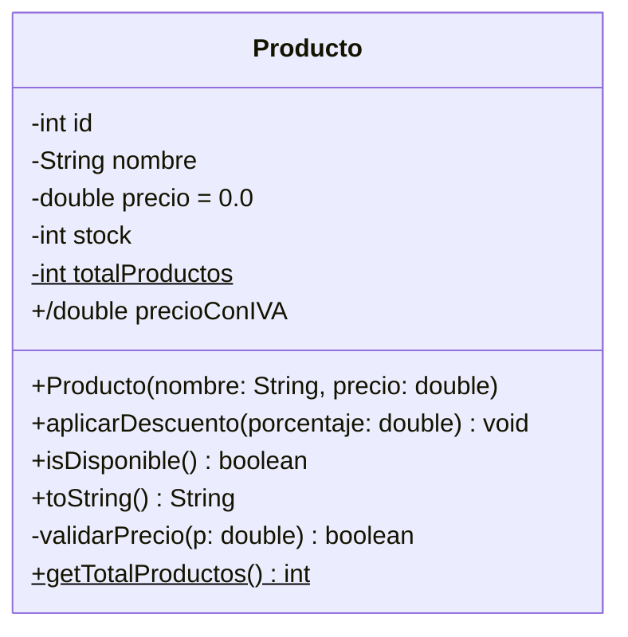
```mermaid
classDiagram
    class Producto {
        -int id
        -String nombre
        -double precio = 0.0
        -int stock
        -int totalProductos$
        +/double precioConIVA
        +Producto(nombre: String, precio: double)
        +aplicarDescuento(porcentaje: double) void
        +isDisponible() boolean
        +toString() String
        -validarPrecio(p: double) boolean
        +getTotalProductos()$ int
    }
```

**Justificación teórica:**
*   **Privados (`-`):** `id`, `nombre`, `precio`, `stock`.
*   **Estático (`$` en Mermaid, subrayado en UML estándar):** `- totalProductos$` y `+ getTotalProductos()$`. La teoría indica que "pertenecen a la clase; compartido por todos los objetos".
*   **Derivado (`/`):** `+/precioConIVA`. Se calcula (probablemente `precio * 1.21`).
*   **Constructor:** `+Producto(nombre, precio)`. La teoría dicta que "crea nuevas instancias; mismo nombre que la clase".


**[⬆️ Volver al índice](#indice)**

---

<a id="ejercicio-03"></a>
### Ejercicio 03: Objetos e Instanciación

> **📌 ENUNCIADO:**
> Dada la siguiente clase `Alumno`, realiza las tareas
>                     indicadas:
> 
>                 
> ```java
> public class Alumno {
>     private String nombre;
>     private int edad;
>     private double notaMedia;
> 
>     public Alumno(String nombre, int edad) {
>         this.nombre = nombre;
>         this.edad = edad;
>         this.notaMedia = 0.0;
>     }
> }
> ```
> 
>                 
> 
>                     a) Escribe en Java el código para crear dos
>                             objetos: `alumno1` (Ana López, 20 años) y alumno2 (Carlos Ruiz, 22 años).
>                     b) Representa ambos objetos como diagrama de
>                             objetos UML.
>                     c) Explica la diferencia entre
>                             **estado** e **identidad** para estos dos objetos.
>                     d) Si ambos objetos tuvieran exactamente los
>                             mismos valores, ¿serían el mismo objeto? Justifica tu respuesta.

--- 

**🟢 SOLUCIÓN:**


**Contexto:** Dada una clase Java `Alumno`, crear instancias, representarlas en UML y explicar la diferencia entre estado e identidad.

**Resolución aplicando la teoría:**

**a) Código en Java para crear los objetos:**
La instanciación es el proceso de creación mediante el operador `new`.

```java
Alumno alumno1 = new Alumno("Ana López", 20);
Alumno alumno2 = new Alumno("Carlos Ruiz", 22);
```

**b) Representación de objetos en UML:**
La teoría indica que en un diagrama de objetos, el nombre se escribe **subrayado** con el formato `nombreObjeto : NombreClase` y solo se muestran los valores concretos (sin métodos).

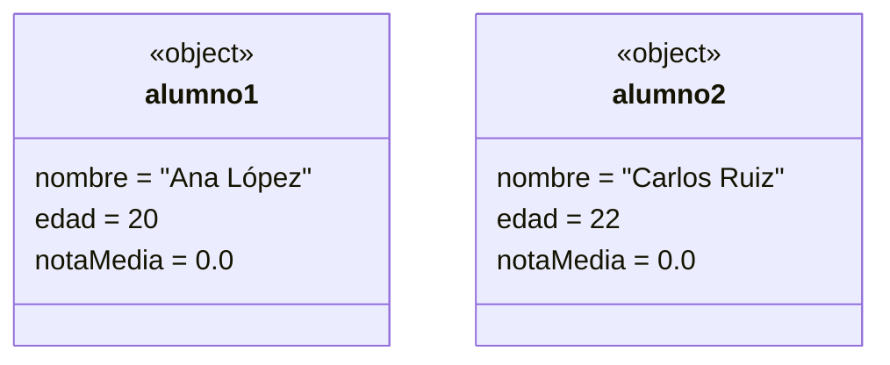
```mermaid
classDiagram
    class alumno1 {
        <<object>>
        nombre = "Ana López"
        edad = 20
        notaMedia = 0.0
    }

    class alumno2 {
        <<object>>
        nombre = "Carlos Ruiz"
        edad = 22
        notaMedia = 0.0
    }
```

**c) Diferencia entre estado e identidad:**
*   **Estado:** Según la teoría, está "determinado por los valores actuales de los atributos". Para `alumno1`, su estado es `nombre="Ana López"`, `edad=20`, `notaMedia=0.0`.
*   **Identidad:** La teoría especifica que "cada objeto tiene una identidad única... en memoria ocupa una posición distinta". Es decir, `alumno1` y `alumno2` son entidades separadas físicamente en el sistema.

**d) Si ambos objetos tuvieran los mismos valores, ¿serían el mismo objeto?**
*   **No, no serían el mismo objeto.** 
*   **Justificación:** Tendrían el mismo *estado* (mismos valores), pero distinta *identidad* (distintas referencias en memoria). Como señala la teoría, el operador `==` en Java devolvería `false` (porque compara identidades/posiciones en memoria), y la igualdad lógica solo se evaluaría correctamente si se utiliza el método `.equals()`.

---

## BLOQUE 2: Relaciones entre Clases

**[⬆️ Volver al índice](#indice)**

<a id="ejercicio-04"></a>
### Ejercicio 04: Asociación y Cardinalidad

> **📌 ENUNCIADO:**
> Analiza el siguiente escenario de una biblioteca y determina las relaciones entre
>                     clases:
> 
>                 
>                     Una **Biblioteca** tiene varios **Socios**. Un Socio puede realizar
>                     múltiples **Prestamos**, pero cada Prestamo pertenece a exactamente un Socio. Cada
>                     Prestamo incluye entre 1 y 3 **Libros**. Un Libro puede estar en ningún o en un único
>                     Prestamo activo. La Biblioteca tiene exactamente un **Bibliotecario** responsable.
>                 
> 
>                 
> 
>                     a) Indica el tipo de asociación entre
>                             Biblioteca y Socio (con cardinalidad).
>                     b) Indica la cardinalidad entre Socio y
>                             Prestamo, y entre Prestamo y Libro.
>                     c) Dibuja el diagrama de asociación en
>                             notación textual UML.
>                     d) ¿Qué significa la navegabilidad
>                             unidireccional? Indica cuál aplicarías entre Prestamo y Socio.

--- 

**🟢 SOLUCIÓN:**


**Contexto:** Modelar las relaciones de un escenario de una biblioteca (Biblioteca, Socio, Prestamo, Libro, Bibliotecario) definiendo cardinalidades y navegabilidad.

**Resolución aplicando la teoría:**

**a) Tipo de asociación entre Biblioteca y Socio:**
*   Se trata de una **Asociación Unidireccional** con cardinalidad `1` a `0..*`. 
*   **Justificación:** La Biblioteca conoce y gestiona a sus socios, por lo que la flecha apunta hacia `Socio` (`Biblioteca ────→ Socio`).

**b) Cardinalidad entre Socio y Prestamo, y entre Prestamo y Libro:**
*   **Socio y Prestamo:** `Socio (1) ──── (0..*) Prestamo`. Un socio puede tener desde cero hasta múltiples préstamos.
*   **Prestamo y Libro:** `Prestamo (1) ──── (1..3) Libro`. Cada préstamo incluye obligatoriamente entre 1 y 3 libros.

**c) Diagrama de asociación en notación UML:**

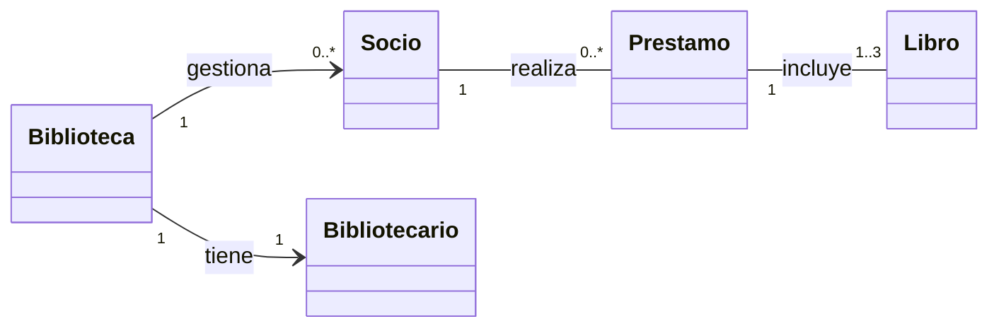
```mermaid
classDiagram
    direction LR
    Biblioteca "1" --> "0..*" Socio : gestiona
    Biblioteca "1" --> "1" Bibliotecario : tiene
    Socio "1" -- "0..*" Prestamo : realiza
    Prestamo "1" -- "1..3" Libro : incluye
```

**d) Navegabilidad unidireccional y su aplicación entre Prestamo y Socio:**
*   **Significado teórico:** La navegabilidad unidireccional (representada con una flecha abierta `→`) significa que solo una clase conoce a la otra, evitando acoplamientos innecesarios.
*   **Aplicación:** Aplicaríamos `Prestamo ────→ Socio`. El préstamo necesita conocer a quién pertenece para enviar notificaciones de vencimiento, pero no es estrictamente necesario que el `Socio` mantenga una lista permanente de sus préstamos en memoria si el sistema centraliza la búsqueda desde los préstamos.


**[⬆️ Volver al índice](#indice)**

---

<a id="ejercicio-05"></a>
### Ejercicio 05: Herencia y Clases Abstractas

> **📌 ENUNCIADO:**
> Se desea modelar un sistema de figuras geométricas con las siguientes reglas:
> 
>                 
> 
>                     - **FiguraGeometrica** es una clase abstracta con atributos color (String) y `relleno` (boolean).
>                     - Tiene un método abstracto `calcularArea(): double` y un
>                         método concreto `describir(): String`.
>                     - **Circulo** hereda de FiguraGeometrica y añade `radio`
>                         (double). Implementa `calcularArea()`.
>                     - **Rectangulo** hereda de FiguraGeometrica y añade `ancho`
>                         y `alto` (double). Implementa calcularArea().
>                     - **Cuadrado** hereda de Rectangulo. No añade atributos nuevos.
>                 
> 
>                 
> 
>                     a) Dibuja el diagrama de herencia en
>                             notación UML.
>                     b) ¿Por qué FiguraGeometrica es abstracta?
>                             ¿Se puede hacer un `new FiguraGeometrica()`?
>                     c) ¿Qué ocurre si Cuadrado no sobreescribe
>                             `calcularArea()`?
>                     d) Indica con notación UML cómo se
>                             representan los métodos abstractos.

--- 

**🟢 SOLUCIÓN:**


**Contexto:** Modelar una jerarquía de figuras geométricas (FiguraGeometrica, Circulo, Rectangulo, Cuadrado) aplicando herencia y métodos abstractos.

**Resolución aplicando la teoría:**

**a) Diagrama de herencia en notación UML:**
*Nota sobre Mermaid:* Los métodos abstractos se indican con un `*` al final, y la herencia con una línea continua y flecha triangular hueca `<|--`.

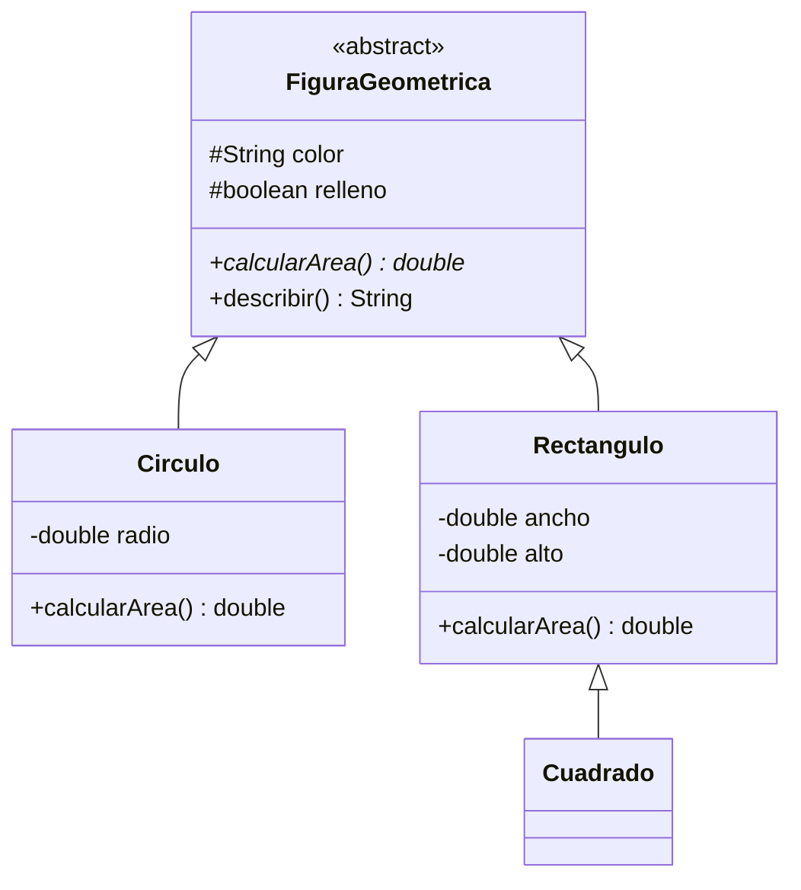
```mermaid
classDiagram
    class FiguraGeometrica {
        <<abstract>>
        #String color
        #boolean relleno
        +calcularArea()* double
        +describir() String
    }
    class Circulo {
        -double radio
        +calcularArea() double
    }
    class Rectangulo {
        -double ancho
        -double alto
        +calcularArea() double
    }
    class Cuadrado {
        %% Hereda todo de Rectangulo
    }

    FiguraGeometrica <|-- Circulo
    FiguraGeometrica <|-- Rectangulo
    Rectangulo <|-- Cuadrado
```

**b) ¿Por qué FiguraGeometrica es abstracta? ¿Se puede hacer un `new FiguraGeometrica()`?**
*   Es abstracta porque representa un concepto genérico (el "molde" base) que no tiene una forma física calculable. 
*   Según la teoría: "Las clases abstractas no pueden instanciarse directamente; sirven como base para otras clases". Por tanto, ejecutar `new FiguraGeometrica()` produciría un error de compilación.

**c) ¿Qué ocurre si Cuadrado no sobreescribe `calcularArea()`?**
*   La teoría establece que "La subclase hereda todos los atributos y métodos públicos y protegidos de la superclase". Al no sobreescribirlo, `Cuadrado` utilizará la implementación concreta de `calcularArea()` heredada de `Rectangulo` (ancho × alto), lo cual es perfectamente válido.

**d) Indica con notación UML cómo se representan los métodos abstractos:**
*   En el diagrama UML estándar, los métodos abstractos se escriben en **cursiva**. Alternativamente, se puede utilizar el estereotipo `{abstract}`.


**[⬆️ Volver al índice](#indice)**

---

<a id="ejercicio-06"></a>
### Ejercicio 06: Composición vs Agregación

> **📌 ENUNCIADO:**
> Para cada una de las siguientes relaciones, indica si es Composición
>                         (◆) o **Agregación (◇)** y justifica tu respuesta:
> 
> | # | Relación | Tipo |
> | :--- | :--- | :--- |
> | a | Ordenador ——— Procesador | ¿? |
> | b | Universidad ——— Departamento | ¿? |
> | c | Playlist ——— Cancion | ¿? |
> | d | Factura ——— LineaDeFactura | ¿? |
> | e | Equipo ——— Jugador | ¿? |
> | f | Edificio ——— Habitacion | ¿? |
> 
>                 Además, explica las diferencias clave entre composición y
>                     agregación en cuanto a ciclo de vida, pertenencia exclusiva y notación gráfica UML.

--- 

**🟢 SOLUCIÓN:**


**Contexto:** Diferenciar entre relaciones "todo-parte" fuertes (composición) y débiles (agregación).

**Resolución aplicando la teoría:**

| # | Relación | Tipo según UML | Justificación teórica |
| :--- | :--- | :--- | :--- |
| a | Ordenador `*--` Procesador | **Composición (◆)** | Vínculo fuerte. El procesador no tiene sentido (en el contexto del sistema ensamblado) fuera del ordenador. |
| b | Universidad `*--` Departamento | **Composición (◆)** | Las partes no pueden existir sin el todo. Si la universidad cierra, sus departamentos desaparecen. |
| c | Playlist `o--` Cancion | **Agregación (◇)** | Vínculo débil. Las canciones existen independientemente y una misma canción puede pertenecer a múltiples playlists. |
| d | Factura `*--` LineaDeFactura | **Composición (◆)** | Vínculo fuerte. Una línea de detalle no puede existir huérfana sin pertenecer a una factura concreta. |
| e | Equipo `o--` Jugador | **Agregación (◇)** | Vínculo débil. Si el equipo desaparece, los jugadores continúan existiendo y pueden unirse a otro. |
| f | Edificio `*--` Habitacion | **Composición (◆)** | Vínculo fuerte físico. Al demoler el edificio (el todo), se destruyen las habitaciones (las partes). |

**Diferencias clave teóricas:**
1.  **Ciclo de vida:** En la **composición**, si el todo se destruye, las partes también se destruyen. En la **agregación**, las partes pueden existir independientemente.
2.  **Pertenencia exclusiva:** En la composición, una parte pertenece a un *único* todo. En la agregación, una parte puede pertenecer a *varios* todos simultáneamente.
3.  **Notación gráfica:** Composición utiliza un **rombo negro (relleno) ◆**. Agregación utiliza un **rombo blanco (hueco) ◇**.


**[⬆️ Volver al índice](#indice)**

---

<a id="ejercicio-07"></a>
### Ejercicio 07: Realización y Dependencia

> **📌 ENUNCIADO:**
> Dado el siguiente escenario, identifica y justifica las relaciones de
>                     **Realización** y **Dependencia**:
> 
>                 
>                     
> 
>                         - La interfaz **Serializable** define el método serializar(): byte[]
>                         - La interfaz **Imprimible** define el método imprimir(): void
>                         - La clase **Documento** implementa tanto Serializable como Imprimible
>                         - La clase **GeneradorPDF** usa un objeto Documento como parámetro en su método
>                             `generar(doc: Documento): File`, pero no lo guarda como atributo
>                         
>                         - La clase **Repositorio** crea objetos Documento temporalmente dentro de sus
>                             métodos
>                     
> 
>                 
> 
>                 
> 
>                     a) ¿Qué relaciones son de Realización y
>                             cuáles de Dependencia?
>                     b) ¿Cuál es la notación UML de cada
>                             una?
>                     c) ¿Por qué GeneradorPDF y Repositorio no
>                             tienen Asociación con Documento?

--- 

**🟢 SOLUCIÓN:**


**Contexto:** Analizar un escenario donde las clases implementan interfaces (realización) o se usan temporalmente (dependencia).

**Resolución aplicando la teoría:**

**a) Identificación de relaciones:**
*   **Realización:** `Documento` realiza `Serializable` y `Imprimible`. Implementa el contrato de ambas interfaces.
*   **Dependencia:** `GeneradorPDF` depende de `Documento` (uso como parámetro). `Repositorio` depende de `Documento` (uso local/temporal dentro de un método).

**b) Notación UML de cada una:**
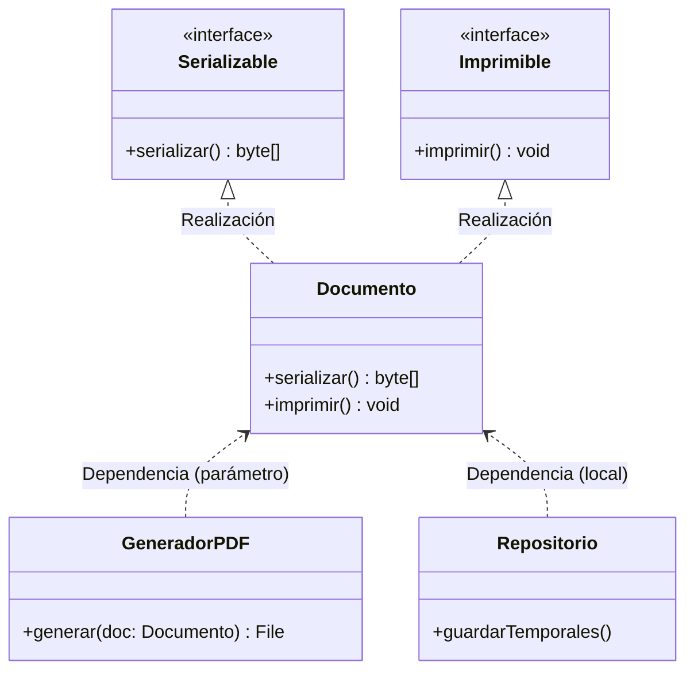
```mermaid
classDiagram
    direction BT
    class Serializable {
        <<interface>>
        +serializar() byte[]
    }
    class Imprimible {
        <<interface>>
        +imprimir() void
    }
    class Documento {
        +serializar() byte[]
        +imprimir() void
    }
    class GeneradorPDF {
        +generar(doc: Documento) File
    }
    class Repositorio {
        +guardarTemporales()
    }

    Documento ..|> Serializable : Realización
    Documento ..|> Imprimible : Realización
    GeneradorPDF ..> Documento : Dependencia (parámetro)
    Repositorio ..> Documento : Dependencia (local)
```
*   **Realización:** Línea discontinua con flecha triangular hueca (`- - - -▷`).
*   **Dependencia:** Línea discontinua con flecha abierta (`- - - -→`).

**c) ¿Por qué GeneradorPDF y Repositorio no tienen Asociación con Documento?**
*   La teoría define la **Asociación** como un vínculo o referencia estructural (generalmente se guarda como atributo permanente en la clase). 
*   La **Dependencia** es la relación más débil: es un uso temporal. Como `GeneradorPDF` recibe el documento por parámetro y `Repositorio` lo crea localmente en un método, ninguno conserva una referencia permanente. Por tanto, es dependencia y no asociación.

## BLOQUE 3: Notación Especial e Ingeniería de Software

**[⬆️ Volver al índice](#indice)**

<a id="ejercicio-08"></a>
### Ejercicio 08: Notación: Clases Especiales y Modificadores

> **📌 ENUNCIADO:**
> Relaciona cada descripción con el elemento UML correcto:
> 
> | Descripción | Elemento UML |
> | :--- | :--- |
> | Tipo con valores fijos: LUNES, MARTES, MIÉRCOLES… | ¿? |
> | Solo contiene firmas de métodos, sin implementación | ¿? |
> | No puede instanciarse directamente; sirve como base | ¿? |
> | Todos sus miembros son estáticos; nunca se instancia | ¿? |
> | Atributo cuyo valor se recalcula desde otros atributos | ¿? |
> | Método que pertenece a la clase, no a las instancias | ¿? |
> 
>                 Diseña en notación UML una enumeración DiaSemana con los 7 días y una interfaz Comparable con el método compareTo(otro: Object): int.

--- 

**🟢 SOLUCIÓN:**


**Contexto:** Relacionar descripciones teóricas con elementos de notación UML y diseñar una enumeración y una interfaz.

**Resolución aplicando la teoría:**

**a) Tabla de relaciones:**

| Descripción teórica | Elemento / Notación UML |
| :--- | :--- |
| Tipo con valores fijos: LUNES, MARTES, MIÉRCOLES… | Estereotipo `<<enumeration>>` |
| Solo contiene firmas de métodos, sin implementación | Estereotipo `<<interface>>` |
| No puede instanciarse directamente; sirve como base | **Clase abstracta** (*cursiva* o `{abstract}`) |
| Todos sus miembros son estáticos; nunca se instancia | Estereotipo `<<utility>>` |
| Atributo cuyo valor se recalcula desde otros atributos | **Atributo derivado** (prefijo `/`) |
| Método que pertenece a la clase, no a las instancias | **Miembro estático** (<u>subrayado</u>) |

**b) Diseño en notación UML (Mermaid):**
Según la teoría, las interfaces se marcan con el estereotipo `<<interface>>` y sus métodos van en cursiva (abstractos). Las enumeraciones usan el estereotipo `<<enumeration>>`.

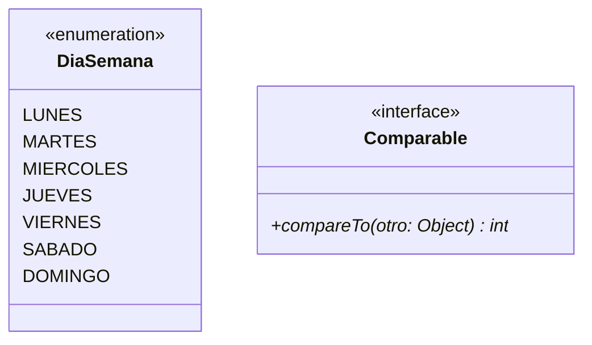
```mermaid
classDiagram
    class DiaSemana {
        <<enumeration>>
        LUNES
        MARTES
        MIERCOLES
        JUEVES
        VIERNES
        SABADO
        DOMINGO
    }

    class Comparable {
        <<interface>>
        +compareTo(otro: Object)* int
    }
```


**[⬆️ Volver al índice](#indice)**

---

<a id="ejercicio-09"></a>
### Ejercicio 09: Ingeniería Directa (Forward Engineering)

> **📌 ENUNCIADO:**
> A partir del siguiente diagrama de clases UML, genera el código Java mediante ingeniería
>                     directa:
> 
> ```mermaid
> classDiagram
>     class EmpleadoFijo {
>         -pagas : int = 14
>         +EmpleadoFijo(id, nombre, salarioBase)
>         +calcularSalario() double
>     }
>     class EmpleadoTemporal {
>         -horasTrabajadas : int
>         -precioHora : double
>         +EmpleadoTemporal(id, nombre, horas, precio)
>         +calcularSalario() double
>     }
> ```
> 
>                 Genera el código Java completo para las tres clases. Las
>                     fórmulas: `EmpleadoFijo: salarioBase × pagas` — EmpleadoTemporal: horasTrabajadas × precioHora.

--- 

**🟢 SOLUCIÓN:**


**Contexto:** Generar código Java a partir de un diagrama UML de una jerarquía de empleados.

**Resolución aplicando la teoría:**
La ingeniería directa transforma automáticamente los elementos del diagrama en código (estructura, atributos, firmas y herencia). 

```java
// Clase abstracta base (en cursiva en UML)
public abstract class Empleado {
    private int id;
    private String nombre;
    protected double salarioBase; // # indica protected

    public Empleado(int id, String nombre, double salarioBase) {
        this.id = id;
        this.nombre = nombre;
        this.salarioBase = salarioBase;
    }

    // Método en cursiva en UML -> abstracto
    public abstract double calcularSalario();

    public String toString() {
        return nombre + " (ID: " + id + ") - Salario: " + calcularSalario();
    }
}

// Subclase EmpleadoFijo hereda de Empleado
public class EmpleadoFijo extends Empleado {
    private int pagas = 14; // Valor por defecto en UML

    public EmpleadoFijo(int id, String nombre, double salarioBase) {
        super(id, nombre, salarioBase);
    }

    @Override
    public double calcularSalario() {
        return salarioBase * pagas;
    }
}

// Subclase EmpleadoTemporal hereda de Empleado
public class EmpleadoTemporal extends Empleado {
    private int horasTrabajadas;
    private double precioHora;

    public EmpleadoTemporal(int id, String nombre, int horas, double precio) {
        super(id, nombre, 0); // No usa salarioBase
        this.horasTrabajadas = horas;
        this.precioHora = precio;
    }

    @Override
    public double calcularSalario() {
        return horasTrabajadas * precioHora;
    }
}
```


**[⬆️ Volver al índice](#indice)**

---

<a id="ejercicio-10"></a>
### Ejercicio 10: Ingeniería Inversa (Reverse Engineering)

> **📌 ENUNCIADO:**
> A partir del siguiente código Java, realiza ingeniería inversa y obtén el diagrama de
>                     clases UML:
> 
>                 
> ```java
> public interface Notificable {
>     void enviarNotificacion(String mensaje);
> }
> 
> public class Pedido {
>     private int numeroPedido;
>     private double total;
>     private List<LineaPedido> lineas;
> 
>     public Pedido(int numero) { ... }
>     public void agregarLinea(LineaPedido l) { ... }
>     public double calcularTotal() { ... }
> }
> 
> public class LineaPedido {
>     private Producto producto;
>     private int cantidad;
>     private double subtotal;
> 
>     public LineaPedido(Producto p, int cantidad) { ... }
>     public double getSubtotal() { ... }
> }
> 
> public class GestorPedidos implements Notificable {
>     private List<Pedido> pedidos;
> 
>     public void registrarPedido(Pedido p) { ... }
>     public void enviarNotificacion(String mensaje) { ... }
>     public Pedido buscarPedido(int num) {
>         Formateador f = new Formateador(); // uso temporal
>         ...
>     }
> }
> 
> public class Producto {
>     private String nombre;
>     private double precio;
>     public Producto(String nombre, double precio) { ... }
> }
> ```
> 
>                 
> 
>                     a) Dibuja el diagrama UML completo
>                             identificando todos los tipos de relaciones.
>                     b) Identifica al menos una relación de cada
>                             tipo: composición, asociación, realización y dependencia.
>                     c) Indica la cardinalidad de todas las
>                             relaciones todo-parte.

--- 

**🟢 SOLUCIÓN:**


**Contexto:** A partir de un código Java dado (sistema de pedidos y notificaciones), obtener el diagrama UML completo.

**Resolución aplicando la teoría:**

**a) Diagrama UML completo y c) Cardinalidades:**

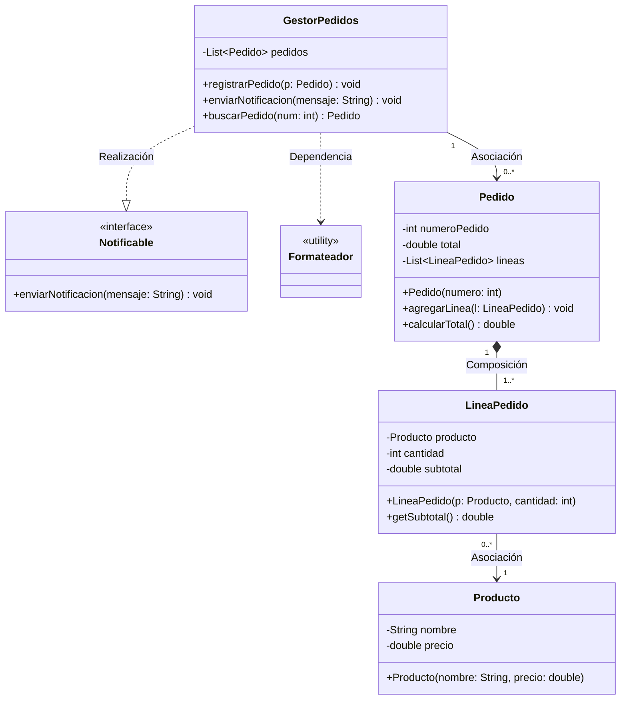
```mermaid
classDiagram
    class Notificable {
        <<interface>>
        +enviarNotificacion(mensaje: String) void
    }

    class Formateador {
        <<utility>>
        %% Estructura omitida, uso temporal
    }

    class GestorPedidos {
        -List~Pedido~ pedidos
        +registrarPedido(p: Pedido) void
        +enviarNotificacion(mensaje: String) void
        +buscarPedido(num: int) Pedido
    }

    class Pedido {
        -int numeroPedido
        -double total
        -List~LineaPedido~ lineas
        +Pedido(numero: int)
        +agregarLinea(l: LineaPedido) void
        +calcularTotal() double
    }

    class LineaPedido {
        -Producto producto
        -int cantidad
        -double subtotal
        +LineaPedido(p: Producto, cantidad: int)
        +getSubtotal() double
    }

    class Producto {
        -String nombre
        -double precio
        +Producto(nombre: String, precio: double)
    }

    %% Relaciones
    GestorPedidos ..|> Notificable : Realización
    GestorPedidos "1" --> "0..*" Pedido : Asociación
    Pedido "1" *-- "1..*" LineaPedido : Composición
    LineaPedido "0..*" --> "1" Producto : Asociación
    GestorPedidos ..> Formateador : Dependencia
```

**b) Identificación y justificación teórica de relaciones:**
*   **Composición (`Pedido *-- LineaPedido`):** Las líneas de pedido se declaran como una lista dentro de `Pedido`. Las líneas no tienen sentido ni ciclo de vida fuera de un pedido concreto.
*   **Asociación (`GestorPedidos --> Pedido`):** El gestor mantiene una referencia permanente a una lista de pedidos.
*   **Realización (`GestorPedidos ..|> Notificable`):** La clase implementa (`implements`) el contrato de la interfaz.
*   **Dependencia (`GestorPedidos ..> Formateador`):** El código indica que `Formateador f = new Formateador();` se usa como variable local dentro de un método. Es un uso temporal y débil, sin referencia permanente.

---

## BLOQUE 4: Ejercicios Avanzados - Ingeniería Directa

**[⬆️ Volver al índice](#indice)**

<a id="ejercicio-11"></a>
### Ejercicio 11: Ingeniería Directa — Sistema Bancario

> **📌 ENUNCIADO:**
> A partir del siguiente diagrama UML genera el código Java completo para cada clase:
> 
>                 
>                     
> **Clase: Cuenta**
> 
>                         
>                             * - iban : String
>                             * - saldo : double = 0.0
>                             * # titular : Cliente
>                         
>                             + ingresar(importe: double) : void
>                             * + retirar(importe: double) : boolean
>                             * + getSaldo() : double
>                         
>                     
>                     
> **Clase: CuentaCorriente**
> 
>                         
>                             * - descubierto : double = 500.0
>                         
>                             + retirar(importe: double) : boolean
>                         
>                     
>                     
> **Clase: Cliente**
> 
>                         
>                             * - nombre : String
>                             * - dni : String
>                             * - cuentas : List<Cuenta>
>                         
>                             + agregarCuenta(c: Cuenta) : void
>                             * + getCuentas() : List<Cuenta>
>                         
>                     
>                 
> 
>                 
>                     **Relaciones:** `CuentaCorriente` hereda de Cuenta (herencia). `Cuenta` tiene una referencia
>                     a `Cliente` (asociación). `Cliente` tiene 0..* cuentas (composición).
>                 
> 
>                 
> 
>                     a) Genera el código Java de las tres clases
>                             respetando herencia, visibilidad y valores por defecto.
>                     b) Implementa el método retirar en `CuentaCorriente` usando
>                             `super` y permitiendo descubierto.
>                     c) ¿Qué anotación Java indica que retirar sobreescribe el método padre?

--- 

**🟢 SOLUCIÓN:**


**Contexto:** Generar código para `Cuenta`, `CuentaCorriente` y `Cliente`, respetando la herencia y asociaciones indicadas en el UML.

**Resolución aplicando la teoría:**

**a) y b) Código Java generado:**

```java
import java.util.ArrayList;
import java.util.List;

public class Cliente {
    private String nombre;
    private String dni;
    // Composición: 0..* cuentas
    private List<Cuenta> cuentas = new ArrayList<>();

    public Cliente(String nombre, String dni) {
        this.nombre = nombre;
        this.dni = dni;
    }

    public void agregarCuenta(Cuenta c) {
        cuentas.add(c);
    }

    public List<Cuenta> getCuentas() {
        return cuentas;
    }
}

public class Cuenta {
    private String iban;
    private double saldo = 0.0;
    // Visibilidad protegida (#)
    protected Cliente titular; 

    public Cuenta(String iban, Cliente titular) {
        this.iban = iban;
        this.titular = titular;
    }

    public void ingresar(double importe) {
        saldo += importe;
    }

    public boolean retirar(double importe) {
        if (importe > saldo) return false;
        saldo -= importe;
        return true;
    }

    public double getSaldo() {
        return saldo;
    }
}

public class CuentaCorriente extends Cuenta {
    private double descubierto = 500.0;

    public CuentaCorriente(String iban, Cliente titular) {
        super(iban, titular);
    }

    @Override
    public boolean retirar(double importe) {
        // Permite retirar si el importe no supera el saldo + descubierto
        if (importe > (getSaldo() + descubierto)) {
            return false;
        }
        // Llamada al método padre para ajustar el saldo en negativo si es necesario
        super.ingresar(-importe); 
        return true;
    }
}
```

**c) ¿Qué anotación Java indica que `retirar` sobreescribe el método padre?**
*   La anotación es `@Override`. Su uso garantiza que el compilador verifique que la firma del método coincide exactamente con la del método en la superclase `Cuenta`.


**[⬆️ Volver al índice](#indice)**

---

<a id="ejercicio-12"></a>
### Ejercicio 12: Ingeniería Directa — Tienda Online

> **📌 ENUNCIADO:**
> Dado el siguiente diagrama UML de una tienda online, genera el código Java:
> 
>                 
>                     
> **Clase: Producto**
> 
>                         
>                             * - nombre : String
>                             * - precio : double
>                             * - stock : int
>                         
>                             + aplicarDescuento(pct:
>                                     double) : double
>                             * + hayStock() : boolean
>                         
>                     
>                     
> **Clase: Carrito**
> 
>                         
>                             * - items : Map<Producto,Integer>
>                         
>                             + agregar(p: Producto, cant:
>                                     int) : void
>                             * + calcularTotal() : double
>                             * + vaciar()
>                                         : void
>                         
>                     
>                 
> 
>                 **Relaciones:** `Producto` implementa
>                     `Descuentable` (realización). `Carrito` agrega
>                     `Producto` con cantidad (agregación, `0..*`).
>                 
> 
>                 
> 
>                     a) Genera el código Java de las tres
>                             clases/interfaz.
>                     b) Implementa calcularTotal() iterando el `Map` y
>                             sumando `precio × cantidad`.
>                     c) ¿Por qué se usa Map<Producto,Integer> en lugar de List<Producto>?

--- 

**🟢 SOLUCIÓN:**


**Contexto:** Generar el código Java para `Descuentable`, `Producto` y `Carrito` resolviendo la relación de agregación mediante un `Map`.

**Resolución aplicando la teoría:**

**a) y b) Código Java generado:**

```java
import java.util.HashMap;
import java.util.Map;

// Interfaz (<<interface>>)
public interface Descuentable {
    double aplicarDescuento(double pct);
}

// Realización
public class Producto implements Descuentable {
    private String nombre;
    private double precio;
    private int stock;

    public Producto(String nombre, double precio, int stock) {
        this.nombre = nombre;
        this.precio = precio;
        this.stock = stock;
    }

    @Override
    public double aplicarDescuento(double pct) {
        return precio - (precio * (pct / 100.0));
    }

    public boolean hayStock() {
        return stock > 0;
    }

    public double getPrecio() {
        return precio;
    }
}

// Clase con Agregación (0..*)
public class Carrito {
    // El Map actúa como colección para la relación de agregación y cantidad
    private Map<Producto, Integer> items = new HashMap<>();

    public void agregar(Producto p, int cant) {
        // Si el producto ya está, suma la cantidad
        items.put(p, items.getOrDefault(p, 0) + cant);
    }

    public double calcularTotal() {
        double total = 0;
        for (Map.Entry<Producto, Integer> entry : items.entrySet()) {
            total += entry.getKey().getPrecio() * entry.getValue();
        }
        return total;
    }

    public void vaciar() {
        items.clear();
    }
}
```

**c) ¿Por qué se usa `Map<Producto,Integer>` en lugar de `List<Producto>`?**
*   Semánticamente, en un carrito de compras un producto específico puede agregarse múltiples veces. Usar un `Map` (Diccionario) permite asociar directamente la entidad `Producto` con su cantidad (`Integer`), optimizando el cálculo y evitando duplicar objetos idénticos en una lista, lo cual sería ineficiente.


**[⬆️ Volver al índice](#indice)**

---

<a id="ejercicio-13"></a>
### Ejercicio 13: Ingeniería Directa — Sistema de Notificaciones

> **📌 ENUNCIADO:**
> El siguiente diagrama modela el patrón **Observer** simplificado. Genera el
>                     código Java:
> 
>                 
>                     
> **Clase: Publicador**
> 
>                         
>                             * - observadores : List<Observador>
>                         
>                             + suscribir(o: Observador) : void
>                             * + desuscribir(o: Observador) : void
>                             * + notificar(evento: String) : void
>                         
>                     
>                     
> **Clase: LoggerObservador**
> 
>                         
>                             * - logs : List<String>
>                         
>                             + actualizar(evento: String) : void
>                             * + getLogs()
>                                         : List<String>
>                         
>                     
>                 
> 
>                 **Relaciones:** `LoggerObservador` realiza
>                     `Observador`. `Publicador` tiene una asociación
>                     `0..*` con `Observador`.
> 
>                 
> 
>                     a) Genera el código Java completo de las
>                             tres clases.
>                     b) Implementa notificar para que llame a `actualizar`
>                             en todos los observadores suscritos.
>                     c) ¿Qué ventaja aporta programar contra la
>                             interfaz `Observador` en lugar de contra LoggerObservador?

--- 

**🟢 SOLUCIÓN:**


**Contexto:** Implementar el patrón Observer partiendo del diagrama UML provisto.

**Resolución aplicando la teoría:**

**a) y b) Código Java generado:**

```java
import java.util.ArrayList;
import java.util.List;

public interface Observador {
    void actualizar(String evento);
}

public class Publicador {
    // Asociación 0..* hacia la interfaz Observador
    private List<Observador> observadores = new ArrayList<>();

    public void suscribir(Observador o) {
        observadores.add(o);
    }

    public void desuscribir(Observador o) {
        observadores.remove(o);
    }

    public void notificar(String evento) {
        // Itera la lista y llama al método polimórfico
        for (Observador o : observadores) {
            o.actualizar(evento);
        }
    }
}

public class LoggerObservador implements Observador {
    private List<String> logs = new ArrayList<>();

    @Override
    public void actualizar(String evento) {
        logs.add("[LOG] Evento recibido: " + evento);
    }

    public List<String> getLogs() {
        return logs;
    }
}
```

**c) ¿Qué ventaja aporta programar contra la interfaz `Observador` en lugar de contra `LoggerObservador`?**
*   Esta es la base del desacoplamiento en el diseño orientado a objetos. Si `Publicador` tuviera una lista de `LoggerObservador`, solo podría notificar a ese tipo específico. Al depender de la interfaz `Observador` (abstracción), podemos agregar nuevos tipos de observadores (por ejemplo, `EmailObservador`, `SMSObservador`) en el futuro sin modificar el código de la clase `Publicador` (cumpliendo el principio Abierto/Cerrado).


**[⬆️ Volver al índice](#indice)**

---

<a id="ejercicio-14"></a>
### Ejercicio 14: Ingeniería Directa — Gestión de Reservas

> **📌 ENUNCIADO:**
> El siguiente diagrama modela un sistema de reservas hoteleras. Genera el código Java:
>                 
> 
>                 
>                     
> **Clase: Habitacion**
> 
>                         
>                             * - numero : int
>                             * - tipo : String
>                             * - precioPorNoche : double
>                             * - disponible : boolean = true
>                         
>                             + reservar() : void
>                             * + liberar()
>                                         : void
>                             * + isDisponible() : boolean
>                         
>                     
>                     
> **Clase: Reserva**
> 
>                         
>                             * - id : int
>                             * - habitacion : Habitacion
>                             * - huesped : String
>                             * - noches : int
>                         
>                             + calcularCoste() : double
>                             * + cancelar() : void
>                         
>                     
>                     
> **Clase: Hotel**
> 
>                         
>                             * - nombre : String
>                             * - habitaciones : List<Habitacion>
>                             * - reservas : List<Reserva>
>                         
>                             + crearReserva(hab: Habitacion,
>                                     huesped: String, noches: int) : Reserva
>                             * + habitacionesLibres() : List<Habitacion>
>                         
>                     
>                 
> 
>                 **Relaciones:** `Hotel` compone Habitacion (`1..*`) y agrega Reserva (`0..*`). Reserva asocia a `Habitacion` (1).
> 
>                 
> 
>                     a) Genera el código Java completo de las
>                             tres clases.
>                     b) Implementa crearReserva verificando que la habitación esté disponible antes
>                             de reservar.
>                     c) Implementa habitacionesLibres() usando streams de Java.

--- 

**🟢 SOLUCIÓN:**


**Contexto:** Generar el código Java gestionando las relaciones de composición (Hotel-Habitación) y agregación (Hotel-Reserva).

**Resolución aplicando la teoría:**

**a), b) y c) Código Java generado:**

```java
import java.util.ArrayList;
import java.util.List;
import java.util.stream.Collectors;

public class Habitacion {
    private int numero;
    private String tipo;
    private double precioPorNoche;
    private boolean disponible = true;

    public Habitacion(int numero, String tipo, double precio) {
        this.numero = numero;
        this.tipo = tipo;
        this.precioPorNoche = precio;
    }

    public void reservar() { this.disponible = false; }
    public void liberar() { this.disponible = true; }
    public boolean isDisponible() { return disponible; }
    public double getPrecioPorNoche() { return precioPorNoche; }
}

public class Reserva {
    private int id;
    private Habitacion habitacion; // Asociación (1)
    private String huesped;
    private int noches;

    public Reserva(int id, Habitacion hab, String huesped, int noches) {
        this.id = id;
        this.habitacion = hab;
        this.huesped = huesped;
        this.noches = noches;
    }

    public double calcularCoste() {
        return habitacion.getPrecioPorNoche() * noches;
    }

    public void cancelar() {
        habitacion.liberar();
    }
}

public class Hotel {
    private String nombre;
    private List<Habitacion> habitaciones = new ArrayList<>(); // Composición 1..*
    private List<Reserva> reservas = new ArrayList<>(); // Agregación 0..*
    private int contadorReservas = 1;

    public Hotel(String nombre) {
        this.nombre = nombre;
    }

    // Creación de la composición (Las habitaciones nacen con el hotel)
    public void agregarHabitacion(Habitacion h) {
        habitaciones.add(h);
    }

    public Reserva crearReserva(Habitacion hab, String huesped, int noches) {
        if (!hab.isDisponible()) {
            return null; // O lanzar excepción
        }
        hab.reservar();
        Reserva nuevaReserva = new Reserva(contadorReservas++, hab, huesped, noches);
        reservas.add(nuevaReserva);
        return nuevaReserva;
    }

    public List<Habitacion> habitacionesLibres() {
        // Uso de streams de Java como se requiere
        return habitaciones.stream()
                .filter(Habitacion::isDisponible)
                .collect(Collectors.toList());
    }
}
```


**[⬆️ Volver al índice](#indice)**

---

<a id="ejercicio-15"></a>
### Ejercicio 15: Ingeniería Directa — Jerarquía de Figuras Geométricas

> **📌 ENUNCIADO:**
> El siguiente diagrama modela figuras geométricas con una clase abstracta y dos
>                     subclases. Genera el código Java:
> 
>                 
>                     
> **Clase: Circulo**
> 
>                         
>                             * - radio : double
>                         
>                             + area() :
>                                         double
>                             * + perimetro() : double
>                         
>                     
>                     
> **Clase: Rectangulo**
> 
>                         
>                             * - ancho : double
>                             * - alto : double
>                         
>                             + area() :
>                                         double
>                             * + perimetro() : double
>                         
>                     
>                 
> 
>                 **Relaciones:** `Circulo` y Rectangulo heredan de `Figura` (herencia). Los
>                     métodos `area()` y `perimetro()` en Figura son abstractos (en cursiva en el diagrama).
> 
>                 
> 
>                     a) Genera el código Java completo. Usa Math.PI para el círculo.
>                     b) Implementa describir() en `Figura` como método
>                             concreto que llame a los abstractos.
>                     c) ¿Qué ocurre si intentamos instanciar
>                             `Figura` directamente? ¿Y si una subclase no implementa area()?

--- 

**🟢 SOLUCIÓN:**


**Contexto:** Aplicación directa de herencia y polimorfismo con clases y métodos abstractos.

**Resolución aplicando la teoría:**

**a) y b) Código Java generado:**

```java
public abstract class Figura {
    protected String color;

    public Figura(String color) {
        this.color = color;
    }

    // Métodos abstractos (en cursiva en UML)
    public abstract double area();
    public abstract double perimetro();

    // Método concreto en clase abstracta que llama a los abstractos
    public String describir() {
        return "Figura de color " + color + 
               " | Área: " + String.format("%.2f", area()) + 
               " | Perímetro: " + String.format("%.2f", perimetro());
    }
}

public class Circulo extends Figura {
    private double radio;

    public Circulo(String color, double radio) {
        super(color);
        this.radio = radio;
    }

    @Override
    public double area() {
        return Math.PI * Math.pow(radio, 2);
    }

    @Override
    public double perimetro() {
        return 2 * Math.PI * radio;
    }
}

public class Rectangulo extends Figura {
    private double ancho;
    private double alto;

    public Rectangulo(String color, double ancho, double alto) {
        super(color);
        this.ancho = ancho;
        this.alto = alto;
    }

    @Override
    public double area() {
        return ancho * alto;
    }

    @Override
    public double perimetro() {
        return 2 * (ancho + alto);
    }
}
```

**c) ¿Qué ocurre si intentamos instanciar `Figura` directamente? ¿Y si una subclase no implementa `area()`?**
*   **Instanciar `Figura` directamente:** El compilador de Java lanzará un error: *`Figura is abstract; cannot be instantiated`*. Según la teoría, las clases abstractas representan conceptos incompletos.
*   **Subclase que no implementa `area()`:** Si `Circulo` no implementara `area()`, la clase `Circulo` heredaría un método sin cuerpo. En Java (y UML), si una clase contiene al menos un método abstracto (heredado o propio), **la clase entera debe ser declarada abstracta**. Si no se declara abstracta y no se implementa el método, el código no compilará.

## BLOQUE 5: Ejercicios Avanzados - Ingeniería Inversa

**[⬆️ Volver al índice](#indice)**

<a id="ejercicio-16"></a>
### Ejercicio 16: Ingeniería Inversa — Biblioteca Digital

> **📌 ENUNCIADO:**
> A partir del siguiente código Java, realiza ingeniería inversa y obtén el diagrama de
>                     clases UML:
> 
>                 
> ```java
> public interface Prestable {
>     boolean prestar(String usuario);
>     void devolver();
> }
> 
> public abstract class RecursoDigital implements Prestable {
>     private String titulo;
>     private String isbn;
>     protected boolean prestado = false;
> 
>     public abstract String getTipo();
> }
> 
> public class Ebook extends RecursoDigital {
>     private int paginas;
>     private String formato; // PDF, EPUB
> 
>     @Override
>     public String getTipo() { return "Ebook"; }
> 
>     @Override
>     public boolean prestar(String usuario) {
>         if (prestado) return false;
>         prestado = true;
>         return true;
>     }
> 
>     @Override
>     public void devolver() { prestado = false; }
> }
> 
> public class CatalogoBiblioteca {
>     private List<RecursoDigital> recursos = new ArrayList<>();
> 
>     public void agregar(RecursoDigital r) { recursos.add(r); }
> 
>     public List<RecursoDigital> disponibles() {
>         return recursos.stream()
>             .filter(r -> !r.prestado)
>             .collect(Collectors.toList());
>     }
> }
> ```
> 
>                 
> 
>                     a) Dibuja el diagrama UML completo con todos
>                             los tipos de relación.
>                     b) Indica la cardinalidad de la relación
>                             entre `CatalogoBiblioteca` y RecursoDigital.
>                     c) ¿Por qué RecursoDigital es abstracta si ya implementa Prestable?

--- 

**🟢 SOLUCIÓN:**


**Contexto:** Obtener el diagrama de clases UML a partir del código Java de un catálogo de recursos digitales que implementan interfaces y clases abstractas.

**Resolución aplicando la teoría:**

**a) Diagrama de Clases UML completo:**
Al analizar el código identificamos:
1.  Interfaz `Prestable` (estereotipo `<<interface>>`).
2.  Clase abstracta `RecursoDigital` (nombre en *cursiva* o `<<abstract>>`), que realiza `Prestable`.
3.  Clase concreta `Ebook` que hereda (`extends`) de `RecursoDigital`.
4.  Clase `CatalogoBiblioteca` que tiene una colección (`List<RecursoDigital>`). Esto es una agregación `0..*`.

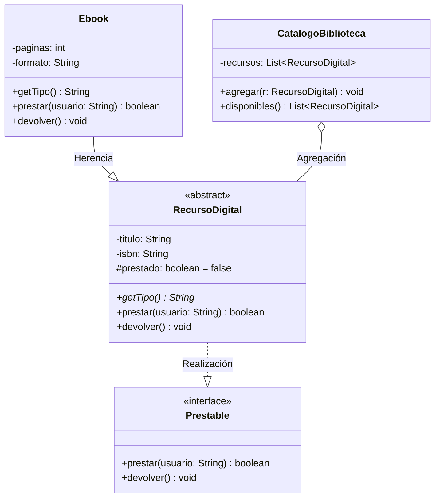
```mermaid
classDiagram
    class Prestable {
        <<interface>>
        +prestar(usuario: String) boolean
        +devolver() void
    }

    class RecursoDigital {
        <<abstract>>
        -titulo: String
        -isbn: String
        #prestado: boolean = false
        +getTipo()* String
        +prestar(usuario: String) boolean
        +devolver() void
    }

    class Ebook {
        -paginas: int
        -formato: String
        +getTipo() String
        +prestar(usuario: String) boolean
        +devolver() void
    }

    class CatalogoBiblioteca {
        -recursos: List~RecursoDigital~
        +agregar(r: RecursoDigital) void
        +disponibles() List~RecursoDigital~
    }

    %% Relaciones
    RecursoDigital ..|> Prestable : Realización
    Ebook --|> RecursoDigital : Herencia
    CatalogoBiblioteca o-- RecursoDigital : Agregación
```

**b) Cardinalidad entre `CatalogoBiblioteca` y `RecursoDigital`:**
*   La cardinalidad es `1` a `0..*`. 
*   Es **agregación** (rombo hueco `o--`) porque el catálogo "tiene" recursos, pero los recursos digitales (los archivos) existen independientemente de que estén registrados en un catálogo específico.

**c) ¿Por qué `RecursoDigital` es abstracta si ya implementa `Prestable`?**
*   Una clase puede ser declarada abstracta aunque implemente una interfaz. En este caso, `RecursoDigital` implementa los métodos comunes (`prestar`, `devolver`) pero declara un nuevo método abstracto `getTipo()` que fuerza a las subclases a proporcionar su tipo específico. 


**[⬆️ Volver al índice](#indice)**

---

<a id="ejercicio-17"></a>
### Ejercicio 17: Ingeniería Inversa — Sistema de Pagos

> **📌 ENUNCIADO:**
> Analiza el siguiente código Java y obtén el diagrama UML:
> 
>                 
> ```java
> public interface MetodoPago {
>     boolean procesar(double importe);
>     String getDescripcion();
> }
> 
> public class Tarjeta implements MetodoPago {
>     private String numero;
>     private String titular;
>     private double limite;
> 
>     @Override
>     public boolean procesar(double importe) { return importe <= limite; }
>     @Override
>     public String getDescripcion() { return "Tarjeta: " + numero; }
> }
> 
> public class PayPal implements MetodoPago {
>     private String email;
>     private double saldo;
> 
>     @Override
>     public boolean procesar(double importe) {
>         if (importe > saldo) return false;
>         saldo -= importe;
>         return true;
>     }
>     @Override
>     public String getDescripcion() { return "PayPal: " + email; }
> }
> 
> public class Pago {
>     private double importe;
>     private MetodoPago metodo;
>     private String estado;
> 
>     public Pago(double importe, MetodoPago metodo) {
>         this.importe = importe; this.metodo = metodo;
>     }
> 
>     public void ejecutar() {
>         Validador v = new Validador(); // uso temporal
>         estado = v.validar(importe) && metodo.procesar(importe) ? "OK" : "RECHAZADO";
>     }
> }
> ```
> 
>                 
> 
>                     a) Dibuja el diagrama UML con todos los
>                             tipos de relación presentes.
>                     b) Identifica la dependencia en el código y
>                             explica por qué es una dependencia y no una asociación.
>                     c) ¿Qué patrón de diseño aplica este código?
>                             ¿Qué ventaja aporta?

--- 

**🟢 SOLUCIÓN:**


**Contexto:** Obtener el diagrama UML identificando la dependencia y el patrón *Strategy* implementado.

**Resolución aplicando la teoría:**

**a) Diagrama de Clases UML:**
El análisis del código revela:
1.  Interfaz `MetodoPago`.
2.  Clases `Tarjeta` y `PayPal` que realizan la interfaz.
3.  Clase `Pago` que tiene una referencia persistente (`- metodo : MetodoPago`).
4.  Uso temporal de la clase `Validador` dentro del método `ejecutar()` de `Pago`.

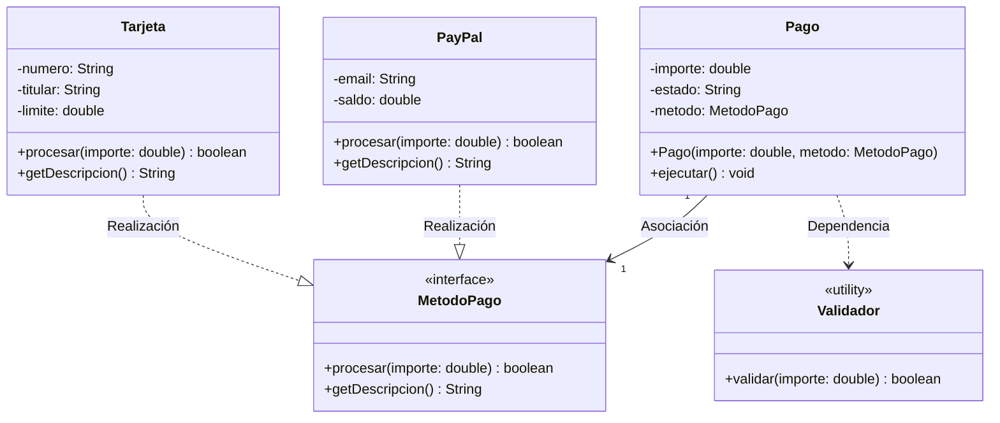
```mermaid
classDiagram
    class MetodoPago {
        <<interface>>
        +procesar(importe: double) boolean
        +getDescripcion() String
    }

    class Tarjeta {
        -numero: String
        -titular: String
        -limite: double
        +procesar(importe: double) boolean
        +getDescripcion() String
    }

    class PayPal {
        -email: String
        -saldo: double
        +procesar(importe: double) boolean
        +getDescripcion() String
    }

    class Pago {
        -importe: double
        -estado: String
        -metodo: MetodoPago
        +Pago(importe: double, metodo: MetodoPago)
        +ejecutar() void
    }

    class Validador {
        <<utility>>
        %% Uso temporal dentro de Pago.ejecutar()
        +validar(importe: double) boolean
    }

    %% Relaciones
    Tarjeta ..|> MetodoPago : Realización
    PayPal ..|> MetodoPago : Realización
    Pago "1" --> "1" MetodoPago : Asociación
    Pago ..> Validador : Dependencia
```

**b) Dependencia vs Asociación:**
*   La relación `Pago ..> Validador` es una **dependencia** porque `Validador` se instancia como una variable local (`Validador v = new Validador();`) dentro del método `ejecutar()`. Al terminar el método, el objeto `Validador` se destruye.
*   En contraste, `Pago` tiene una **asociación** con `MetodoPago` porque se almacena como un atributo permanente (`private MetodoPago metodo;`) y persiste a lo largo del ciclo de vida del objeto `Pago`.

**c) ¿Qué patrón de diseño aplica este código y qué ventaja aporta?**
*   Aplica el patrón **Strategy (Estrategia)**. 
*   **Ventaja:** Permite cambiar el comportamiento en tiempo de ejecución (inyectando diferentes métodos de pago en el constructor de `Pago`). Además, se pueden añadir nuevas formas de pago (ej. Criptomonedas) implementando la interfaz `MetodoPago` sin tener que modificar la clase `Pago`, cumpliendo el Principio de Responsabilidad Única y Abierto/Cerrado (SOLID).


**[⬆️ Volver al índice](#indice)**

---

<a id="ejercicio-18"></a>
### Ejercicio 18: Ingeniería Inversa — Red Social

> **📌 ENUNCIADO:**
> A partir del siguiente código Java, obtén el diagrama de clases UML completo:
> 
>                 
> ```java
> public class Usuario {
>     private String nick;
>     private String email;
>     private List<Usuario> seguidores = new ArrayList<>();
>     private List<Publicacion> publicaciones = new ArrayList<>();
> 
>     public void publicar(Publicacion p) { publicaciones.add(p); }
>     public void seguir(Usuario otro) { otro.seguidores.add(this); }
>     public List<Usuario> getSeguidores() { return seguidores; }
> }
> 
> public class Publicacion {
>     private String contenido;
>     private String fecha;
>     private Usuario autor;
>     private List<Comentario> comentarios = new ArrayList<>();
> 
>     public Publicacion(String contenido, Usuario autor) {
>         this.contenido = contenido; this.autor = autor;
>     }
> 
>     public void comentar(Comentario c) { comentarios.add(c); }
> }
> 
> public class Comentario {
>     private String texto;
>     private Usuario autor;
> 
>     public Comentario(String texto, Usuario autor) {
>         this.texto = texto; this.autor = autor;
>     }
> }
> ```
> 
>                 
> 
>                     a) Dibuja el diagrama UML completo indicando
>                             cardinalidades.
>                     b) Identifica la
>                             **auto-asociación** en el diagrama y explica qué representa.
>                     c) ¿La relación entre Publicacion y `Comentario` es
>                             composición o agregación? Justifica.

--- 

**🟢 SOLUCIÓN:**


**Contexto:** Analizar un sistema con auto-asociaciones y determinar la diferencia entre composición y agregación.

**Resolución aplicando la teoría:**

**a) Diagrama de Clases UML con cardinalidades:**

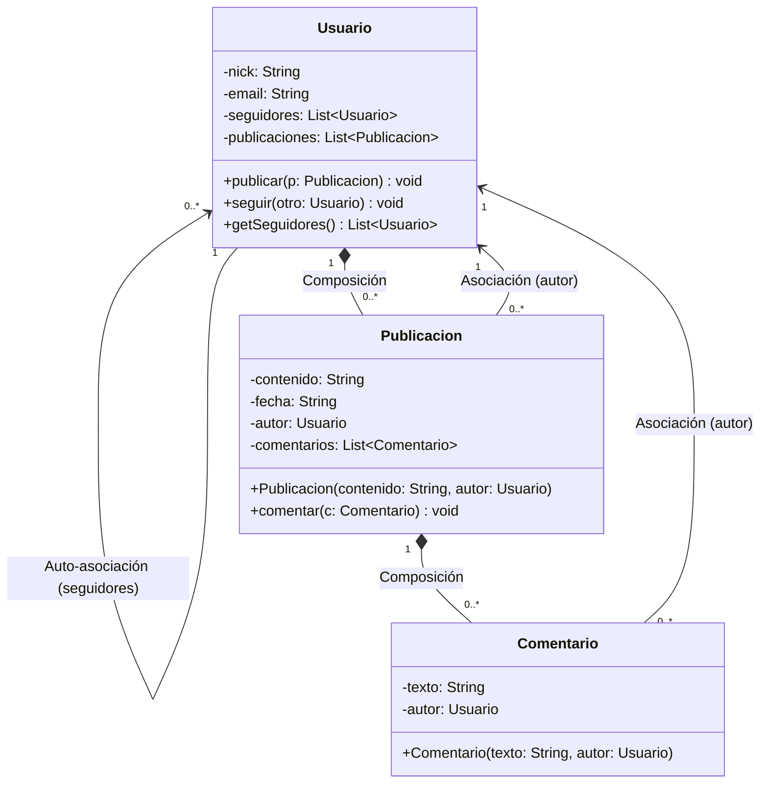
```mermaid
classDiagram
    class Usuario {
        -nick: String
        -email: String
        -seguidores: List~Usuario~
        -publicaciones: List~Publicacion~
        +publicar(p: Publicacion) void
        +seguir(otro: Usuario) void
        +getSeguidores() List~Usuario~
    }

    class Publicacion {
        -contenido: String
        -fecha: String
        -autor: Usuario
        -comentarios: List~Comentario~
        +Publicacion(contenido: String, autor: Usuario)
        +comentar(c: Comentario) void
    }

    class Comentario {
        -texto: String
        -autor: Usuario
        +Comentario(texto: String, autor: Usuario)
    }

    %% Relaciones
    Usuario "0..*" <-- "1" Usuario : Auto-asociación (seguidores)
    Usuario "1" *-- "0..*" Publicacion : Composición
    Publicacion "1" *-- "0..*" Comentario : Composición
    Publicacion "0..*" --> "1" Usuario : Asociación (autor)
    Comentario "0..*" --> "1" Usuario : Asociación (autor)
```

**b) Identifica la auto-asociación en el diagrama y explica qué representa:**
*   La auto-asociación ocurre en la clase `Usuario`. El atributo `seguidores` es una lista del mismo tipo `Usuario`. 
*   En UML se representa como una flecha de asociación que sale y entra en la misma caja de la clase. Representa que una instancia de `Usuario` se relaciona con otras instancias de la misma clase (los seguidores).

**c) ¿La relación entre `Publicacion` y `Comentario` es composición o agregación? Justifica.**
*   Es **composición (◆)**. 
*   **Justificación basada en el código:** Los comentarios se instancian y se agregan *exclusivamente* a la lista interna de una publicación. Si la publicación (el todo) se elimina de la base de datos o de memoria, sus comentarios (las partes) dejan de tener contexto o sentido y se eliminan con ella. Un comentario no puede existir huérfano sin su publicación.


**[⬆️ Volver al índice](#indice)**

---

<a id="ejercicio-19"></a>
### Ejercicio 19: Ingeniería Inversa — Sistema de Inventario

> **📌 ENUNCIADO:**
> A partir del siguiente código Java, obtén el diagrama UML e identifica todos los tipos
>                     de relación:
> 
>                 
> ```java
> public enum Categoria { ELECTRONICA, ROPA, ALIMENTACION }
> 
> public class Articulo {
>     private String codigo;
>     private String descripcion;
>     private double precio;
>     private Categoria categoria;
> 
>     public Articulo(String codigo, String descripcion, double precio, Categoria cat) {
>         this.codigo = codigo; this.descripcion = descripcion;
>         this.precio = precio; this.categoria = cat;
>     }
>     public double getPrecio() { return precio; }
>     public Categoria getCategoria() { return categoria; }
> }
> 
> public class Stock {
>     private Articulo articulo;
>     private int cantidad;
>     private int minimo;
> 
>     public Stock(Articulo articulo, int cantidad, int minimo) {
>         this.articulo = articulo;
>         this.cantidad = cantidad; this.minimo = minimo;
>     }
>     public boolean bajominimo() { return cantidad < minimo; }
>     public void sumar(int n) { cantidad += n; }
> }
> 
> public class Almacen {
>     private String ubicacion;
>     private Map<Articulo, Stock> inventario = new HashMap<>();
> 
>     public void registrar(Articulo a, int cant, int min) {
>         inventario.put(a, new Stock(a, cant, min));
>     }
> 
>     public List<Articulo> articulosBajoMinimo() {
>         ReporteGenerator rg = new ReporteGenerator(); // uso temporal
>         return inventario.entrySet().stream()
>             .filter(e -> e.getValue().bajominimo())
>             .map(Map.Entry::getKey)
>             .collect(Collectors.toList());
>     }
> }
> ```
> 
>                 
> 
>                     a) Dibuja el diagrama UML completo
>                             identificando todas las relaciones y la enumeración.
>                     b) ¿Cómo se representa una enumeración
>                             (`enum`) en UML? ¿Qué estereotipo se usa?
>                     c) Identifica la dependencia e indica cuál
>                             es el elemento cliente y cuál el proveedor.

--- 

**🟢 SOLUCIÓN:**


**Contexto:** Obtener el diagrama de clases identificando enumeraciones y uso de mapas.

**Resolución aplicando la teoría:**

**a) Diagrama de Clases UML:**

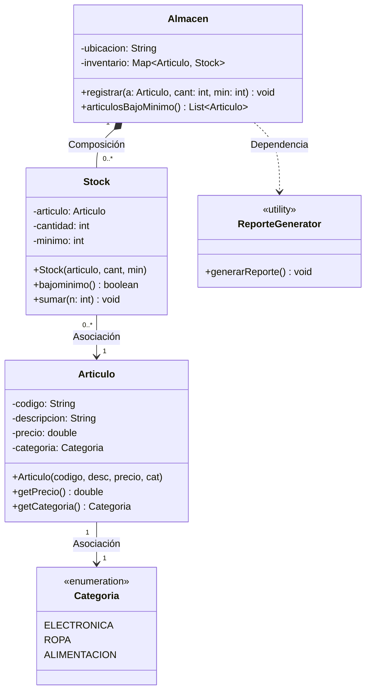
```mermaid
classDiagram
    class Categoria {
        <<enumeration>>
        ELECTRONICA
        ROPA
        ALIMENTACION
    }

    class Articulo {
        -codigo: String
        -descripcion: String
        -precio: double
        -categoria: Categoria
        +Articulo(codigo, desc, precio, cat)
        +getPrecio() double
        +getCategoria() Categoria
    }

    class Stock {
        -articulo: Articulo
        -cantidad: int
        -minimo: int
        +Stock(articulo, cant, min)
        +bajominimo() boolean
        +sumar(n: int) void
    }

    class Almacen {
        -ubicacion: String
        -inventario: Map~Articulo, Stock~
        +registrar(a: Articulo, cant: int, min: int) void
        +articulosBajoMinimo() List~Articulo~
    }

    class ReporteGenerator {
        <<utility>>
        +generarReporte() void
    }

    %% Relaciones
    Articulo "1" --> "1" Categoria : Asociación
    Stock "0..*" --> "1" Articulo : Asociación
    Almacen "1" *-- "0..*" Stock : Composición
    Almacen ..> ReporteGenerator : Dependencia
```

**b) ¿Cómo se representa una enumeración (`enum`) en UML? ¿Qué estereotipo se usa?**
*   Se representa como una clase convencional, pero en la cabecera se incluye el estereotipo `<<enumeration>>`. Sus constantes (ELECTRONICA, ROPA...) se listan en el compartimento superior (donde normalmente van los atributos).

**c) Identifica la dependencia e indica cuál es el elemento cliente y cuál el proveedor.**
*   La dependencia se da en el método `articulosBajoMinimo()`, donde se instancia `ReporteGenerator rg = new ReporteGenerator();`.
*   **Elemento Cliente (quien depende):** `Almacen` (porque utiliza la clase).
*   **Elemento Proveedor (de quien se depende):** `ReporteGenerator`. En el diagrama UML, la flecha de dependencia (`..>`) apunta desde el cliente hacia el proveedor.


**[⬆️ Volver al índice](#indice)**

---

<a id="ejercicio-20"></a>
### Ejercicio 20: Ingeniería Inversa — Juego de Roles

> **📌 ENUNCIADO:**
> A partir del siguiente código Java de un juego de roles, obtén el diagrama UML e
>                     identifica todas las relaciones:
> 
>                 
> ```java
> public interface Atacable {
>     void recibirDanio(int danio);
>     boolean estaVivo();
> }
> 
> public abstract class Personaje implements Atacable {
>     protected String nombre;
>     protected int vida;
>     protected int vidaMax;
>     protected List<Habilidad> habilidades = new ArrayList<>();
> 
>     public abstract int atacar();
> 
>     @Override
>     public void recibirDanio(int danio) { vida = Math.max(0, vida - danio); }
>     @Override
>     public boolean estaVivo() { return vida > 0; }
>     public void aprenderHabilidad(Habilidad h) { habilidades.add(h); }
> }
> 
> public class Guerrero extends Personaje {
>     private int fuerza;
>     private Arma arma;
> 
>     public Guerrero(String nombre, int vida, int fuerza) {
>         this.nombre = nombre; this.vida = this.vidaMax = vida; this.fuerza = fuerza;
>     }
> 
>     @Override
>     public int atacar() { return arma != null ? fuerza + arma.getDanio() : fuerza; }
>     public void equipar(Arma a) { this.arma = a; }
> }
> 
> public class Habilidad {
>     private String nombre;
>     private int coste;
>     private int efecto;
> }
> 
> public class Arma {
>     private String nombre;
>     private int danio;
>     private String tipo;
>     public int getDanio() { return danio; }
> }
> ```
> 
>                 
> 
>                     a) Dibuja el diagrama UML completo con todas
>                             las clases, relaciones y cardinalidades.
>                     b) ¿La relación Guerrero–`Arma` es composición o
>                             agregación? Justifica según el código.
>                     c) ¿La relación Personaje–`Habilidad` es composición o
>                             agregación? ¿Por qué puede diferir de la anterior?

--- 

**🟢 SOLUCIÓN:**


**Contexto:** Analizar la diferencia estructural entre la posesión de armas (agregación) y la de habilidades (composición) en un juego de rol.

**Resolución aplicando la teoría:**

**a) Diagrama de Clases UML:**

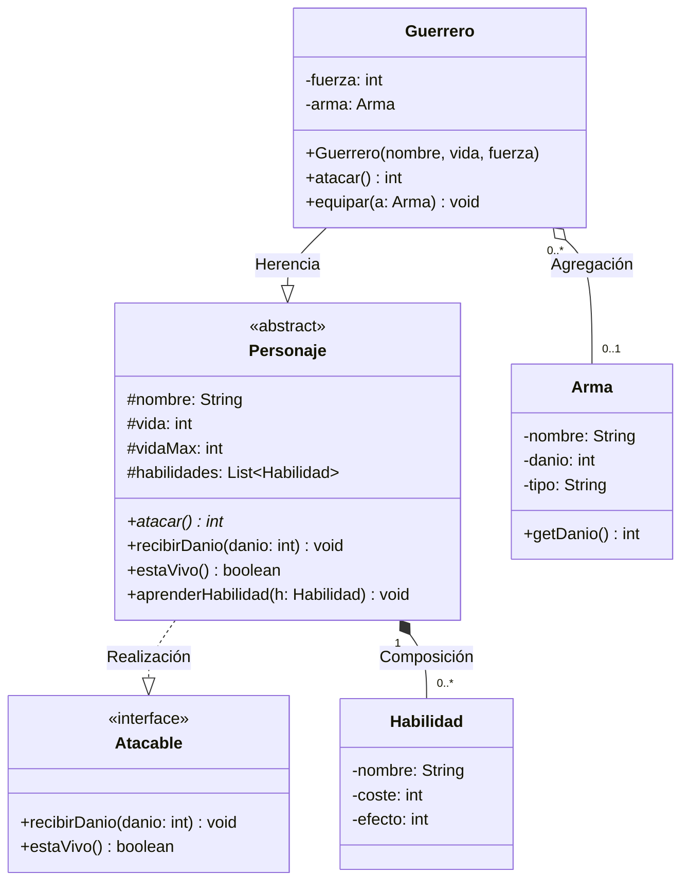
```mermaid
classDiagram
    class Atacable {
        <<interface>>
        +recibirDanio(danio: int) void
        +estaVivo() boolean
    }

    class Personaje {
        <<abstract>>
        #nombre: String
        #vida: int
        #vidaMax: int
        #habilidades: List~Habilidad~
        +atacar()* int
        +recibirDanio(danio: int) void
        +estaVivo() boolean
        +aprenderHabilidad(h: Habilidad) void
    }

    class Guerrero {
        -fuerza: int
        -arma: Arma
        +Guerrero(nombre, vida, fuerza)
        +atacar() int
        +equipar(a: Arma) void
    }

    class Habilidad {
        -nombre: String
        -coste: int
        -efecto: int
    }

    class Arma {
        -nombre: String
        -danio: int
        -tipo: String
        +getDanio() int
    }

    %% Relaciones
    Personaje ..|> Atacable : Realización
    Guerrero --|> Personaje : Herencia
    Personaje "1" *-- "0..*" Habilidad : Composición
    Guerrero "0..*" o-- "0..1" Arma : Agregación
```

**b) ¿La relación `Guerrero`–`Arma` es composición o agregación? Justifica.**
*   Es **agregación (◇)**. 
*   **Justificación en código:** El atributo `Arma arma` se inicializa como nulo o se inyecta externamente a través del método `equipar(Arma a)`. El ciclo de vida del arma no depende del guerrero; si el guerrero muere (se destruye el objeto), el arma podría existir en el sistema para que otro guerrero la equipe (por tanto, es un vínculo débil).

**c) ¿La relación `Personaje`–`Habilidad` es composición o agregación? ¿Por qué difiere?**
*   Es **composición (◆)**. 
*   **Justificación:** Las habilidades se gestionan de forma inmanente en el `Personaje` (`habilidades.add(h)`). A nivel conceptual, las habilidades de un personaje forman parte de su esencia y progresión interna. Si el personaje se elimina de la base de datos del juego, sus habilidades aprendidas (la asociación concreta a él) desaparecen. El ciclo de vida es compartido.

## BLOQUE 6: Ejercicios Funcional → Diagrama

En esta sección, aplicaremos la teoría de modelado UML para transformar descripciones funcionales (requisitos de negocio en lenguaje natural) en diagramas de clases formales.

**[⬆️ Volver al índice](#indice)**

<a id="ejercicio-21"></a>
### Ejercicio 21: Funcional — Clínica Veterinaria

> **📌 ENUNCIADO:**
> Lee el siguiente descripción funcional y diseña el diagrama de clases UML
>                     correspondiente:
> 
>                 Una clínica veterinaria necesita gestionar la información de sus animales y
>                     consultas. Existen distintos tipos de animales (perros y gatos) que comparten atributos comunes como
>                     nombre, especie y edad, pero cada tipo emite un sonido diferente. Los veterinarios atienden a los
>                     animales y registran consultas, que incluyen la fecha, el diagnóstico y el animal atendido. Un
>                     veterinario puede tener múltiples consultas a lo largo del tiempo, y cada consulta corresponde a un
>                     único animal.
> 
>                 
> 
>                     a) Identifica las clases, sus atributos y
>                             métodos.
>                     b) Indica qué tipo de relación existe entre
>                             `Perro`/`Gato` y Animal.
>                     c) Justifica si la relación entre Veterinario y `Consulta` es composición
>                             o agregación.

--- 

**🟢 SOLUCIÓN:**


**Contexto:** Modelar un sistema con veterinarios, consultas y animales (perros y gatos) con atributos comunes y métodos polimórficos.

**Resolución aplicando la teoría:**

**a) Identificación de clases, atributos y métodos:**
*   **Clases:** `Veterinario`, `Consulta`, `Animal` (clase base), `Perro` (subclase), `Gato` (subclase).
*   **Atributos comunes (Animal):** `nombre` (String), `especie` (String), `edad` (int). Al ser heredados, su visibilidad debe ser protegida (`#`).
*   **Método polimórfico (Animal):** `sonido()`, que será abstracto en `Animal` y concreto en `Perro` y `Gato`.
*   **Atributos específicos (Consulta):** `fecha` (String/Date), `diagnostico` (String), y una referencia al `Animal` atendido.

**b) Tipo de relación entre `Perro`/`Gato` y `Animal`:**
*   Es una relación de **Herencia (Especialización/Generalización)**. `Perro` "es un" `Animal`. Se representa con una flecha triangular hueca apuntando hacia la superclase `Animal`. Dado que `Animal` define un método que varía según la especie (`sonido()`), debe ser una clase **abstracta**.

**c) Relación entre `Veterinario` y `Consulta`:**
*   Es una **Composición (◆)**.
*   **Justificación teórica:** Las consultas no tienen sentido ni ciclo de vida independiente del acto médico realizado por el veterinario en la clínica. Si se elimina el registro del veterinario o la clínica cierra, las consultas asociadas a su actividad específica pierden su contexto principal. (Nota: En algunos modelos de dominio muy flexibles podría argumentarse agregación si las consultas se reasignan, pero el vínculo inicial de creación médica es fuerte).

**Diagrama de Clases UML:**

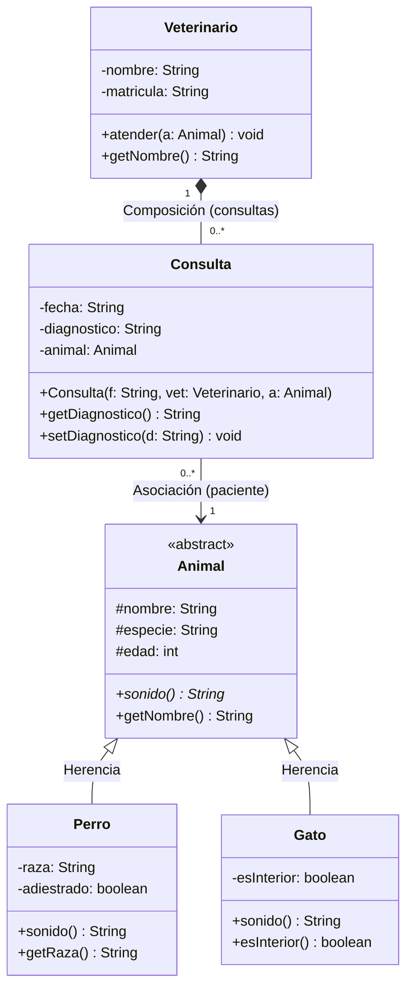
```mermaid
classDiagram
    class Animal {
        <<abstract>>
        #nombre: String
        #especie: String
        #edad: int
        +sonido()* String
        +getNombre() String
    }

    class Perro {
        -raza: String
        -adiestrado: boolean
        +sonido() String
        +getRaza() String
    }

    class Gato {
        -esInterior: boolean
        +sonido() String
        +esInterior() boolean
    }

    class Veterinario {
        -nombre: String
        -matricula: String
        +atender(a: Animal) void
        +getNombre() String
    }

    class Consulta {
        -fecha: String
        -diagnostico: String
        -animal: Animal
        +Consulta(f: String, vet: Veterinario, a: Animal)
        +getDiagnostico() String
        +setDiagnostico(d: String) void
    }

    %% Relaciones
    Animal <|-- Perro : Herencia
    Animal <|-- Gato : Herencia
    Veterinario "1" *-- "0..*" Consulta : Composición (consultas)
    Consulta "0..*" --> "1" Animal : Asociación (paciente)
```


**[⬆️ Volver al índice](#indice)**

---

<a id="ejercicio-22"></a>
### Ejercicio 22: Funcional — Universidad — Cursos y Matriculación

> **📌 ENUNCIADO:**
> Lee el siguiente descripción funcional y diseña el diagrama de clases UML
>                     correspondiente:
> 
>                 Una universidad gestiona personas (estudiantes y profesores) que comparten nombre
>                     y DNI. Los estudiantes se matriculan en cursos y cada matrícula registra la fecha y la nota final.
>                     Los profesores imparten cursos. Un mismo curso puede tener varios estudiantes matriculados y ser
>                     impartido por un profesor. La matrícula actúa como clase de asociación entre estudiante y curso.
>                 
> 
>                 
> 
>                     a) Diseña el diagrama UML completo con todas
>                             las relaciones y cardinalidades.
>                     b) ¿Qué tipo de relación tiene Estudiante con `Persona`? ¿Y Matricula con `Curso`?
>                     c) Explica por qué Matricula es una clase de asociación.

--- 

**🟢 SOLUCIÓN:**


**Contexto:** Modelar estudiantes, profesores, cursos y la relación compleja de matriculación que incluye notas y fechas.

**Resolución aplicando la teoría:**

**a) Diagrama UML completo con cardinalidades:**

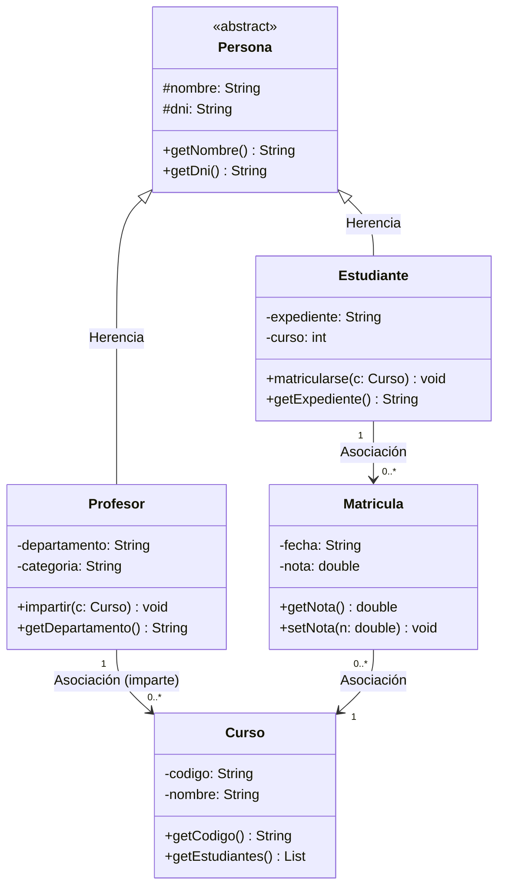
```mermaid
classDiagram
    class Persona {
        <<abstract>>
        #nombre: String
        #dni: String
        +getNombre() String
        +getDni() String
    }

    class Estudiante {
        -expediente: String
        -curso: int
        +matricularse(c: Curso) void
        +getExpediente() String
    }

    class Profesor {
        -departamento: String
        -categoria: String
        +impartir(c: Curso) void
        +getDepartamento() String
    }

    class Curso {
        -codigo: String
        -nombre: String
        +getCodigo() String
        +getEstudiantes() List
    }

    class Matricula {
        -fecha: String
        -nota: double
        +getNota() double
        +setNota(n: double) void
    }

    %% Relaciones
    Persona <|-- Estudiante : Herencia
    Persona <|-- Profesor : Herencia
    Profesor "1" --> "0..*" Curso : Asociación (imparte)
    Estudiante "1" --> "0..*" Matricula : Asociación
    Matricula "0..*" --> "1" Curso : Asociación
```

**b) ¿Qué tipo de relación tiene `Estudiante` con `Persona`? ¿Y `Matricula` con `Curso`?**
*   `Estudiante` a `Persona`: **Herencia (▷)**. Un estudiante "es una" persona y hereda `nombre` y `dni`.
*   `Matricula` a `Curso`: **Asociación (→)**. La matrícula mantiene una referencia estructural al curso en el que el estudiante se ha inscrito.

**c) Explica por qué `Matricula` es una *clase de asociación*:**
*   Teóricamente, un estudiante y un curso tienen una relación muchos a muchos (`*` a `*`). Sin embargo, cuando esa relación necesita almacenar información propia que no pertenece ni al Estudiante ni al Curso por separado (como la `fecha` en la que se matriculó y la `nota` final que sacó), la relación se transforma en una **Clase de Asociación** (`Matricula`). Esta clase "rompe" el muchos a muchos en dos relaciones uno a muchos.


**[⬆️ Volver al índice](#indice)**

---

<a id="ejercicio-23"></a>
### Ejercicio 23: Funcional — Gestión de Proyectos Software

> **📌 ENUNCIADO:**
> Lee el siguiente descripción funcional y diseña el diagrama de clases UML
>                     correspondiente:
> 
>                 Una empresa de desarrollo necesita gestionar proyectos de software. Cada proyecto
>                     contiene tareas y sprints. Las tareas tienen título, prioridad y estado de completitud. Los sprints
>                     agrupan tareas y miden la velocidad del equipo. Los empleados tienen un rol y pueden ser asignados a
>                     múltiples tareas. Cada proyecto tiene un único repositorio de código con URL y rama por defecto.
>                 
> 
>                 
> 
>                     a) Dibuja el diagrama UML completo con todas
>                             las relaciones.
>                     b) ¿Qué relación existe entre Sprint y `Tarea`? Justifica si es
>                             composición o agregación.
>                     c) Indica la cardinalidad entre Empleado y `Tarea`.

--- 

**🟢 SOLUCIÓN:**


**Contexto:** Modelar un sistema con proyectos, tareas, sprints, empleados (asignación) y repositorios.

**Resolución aplicando la teoría:**

**a) Diagrama UML completo con todas las relaciones:**

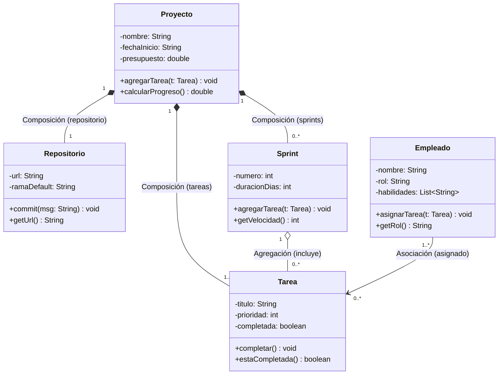
```mermaid
classDiagram
    class Proyecto {
        -nombre: String
        -fechaInicio: String
        -presupuesto: double
        +agregarTarea(t: Tarea) void
        +calcularProgreso() double
    }

    class Repositorio {
        -url: String
        -ramaDefault: String
        +commit(msg: String) void
        +getUrl() String
    }

    class Tarea {
        -titulo: String
        -prioridad: int
        -completada: boolean
        +completar() void
        +estaCompletada() boolean
    }

    class Sprint {
        -numero: int
        -duracionDias: int
        +agregarTarea(t: Tarea) void
        +getVelocidad() int
    }

    class Empleado {
        -nombre: String
        -rol: String
        -habilidades: List~String~
        +asignarTarea(t: Tarea) void
        +getRol() String
    }

    %% Relaciones
    Proyecto "1" *-- "1" Repositorio : Composición (repositorio)
    Proyecto "1" *-- "1..*" Tarea : Composición (tareas)
    Proyecto "1" *-- "0..*" Sprint : Composición (sprints)
    Sprint "1" o-- "0..*" Tarea : Agregación (incluye)
    Empleado "1..*" --> "0..*" Tarea : Asociación (asignado)
```

**b) ¿Qué relación existe entre `Sprint` y `Tarea`? Justifica si es composición o agregación.**
*   Es **Agregación (◇)**.
*   **Justificación:** Las tareas se crean dentro del contexto del `Proyecto` (Composición fuerte: si el proyecto se borra, las tareas también). Sin embargo, un `Sprint` simplemente "agrupa" tareas temporalmente para ejecutarlas. Si el `Sprint` se cancela o elimina, las tareas no se destruyen, vuelven al "Backlog" del proyecto. Por tanto, el vínculo del Sprint con la Tarea es débil.

**c) Indica la cardinalidad entre `Empleado` y `Tarea`.**
*   `Empleado (1..*) ──── (0..*) Tarea`.
*   Un empleado puede ser asignado a múltiples tareas, y una tarea (por ejemplo, compleja) podría tener asignados a múltiples empleados colaborando en ella. Es una asociación muchos a muchos.


**[⬆️ Volver al índice](#indice)**

---

<a id="ejercicio-24"></a>
### Ejercicio 24: Funcional — Sistema de Transporte Público

> **📌 ENUNCIADO:**
> Lee el siguiente descripción funcional y diseña el diagrama de clases UML
>                     correspondiente:
> 
>                 Una ciudad gestiona su red de transporte público. Existen vehículos (autobuses y
>                     metros) con matrícula y capacidad. Los conductores conducen vehículos. Cada vehículo recorre una
>                     ruta, y cada ruta tiene al menos dos paradas con nombre y coordenadas. Las paradas son parte
>                     esencial de la ruta: no existen fuera de ella.
> 
>                 
> 
>                     a) Diseña el diagrama UML con todas las
>                             clases y relaciones.
>                     b) ¿Por qué Autobus y `Metro` heredan de Vehiculo abstracto?
>                     c) ¿La relación entre Ruta y `Parada` es composición o
>                             agregación? Justifica.

--- 

**🟢 SOLUCIÓN:**


**Contexto:** Modelar vehículos (autobuses/metros), conductores, rutas y paradas.

**Resolución aplicando la teoría:**

**a) Diagrama UML con todas las clases y relaciones:**

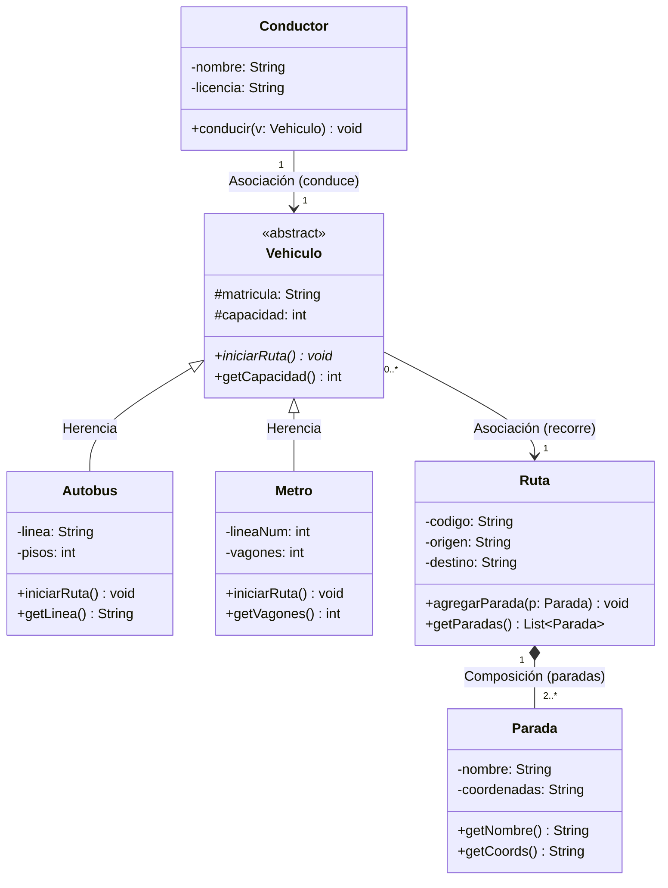
```mermaid
classDiagram
    class Vehiculo {
        <<abstract>>
        #matricula: String
        #capacidad: int
        +iniciarRuta()* void
        +getCapacidad() int
    }

    class Autobus {
        -linea: String
        -pisos: int
        +iniciarRuta() void
        +getLinea() String
    }

    class Metro {
        -lineaNum: int
        -vagones: int
        +iniciarRuta() void
        +getVagones() int
    }

    class Conductor {
        -nombre: String
        -licencia: String
        +conducir(v: Vehiculo) void
    }

    class Ruta {
        -codigo: String
        -origen: String
        -destino: String
        +agregarParada(p: Parada) void
        +getParadas() List~Parada~
    }

    class Parada {
        -nombre: String
        -coordenadas: String
        +getNombre() String
        +getCoords() String
    }

    %% Relaciones
    Vehiculo <|-- Autobus : Herencia
    Vehiculo <|-- Metro : Herencia
    Conductor "1" --> "1" Vehiculo : Asociación (conduce)
    Vehiculo "0..*" --> "1" Ruta : Asociación (recorre)
    Ruta "1" *-- "2..*" Parada : Composición (paradas)
```

**b) ¿Por qué `Autobus` y `Metro` heredan de `Vehiculo` abstracto?**
*   Ambos comparten propiedades comunes (`matricula`, `capacidad`) y un comportamiento común (`iniciarRuta()`). Convertir `Vehiculo` en una clase abstracta permite aplicar el **polimorfismo**: el `Conductor` puede conducir un `Vehiculo` genérico, y el método `iniciarRuta()` se ejecutará de forma específica dependiendo de si el objeto en memoria es un `Autobus` o un `Metro` (ligadura dinámica). No tiene sentido instanciar un "vehículo genérico" que no sea ni bus ni metro, de ahí la abstracción.

**c) ¿La relación entre `Ruta` y `Parada` es composición o agregación? Justifica.**
*   Es **Composición (◆)**.
*   **Justificación:** El enunciado indica explícitamente: "Las paradas son parte esencial de la ruta: no existen fuera de ella". Este es el principio teórico fundamental de la composición: las partes (paradas) tienen su ciclo de vida estrictamente ligado al todo (ruta). Si la ruta de autobús número 5 se elimina del sistema de transporte, todas las paradas exclusivas de esa ruta lógica se destruyen con ella.

## BLOQUE 7: Ejercicios Funcional → Diagrama (Continuación)

**[⬆️ Volver al índice](#indice)**

<a id="ejercicio-25"></a>
### Ejercicio 25: Funcional — Plataforma de Streaming

> **📌 ENUNCIADO:**
> Lee el siguiente descripción funcional y diseña el diagrama de clases UML
>                     correspondiente:
> 
>                 Una plataforma de streaming ofrece contenidos (películas y series). Las películas
>                     tienen director y clasificación. Las series se componen de episodios numerados por temporada. Los
>                     usuarios tienen un plan de suscripción, mantienen un historial de visualizaciones y reciben
>                     recomendaciones personalizadas con puntuación y motivo. Tanto películas como series se pueden
>                     reproducir.
> 
>                 
> 
>                     a) Dibuja el diagrama de clases UML
>                             completo.
>                     b) ¿Qué estereotipo tiene Contenido y por qué?
>                     c) Indica si la relación Usuario–`Recomendacion` es composición o
>                             agregación y justifícalo.

--- 

**🟢 SOLUCIÓN:**


**Contexto:** Diseñar un sistema que gestione contenidos (películas y series), usuarios, historiales y recomendaciones.

**Resolución aplicando la teoría:**

**a) Dibuja el diagrama de clases UML completo.**

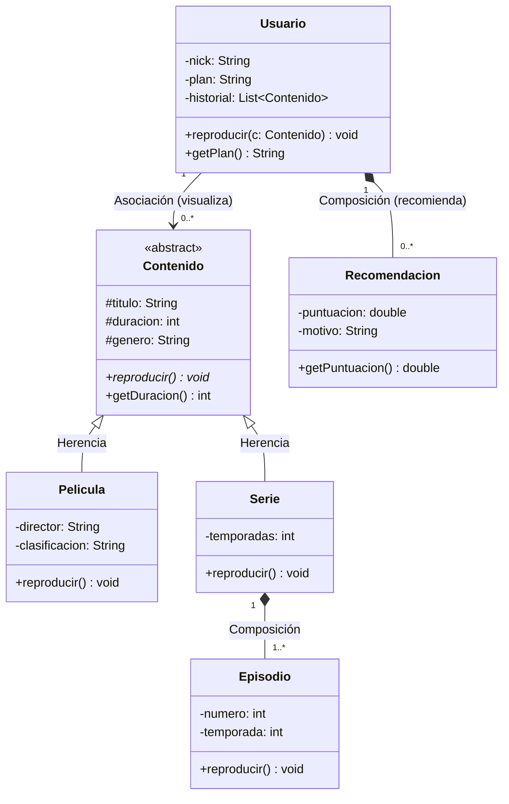
```mermaid
classDiagram
    class Contenido {
        <<abstract>>
        #titulo: String
        #duracion: int
        #genero: String
        +reproducir()* void
        +getDuracion() int
    }

    class Pelicula {
        -director: String
        -clasificacion: String
        +reproducir() void
    }

    class Serie {
        -temporadas: int
        +reproducir() void
    }

    class Episodio {
        -numero: int
        -temporada: int
        +reproducir() void
    }

    class Usuario {
        -nick: String
        -plan: String
        -historial: List~Contenido~
        +reproducir(c: Contenido) void
        +getPlan() String
    }

    class Recomendacion {
        -puntuacion: double
        -motivo: String
        +getPuntuacion() double
    }

    %% Relaciones
    Contenido <|-- Pelicula : Herencia
    Contenido <|-- Serie : Herencia
    Serie "1" *-- "1..*" Episodio : Composición
    Usuario "1" --> "0..*" Contenido : Asociación (visualiza)
    Usuario "1" *-- "0..*" Recomendacion : Composición (recomienda)
```

**b) ¿Qué estereotipo tiene `Contenido` y por qué?**
*   Tiene el estereotipo `<<abstract>>` (o se escribe en *cursiva*).
*   **Justificación:** Representa un concepto genérico que agrupa los atributos (`titulo`, `duracion`, `genero`) y métodos (`reproducir()`) comunes a Películas y Series. No tiene sentido instanciar un "Contenido" genérico que no sea ni una película ni una serie, por lo que debe ser abstracta.

**c) Indica si la relación `Usuario`–`Recomendacion` es composición o agregación y justifícalo.**
*   Es **Composición (◆)**.
*   **Justificación:** Según el enunciado, las recomendaciones son "personalizadas". Esto significa que una recomendación concreta (con su puntuación y motivo) se genera *específicamente* para un usuario en particular en base a su historial. Si el usuario elimina su cuenta, sus recomendaciones personales dejan de tener sentido y deben ser eliminadas de la base de datos. El ciclo de vida de la recomendación depende estrictamente del usuario (el "todo").


**[⬆️ Volver al índice](#indice)**

---

<a id="ejercicio-26"></a>
### Ejercicio 26: Funcional — Sistema Bancario con Transacciones

> **📌 ENUNCIADO:**
> Lee el siguiente descripción funcional y diseña el diagrama de clases UML
>                     correspondiente:
> 
>                 Un banco gestiona cuentas bancarias de dos tipos: de ahorro (con interés y
>                     penalización por retirada anticipada) y corrientes (con límite de descubierto y comisión). Ambas
>                     heredan de una clase abstracta CuentaBancaria con IBAN y saldo. Cada cuenta pertenece a un
>                     cliente, que puede tener varias cuentas. Las cuentas almacenan un historial de transacciones con
>                     tipo e importe.
> 
>                 
> 
>                     a) Diseña el diagrama UML completo.
>                     
> 
>                     b)¿Por qué CuentaBancaria es abstracta? ¿Qué método podría ser
>                             abstracto?
>                     c) Justifica el tipo de relación entre Cliente y `CuentaBancaria`.

--- 

**🟢 SOLUCIÓN:**


**Contexto:** Modelar cuentas bancarias (ahorro y corriente), clientes y un historial de transacciones.

**Resolución aplicando la teoría:**

**a) Diseña el diagrama UML completo.**

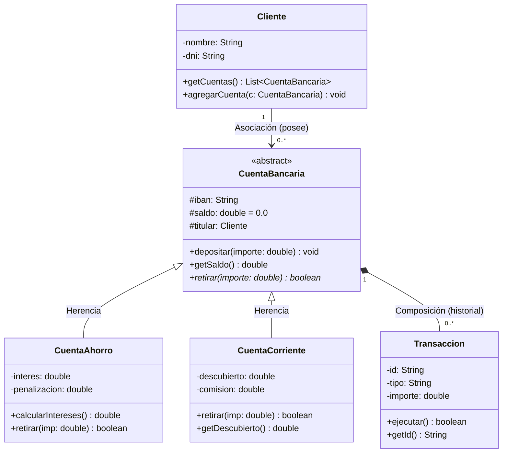
```mermaid
classDiagram
    class Cliente {
        -nombre: String
        -dni: String
        +getCuentas() List~CuentaBancaria~
        +agregarCuenta(c: CuentaBancaria) void
    }

    class CuentaBancaria {
        <<abstract>>
        #iban: String
        #saldo: double = 0.0
        #titular: Cliente
        +depositar(importe: double) void
        +getSaldo() double
        +retirar(importe: double)* boolean
    }

    class CuentaAhorro {
        -interes: double
        -penalizacion: double
        +calcularIntereses() double
        +retirar(imp: double) boolean
    }

    class CuentaCorriente {
        -descubierto: double
        -comision: double
        +retirar(imp: double) boolean
        +getDescubierto() double
    }

    class Transaccion {
        -id: String
        -tipo: String
        -importe: double
        +ejecutar() boolean
        +getId() String
    }

    %% Relaciones
    Cliente "1" --> "0..*" CuentaBancaria : Asociación (posee)
    CuentaBancaria <|-- CuentaAhorro : Herencia
    CuentaBancaria <|-- CuentaCorriente : Herencia
    CuentaBancaria "1" *-- "0..*" Transaccion : Composición (historial)
```

**b) ¿Por qué `CuentaBancaria` es abstracta? ¿Qué método podría ser abstracto?**
*   **Por qué es abstracta:** Porque representa un concepto base. Un banco no abre "cuentas bancarias genéricas", abre cuentas de ahorro o corrientes.
*   **Método abstracto:** El método `retirar(importe: double)` debe ser abstracto en `CuentaBancaria` y concreto en las subclases, ya que la lógica de retirada varía (la de ahorro tiene penalización por anticipo, la corriente permite descubierto).

**c) Justifica el tipo de relación entre `Cliente` y `CuentaBancaria`.**
*   Es una **Asociación Bidireccional** (o agregación en algunos modelos, pero la asociación es más precisa aquí).
*   **Justificación:** Un cliente "posee" (`0..*`) cuentas, y cada cuenta "pertenece" a un (`1`) cliente titular. Las cuentas y los clientes tienen ciclos de vida independientes en el dominio bancario (un cliente existe en el CRM del banco aunque cierre todas sus cuentas, y una cuenta podría requerir un titular, pero no se "destruye" físicamente al cliente si se cierra la cuenta).


**[⬆️ Volver al índice](#indice)**

---

<a id="ejercicio-27"></a>
### Ejercicio 27: Funcional — Juego de Cartas Coleccionables

> **📌 ENUNCIADO:**
> Lee el siguiente descripción funcional y diseña el diagrama de clases UML
>                     correspondiente:
> 
>                 Un juego de cartas coleccionables tiene cartas de dos tipos: de ataque (con daño
>                     y velocidad) y de defensa (con escudo y resistencia). Ambas heredan de Carta abstracta con
>                     nombre y rareza. Los jugadores poseen un mazo que contiene cartas. Se pueden disputar partidas entre
>                     dos jugadores, que van jugando cartas por turnos acumulando puntos.
> 
>                 
> 
>                     a) Dibuja el diagrama UML con todas las
>                             relaciones.
>                     b) ¿Qué tipo de relación existe entre Jugador y `Mazo`? ¿Y entre Mazo y `Carta`?
>                     c) ¿Cuántos jugadores puede tener una Partida? Indica la cardinalidad.

--- 

**🟢 SOLUCIÓN:**


**Contexto:** Modelar cartas de ataque/defensa, mazos, jugadores y el desarrollo de partidas.

**Resolución aplicando la teoría:**

**a) Dibuja el diagrama UML con todas las relaciones.**

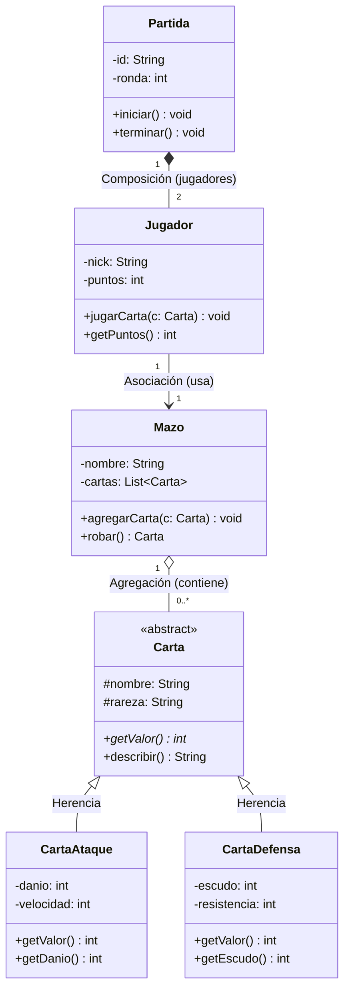
```mermaid
classDiagram
    class Carta {
        <<abstract>>
        #nombre: String
        #rareza: String
        +getValor()* int
        +describir() String
    }

    class CartaAtaque {
        -danio: int
        -velocidad: int
        +getValor() int
        +getDanio() int
    }

    class CartaDefensa {
        -escudo: int
        -resistencia: int
        +getValor() int
        +getEscudo() int
    }

    class Mazo {
        -nombre: String
        -cartas: List~Carta~
        +agregarCarta(c: Carta) void
        +robar() Carta
    }

    class Jugador {
        -nick: String
        -puntos: int
        +jugarCarta(c: Carta) void
        +getPuntos() int
    }

    class Partida {
        -id: String
        -ronda: int
        +iniciar() void
        +terminar() void
    }

    %% Relaciones
    Carta <|-- CartaAtaque : Herencia
    Carta <|-- CartaDefensa : Herencia
    Mazo "1" o-- "0..*" Carta : Agregación (contiene)
    Jugador "1" --> "1" Mazo : Asociación (usa)
    Partida "1" *-- "2" Jugador : Composición (jugadores)
```

**b) ¿Qué tipo de relación existe entre `Jugador` y `Mazo`? ¿Y entre `Mazo` y `Carta`?**
*   **`Jugador` y `Mazo`:** **Asociación Unidireccional (→)**. El jugador "usa" o "tiene" un mazo para jugar, pero el mazo no necesita conocer internamente a qué jugador pertenece para funcionar mecánicamente (robar cartas, barajar).
*   **`Mazo` y `Carta`:** **Agregación (◇)**. Un mazo "contiene" cartas. Si el mazo se destruye (ej. el jugador lo borra en el editor), las cartas coleccionadas siguen existiendo en el inventario global del jugador. El vínculo es débil.

**c) ¿Cuántos jugadores puede tener una `Partida`? Indica la cardinalidad.**
*   El enunciado especifica: "Se pueden disputar partidas entre dos jugadores".
*   Por tanto, la cardinalidad es exacta: `Partida (1) *-- (2) Jugador`. Cada partida se compone estructuralmente de exactamente 2 jugadores.


**[⬆️ Volver al índice](#indice)**

---

<a id="ejercicio-28"></a>
### Ejercicio 28: Funcional — Aeropuerto — Vuelos y Pasajeros

> **📌 ENUNCIADO:**
> Lee el siguiente descripción funcional y diseña el diagrama de clases UML
>                     correspondiente:
> 
>                 Un aeropuerto gestiona vuelos operados por aviones con matrícula y modelo. Cada
>                     vuelo tiene número, origen, destino y hora de salida. Los pasajeros realizan reservas para un vuelo
>                     concreto, con localizador, clase y precio. El aeropuerto gestiona múltiples vuelos y se organiza en
>                     terminales con número de puertas de embarque.
> 
>                 
> 
>                     a) Diseña el diagrama UML completo con todas
>                             las clases y relaciones.
>                     b) ¿La relación entre Vuelo y `Reserva` es composición o
>                             agregación?
>                     c) Indica la cardinalidad entre Aeropuerto y `Terminal`.

--- 

**🟢 SOLUCIÓN:**


**Contexto:** Modelar aviones, vuelos, pasajeros, reservas, aeropuertos y terminales.

**Resolución aplicando la teoría:**

**a) Diseña el diagrama UML completo con todas las clases y relaciones.**

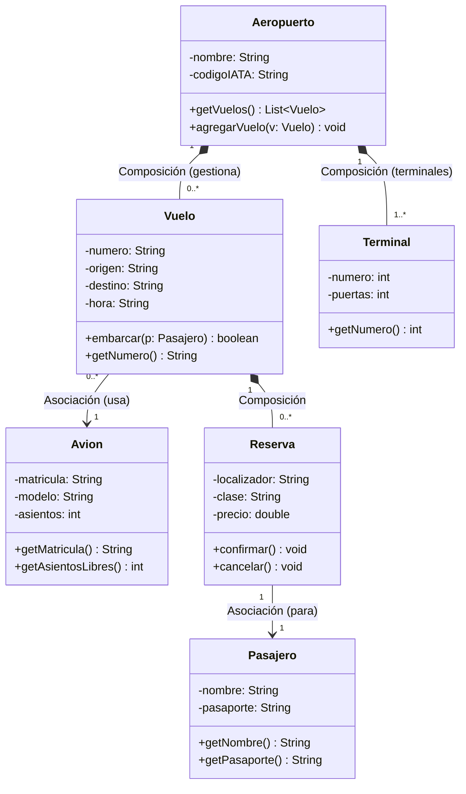
```mermaid
classDiagram
    class Avion {
        -matricula: String
        -modelo: String
        -asientos: int
        +getMatricula() String
        +getAsientosLibres() int
    }

    class Vuelo {
        -numero: String
        -origen: String
        -destino: String
        -hora: String
        +embarcar(p: Pasajero) boolean
        +getNumero() String
    }

    class Pasajero {
        -nombre: String
        -pasaporte: String
        +getNombre() String
        +getPasaporte() String
    }

    class Reserva {
        -localizador: String
        -clase: String
        -precio: double
        +confirmar() void
        +cancelar() void
    }

    class Aeropuerto {
        -nombre: String
        -codigoIATA: String
        +getVuelos() List~Vuelo~
        +agregarVuelo(v: Vuelo) void
    }

    class Terminal {
        -numero: int
        -puertas: int
        +getNumero() int
    }

    %% Relaciones
    Vuelo "0..*" --> "1" Avion : Asociación (usa)
    Vuelo "1" *-- "0..*" Reserva : Composición
    Reserva "1" --> "1" Pasajero : Asociación (para)
    Aeropuerto "1" *-- "0..*" Vuelo : Composición (gestiona)
    Aeropuerto "1" *-- "1..*" Terminal : Composición (terminales)
```

**b) ¿La relación entre `Vuelo` y `Reserva` es composición o agregación?**
*   Es **Composición (◆)**.
*   **Justificación:** Las reservas se emiten exclusivamente para un vuelo concreto. Si el vuelo se cancela y se elimina del sistema (el "todo"), las reservas asociadas a ese vuelo específico (las "partes") pierden su validez y deben ser canceladas o reubicadas (destruidas en su contexto original).

**c) Indica la cardinalidad entre `Aeropuerto` y `Terminal`.**
*   `Aeropuerto (1) *-- (1..*) Terminal`.
*   Un aeropuerto se compone lógicamente de una o más terminales. Las terminales no existen de forma independiente sin pertenecer a un aeropuerto concreto (composición).

## BLOQUE 8: Ejercicios Funcional → Diagrama (Final)

**[⬆️ Volver al índice](#indice)**

<a id="ejercicio-29"></a>
### Ejercicio 29: Funcional — E-Commerce — Productos y Pedidos

> **📌 ENUNCIADO:**
> Lee el siguiente descripción funcional y diseña el diagrama de clases UML
>                     correspondiente:
> 
>                 Una tienda online vende productos organizados en categorías. Los productos tienen
>                     código, nombre, precio y stock. Los clientes realizan pedidos que contienen líneas de pedido, cada
>                     una referenciando un producto con una cantidad. Los pedidos tienen número, fecha y estado, y pueden
>                     generar un envío con número de seguimiento y transportista.
> 
>                 
> 
>                     a) Dibuja el diagrama UML completo con todas
>                             las relaciones y cardinalidades.
>                     b) ¿Por qué LineaPedido es una composición de Pedido y no una agregación?
>                     c) ¿Qué tipo de relación existe entre Pedido y `Envio`? Justifica la
>                             cardinalidad `0..1`.

--- 

**🟢 SOLUCIÓN:**


**Contexto:** Diseñar el modelo para una tienda online que gestiona categorías, productos, clientes, pedidos con múltiples líneas y envíos opcionales.

**Resolución aplicando la teoría:**

**a) Dibuja el diagrama UML completo con todas las relaciones y cardinalidades.**

```mermaid
classDiagram
    class Categoria {
        -nombre: String
        -descripcion: String
        +getNombre() String
    }

    class Producto {
        -codigo: String
        -nombre: String
        -precio: double
        -stock: int
        +hayStock() boolean
        +reducirStock(n: int) void
    }

    class Cliente {
        -nombre: String
        -email: String
        +realizarPedido() Pedido
        +getEmail() String
    }

    class Pedido {
        -numero: String
        -fecha: String
        -estado: String
        +calcularTotal() double
        +confirmar() void
    }

    class LineaPedido {
        -producto: Producto
        -cantidad: int
        +getSubtotal() double
    }

    class Envio {
        -tracking: String
        -transportista: String
        +getTracking() String
        +getEstado() String
    }

    %% Relaciones
    Categoria "1" --> "0..*" Producto : Asociación (contiene)
    Cliente "1" --> "0..*" Pedido : Asociación (realiza)
    Pedido "1" *-- "1..*" LineaPedido : Composición (lineas)
    LineaPedido "0..*" --> "1" Producto : Asociación (referencia)
    Pedido "1" --> "0..1" Envio : Asociación (envio)
```

**b) ¿Por qué `LineaPedido` es una composición de `Pedido` y no una agregación?**
*   **Justificación teórica:** La relación es de **Composición (◆)** porque representa un vínculo "todo-parte fuerte". El enunciado indica que los pedidos "contienen líneas de pedido". Si un `Pedido` es cancelado y eliminado de la base de datos (se destruye el "todo"), todas sus `LineaPedido` asociadas pierden el sentido de existencia y también deben ser eliminadas (se destruyen las "partes"). Una línea de pedido no puede existir de forma huérfana sin pertenecer a un pedido específico.

**c) ¿Qué tipo de relación existe entre `Pedido` y `Envio`? Justifica la cardinalidad `0..1`.**
*   **Tipo de relación:** Es una **Asociación Unidireccional (→)**. El pedido "genera" o "tiene" un envío asociado.
*   **Justificación de la cardinalidad (`0..1`):** El enunciado especifica que los pedidos "*pueden* generar un envío". La palabra "pueden" implica opcionalidad. Un pedido recién creado o que consiste en productos digitales (descargables) podría no tener ningún envío asociado (`0`), mientras que un pedido de productos físicos completado tendrá exactamente un envío asociado (`1`).


**[⬆️ Volver al índice](#indice)**

---

<a id="ejercicio-30"></a>
### Ejercicio 30: Funcional — Sistema de Seguridad y Accesos

> **📌 ENUNCIADO:**
> Lee el siguiente descripción funcional y diseña el diagrama de clases UML
>                     correspondiente:
> 
>                 Un sistema de seguridad gestiona usuarios con login, contraseña (almacenada como
>                     hash) y estado activo. Cada usuario tiene un rol (enumeración: ADMIN, EDITOR, LECTOR) y un conjunto
>                     de permisos. Cuando un usuario se autentica se crea una sesión con token y fecha de expiración.
>                     Todas las acciones quedan registradas en un log de acceso. Las sesiones permiten acceder a recursos
>                     del sistema identificados por nombre y ruta.
> 
>                 
> 
>                     a) Diseña el diagrama UML completo.
>                     
> 
>                     b)¿Cómo se representa el Rol en UML y qué estereotipo usa?
>                     c) Justifica por qué el LogAcceso es composición y no agregación respecto al Usuario.

--- 

**🟢 SOLUCIÓN:**


**Contexto:** Modelar la estructura de seguridad de un sistema con usuarios, roles (enumeración), contraseñas, permisos, sesiones y un registro de logs.

**Resolución aplicando la teoría:**

**a) Diseña el diagrama UML completo.**

```mermaid
classDiagram
    class Rol {
        <<enumeration>>
        ADMIN
        EDITOR
        LECTOR
    }

    class Usuario {
        -login: String
        -passwordHash: String
        -activo: boolean = true
        -rol: Rol
        +autenticar(pwd: String) boolean
        +tienePermiso(p: Permiso) boolean
    }

    class Permiso {
        -codigo: String
        -descripcion: String
        +getCodigo() String
        +aplicar() boolean
    }

    class Sesion {
        -token: String
        -inicio: String
        -expira: String
        +isValida() boolean
        +cerrar() void
    }

    class LogAcceso {
        -fecha: String
        -accion: String
        -exito: boolean
        +getFecha() String
        +getAccion() String
    }

    class Recurso {
        -nombre: String
        -ruta: String
        +getRuta() String
        +estaProtegido() boolean
    }

    %% Relaciones
    Usuario "1" --> "0..*" Permiso : Asociación (tiene)
    Usuario "1" *-- "0..*" Sesion : Composición (sesiones)
    Usuario "1" *-- "0..*" LogAcceso : Composición (logs)
    Sesion "0..*" --> "1..*" Recurso : Asociación (accede a)
```

**b) ¿Cómo se representa el `Rol` en UML y qué estereotipo usa?**
*   Se representa como una caja de clase (clasificador) pero se le añade en la cabecera el estereotipo `<<enumeration>>`. 
*   **Justificación:** El enunciado define "ADMIN, EDITOR, LECTOR". Al ser una lista de constantes predefinidas y estáticas, en UML se modela como enumeración, y sus posibles valores se listan en el compartimento superior (donde normalmente se declaran los atributos). Además, el `Usuario` tendría un atributo `- rol: Rol` que asocia la enumeración al usuario.

**c) Justifica por qué el `LogAcceso` es composición y no agregación respecto al `Usuario`.**
*   **Justificación teórica:** Es **Composición (◆)** debido a la fuerte dependencia del ciclo de vida y el contexto de los datos. Un `LogAcceso` registra acciones ("login", "cambio de contraseña", "acceso denegado") realizadas *exclusiva y específicamente* por un `Usuario`. Si la cuenta de un usuario es purgada por completo del sistema (eliminación física por RGPD, por ejemplo), sus registros de log asociados pierden la entidad referencial a la que pertenecen y deben ser destruidos en cascada. Un log de acceso no tiene sentido de existencia flotando sin estar anclado al usuario que ejecutó la acción.

**[⬆️ Volver al índice](#indice)**

