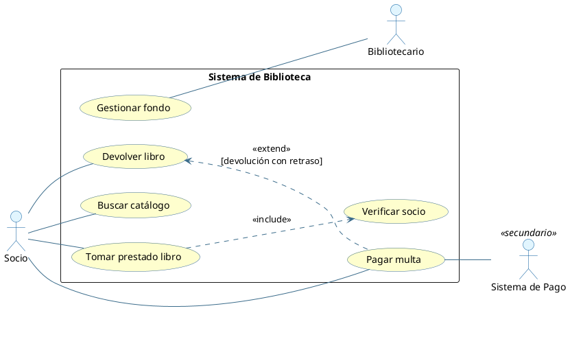
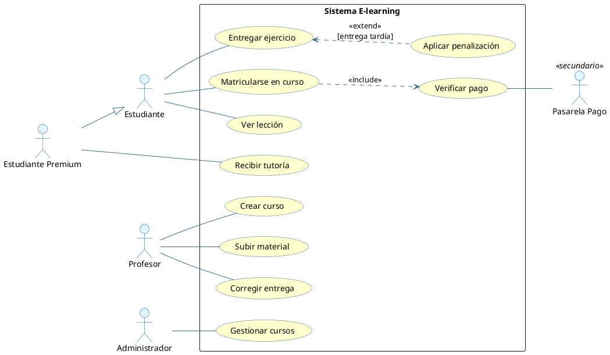
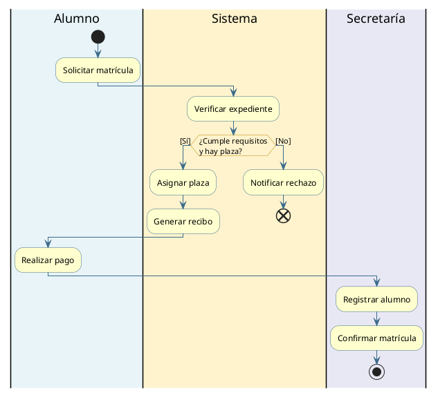
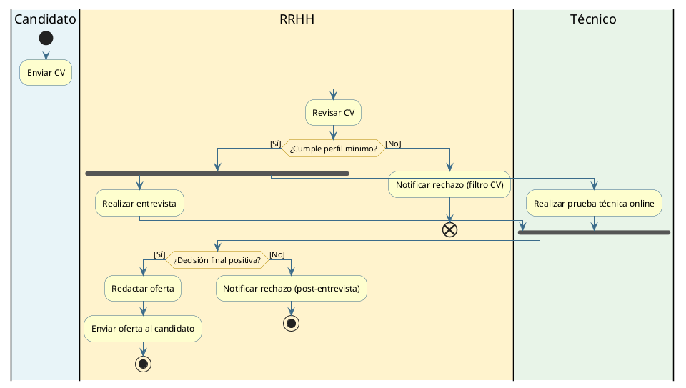
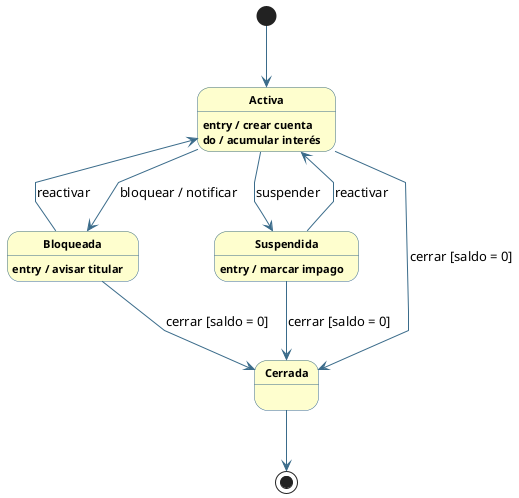
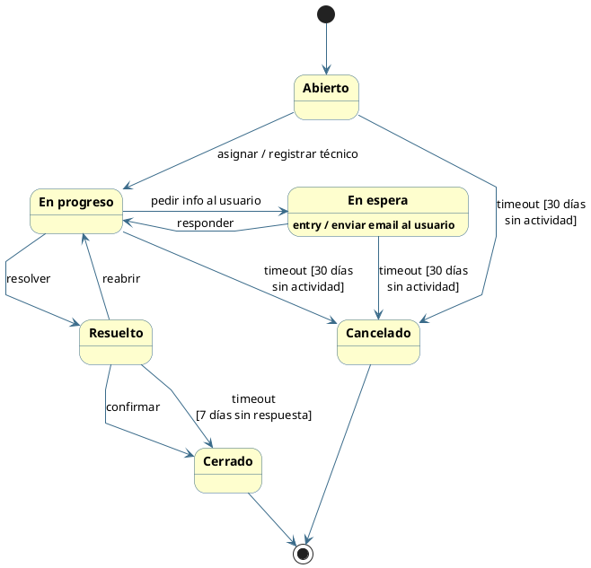
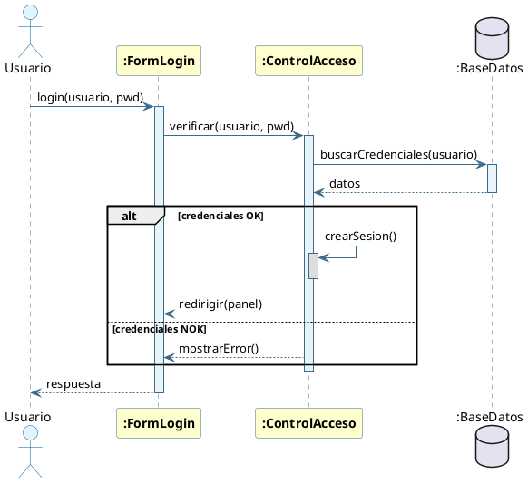
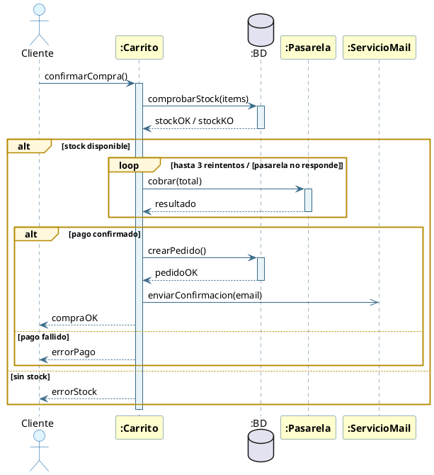
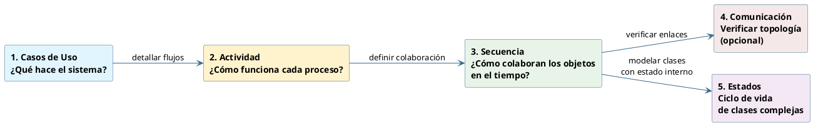

# 🎓 Estudio UT07 — Diagramas UML (Repaso Examen) <a id="top"></a>

> **Documento de repaso final.** Diseñado para una sola pasada antes del examen.
> **Examen:** a mano, 2 horas. Muy probable 1 diagrama de **secuencia** + tipo test + alguna pregunta de desarrollo breve.
> **Dificultad esperada:** media-baja, equivalente o ligeramente inferior a los ejercicios HTML del directorio.
> **Lectura completa estimada:** 25-30 min. Vuelve siempre al índice usando 🏠 al final de cada bloque.

---

# 📑 ÍNDICE DINÁMICO

1. 📘 **[01 - Fundamentos UML y Diagramas de Comportamiento](#sec1)**
2. 📘 **[02 - Diagrama de Casos de Uso](#sec2)**
    - [Elementos y notación](#sec21)
    - [Cómo atacar el enunciado](#sec22)
    - [Ejemplo del HTML + mini-enunciado nuevo](#sec23)
    - [❓ FAQ Casos de Uso](#sec24)
3. 📘 **[03 - Diagrama de Actividad](#sec3)**
    - [Elementos y notación](#sec31)
    - [Cómo atacar el enunciado](#sec32)
    - [Ejemplo del HTML + mini-enunciado nuevo](#sec33)
    - [❓ FAQ Actividad](#sec34)
4. 📘 **[04 - Diagrama de Estados](#sec4)**
    - [Elementos y notación](#sec41)
    - [Cómo atacar el enunciado](#sec42)
    - [Ejemplo del HTML + mini-enunciado nuevo](#sec43)
    - [❓ FAQ Estados](#sec44)
5. 📘 **[05 - Diagrama de Secuencia](#sec5)** ⭐ *(muy probable en examen)*
    - [Elementos y notación](#sec51)
    - [Fragmentos combinados (alt, opt, loop, par...)](#sec52)
    - [Cómo atacar el enunciado](#sec53)
    - [Ejemplo del HTML + mini-enunciado nuevo](#sec54)
    - [❓ FAQ Secuencia](#sec55)
6. 📘 **[06 - Diagrama de Comunicación (solo teoría)](#sec6)**
    - [Elementos y numeración jerárquica](#sec61)
    - [Secuencia vs Comunicación](#sec62)
    - [❓ FAQ Comunicación](#sec63)
7. 📘 **[07 - Comparativa final entre los 5 diagramas](#sec7)**
8. 📘 **[08 - Checklist 10 minutos antes del examen](#sec8)**

---

## 01 - Fundamentos UML y Diagramas de Comportamiento <a id="sec1"></a>

**UML (Unified Modeling Language)** es el lenguaje de modelado estándar para describir sistemas software orientados a objetos. Sus diagramas se dividen en dos grandes familias:

- **Diagramas estructurales (estáticos):** muestran la *arquitectura* del sistema (clases, componentes, paquetes, despliegue, objetos…). Responden a **qué hay** en el sistema.
- **Diagramas de comportamiento (dinámicos):** muestran *qué hace* el sistema y *cómo lo hace*. Responden a **qué ocurre** y **cuándo ocurre**.

Este tema se centra en los diagramas de comportamiento. UML 2.x define **7 tipos**, pero en el examen entran principalmente **5**:

| Diagrama | Pregunta que responde | ¿Cae en examen? |
| :--- | :--- | :--- |
| **Casos de Uso** | ¿Qué hace el sistema y quién lo usa? | ✅ Teoría + posible ejercicio |
| **Actividad** | ¿Cómo es el flujo del proceso? | ✅ Teoría + posible ejercicio |
| **Estados** | ¿Cómo evoluciona un objeto en su ciclo de vida? | ✅ Teoría + posible ejercicio |
| **Secuencia** | ¿Cómo interactúan los objetos en el tiempo? | ⭐ Teoría + ejercicio casi seguro |
| **Comunicación** | ¿Cuál es la topología de la red de objetos? | ✅ Solo teoría (no ejercicio) |
| *Interacción general* | Combina varios diagramas de interacción | ➖ Solo mención |
| *Tiempo* | Restricciones temporales del comportamiento | ➖ Solo mención |

### Campo de aplicación de los diagramas dinámicos

- **Análisis de requisitos:** identificar funcionalidades esperadas (Casos de Uso).
- **Diseño del sistema:** modelar la colaboración entre objetos (Secuencia / Comunicación).
- **Lógica de negocio:** documentar procesos y flujos complejos (Actividad).
- **Diseño detallado de clases:** modelar el ciclo de vida interno (Estados).
- **Documentación y comunicación** entre equipos.

> 💡 **TIPS Prácticos — regla mnemotécnica:**
> Asocia cada diagrama a una pregunta:
> *   **CASOS DE USO** → "¿QUÉ hace?"
> *   **ACTIVIDAD** → "¿CÓMO fluye?"
> *   **ESTADOS** → "¿CÓMO cambia un objeto?"
> *   **SECUENCIA** → "¿CUÁNDO se mandan los mensajes?"
> *   **COMUNICACIÓN** → "¿QUIÉN habla con QUIÉN?"

> ⚠️ **ATENCIÓN EXAMEN:** una pregunta típica de test es diferenciar **estructural vs comportamiento**. El **diagrama de clases** NO es de comportamiento (es estructural). Los **5 de arriba** sí lo son.

[🏠 Volver al Índice](#top)

---

## 02 - Diagrama de Casos de Uso <a id="sec2"></a>

El **diagrama de casos de uso** es el **punto de entrada del análisis orientado a objetos**. Captura los **requisitos funcionales** desde la perspectiva del usuario: define el contrato funcional entre el sistema y el mundo exterior. Muestra **QUÉ** hace el sistema y **QUIÉN** lo usa, sin entrar en CÓMO se implementa.

### Elementos y notación <a id="sec21"></a>

| Elemento | Notación | Descripción |
| :--- | :--- | :--- |
| **Actor** | Stick figure 👤 con nombre debajo | Entidad externa (humano, sistema o dispositivo) que interactúa con el sistema. Vive **fuera del boundary**. |
| **Caso de Uso** | Elipse con texto dentro | Unidad de funcionalidad que el sistema ofrece. Se nombra **verbo en infinitivo + sustantivo** (*"Registrar pedido"*). |
| **Boundary / Límite del Sistema** | Rectángulo que engloba los CU | Delimita qué pertenece al sistema (los CU dentro) y qué es externo (los actores fuera). |
| **Escenario** | (No se dibuja) | Secuencia concreta de pasos que describe una instancia del CU: flujo principal, alternativos y de excepción. |

**Tipos de actores:**
- **Primarios:** inician la interacción (Cliente, Cajero, Estudiante).
- **Secundarios:** responden o son notificados (Pasarela de pago, Servicio de email).
- **Humanos / Sistemas externos / Dispositivos.**

#### 🔗 Tipos de relaciones (4 — son las que más caen en test)

| Relación | Notación | Significado |
| :--- | :--- | :--- |
| **Asociación** | Línea simple actor ↔ CU | El actor participa en el caso de uso. |
| **«include»** | Flecha discontinua etiquetada `<<include>>` apuntando al CU **incluido** | El comportamiento incluido ocurre **SIEMPRE** (obligatorio). |
| **«extend»** | Flecha discontinua etiquetada `<<extend>>` apuntando al CU **base** | El comportamiento extendido ocurre **A VECES** (opcional, bajo guarda). |
| **Generalización** | Flecha con triángulo hueco apuntando al padre | Herencia entre actores (o entre CU). El hijo hereda comportamiento. |

> ⚠️ **ATENCIÓN EXAMEN — diferencia clave include vs extend:**
> *   **`include`** = el CU base SIEMPRE incluye al otro. Piensa en **llamada a función obligatoria**.
> *   **`extend`** = el CU extendido se ejecuta SOLO si se cumple una condición (guarda). Piensa en un **`if` opcional**.
> *   La **flecha de `include`** sale del CU base y apunta al **incluido**.
> *   La **flecha de `extend`** sale del CU **extensor** y apunta al **base**.

> 💡 **TIPS Prácticos:**
> *   **Regla de oro del nombramiento:** verbo en infinitivo + sustantivo (*"Registrar cliente"*, NUNCA *"Registro de clientes"*).
> *   No incluyas más de **20 CU** en un mismo diagrama.
> *   **NUNCA** modeles interfaces gráficas ni navegación de pantallas en este diagrama.
> *   Si dos CU comparten comportamiento, decide: ¿siempre? → `include`. ¿a veces? → `extend`.

> 🚀 **COMPLEMENTO (Fuera de temario): User Stories [NO ENTRA EN EXAMEN]**
> En metodologías ágiles (Scrum), los CU se sustituyen por *Historias de Usuario*: "Como [rol] quiero [acción] para [beneficio]". Los CU siguen ganando para contratos formales y sistemas complejos.

[🏠 Volver al Índice](#top)

### Cómo atacar el enunciado <a id="sec22"></a>

Tabla de **palabras clave → elemento del diagrama**:

| En el enunciado lees... | Identifica como... |
| :--- | :--- |
| "El cliente / el cajero / el administrador / el sistema externo / el dispositivo X..." | **Actor** |
| "puede / debe poder / le permite + verbo infinitivo" | **Caso de uso** |
| "siempre / requiere / es necesario / como parte de / obligatoriamente" | **`<<include>>`** |
| "opcionalmente / si... / puede / en caso de / cuando aplica" | **`<<extend>>`** |
| "es un tipo de / especializa a / hereda de" | **Generalización** entre actores o entre CU |

**🛠️ Pasos canónicos para resolver el ejercicio (orden recomendado):**

1. **Subraya sustantivos agente** (quién actúa) → candidatos a **actores**.
2. **Subraya verbos en infinitivo** o frases tipo *"puede hacer X"* → candidatos a **casos de uso**.
3. **Filtra duplicados y agrupa**. Decide qué actores son primarios y cuáles secundarios.
4. **Traza asociaciones**: línea entre cada actor y los CU que ejecuta.
5. **Busca comportamiento común** que aparezca en varios CU → factoriza con **`<<include>>`**.
6. **Busca comportamiento condicional** (palabras tipo "si", "puede que") → modélalo con **`<<extend>>`**.
7. **Busca jerarquías** ("usuario registrado es un tipo de usuario") → **generalización**.
8. **Dibuja el rectángulo del sistema** y coloca los CU dentro; actores fuera.

> ⚠️ **ATENCIÓN EXAMEN — errores típicos que quitan nota:**
> *   Nombrar CU con sustantivos (*"Registro"* en vez de *"Registrar"*).
> *   Confundir el sentido de la flecha de `include` / `extend`.
> *   Meter actores dentro del boundary.
> *   Modelar pantallas o navegación.

[🏠 Volver al Índice](#top)

### Ejemplo del HTML + mini-enunciado nuevo <a id="sec23"></a>

#### Ejemplo 1 del HTML — Sistema de Comercio Electrónico (resumido)

**Enunciado:** *"Diseña el diagrama de casos de uso para una plataforma de comercio electrónico. Identifica al menos tres actores (Cliente, Vendedor y Administrador) y los casos de uso asociados a cada uno, incluyendo al menos dos relaciones «include» y una «extend»."*

**Solución resumida:**

- **Actores:** Cliente, Vendedor, Administrador, Pasarela de Pago (secundario).
- **CU:** Buscar producto, Añadir al carrito, Realizar pedido, Verificar stock, Procesar pago, Aplicar cupón descuento, Gestionar catálogo, Gestionar usuarios.
- **`<<include>>`:** *Realizar pedido* → *Verificar stock* / *Realizar pedido* → *Procesar pago*.
- **`<<extend>>`:** *Aplicar cupón descuento* → *Realizar pedido* `[cliente tiene cupón]`.

#### Ejemplo canónico — Sistema de Biblioteca (Mermaid)

**Enunciado:** *"Una biblioteca universitaria necesita un sistema para gestionar el préstamo de libros. Los socios pueden buscar el catálogo, tomar libros prestados y devolver los que han leído. Si un socio devuelve un libro con retraso, el sistema debe gestionar el pago de una multa. El bibliotecario es responsable de mantener actualizado el fondo."*



**🛠️ Análisis paso a paso:**
1. **Actores externos:** *Socio* y *Bibliotecario* (primarios); *Sistema de Pago* (secundario).
2. **Boundary:** todo lo que ofrece el sistema queda dentro del rectángulo.
3. **`include` (Verificar socio)**: cada vez que se toma prestado un libro, el sistema **siempre** verifica al socio.
4. **`extend` (Pagar multa)**: solo se ejecuta condicionalmente cuando se devuelve con retraso; extiende a *Devolver libro*.

#### 🎯 Mini-enunciado NUEVO — Plataforma de e-learning

**Enunciado:** *"Una academia online quiere un sistema donde los estudiantes puedan matricularse en cursos, ver lecciones y entregar ejercicios. El profesor crea cursos, sube material y corrige entregas. Antes de matricularse, el sistema siempre debe verificar el pago del estudiante. Si la entrega es tardía, opcionalmente se aplica una penalización. Los administradores gestionan todos los cursos. Un Estudiante Premium es un tipo especial de Estudiante con acceso a tutorías."*

**Solución propuesta:**



**🛠️ Análisis paso a paso:**
1. **Actores:** Estudiante, Profesor, Administrador, Pasarela de Pago. **Estudiante Premium hereda** de Estudiante (generalización) y añade el CU *Recibir tutoría*.
2. **Asociaciones simples:** cada actor con los CU que ejecuta.
3. **`<<include>>`:** *Matricularse en curso* → *Verificar pago* (palabra clave del enunciado: "siempre debe verificar").
4. **`<<extend>>`:** *Aplicar penalización* extiende a *Entregar ejercicio* con guarda `[entrega tardía]` (palabra clave: "opcionalmente").
5. **Pasarela de Pago** es actor secundario (sistema externo) → fuera del boundary.

[🏠 Volver al Índice](#top)

### ❓ FAQ Casos de Uso <a id="sec24"></a>

**1. ¿Cuándo usar `include` y cuándo `extend`?**
`include` cuando el comportamiento incluido se da **siempre** y es obligatorio para el CU base (extraes algo común). `extend` cuando solo ocurre **a veces**, bajo una condición de guarda (es opcional).

**2. ¿Un actor puede ser otro sistema?**
Sí. Los actores no tienen por qué ser humanos: una pasarela de pago, un servicio de email, un sensor, un sistema legacy externo… todos son actores válidos. Se representan igual (stick figure) y se indican como "secundarios".

**3. ¿Se puede heredar entre casos de uso o solo entre actores?**
En UML 2 sí se permite generalización entre casos de uso, pero es **mucho más frecuente y aceptada** entre actores. En el examen, si te piden generalización, casi siempre es entre actores.

**4. ¿Cuántos CU caben en un diagrama sin perder legibilidad?**
La regla habitual es **no pasar de 20 CU**. Si hay más, conviene partirlo en varios diagramas por paquete o subsistema.

**5. ¿Qué pasa si dos actores comparten muchos CU?**
Crea un **actor genérico padre** (p. ej. *Usuario*) y haz que los específicos (*Cliente*, *Empleado*) **hereden de él**. Los CU comunes se asocian al padre y los específicos a los hijos.

**6. ¿Hay que dibujar siempre el boundary?**
No es obligatorio gráficamente, pero **se recomienda** para dejar claro qué está dentro y qué fuera del sistema. En el examen, dibújalo siempre — da puntos.

**7. ¿Modelo aquí los flujos alternativos del escenario?**
No con detalle: los flujos alternativos se documentan **en la ficha textual del caso de uso** (precondiciones, flujo principal, alternativos, excepciones, postcondiciones). En el diagrama solo se ve la estructura, no la secuencia interna.

[🏠 Volver al Índice](#top)

---

## 03 - Diagrama de Actividad <a id="sec3"></a>

El **diagrama de actividad** es el equivalente UML del clásico **diagrama de flujo**, pero con semántica orientada a objetos. Modela el **flujo de trabajo** (workflow) de un proceso, algoritmo o caso de uso: qué acciones se realizan, qué decisiones se toman y cómo fluye el control. UML 2 añade soporte para **concurrencia** (fork/join), **particiones (swimlanes)**, **señales** y **flujos de datos**.

### Elementos y notación <a id="sec31"></a>

| Elemento | Símbolo | Descripción |
| :--- | :--- | :--- |
| **Nodo inicial** | Círculo negro sólido ● | Marca el inicio del flujo. |
| **Nodo final de actividad** | Círculo con punto ⦿ | **Termina TODA la actividad** (todos los flujos paralelos también). |
| **Nodo final de flujo** | Círculo con X ⊗ | **Termina SOLO ese flujo concreto**, no la actividad completa. |
| **Acción** | Rectángulo de esquinas redondeadas | Tarea atómica del proceso (verbo). |
| **Actividad** | Igual que acción | Puede descomponerse en subactividades. |
| **Decisión** | Rombo ◇ — 1 entrada, varias salidas con guardas `[cond]` | Bifurcación condicional. |
| **Merge (Unión)** | Rombo ◇ — varias entradas, 1 salida | Reúne flujos alternativos. |
| **Fork (Bifurcación paralela)** | Barra gruesa horizontal ▬ — 1 entrada, varias salidas | Lanza ramas **concurrentes**. |
| **Join (Unión paralela)** | Barra gruesa ▬ — varias entradas, 1 salida | **Sincroniza** ramas paralelas (espera a que todas terminen). |
| **Swimlane (partición)** | Carril vertical u horizontal | Agrupa acciones por **responsable** (actor/sistema/departamento). |
| **Nodo objeto** | Rectángulo simple | Estado de un objeto en el flujo de datos. |
| **Señal enviada** | Pentágono apuntando hacia fuera | Emite evento. |
| **Señal recibida** | Pentágono apuntando hacia dentro | Espera evento. |

> ⚠️ **ATENCIÓN EXAMEN — diferencia que cae en test:**
> *   **Fin de actividad (⦿)** = termina todo el diagrama.
> *   **Fin de flujo (⊗)** = termina solo esa rama; el resto del proceso sigue.
> *   **Decisión (◇)** = bifurcación condicional (1→N con guardas). Lleva guardas en CADA rama.
> *   **Fork (▬)** = bifurcación PARALELA (1→N concurrente). NO lleva guardas.

**Flujo de control vs flujo de datos:**
- **Flujo de control:** flechas entre acciones (orden de ejecución). Líneas sólidas.
- **Flujo de datos:** flechas entre nodos objeto (qué datos produce/consume cada acción).

> 💡 **TIPS Prácticos:**
> *   Toda **decisión** debe llevar **guarda en cada salida** `[Sí]`/`[No]`/`[OK]`/`[error]`.
> *   Todo **fork** debe terminar en un **join** que lo sincronice (regla mnemotécnica: *"fork sin join, suspenso fijo"*).
> *   Los **swimlanes** son el rasgo más característico de actividad cuando hay **varios responsables**.

[🏠 Volver al Índice](#top)

### Cómo atacar el enunciado <a id="sec32"></a>

Tabla de **palabras clave → elemento del diagrama**:

| En el enunciado lees... | Identifica como... |
| :--- | :--- |
| "El cliente / el almacén / el sistema de pagos / secretaría..." (lista de responsables) | **Swimlanes** (uno por responsable) |
| Verbo de acción (procesar, verificar, registrar, enviar, generar) | **Acción** dentro del swimlane correspondiente |
| "si... entonces... si no..." / "¿es válido?" / "comprueba si..." | **Decisión (◇)** con guardas |
| "en paralelo / simultáneamente / al mismo tiempo / mientras tanto" | **Fork + Join** |
| "una vez completadas ambas / cuando ambas terminen" | **Join** |
| "se vuelve al paso X" o reúnen varias ramas alternativas | **Merge** |
| "se cancela el proceso por completo" | **Final de actividad ⦿** |
| "se descarta esa rama y el resto continúa" | **Final de flujo ⊗** |

**🛠️ Pasos canónicos para resolver el ejercicio:**

1. **Identifica responsables** del proceso en el enunciado → cada uno será un **swimlane**.
2. **Linealiza el proceso** apuntando los verbos en orden → cada verbo es una **acción** en el carril que corresponda.
3. **Marca las decisiones**: dónde el enunciado dice "si...", "comprueba si...", "es válido?". Cada decisión es un rombo con al menos 2 ramas etiquetadas.
4. **Marca el paralelismo**: dónde el enunciado dice "al mismo tiempo / en paralelo". Coloca un fork antes y un join después.
5. **Coloca el inicio (●)** en el carril del que dispara el proceso.
6. **Decide los finales:** ¿el flujo de error cancela todo? → final de actividad. ¿solo abandona esa rama? → final de flujo.
7. **Cruza líneas entre carriles** cuando el control pasa de un responsable a otro.

> ⚠️ **ATENCIÓN EXAMEN — errores típicos:**
> *   Olvidar las **guardas** `[Sí]`/`[No]` en las decisiones.
> *   Hacer un **fork sin join** o un **join sin fork**.
> *   Confundir **merge (◇)** con **decisión**: el merge tiene varias entradas y UNA salida sin guarda.
> *   Mezclar acciones de varios responsables en el mismo swimlane.

[🏠 Volver al Índice](#top)

### Ejemplo del HTML + mini-enunciado nuevo <a id="sec33"></a>

#### Ejemplo 1 del HTML — Tramitación de pedido online (resumido)

**Enunciado:** *"Diseña el diagrama de actividad del proceso de tramitación de un pedido online desde que el cliente pulsa «comprar» hasta la entrega. Usa swimlanes (Cliente, Sistema de Pagos, Almacén, Transportista) e incluye al menos dos decisiones y un fork/join."*

**Solución resumida:**
- **4 swimlanes:** Cliente | Sistema de Pagos | Almacén | Transportista.
- **2 decisiones:** `¿Pago OK?` y `¿Stock OK?`.
- **1 fork/join:** Almacén actualiza stock **||** Transportista registra bulto → Join → Transportar.
- **2 finales de flujo** para los caminos de error (pago fallido y rotura de stock).
- **1 final de actividad** al entregar el pedido.

#### Ejemplo canónico — Matrícula universitaria (Mermaid)

**Enunciado:** *"Un alumno solicita su matrícula. El sistema verifica su expediente y comprueba plazas. Si cumple requisitos, se le asigna plaza, se genera recibo y, una vez pagado, secretaría confirma la matrícula. Si no cumple requisitos o no hay plazas, se notifica el rechazo."*



**🛠️ Análisis paso a paso:**
1. **Swimlanes implícitos:** Alumno (Solicitar, Pagar), Sistema (Verificar, decisión, Asignar, Recibo, Rechazo), Secretaría (Registrar, Confirmar).
2. **Nodo inicial** en el carril del Alumno: él dispara el proceso.
3. **Decisión** `¿OK?` con dos ramas guardadas `[Sí]` / `[No]`.
4. **Rama de rechazo** termina en **final de flujo** porque no afecta al resto del sistema.
5. **Rama feliz** atraviesa varios carriles hasta el **final de actividad ⦿**.

#### 🎯 Mini-enunciado NUEVO — Selección de personal en RRHH

**Enunciado:** *"Una empresa quiere modelar su proceso de selección. El candidato envía su CV. El departamento de RRHH lo revisa: si no cumple el perfil mínimo, se le notifica el rechazo. Si lo cumple, se le convoca a una entrevista y, en paralelo, el departamento Técnico realiza una prueba técnica online. Una vez completadas ambas (entrevista y prueba), RRHH toma la decisión final: si es positiva, redacta la oferta y la envía al candidato; si es negativa, le notifica el rechazo."*

**Solución propuesta:**



**🛠️ Análisis paso a paso:**
1. **3 swimlanes:** Candidato (Enviar CV), RRHH (Revisar, Entrevista, Decisión, Oferta), Técnico (Prueba).
2. **Decisión 1** (`¿Cumple perfil?`): rama `[No]` → final de flujo; rama `[Sí]` → continúa.
3. **Fork** lanza dos ramas paralelas: *Entrevista* (RRHH) y *Prueba técnica* (Técnico) → palabra clave "en paralelo".
4. **Join** sincroniza ambas antes de tomar la decisión final.
5. **Decisión 2** (`¿Positiva?`) tiene dos ramas que ambas terminan en el **final de actividad ⦿** (porque el proceso de selección acaba completamente en cualquier caso).

[🏠 Volver al Índice](#top)

### ❓ FAQ Actividad <a id="sec34"></a>

**1. ¿Cuándo usar diagrama de actividad y cuándo de estados?**
**Actividad** modela un **proceso** (secuencia de pasos con decisiones y paralelismo). **Estados** modela el **ciclo de vida de UN objeto** (las situaciones por las que pasa y los eventos que lo cambian). Si el enunciado describe un workflow con varios participantes → actividad. Si describe cómo evoluciona algo (un pedido, una cuenta, un ticket) → estados.

**2. ¿Qué diferencia hay entre el rombo de decisión y el merge?**
Los dos son rombos, pero el de **decisión** tiene 1 entrada y N salidas (con guardas), mientras que el **merge** tiene N entradas y 1 salida (sin guardas). El merge se usa para *reunificar* ramas alternativas.

**3. ¿Puedo tener fork sin join?**
Conceptualmente no debería: cada **fork** debe tener su **join** correspondiente para sincronizar. Si las ramas terminan independientemente sin sincronizarse, mejor usa **finales de flujo** en cada una.

**4. ¿Para qué sirven los swimlanes?**
Para **clarificar responsabilidades**: cada carril agrupa las acciones que ejecuta un mismo actor o sistema. Imprescindibles cuando el enunciado lista varios responsables ("el cliente, el almacén, el sistema de pagos…").

**5. ¿Se pueden anidar actividades?**
Sí. Una **actividad** (rectángulo redondeado) puede descomponerse en otro diagrama de actividad más detallado. Se indica con un pequeño icono de "tridente" en la esquina inferior.

**6. ¿Diferencia entre nodo final de actividad y nodo final de flujo?**
**Final de actividad (⦿)** termina **TODA** la actividad: todas las ramas paralelas se cancelan. **Final de flujo (⊗)** termina **SOLO esa rama**; el resto del diagrama sigue ejecutándose.

**7. ¿Cómo modelo una excepción o error?**
Con una **decisión** que detecte el error y una rama que vaya al **final de flujo** o al **final de actividad** según corresponda. También se puede usar una **señal recibida** si la excepción viene del exterior.

[🏠 Volver al Índice](#top)

---

## 04 - Diagrama de Estados <a id="sec4"></a>

El **diagrama de estados** (state machine diagram) modela el **comportamiento de UN objeto concreto a lo largo de su ciclo de vida**: las **situaciones estables** por las que pasa y los **eventos** que lo hacen cambiar de una a otra. Es especialmente útil para clases con comportamiento **dependiente del estado** (pedidos, cuentas, documentos, conexiones, sesiones…).

### Elementos y notación <a id="sec41"></a>

| Elemento | Notación | Descripción |
| :--- | :--- | :--- |
| **Estado** | Rectángulo de esquinas redondeadas con el nombre | Situación estable del objeto. |
| **Transición** | Flecha entre estados con etiqueta `evento [guarda] / acción` | Cambio de estado provocado por un evento. |
| **Estado inicial** | Círculo negro sólido ● | Punto de partida del ciclo de vida. Sin transiciones entrantes. |
| **Estado final** | Círculo con punto ⦿ | Fin del ciclo de vida. |
| **Estado de decisión** | Rombo ◇ | Bifurcación condicional dentro del flujo de estados. |
| **Estado histórico** | Círculo con H Ⓗ | Dentro de un estado compuesto: recuerda el último subestado activo. |
| **Estado compuesto** | Rectángulo grande que contiene una submáquina | Estado con jerarquía interna. |
| **Regiones ortogonales** | Líneas discontinuas dividiendo un compuesto | Concurrencia interna (el objeto está en un subestado de cada región a la vez). |

#### 🔗 Sintaxis de una transición

Una transición se etiqueta con (todos los componentes son **opcionales**):

```
evento [guarda] / acción
```

| Componente | Significado | Ejemplo |
| :--- | :--- | :--- |
| `evento` | Estímulo que dispara la transición | `pagar`, `timeout`, `cancelar` |
| `[guarda]` | Condición booleana que debe ser **verdadera** | `[saldo > 0]`, `[reintentos < 3]` |
| `/ acción` | Operación atómica que se ejecuta al transicionar | `/ notificar`, `/ registrar log` |

**Ejemplo completo:** `cerrar [saldo = 0] / liberar recursos`

#### 🔗 Acciones internas del estado

Dentro del rectángulo de un estado se pueden escribir acciones internas (todas opcionales):

| Sintaxis | ¿Cuándo se ejecuta? |
| :--- | :--- |
| `entry / acción` | Al **entrar** al estado |
| `exit / acción` | Al **salir** del estado |
| `do / acción` | **Continuamente** mientras el objeto está en el estado |

> ⚠️ **ATENCIÓN EXAMEN — distinción entry/exit/do:**
> *   `entry` y `exit` son **atómicas** (se ejecutan una vez).
> *   `do` es **continua/durativa** (se ejecuta mientras estás dentro).
> *   Si te dicen "*mientras está en X, hace Y*" → `do / Y`.

> 💡 **TIPS Prácticos:**
> *   El error más común es **confundir estado con acción/actividad**. Un estado es una *situación* (Activa, Pendiente, Bloqueada); una acción es un *paso* (Verificar, Procesar).
> *   Una transición sin evento explícito es una **autotransición de completado**: se dispara cuando termina la actividad `do` interna.

[🏠 Volver al Índice](#top)

### Cómo atacar el enunciado <a id="sec42"></a>

Tabla de **palabras clave → elemento del diagrama**:

| En el enunciado lees... | Identifica como... |
| :--- | :--- |
| Sustantivos de situación: *Pendiente, Activa, En tránsito, Bloqueada, Cerrada, Completado* | **Estado** |
| Verbos que provocan cambios: *pagar, cancelar, bloquear, timeout, vencer* | **Evento** (etiqueta de la transición) |
| "siempre que / si cumple / cuando + condición booleana" | **Guarda `[...]`** |
| "entonces se envía / se notifica / se registra / se actualiza" | **Acción `/ ...`** |
| "mientras está en X se va haciendo Y" | **`do / Y`** dentro del estado X |
| "al entrar en X se avisa al titular" | **`entry / avisar titular`** dentro de X |
| "al salir de X se libera memoria" | **`exit / liberar memoria`** dentro de X |

**🛠️ Pasos canónicos para resolver el ejercicio:**

1. **Identifica el OBJETO** cuyo ciclo de vida modelas (un pedido, una cuenta, un ticket…). Solo es UNO.
2. **Lista los estados** estables (sustantivos de situación) → un rectángulo redondeado por cada uno.
3. **Para cada estado**, pregúntate: ¿qué evento lo hace pasar a otro estado? → dibuja la transición.
4. **Etiqueta cada transición** con `evento [guarda] / acción`. La guarda solo aparece si el enunciado pone una condición; la acción solo si el enunciado dice qué se ejecuta al transicionar.
5. **Añade acciones internas** (entry/do/exit) solo si el enunciado lo menciona explícitamente.
6. **Marca el estado inicial (●)** apuntando al estado en el que arranca el objeto al crearse.
7. **Marca el estado final (⦿)** si el ciclo termina (algunos objetos no terminan nunca → no llevan final).

> ⚠️ **ATENCIÓN EXAMEN — errores típicos:**
> *   Mezclar **acciones (pasos del proceso)** con **estados (situaciones)**.
> *   Olvidar las **guardas** cuando hay condiciones explícitas en el enunciado.
> *   Poner el evento como nombre del estado ("Pagando" en lugar de "Pendiente" + evento `pagar`).

[🏠 Volver al Índice](#top)

### Ejemplo del HTML + mini-enunciado nuevo <a id="sec43"></a>

#### Ejemplo 1 del HTML — Ciclo de vida de un pedido online (resumido)

**Enunciado:** *"Modela el ciclo de vida de un pedido online: identifica estados posibles, transiciones, eventos que las disparan, guardas y acciones."*

**Estados clave:** Pendiente → Pagado → En preparación → En tránsito → Entregado (final). Además, *Cancelado* (final) accesible desde varios estados según guardas.

#### Ejemplo canónico — Cuenta bancaria (Mermaid)

**Enunciado:** *"Una cuenta bancaria, tras ser creada, queda Activa. Puede Bloquearse temporalmente por seguridad o Suspenderse por impago. Desde Bloqueada o Suspendida se puede reactivar. La cuenta puede cerrarse definitivamente siempre que el saldo sea cero. Mientras está Activa, acumula intereses. Al entrar en Bloqueada se avisa al titular."*



**🛠️ Análisis paso a paso:**
1. **Estados estables:** Activa, Bloqueada, Suspendida, Cerrada.
2. **Acción interna `do`** en Activa: refleja que mientras la cuenta está activa, se acumulan intereses continuamente.
3. **Acción interna `entry`** en Bloqueada: al entrar se avisa al titular UNA vez.
4. **Transición con guarda**: `cerrar [saldo=0]` impide cerrar si aún hay fondos — la lógica de validación queda en el modelo, no hay que ponerla en código.
5. **Transición con acción**: `bloquear / notificar` ejecuta una acción al transicionar.
6. **Pseudoestados** inicial y final indican el principio y fin del ciclo de vida.

#### 🎯 Mini-enunciado NUEVO — Ticket de soporte

**Enunciado:** *"Un sistema de helpdesk modela los tickets así: al crearlo queda en estado Abierto. El técnico lo Asigna y pasa a En progreso. Si necesita información del usuario, se queda En espera; cuando el usuario responde, vuelve a En progreso. Cuando se resuelve, pasa a Resuelto; el usuario tiene 7 días para confirmar el cierre (timeout) o reabrirlo. Si confirma, pasa a Cerrado (final). Si lo reabre, vuelve a En progreso. En cualquier momento, si el ticket lleva más de 30 días sin actividad, se Cancela automáticamente. Al entrar en En espera se envía un email al usuario."*

**Solución propuesta:**



**🛠️ Análisis paso a paso:**
1. **Objeto modelado:** un Ticket (uno solo, su ciclo de vida).
2. **6 estados:** Abierto, En progreso, En espera, Resuelto, Cerrado (final), Cancelado (final).
3. **Acción `entry`** en *En espera* envía email al usuario (palabra clave: "al entrar").
4. **Guarda `[7 días sin respuesta]`** en la transición de timeout desde Resuelto.
5. **Transiciones de cancelación automática** desde varios estados con la guarda `[30 días sin actividad]` — palabra clave "en cualquier momento".
6. **Dos finales**: Cerrado y Cancelado representan dos formas de terminar el ciclo de vida.

[🏠 Volver al Índice](#top)

### ❓ FAQ Estados <a id="sec44"></a>

**1. ¿Diferencia entre estado y acción/actividad?**
Un **estado** es una *situación* estable en la que el objeto puede permanecer (un sustantivo: *Activa, Pendiente, Bloqueada*). Una **acción/actividad** es un *paso* del proceso (un verbo: *Verificar, Procesar*). Los estados van en diagrama de estados; las acciones, en diagrama de actividad.

**2. ¿Cuándo se ejecuta `entry`, `exit` y `do`?**
- `entry` → **una vez**, al entrar al estado.
- `exit` → **una vez**, al salir del estado.
- `do` → **continuamente**, mientras el objeto permanezca en el estado (puede ser interrumpido por una transición de salida).

**3. ¿Para qué sirve la guarda en una transición?**
Para **bloquear o permitir** la transición según una condición. Si la guarda es falsa, el evento se descarta y el objeto permanece en el estado actual. Útil para validaciones (`[saldo=0]`, `[reintentos<3]`).

**4. ¿Puede un objeto estar en dos estados a la vez?**
Sí, **solo si usas regiones ortogonales** dentro de un estado compuesto. Cada región tiene su propia máquina de estados y el objeto está en UN subestado de cada región simultáneamente. Sirve para modelar concurrencia interna.

**5. ¿Qué es un estado histórico (H)?**
Un pseudoestado dentro de un estado compuesto que **recuerda el último subestado activo** cuando se sale y se vuelve a entrar. Útil cuando se interrumpe un proceso y se reanuda en el mismo punto.

**6. ¿Puedo tener varios estados finales?**
Sí. Un objeto puede terminar su ciclo por varias rutas (p. ej., *Cerrado* o *Cancelado*). También se puede tener **ningún estado final** si el ciclo de vida no termina (un sistema permanente).

**7. ¿Una transición sin evento es válida?**
Sí: se llama **transición de completado (completion transition)** y se dispara automáticamente cuando termina la actividad `do` del estado. Si además lleva guarda, se evalúa al completarse `do`.

[🏠 Volver al Índice](#top)

---

## 05 - Diagrama de Secuencia ⭐ *(prioridad alta — muy probable en examen)* <a id="sec5"></a>

El **diagrama de secuencia** es el diagrama de interacción **más utilizado en UML**. Muestra cómo un conjunto de objetos colabora intercambiando **mensajes a lo largo del tiempo** para llevar a cabo una operación o implementar un caso de uso. Es el más probable de caer como ejercicio práctico en el examen.

- **Eje horizontal:** participantes (objetos o roles).
- **Eje vertical:** tiempo, que avanza **hacia abajo**.
- Su fortaleza: hacer explícito el **orden temporal estricto** de los mensajes.

### Elementos y notación <a id="sec51"></a>

| Elemento | Notación | Descripción |
| :--- | :--- | :--- |
| **Línea de vida (Lifeline)** | Rectángulo arriba con `nombre:Clase` + línea vertical discontinua hacia abajo | Representa la existencia del objeto a lo largo de la interacción. |
| **Caja de activación (Execution occurrence)** | Rectángulo estrecho y alargado sobre la línea de vida | Período durante el cual el objeto está **ejecutando** una operación. |
| **Mensaje síncrono** | Flecha sólida con cabeza **rellena** ▶ | El emisor **queda bloqueado** esperando respuesta. (= llamada a método). |
| **Mensaje asíncrono** | Flecha sólida con cabeza **abierta** ▷ | El emisor **continúa** sin esperar respuesta. (= eventos, mensajería). |
| **Mensaje de respuesta** | Flecha **discontinua** ⤺ | Devuelve el control (y opcionalmente un valor) al llamante. |
| **Mensaje de creación** | Flecha discontinua con `«create»` apuntando al rectángulo del objeto | El mensaje **instancia** un objeto durante la interacción. |
| **Mensaje de destrucción** | Flecha con `«destroy»` terminando en una **X** sobre la línea de vida | Termina la existencia del objeto. |
| **Autollamada (self-call)** | Flecha que sale y vuelve a la misma línea de vida | El objeto se llama a sí mismo. |

**Notación de las líneas de vida:**
- `usuario:Cliente` → instancia llamada *usuario* de la clase *Cliente*.
- `:Servidor` → instancia anónima de la clase *Servidor*.
- `Cliente` (a secas) → rol o nombre de actor.

**Anidamiento de activaciones:** cuando un objeto A llama a B y espera respuesta, la caja de activación de B se dibuja **dentro** del período de actividad de A (anidadas). Esto refleja la pila de llamadas.

> 💡 **TIPS Prácticos:**
> *   **Eje vertical = TIEMPO**. Un mensaje más abajo SIEMPRE ocurre después que uno arriba. Es la regla más violada en el examen.
> *   **Si te piden a mano:** dibuja primero las líneas de vida arriba; luego mensajes uno a uno **de arriba abajo**; al final añade las cajas de activación.
> *   **Procura no cruzar flechas**. Si se cruzan, reordena los participantes.

### Fragmentos combinados (UML 2) <a id="sec52"></a>

Los **fragmentos combinados** modelan la lógica de control dentro del diagrama de secuencia. Se dibujan como **rectángulos** con una etiqueta en la esquina superior izquierda (el operador), y pueden tener varias **regiones** separadas por líneas discontinuas, cada una con su **guarda `[condición]`**.

| Operador | Significado | Cuándo usarlo |
| :--- | :--- | :--- |
| **`alt`** | **Alternativa (if-else).** Se ejecuta la región cuya guarda es verdadera. | "Si X... si no..." → 2 o más regiones con guardas. |
| **`opt`** | **Opcional (if simple).** Se ejecuta solo si la guarda es verdadera. | "Si X, entonces..." (sin else). |
| **`loop`** | **Bucle.** Se repite mientras la guarda sea verdadera o un nº fijo de veces. | "Repite mientras / por cada / N veces". |
| **`par`** | **Paralelo.** Las regiones se ejecutan **concurrentemente**. | "Al mismo tiempo / en paralelo". |
| **`ref`** | **Referencia** a otra interacción definida en otro diagrama. | Reutilizar una secuencia ya modelada. |
| **`break`** | **Salida anticipada** del fragmento contenedor. | Excepción, interrupción de bucle. |

**Sintaxis de guardas:** `[guarda]` en la esquina superior izquierda de cada región interna del fragmento.

> ⚠️ **ATENCIÓN EXAMEN — fragmento más probable:** `alt` y `loop` son los más típicos. Si el enunciado dice "si las credenciales son válidas... si no..." → `alt` con dos regiones. Si dice "el sistema reintenta hasta 3 veces" → `loop` con guarda `[reintentos<3]`.

[🏠 Volver al Índice](#top)

### Cómo atacar el enunciado <a id="sec53"></a>

Tabla de **palabras clave → elemento del diagrama**:

| En el enunciado lees... | Identifica como... |
| :--- | :--- |
| Sustantivos de objeto: *Cliente, Servidor, BD, Pasarela, Controlador, Vista* | **Línea de vida** (de izquierda a derecha según orden de aparición) |
| "solicita / pide / llama a / consulta / envía y espera" | **Mensaje síncrono ▶** |
| "notifica / publica / envía email / registra en log" | **Mensaje asíncrono ▷** |
| "devuelve / responde con / retorna" | **Mensaje de respuesta** (flecha discontinua) |
| "crea / instancia / genera nuevo objeto" | **`«create»`** |
| "destruye / cierra / libera" | **`«destroy»`** + X |
| "si las credenciales son OK... si no..." | **Fragmento `alt`** con 2 regiones |
| "si el cliente tiene cupón..." | **Fragmento `opt`** con 1 región |
| "repite mientras / por cada item / hasta que" | **Fragmento `loop`** |
| "al mismo tiempo / en paralelo" | **Fragmento `par`** |

**🛠️ Pasos canónicos (orden CRÍTICO):**

1. **Subraya los sustantivos** del enunciado → cada uno es una **línea de vida**. Decide su orden de izquierda a derecha según aparezcan.
2. **Subraya los verbos / acciones** → cada uno es un **mensaje**. Determina si el emisor espera respuesta:
    - Sí espera → **síncrono** ▶
    - No espera → **asíncrono** ▷
3. **Dibuja la cabecera**: rectángulos con `nombre:Clase` y líneas verticales discontinuas hacia abajo.
4. **Coloca los mensajes en orden estricto** de aparición, de arriba abajo.
5. **Añade las cajas de activación** sobre las líneas de vida en los tramos en los que ese objeto está procesando algo.
6. **Mensajes de respuesta**: dibújalos con flecha discontinua cuando el enunciado los menciona explícitamente o cuando aportan claridad (típico tras una consulta a BD).
7. **Si hay lógica condicional o repetitiva**, engloba esa parte en un **fragmento combinado**:
    - "si... si no..." → `alt` con guardas en cada región.
    - "si... (sin else)" → `opt`.
    - "repite / por cada / mientras" → `loop`.
    - "en paralelo" → `par`.
8. **Revisa** que el eje vertical refleja el orden temporal y que las activaciones están bien anidadas.

> ⚠️ **ATENCIÓN EXAMEN — errores típicos que tiran la nota:**
> *   Confundir síncrono con asíncrono (cabeza rellena vs cabeza abierta).
> *   Dibujar mensajes fuera de orden temporal (un mensaje más abajo no puede ocurrir antes que otro más arriba).
> *   Olvidar las cajas de activación.
> *   Poner una respuesta donde no la hay, o no ponerla cuando es explícita en el enunciado.
> *   Cruzar flechas innecesariamente (reordena participantes para evitarlo).
> *   Olvidar las guardas `[condición]` en los fragmentos `alt`/`opt`/`loop`.

[🏠 Volver al Índice](#top)

### Ejemplo del HTML + mini-enunciado nuevo <a id="sec54"></a>

#### Ejemplo 1 del HTML — Autenticación web (resumido)

**Enunciado:** *"Modela la secuencia de mensajes para la autenticación en una aplicación web. Incluye los actores Cliente, Servidor Web, Base de Datos y Servidor de Sesiones. Muestra mensajes síncronos, respuestas y validaciones."*

**Solución resumida:**
- **4 lifelines:** Cliente, Servidor Web, BD, Servidor de Sesiones.
- **Mensajes síncronos:** solicitar_login, validar_credenciales, crear_sesion.
- **Respuestas discontinuas** tras cada consulta.
- **Fragmento `alt`** con regiones `[credenciales OK]` (crear sesión + responder éxito) y `[error]` (mensaje de error).
- **Mensaje asíncrono final:** notificación (no espera respuesta).

#### Ejemplo canónico — Inicio de sesión (Mermaid)

**Enunciado:** *"Un usuario accede a una aplicación introduciendo usuario y contraseña. El formulario envía los datos al controlador, que los verifica contra la BD. Si las credenciales son correctas, se crea sesión y se redirige al panel. Si son incorrectas, se muestra error."*



**🛠️ Análisis paso a paso:**
1. **4 participantes** ordenados por aparición: Usuario → FormLogin → ControlAcceso → BaseDatos.
2. **Mensajes síncronos** (▶): login, verificar, buscarCredenciales (el llamante espera).
3. **Respuesta discontinua** de BD a ControlAcceso: `datos`.
4. **Autollamada** `crearSesion()` dentro de ControlAcceso (caja de activación anidada sobre sí misma).
5. **Fragmento `alt`** con dos regiones (`[credenciales OK]` / `[NOK]`) que modelan el if/else.
6. **Cajas de activación anidadas** reflejan la pila: FormLogin está activo todo el tiempo, ControlAcceso mientras verifica, BD mientras consulta.

#### 🎯 Mini-enunciado NUEVO — Compra online con pago externo

**Enunciado:** *"Un cliente confirma su carrito en una tienda online. El controlador del carrito comprueba el stock en la base de datos; si hay stock suficiente, envía la petición de cobro a la pasarela de pago externa y espera respuesta. Si el pago se confirma, el sistema crea el pedido en BD, envía asíncronamente una notificación al servicio de emails y devuelve la confirmación al cliente. Si no hay stock o el pago falla, devuelve un error. El sistema reintenta el cobro hasta 3 veces si la pasarela no responde."*

**Solución propuesta:**



**🛠️ Análisis paso a paso (CRÍTICO — modelo este ejemplo en casa):**
1. **5 lifelines** ordenadas: Cliente, Carrito, BD, Pasarela, ServicioMail. El orden facilita que las flechas no se crucen.
2. **Mensaje inicial síncrono** `confirmarCompra()` del Cliente al Carrito → activa al Carrito durante toda la interacción.
3. **Consulta a BD** (`comprobarStock`) síncrona con respuesta discontinua.
4. **Fragmento `alt` exterior** con regiones `[stock disponible]` / `[sin stock]`.
5. **Dentro del alt**, fragmento `loop` con guarda `[hasta 3 reintentos]` para los intentos de cobro a la pasarela.
6. **Fragmento `alt` interior anidado** para el resultado del pago (confirmado / fallido).
7. **Mensaje asíncrono** `enviarConfirmacion` al ServicioMail (cabeza abierta `-)` en Mermaid) → el Carrito NO espera respuesta.
8. **Respuesta final** al Cliente con flecha discontinua.
9. **Activaciones anidadas** correctamente: el Carrito activo todo el tiempo, BD y Pasarela solo durante sus consultas.

> 💡 **TIP DE EXAMEN:** este patrón (alt exterior + loop + alt interior + mensaje asíncrono al final) cubre prácticamente cualquier enunciado de secuencia que te pongan. Memorízalo.

[🏠 Volver al Índice](#top)

### ❓ FAQ Secuencia <a id="sec55"></a>

**1. ¿Cuándo el mensaje es síncrono y cuándo asíncrono?**
**Síncrono** (▶ cabeza rellena): el emisor **bloquea su ejecución** hasta recibir respuesta. Es lo típico en llamadas a métodos. **Asíncrono** (▷ cabeza abierta): el emisor **continúa** sin esperar. Típico en eventos, mensajería (colas), notificaciones por email/SMS.

**2. ¿La respuesta siempre debe dibujarse?**
No. En llamadas síncronas, la respuesta es **implícita** (se devuelve al terminar la activación). Solo se dibuja cuando aporta valor (cuando devuelves un dato concreto o cuando lo pide el enunciado).

**3. ¿Qué representa la caja de activación exactamente?**
El **período de tiempo durante el cual el objeto está ejecutando una operación**. Empieza al recibir un mensaje (o iniciar una llamada) y termina al devolver el control. Se anidan cuando un objeto llama a otro y espera respuesta.

**4. ¿Cómo modelo un if-else? ¿Y un bucle?**
**If-else** → fragmento `alt` con dos regiones, cada una con su guarda `[condición]`. **If sin else** → `opt`. **Bucle** → `loop` con guarda `[condición]` (también puede llevar número fijo de iteraciones).

**5. ¿Puedo crear y destruir objetos durante la secuencia?**
Sí. **Creación**: mensaje con estereotipo `«create»` apuntando al rectángulo del objeto (que aparece a la altura del mensaje, no arriba). **Destrucción**: mensaje `«destroy»` que termina la línea de vida con una **X**.

**6. ¿Qué orden tienen los participantes en el eje horizontal?**
**El orden importa**: colócalos según el flujo de interacción, normalmente de izquierda a derecha en el orden en que entran en juego. El actor humano va casi siempre el primero de la izquierda. Reordena si las flechas se cruzan demasiado.

**7. ¿Puedo mezclar varios fragmentos (alt dentro de loop, etc.)?**
Sí, los fragmentos se pueden **anidar libremente**. Es lo habitual en ejemplos reales (un alt dentro de un loop, un opt dentro de un alt…). Mantén la indentación visual clara para que se entienda la anidación.

[🏠 Volver al Índice](#top)

---

## 06 - Diagrama de Comunicación (solo teoría) <a id="sec6"></a>

El **diagrama de comunicación** (antes "de colaboración" en UML 1.x) modela las **mismas interacciones** que el diagrama de secuencia, pero pone el énfasis en la **topología de la red de objetos** que colaboran, en lugar de en el orden temporal. Ambos son **semánticamente equivalentes**.

> ⚠️ **ATENCIÓN EXAMEN:** este diagrama **NO entra como ejercicio práctico**, pero SÍ puede caer en preguntas tipo test o de desarrollo (diferencias con secuencia, numeración jerárquica, etc.). Repasa la teoría con atención.

### Elementos y numeración jerárquica <a id="sec61"></a>

| Elemento | Notación | Descripción |
| :--- | :--- | :--- |
| **Objeto** | Rectángulo con nombre **subrayado** (`obj:Clase`) | Participante en la colaboración. Disposición libre en el espacio (sin eje temporal). |
| **Enlace (Link)** | Línea simple entre objetos | Instancia de una asociación entre clases. Sirve también para verificar que el diagrama de clases tiene las asociaciones necesarias. |
| **Mensaje** | Flecha sobre el enlace, etiquetada con `nº: nombre(args) [guarda]` | Comunicación entre objetos. |

#### Etiqueta de un mensaje

```
<número de secuencia> [guarda] *[iteración] : nombre(args)
```

| Componente | Ejemplo | Significado |
| :--- | :--- | :--- |
| `nº secuencia` | `1`, `1.1`, `1.1.2`, `2`... | Orden y anidación jerárquica. |
| `[guarda]` | `[saldo > 0]` | Condición que debe cumplirse. |
| `*[iteración]` | `*[i<n]` | Indica que el mensaje se envía en bucle. |
| `nombre(args)` | `calcularTotal()` | Operación invocada. |

**Numeración jerárquica** — refleja la anidación de las llamadas:

| Ejemplo | Interpretación |
| :--- | :--- |
| `1: calcularTotal()` | Primer mensaje de la interacción. |
| `1.1: obtenerPrecio(id)` | Submensaje **dentro del procesamiento de 1**. |
| `1.2: aplicarDescuento()` | Segundo submensaje dentro de 1. |
| `1.1.1: leer(id)` | Submensaje dentro de 1.1. |
| `2: confirmarPedido()` | Segundo mensaje de nivel superior. |
| `*[i<n] 1.1: procesar(i)` | Submensaje 1.1 en bucle. |

> 💡 **TIPS Prácticos:**
> *   Cuando veas `1.1.2` en el examen, recuerda: es el **segundo submensaje** que ocurre dentro del **primer submensaje** del **primer mensaje**.
> *   La **iteración** se marca con `*`, las **condiciones** con `[...]`.
> *   La **flecha** indica el sentido del mensaje (quién envía a quién); el **enlace** subyacente es bidireccional.

[🏠 Volver al Índice](#top)

### Secuencia vs Comunicación (TABLA CLAVE — cae en test) <a id="sec62"></a>

| Aspecto | **Secuencia** | **Comunicación** |
| :--- | :--- | :--- |
| **Énfasis** | Orden **temporal** de los mensajes | **Topología** de la red de objetos |
| **Eje temporal** | Sí, **vertical hacia abajo** | No (sin eje); el orden se ve por **numeración jerárquica** |
| **Disposición** | Participantes en columnas en la parte superior | Objetos colocados libremente |
| **Ideal para** | Detallar un escenario paso a paso | Visualizar la arquitectura de la colaboración |
| **Ventaja principal** | Claridad del orden de ejecución | Claridad de qué objeto se conecta con quién |
| **Fragmentos combinados (alt/opt/loop)** | Soporte nativo y muy expresivo | Se modelan vía guardas e iteración `*` (menos cómodo) |
| **Espacio que ocupa** | Vertical (puede crecer mucho) | Compacto; cabe en menos sitio |
| **¿Equivalentes?** | Sí: representan la misma información | Sí: convertibles uno en otro |

> ⚠️ **ATENCIÓN EXAMEN — preguntas frecuentes de test:**
> *   "¿Cuál es el énfasis del diagrama de comunicación?" → **topología / estructura**, no el tiempo.
> *   "¿Cómo se ve el orden temporal en comunicación?" → mediante la **numeración jerárquica** de los mensajes.
> *   "¿Cuál es más adecuado para mostrar un if/else complejo?" → **secuencia** (fragmentos combinados).

[🏠 Volver al Índice](#top)

#### Ejemplo conceptual — Procesar pedido

**Enunciado:** *"Un cliente realiza un pedido en una tienda online. El sistema comprueba el stock en el inventario, procesa el pago a través de la pasarela y envía una confirmación al cliente cuando todo termina."*

**Numeración resultante:**
- `1: realizarPedido()` — Cliente → :Tienda
- `1.1: comprobarStock()` — :Tienda → :Inventario
- `1.2: procesarPago()` — :Tienda → :Pago
- `1.3: enviarConfirmacion()` — :Tienda → :Notificacion

Observa que **:Tienda es el hub central** (todos los submensajes salen de ella). Esto el diagrama de comunicación lo muestra mucho mejor que el de secuencia.

### ❓ FAQ Comunicación <a id="sec63"></a>

**1. ¿En qué se diferencia del diagrama de secuencia?**
En el **énfasis**: secuencia muestra el **orden temporal**, comunicación muestra la **estructura/topología** de la colaboración. Son semánticamente equivalentes: puedes convertir uno en otro sin perder información.

**2. ¿Cómo se ve el orden temporal si no hay eje?**
Mediante la **numeración jerárquica** de los mensajes (1, 1.1, 1.2, 2…). Cada número indica el orden global y la anidación de llamadas.

**3. ¿Qué significa la numeración `1.1.2`?**
Es el **segundo submensaje** que ocurre durante el **primer submensaje** del **primer mensaje de nivel superior**. La jerarquía refleja la pila de llamadas (como `método→subMétodo→subSubMétodo`).

**4. ¿Cómo se modela un bucle aquí?**
Con un **asterisco** delante de la numeración: `*1.1: procesar(i)` o `*[i<n] 1.1: procesar(i)`. El asterisco indica iteración; el corchete, condición.

**5. ¿Y un condicional?**
Con una **guarda** entre corchetes: `[saldo>0] 1.2: cobrar()`. El mensaje solo se envía si la guarda es verdadera. Para if-else explícito, se usan dos mensajes con guardas mutuamente excluyentes.

**6. ¿Por qué se llama también "diagrama de colaboración"?**
En UML 1.x se llamaba así. En UML 2 se renombró a "diagrama de comunicación" para reflejar mejor que muestra **comunicación entre objetos** dentro de una colaboración.

**7. ¿Para qué sirve verificar los enlaces (links)?**
Cada enlace en el diagrama de comunicación es una **instancia de asociación** del diagrama de clases. Si un objeto necesita enviar un mensaje a otro pero no hay enlace, te falta la asociación en el diagrama de clases. Es una buena forma de **validar la consistencia** entre diagramas estáticos y dinámicos.

[🏠 Volver al Índice](#top)

---

## 07 - Comparativa final entre los 5 diagramas <a id="sec7"></a>

### Tabla maestra (para repasar de un vistazo)

| Aspecto | **Casos de Uso** | **Actividad** | **Estados** | **Secuencia** | **Comunicación** |
| :--- | :--- | :--- | :--- | :--- | :--- |
| **Nivel de abstracción** | Alto (requisitos) | Medio (procesos) | Detallado (clase) | Medio-alto (escenarios) | Medio-alto (escenarios) |
| **Eje temporal** | No | Implícito (flujo) | No (eventos) | **Sí, vertical** | No (numeración) |
| **Énfasis** | QUÉ hace el sistema | CÓMO fluye el proceso | CÓMO cambia un objeto | CUÁNDO se envían los mensajes | QUIÉN habla con QUIÉN |
| **Participantes** | Actores y CU | Acciones y decisiones | Estados internos | Objetos / lifelines | Objetos enlazados |
| **Relaciones principales** | Asociación, include, extend, generalización | Control (flechas), decisiones, fork/join | Transiciones con evento[guarda]/acción | Mensajes síncronos / asíncronos / respuesta | Mensajes numerados |
| **Pregunta que responde** | ¿Qué hace el sistema? | ¿Cómo se ejecuta un proceso? | ¿Cómo evoluciona un objeto? | ¿En qué orden ocurren las interacciones? | ¿Cuál es la red de objetos? |
| **Fase del proyecto** | Análisis de requisitos | Análisis / diseño | Diseño detallado | Diseño | Diseño |
| **Probabilidad de caer como ejercicio** | Media | Media | Media | **Alta ⭐** | Nula (solo teoría) |

### Flujo de trabajo profesional (workflow DAM)



1. **Casos de Uso** → captura de requisitos funcionales.
2. **Actividad** → detalle del flujo para CU complejos (con swimlanes).
3. **Secuencia** → cómo colaboran los objetos para implementar cada CU.
4. **Comunicación** → opcional, para verificar que el diagrama de clases tiene las asociaciones necesarias.
5. **Estados** → para clases cuyo comportamiento depende del estado interno.

> 💡 **TIPS FINALES — reglas mnemotécnicas anti-confusión:**
> *   **Actividad vs Estados:** Actividad = *proceso* con varios actores (verbos). Estados = *un objeto* y sus situaciones (sustantivos).
> *   **Secuencia vs Comunicación:** Secuencia = *cuándo* (tiempo vertical). Comunicación = *quién con quién* (topología y numeración).
> *   **Include vs Extend:** Include = *siempre* (flecha del base al incluido). Extend = *a veces* (flecha del extensor al base).
> *   **Fin de actividad vs Fin de flujo:** Actividad ⦿ = mata todo. Flujo ⊗ = mata solo esa rama.

> 🚀 **COMPLEMENTO (Fuera de temario): Diagramas estructurales que NO entran [NO ENTRA EN EXAMEN]**
> Por si te preguntan en test: los diagramas **estructurales** de UML son: clases, objetos, paquetes, componentes, despliegue, perfiles, estructura compuesta. No son de comportamiento.

[🏠 Volver al Índice](#top)

---

## 08 - Checklist 10 minutos antes del examen <a id="sec8"></a>

Lee esta sección lentamente justo antes de entrar. Es el "esqueleto" mínimo de cada diagrama.

### ✅ Casos de Uso
- **Actores fuera** del boundary, **CU dentro**.
- Nombres de CU: **verbo en infinitivo + sustantivo** (*Registrar pedido*).
- **`<<include>>`** = siempre. Flecha **del base al incluido**.
- **`<<extend>>`** = a veces. Flecha **del extensor al base**, con guarda.
- **Generalización** entre actores: flecha con triángulo hueco al padre.
- NUNCA modelar interfaces gráficas ni pantallas.

### ✅ Actividad
- **Swimlanes** (carriles) = un responsable por carril.
- **Nodo inicial ●**, **fin de actividad ⦿**, **fin de flujo ⊗**.
- **Decisión ◇** con **guardas `[Sí]`/`[No]`** en cada rama.
- **Fork** + **Join** siempre van **emparejados** (1→N paralelo y N→1 sincronización).
- **Merge ◇** = N entradas, 1 salida, **sin guardas**.

### ✅ Estados
- **Un solo objeto** modelado (un sustantivo).
- **Estados = sustantivos de situación** (Activa, Pendiente, Cerrado).
- **Transición:** `evento [guarda] / acción`.
- Acciones internas: `entry`, `do`, `exit`.
- Pseudoestados: inicial ●, final ⦿, decisión ◇, histórico Ⓗ.
- NO confundir estados con acciones (las acciones son de Actividad).

### ✅ Secuencia ⭐ (la que más probablemente caiga)
- **Eje vertical = tiempo** (hacia abajo).
- **Lifelines** arriba con `nombre:Clase` y línea discontinua.
- **Mensajes:** síncrono (▶ cabeza rellena), asíncrono (▷ cabeza abierta), respuesta (---> discontinua).
- **Cajas de activación** sobre las lifelines (anidadas correctamente).
- **Fragmentos** `alt` (if-else), `opt` (if), `loop` (bucle), `par` (paralelo) con guardas `[cond]`.
- Para enunciados complejos: **patrón modelo = alt + loop + alt anidado + mensaje asíncrono final**.

### ✅ Comunicación (solo teoría)
- **Equivalente** al diagrama de secuencia pero énfasis en **topología**.
- **Numeración jerárquica**: 1, 1.1, 1.1.2, 2…
- **Iteración** con `*[cond]`, **guarda** con `[cond]`.
- Sin eje de tiempo: el orden lo dicen los **números**.

### ✅ Errores que más quitan nota (vigílalos)
1. Confundir sentido de la flecha en `include`/`extend`.
2. Olvidar guardas en decisiones / fragmentos.
3. Mezclar estados con acciones.
4. Cabeza rellena vs abierta en mensajes de secuencia.
5. Fork sin join.
6. Cruzar flechas innecesariamente en secuencia.
7. Nombrar CU con sustantivos en lugar de verbos.
8. Olvidar el boundary en casos de uso.

---

**🎓 ¡Suerte mañana!** Una pasada completa a este documento, otra al `Resumen UT07.md` y revisar los HTML que te peten. El examen no irá más allá del nivel de los ejercicios HTML — confía en el material.

[🏠 Volver al Índice](#top)

