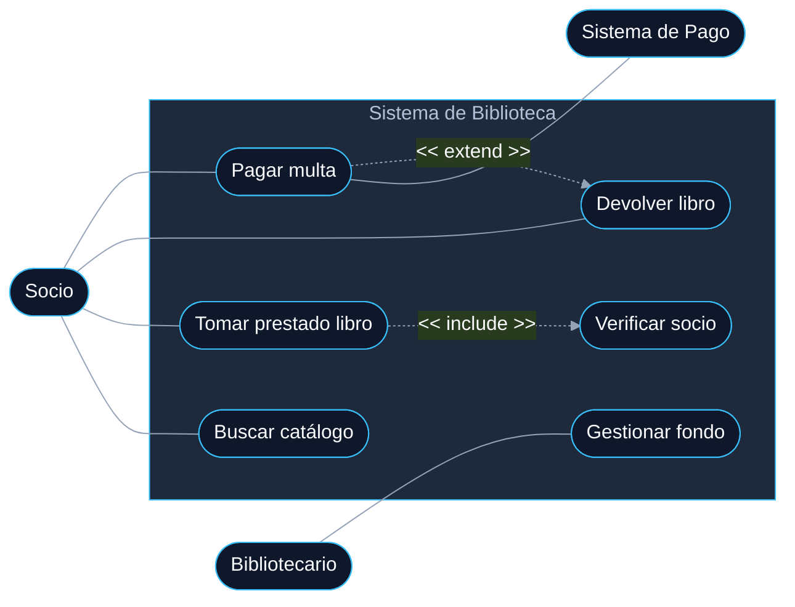
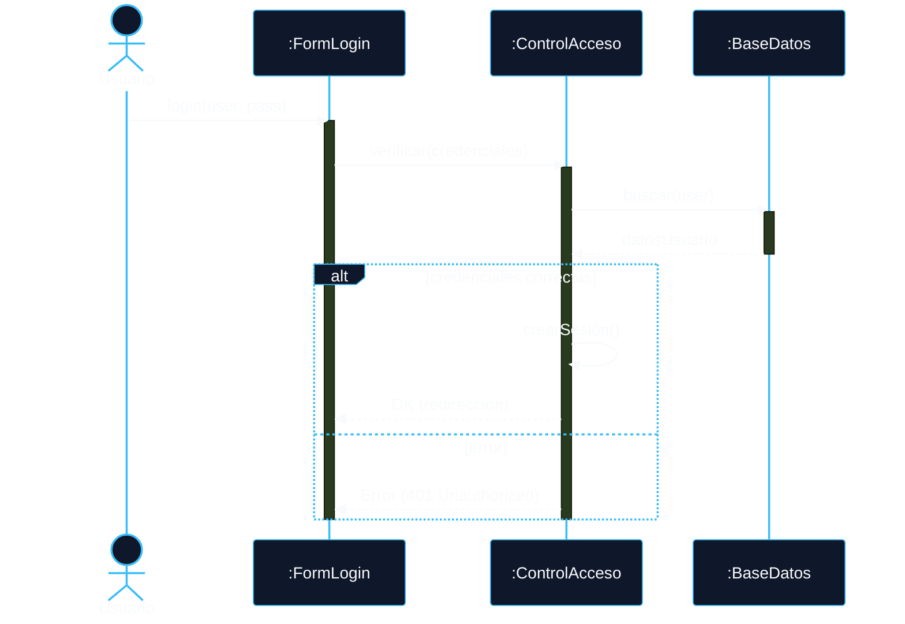
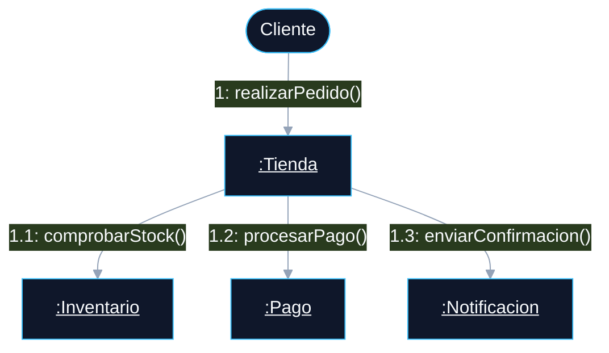
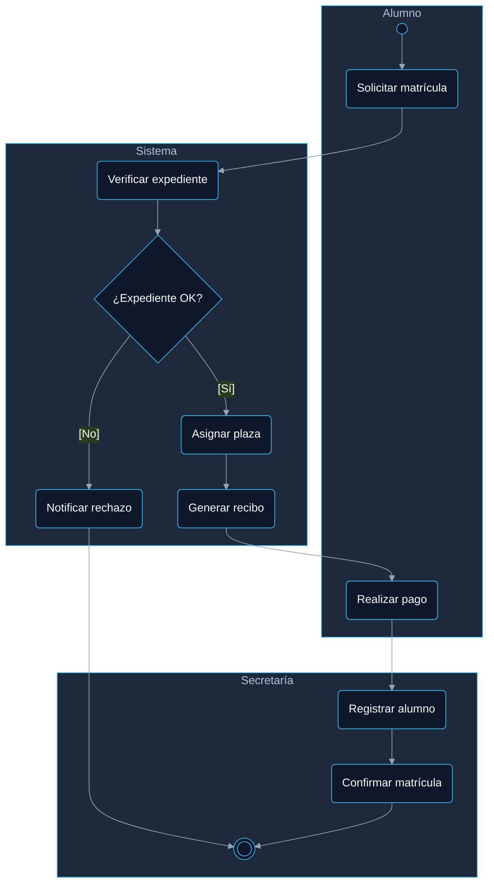
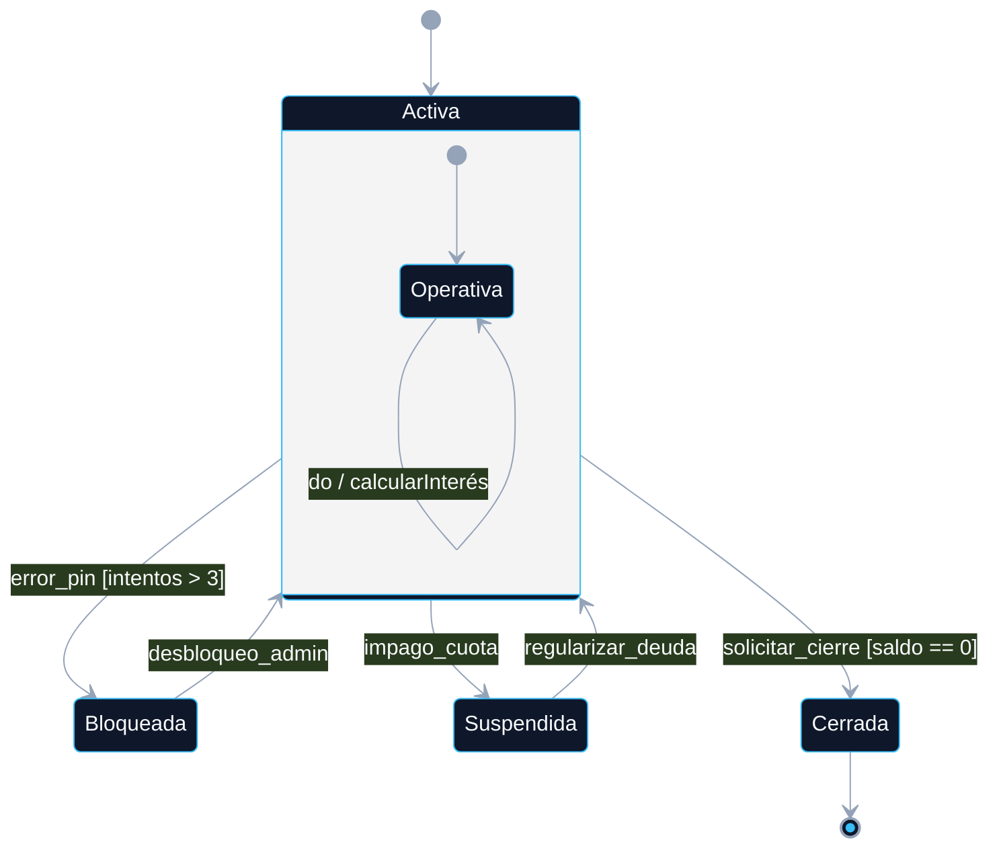

# 📑 ÍNDICE DINÁMICO

1. 📘 **[01 - Diagramas de Comportamiento: Tipos y Campo de Aplicación](#sec1)**
2. 📘 **[02 - Diagrama de Casos de Uso](#sec2)**
    - [Elementos del diagrama](#sec21)
    - [Ejemplo Práctico: Sistema de Biblioteca](#sec22)
3. 📘 **[03 - Diagrama de Secuencia](#sec3)**
4. 📘 **[04 - Diagrama de Comunicación](#sec4)**
5. 📘 **[05 - Diagrama de Actividad](#sec5)**
6. 📘 **[06 - Diagrama de Estados (State Machine Diagram)](#sec6)**
7. 📘 **[07 - Comparativa y Relación entre los Diagramas](#sec7)**

---

## 01 - Diagramas de Comportamiento: Tipos y Campo de Aplicación

### ¿Qué son y para qué sirven?
Los diagramas de comportamiento en UML (Unified Modeling Language) describen el **comportamiento dinámico** de un sistema. Frente a los estructurales (que muestran organización), estos responden a: *¿Qué hace el sistema y cómo lo hace a lo largo del tiempo?*

### 📌 Tabla Resumen: Tipos Principales (UML 2.x)

| Diagrama | Propósito Principal | Fase de Aplicación Ideal |
| :--- | :--- | :--- |
| **Casos de Uso** | Interacciones entre usuarios (actores) y el sistema. | Análisis / Captura de requisitos |
| **Secuencia** | Intercambio temporal de mensajes entre objetos. | Diseño del sistema / Escenarios |
| **Comunicación** | Relaciones estructurales entre objetos que se comunican. | Diseño del sistema / Topología |
| **Actividad** | Flujos de trabajo, algoritmos o procesos complejos. | Modelado de lógica de negocio |
| **Estados** | Ciclo de vida de un objeto y eventos de transición. | Diseño detallado de clases |
| **Interacción** | Combina diagramas de interacción (flujos complejos). | Diseño avanzado |
| **Tiempo** | Restricciones temporales en el comportamiento. | Sistemas de tiempo real |

> 💡 **TIPS Prácticos:**
> Para memorizar la diferencia fundamental en un examen: Si te preguntan por la "arquitectura o esqueleto", es **estructural** (Clases, Componentes). Si te preguntan por "tiempo, flujos, procesos o interacciones", es **comportamiento**.

> 🚀 **COMPLEMENTO (Fuera de temario): Alternativas Modernas[NO ENTRA EN EXAMEN]**
> En entornos Agile actuales, el uso exhaustivo de UML "de libro" ha disminuido. Sin embargo, herramientas *Diagram-as-Code* como **Mermaid.js** (que usamos aquí) o **PlantUML** son un estándar en la industria para documentar repositorios (GitHub/GitLab) porque se integran directamente en los archivos `.md`.

[🏠 Volver al Índice](https://www.notion.so/Resumenes-despu-s-de-md-34300d699d8880c7a08afd81508f534d?pvs=21)

---

## 02 - Diagrama de Casos de Uso

El punto de entrada del análisis orientado a objetos. Define un **contrato funcional**: captura los requisitos funcionales desde la perspectiva del usuario (qué hace el sistema, no cómo lo implementa).

### Elementos Clave del Diagrama

*   **Actor (Stick figure):** Entidad externa (humano, sistema o hardware) que interactúa con el sistema. Pueden ser primarios (inician) o secundarios (responden).
*   **Caso de Uso (Elipse):** Unidad de funcionalidad ofrecida a un actor. Representa una acción (escrita en infinitivo).
*   **Límite del Sistema (Boundary):** Rectángulo que separa el interior del sistema (Casos de Uso) del exterior (Actores).

#### 🔗 Tipos de Relaciones

| Relación | Notación | Comportamiento |
| :--- | :--- | :--- |
| **Asociación** | Línea simple | Comunica actor y caso de uso. |
| **«include»** | Flecha discontinua | Dependencia **obligatoria**. El caso base extrae comportamiento común que ocurre siempre. |
| **«extend»** | Flecha discontinua | Dependencia **opcional**. Modela alternativas o extensiones bajo ciertas condiciones. |
| **Generalización** | Flecha con punta vacía | Herencia. Un actor/caso de uso hereda de otro más general. |

> 💡 **TIPS Prácticos:**
> *   **Regla de Oro del Nombramiento:** Siempre verbos en infinitivo + sustantivo (*Ej: "Registrar cliente", NUNCA "Registro de clientes"*).
> *   **Truco para `include` vs `extend`:** Piensa en `include` como una llamada a una función indispensable, y en `extend` como un bloque `if` que solo se ejecuta a veces.

> 🚀 **COMPLEMENTO (Fuera de temario): User Stories vs Casos de Uso [NO ENTRA EN EXAMEN]**
> En metodologías ágiles (Scrum), los Casos de Uso suelen sustituirse o complementarse con *Historias de Usuario* (Formato: "Como[rol], quiero [acción] para [beneficio]"). Los Casos de Uso siguen siendo superiores para documentar sistemas complejos o contratos legales de software.

[🏠 Volver al Índice](https://www.notion.so/Resumenes-despu-s-de-md-34300d699d8880c7a08afd81508f534d?pvs=21)

### Ejemplo Práctico: Sistema de Biblioteca

**Situación:** Socio busca, toma prestado y devuelve libros. Si hay retraso, paga multa. El bibliotecario gestiona el fondo.

#### 🛠️ Análisis de Construcción Paso a Paso:
1.  **Actores Externos:** `Socio`, `Bibliotecario` (Primarios) y `Sistema de Pago` (Secundario).
2.  **Boundary (Límite):** Todo ocurre dentro de "Sistema de Biblioteca".
3.  **Include (`Verificar socio`):** Es una acción obligatoria cada vez que se quiere "Tomar prestado".
4.  **Extend (`Pagar multa`):** Solo ocurre condicionalmente cuando se devuelve un libro con retraso, expandiendo el caso "Devolver libro".

[🏠 Volver al Índice](https://www.notion.so/Resumenes-despu-s-de-md-34300d699d8880c7a08afd81508f534d?pvs=21)

## 03 - Diagrama de Secuencia

El diagrama de secuencia es el más utilizado para modelar la dinámica del sistema. Su eje horizontal muestra los **participantes** y el vertical el **tiempo** (que avanza hacia abajo).

### Elementos Fundamentales

1.  **Línea de Vida (Lifeline):** Rectángulo con `nombre:Clase` y una línea discontinua vertical.
2.  **Activación (Execution Box):** Rectángulo estrecho sobre la línea de vida que indica que el objeto está ejecutando una operación.
3.  **Mensajes:**
    *   **Síncrono (➡):** El emisor espera respuesta (típica llamada a método).
    *   **Asíncrono (->):** El emisor no espera (señales, eventos).
    *   **Retorno (-->):** Flecha discontinua que devuelve el control.
    *   **Autollamada:** Flecha que vuelve al propio objeto (recursividad).

### Fragmentos Combinados (Lógica de Control)

| Operador | Significado | Uso en Código |
| :--- | :--- | :--- |
| **alt** | Alternativa (if-else) | Solo se ejecuta la rama cuya condición (guarda) sea cierta. |
| **opt** | Opcional (if) | Se ejecuta solo si se cumple la condición. |
| **loop** | Bucle (while/for) | Repetición de los mensajes internos. |
| **ref** | Referencia | Enlace a otro diagrama de secuencia para simplificar el actual. |

> 💡 **TIPS Prácticos:**
> *   **Destrucción de Objetos:** Si un objeto deja de existir (ej: se cierra una conexión), marca el final de su línea de vida con una **X**.
> *   **Claridad:** No satures el diagrama con todos los métodos de bajo nivel; céntrate en los mensajes que aportan valor al flujo de negocio.

> 🚀 **COMPLEMENTO (Fuera de temario): Trazabilidad en Microservicios [NO ENTRA EN EXAMEN]**
> En arquitecturas modernas de microservicios, los diagramas de secuencia son vitales para entender la "Saga Pattern" o la coreografía de eventos. Herramientas como **Jaeger** o **Zipkin** generan diagramas de secuencia automáticos a partir de trazas reales del sistema.

### Ejemplo Práctico: Inicio de Sesión

[🏠 Volver al Índice](https://www.notion.so/Resumenes-despu-s-de-md-34300d699d8880c7a08afd81508f534d?pvs=21)

---

## 04 - Diagrama de Comunicación

Este diagrama (antes llamado *Colaboración*) es semánticamente equivalente al de secuencia, pero cambia el foco: destaca la **organización de los objetos** (topología) en lugar del orden temporal.

### Diferencias Clave

| Característica | Diagrama de Secuencia | Diagrama de Comunicación |
| :--- | :--- | :--- |
| **Énfasis** | Tiempo y orden de mensajes. | Estructura y enlaces entre objetos. |
| **Espacio** | Consume mucho espacio vertical. | Es más compacto (red de nodos). |
| **Navegación** | De arriba a abajo. | Mediante números de secuencia (1, 1.1, 2...). |

### Numeración Jerárquica
Como no hay eje de tiempo, el orden se define con números:
*   **1:** Primer mensaje.
*   **1.1:** Primer mensaje enviado *dentro* de la ejecución del mensaje 1.
*   **1.2:** Segundo mensaje enviado *dentro* del mensaje 1.
*   **2:** Siguiente mensaje al mismo nivel que el 1.

> 💡 **TIPS Prácticos:**
> *   Utiliza este diagrama cuando quieras demostrar que tu **Diagrama de Clases** es correcto. Si dos objetos se hablan en el diagrama de comunicación pero no tienen una relación/asociación en el de clases, falta algo en tu diseño.

### Ejemplo Práctico: Procesar Pedido

[🏠 Volver al Índice](https://www.notion.so/Resumenes-despu-s-de-md-34300d699d8880c7a08afd81508f534d?pvs=21)

## 05 - Diagrama de Actividad

Es el equivalente UML al **diagrama de flujo**, pero con esteroides: permite modelar concurrencia (procesos paralelos) y organizar responsabilidades mediante carriles.

### 🧱 Bloques de Construcción

| Elemento | Representación | Propósito |
| :--- | :--- | :--- |
| **Nodo Inicial** | ● | Punto de arranque del flujo. |
| **Acción** | Rectángulo redondeado | Tarea atómica (ej: "Validar PDF"). |
| **Decisión / Unión** | Rombo ( ◊ ) | Bifurcación basada en una condición `[si/no]`. |
| **Fork (Bifurcación)** | Barra gruesa (una entrada, varias salidas) | Inicia tareas en **paralelo**. |
| **Join (Unión)** | Barra gruesa (varias entradas, una salida) | **Sincroniza** hilos paralelos antes de seguir. |
| **Swimlanes** | Carriles (Columnas) | Define **quién** hace cada cosa (Alumno, Sistema, etc.). |
| **Nodo Final** | ◉ | Fin de toda la actividad. |

> 💡 **TIPS Prácticos:**
> *   **Diferencia Finales:** El "Final de Actividad" (círculo con punto) detiene todo el proceso. El "Final de Flujo" (círculo con X) solo detiene una rama secundaria sin afectar a las demás que sigan activas.
> *   **Atomicidad:** Una "Acción" no debería ser un proceso de 50 pasos; si es muy complejo, conviértelo en una "Subactividad".

> 🚀 **COMPLEMENTO (Fuera de temario): BPMN vs UML [NO ENTRA EN EXAMEN]**
> En el mundo empresarial (Business Process Management), se suele preferir **BPMN 2.0** en lugar de diagramas de actividad de UML. BPMN es mucho más rico para modelar eventos de tiempo, errores y mensajería entre empresas.

### Ejemplo Práctico: Matrícula Universitaria

[🏠 Volver al Índice](https://www.notion.so/Resumenes-despu-s-de-md-34300d699d8880c7a08afd81508f534d?pvs=21)

---

## 06 - Diagrama de Estados (State Machine Diagram)

Mientras que el de actividad modela un proceso, este modela la **vida de un objeto**. Es ideal para clases que cambian radicalmente su comportamiento según sus atributos internos (ej: un Pedido, una Factura).

### Componentes de una Transición
La flecha que une dos estados suele llevar esta sintaxis:
`Evento [Condición] / Acción`

1.  **Evento:** Lo que ocurre (ej: `click_en_pagar`).
2.  **Condición (Guarda):** Solo si es cierta se cambia de estado (ej: `[saldo > total]`).
3.  **Acción:** Lo que el objeto hace durante el cambio (ej: `/ descontar_saldo`).

### Acciones Internas del Estado
Un estado (rectángulo) puede tener lógica propia:
*   `entry /`: Se ejecuta nada más entrar.
*   `do /`: Se ejecuta mientras se esté en ese estado (proceso continuo).
*   `exit /`: Se ejecuta justo antes de salir.

### Ejemplo Práctico: Ciclo de Vida de una Cuenta Bancaria

> 💡 **TIPS Prácticos:**
> *   **Estado vs Atributo:** No crees un estado para cada cambio de variable. Si el objeto se comporta igual pero solo cambia un número, es un **atributo**. Si cambian las reglas (ej: en "Bloqueada" no puedes sacar dinero), es un **estado**.

[🏠 Volver al Índice](https://www.notion.so/Resumenes-despu-s-de-md-34300d699d8880c7a08afd81508f534d?pvs=21)

## 07 - Comparativa y Relación entre los Diagramas

Los diagramas de comportamiento no son herramientas aisladas; forman un ecosistema donde cada uno aporta una perspectiva necesaria para cubrir el ciclo de vida del software.

### 🔄 Tabla Comparativa Final

| Diagrama | Foco Principal | Pregunta que responde | Relación con otros |
| :--- | :--- | :--- | :--- |
| **Casos de Uso** | Requisitos | ¿QUÉ debe hacer el sistema? | Base para los diagramas de Secuencia. |
| **Actividad** | Procesos | ¿En qué ORDEN se ejecutan las tareas? | Detalla la lógica interna de un Caso de Uso. |
| **Secuencia** | Interacción | ¿CÓMO se comunican los objetos? | Valida el Diagrama de Clases. |
| **Comunicación** | Estructura | ¿Quién está CONECTADO con quién? | Versión estructural de la Secuencia. |
| **Estados** | Ciclo de Vida | ¿Cómo cambia el OBJETO internamente? | Detalla el comportamiento de una Clase. |

### 🛠️ Flujo de Trabajo Profesional (Workflow DAM)

Para abordar un proyecto de desarrollo desde cero, el orden lógico de modelado suele ser:

1.  **Definición de Requisitos:** Se crea el **Diagrama de Casos de Uso** para acordar las funcionalidades con el cliente.
2.  **Lógica de Proceso:** Se usa el **Diagrama de Actividad** para entender flujos de negocio complejos (especialmente si hay varios departamentos implicados).
3.  **Realizaciones de Casos de Uso:** Por cada Caso de Uso, se diseña un **Diagrama de Secuencia** para identificar qué métodos y clases necesitaremos programar.
4.  **Validación Estructural:** Se revisa el **Diagrama de Comunicación** para asegurar que las asociaciones entre clases permiten el flujo de mensajes diseñado.
5.  **Refinamiento de Clases:** Para objetos con lógica crítica (ej: un motor de videojuegos o un gestor de pedidos), se dibuja el **Diagrama de Estados**.

> 💡 **TIPS Prácticos:**
> *   **En el examen:** Si te piden modelar un sistema completo, empieza siempre por Casos de Uso. Es el cimiento.
> *   **Coherencia:** Si en un Diagrama de Secuencia el objeto `A` llama al método `calcular()` del objeto `B`, en tu Diagrama de Clases la clase `B` **debe** tener el método `calcular()`. UML sirve para detectar estas incoherencias antes de escribir una sola línea de código.

> 🚀 **COMPLEMENTO (Fuera de temario): Model-Driven Development (MDD) [NO ENTRA EN EXAMEN]**
> Existen herramientas avanzadas (como *Enterprise Architect* o *IBM Rhapsody*) capaces de generar código fuente automáticamente a partir de estos diagramas. En este paradigma, el diagrama **es** el código. Aunque en DAM aprendemos a picar código a mano, en sistemas críticos (aeroespacial, médico) se usa mucho el modelado para asegurar que el código generado sea 100% fiel al diseño.

[🏠 Volver al Índice](https://www.notion.so/Resumenes-despu-s-de-md-34300d699d8880c7a08afd81508f534d?pvs=21)