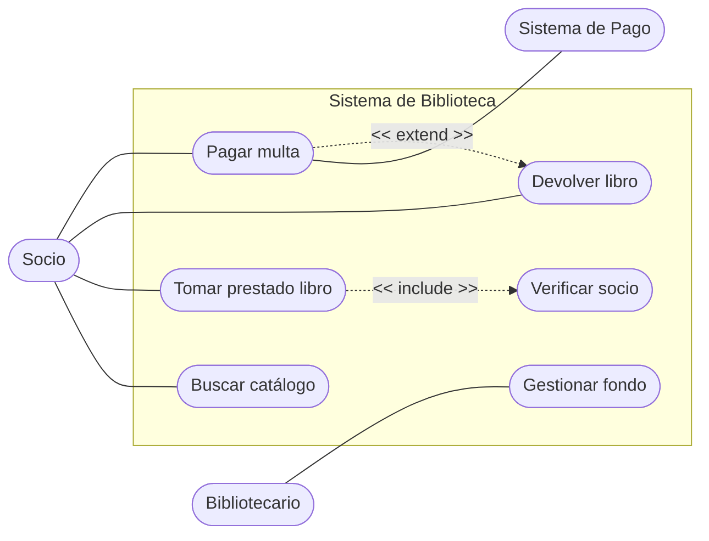
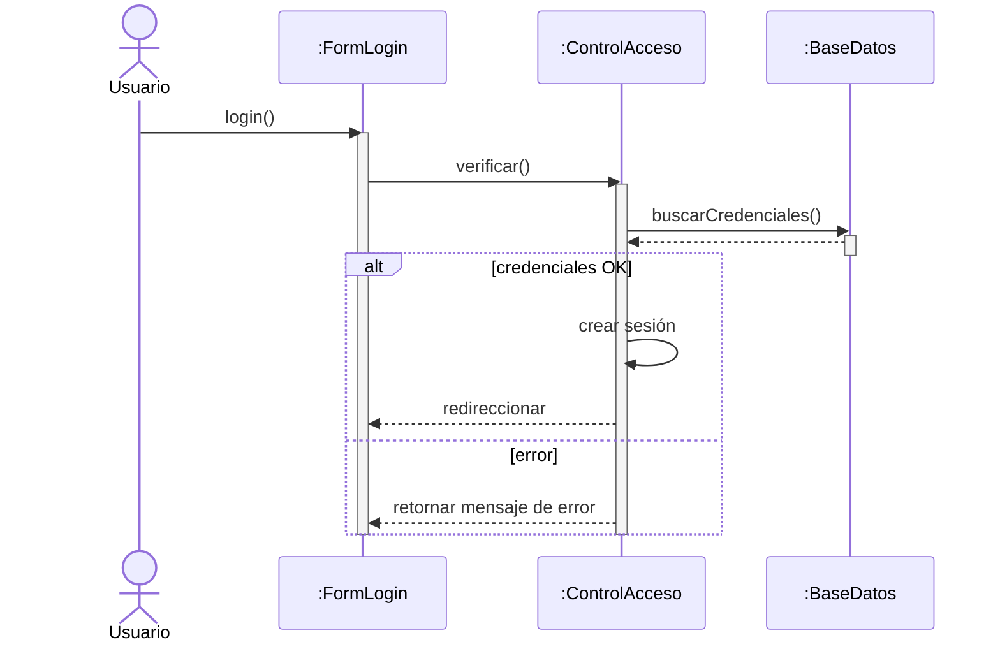
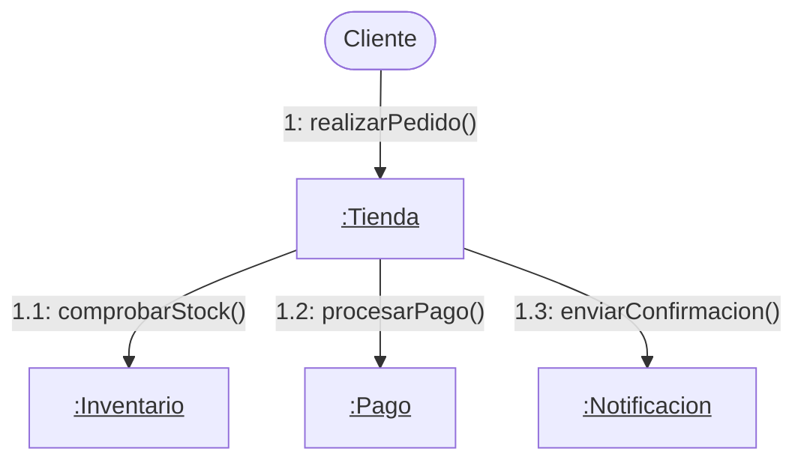
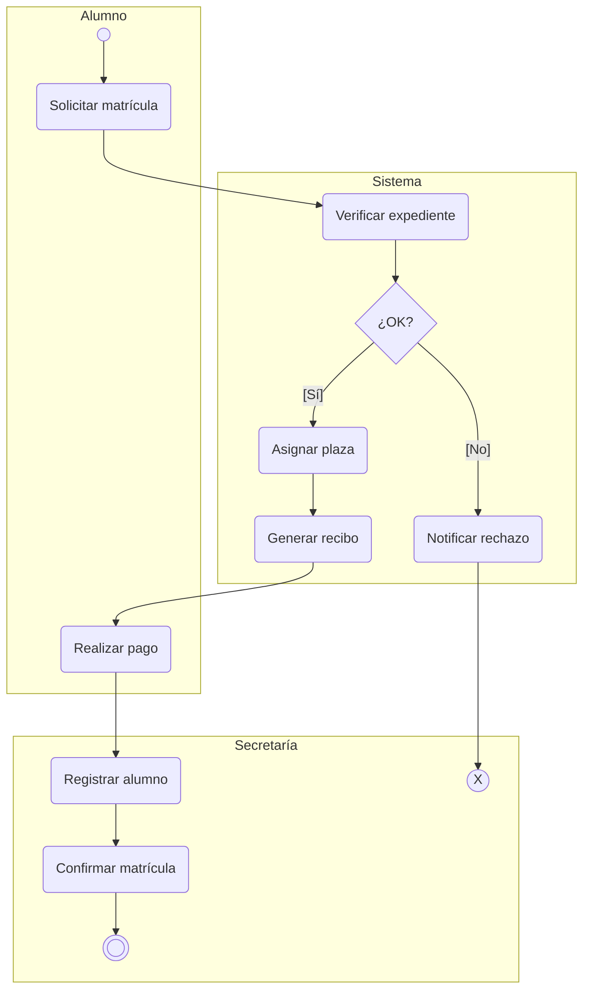
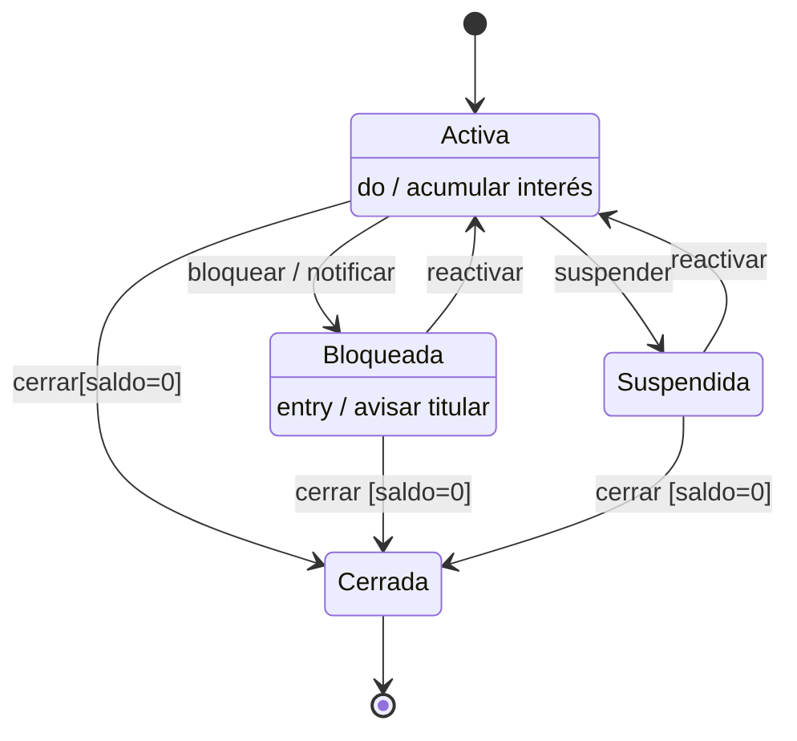

## 01 - Diagramas de Comportamiento: Tipos y Campo de Aplicación

### ¿Qué son los diagramas de comportamiento?

Los diagramas de comportamiento en UML (Unified Modeling Language) describen el **comportamiento dinámico** de un sistema de software. Mientras que los diagramas estructurales muestran cómo está organizado el sistema, los de comportamiento responden a la pregunta: *¿qué hace el sistema y cómo lo hace?*

UML 2.x define siete tipos de diagramas de comportamiento, de los cuales cuatro son especialmente relevantes en la práctica profesional:

| Diagrama | Descripción y uso principal |
| --- | --- |
| Casos de Uso | Describe las interacciones entre usuarios (actores) y el sistema. Se usa en la fase de captura de requisitos. |
| Secuencia | Muestra el intercambio de mensajes entre objetos a lo largo del tiempo. Ideal para detallar escenarios concretos. |
| Comunicación | Similar al de secuencia pero enfocado en las relaciones estructurales entre objetos que se comunican. |
| Actividad | Modela flujos de trabajo o algoritmos. Equivalente a un diagrama de flujo orientado a objetos. |
| Estados | Representa los estados por los que pasa un objeto durante su ciclo de vida y los eventos que causan transiciones. |
| Interacción general | Combina diagramas de interacción para mostrar flujos complejos con alternativas. |
| Tiempo | Muestra restricciones temporales sobre el comportamiento de objetos. |

### Campo de aplicación

Los diagramas de comportamiento se aplican a lo largo de todo el ciclo de vida del desarrollo de software:

* **Análisis de requisitos:** Los diagramas de casos de uso permiten identificar qué funcionalidades espera el usuario del sistema.
* **Diseño del sistema:** Los diagramas de secuencia y comunicación permiten diseñar cómo los objetos colaboran para implementar cada caso de uso.
* **Modelado de lógica de negocio:** Los diagramas de actividad describen procesos y flujos de trabajo complejos.
* **Diseño detallado de clases:** El diagrama de estados documenta el ciclo de vida de objetos con comportamiento complejo.
* **Documentación y comunicación:** Facilitan el entendimiento entre analistas, diseñadores, desarrolladores y clientes.

## 02 - Diagrama de Casos de Uso

### Introducción y propósito
El diagrama de casos de uso es el **punto de entrada del análisis orientado a objetos**. Su objetivo es capturar los requisitos funcionales del sistema desde la perspectiva del usuario, mostrando qué puede hacer el sistema y quién interactúa con él.

No describe cómo se implementan las funciones, sino *qué funciones ofrece el sistema a sus usuarios*. Se trata del contrato funcional entre el sistema y el mundo exterior.

### Elementos del diagrama de casos de uso

#### Actor
Un actor es cualquier entidad externa que interactúa con el sistema: puede ser una persona, otro sistema informático o un dispositivo hardware.

> **Características de los actores**
> * Viven fuera del sistema (son entidades externas).
> * Interactúan con el sistema para conseguir un objetivo.
> * Se representan con el icono de un muñeco (stick figure) y su nombre debajo.
> * Pueden ser primarios (inician la interacción) o secundarios (responden o son notificados).
> * Se agrupan mediante herencia: un actor puede especializar a otro más general.

Ejemplos de actores:
* **Actores humanos:** Cliente, Administrador, Cajero.
* **Actores sistema:** Sistema de pago externo, Servicio de correo electrónico.
* **Actores dispositivo:** Sensor de temperatura, Impresora.

#### Caso de uso
Un caso de uso representa una **unidad de funcionalidad** que el sistema ofrece a un actor. Se escribe como una acción expresada con un verbo en infinitivo (ej.: *Registrar pedido, Consultar saldo, Emitir factura*).

Cada caso de uso implica un escenario principal y escenarios alternativos o de error. El conjunto de todos los escenarios de un caso de uso forma su especificación completa.

#### Límite del sistema (boundary)
El límite del sistema es un rectángulo que delimita qué está dentro del sistema y qué está fuera. Los casos de uso se colocan dentro del rectángulo; los actores, fuera.

#### Relaciones
Los diagramas de casos de uso utilizan cuatro tipos de relaciones:

| Relación | Descripción |
| --- | --- |
| Asociación (comunicación) | Línea simple entre actor y caso de uso. Indica que el actor participa en el caso de uso. |
| «include» | Un caso de uso base incluye siempre a otro. Se usa para extraer comportamiento común. |
| «extend» | Un caso de uso extiende a otro solo en ciertas condiciones. Modela comportamiento opcional o alternativo. |
| Generalización | Herencia entre actores (o entre casos de uso). El hijo hereda el comportamiento del padre. |

### Escenario
Un escenario es una **secuencia concreta de pasos** que describe una instancia de un caso de uso. Cada caso de uso puede tener:
* **Escenario principal (flujo básico):** el camino feliz, cuando todo va bien.
* **Escenarios alternativos:** variaciones del flujo principal que siguen siendo válidas.
* **Escenarios de excepción:** situaciones de error o condiciones anómalas.

La especificación de un caso de uso suele incluir: nombre, actores, precondiciones, postcondiciones, flujo principal, flujos alternativos y requisitos especiales.

### Buenas prácticas
* Nombrar los casos de uso con verbos en infinitivo desde la perspectiva del actor.
* No incluir más de 20 casos de uso en un único diagrama para mantener la legibilidad.
* Usar «include» cuando el comportamiento compartido ocurre siempre; usar «extend» cuando es opcional.
* No modelar la interfaz gráfica ni la navegación de pantallas en este diagrama.

### Ejemplo práctico: Sistema de Biblioteca

> **Enunciado del problema**
> 
> Una biblioteca universitaria necesita un sistema informático para gestionar el préstamo de libros.
> 
> Los socios pueden buscar el catálogo, tomar libros en préstamo y devolver los que ya han leído.
> 
> Si un socio devuelve un libro con retraso, el sistema debe gestionar el pago de una multa.
> 
> El bibliotecario es el responsable de mantener actualizado el fondo de la biblioteca.

*Figura 2.1 — Diagrama de Casos de Uso del Sistema de Biblioteca*

#### Cómo se construye este diagrama
1. **Identificar los actores.** Se analiza quién interactúa con el sistema: el Socio (actor primario, inicia acciones), el Bibliotecario (actor primario, gestiona el fondo) y el Sistema de Pago externo (actor secundario, procesa cobros). Cada actor se dibuja fuera del rectángulo de sistema.
2. **Identificar los casos de uso.** Por cada necesidad funcional se crea una elipse dentro del boundary: Buscar catálogo, Tomar prestado libro, Devolver libro, Pagar multa y Gestionar fondo.
3. **Trazar las asociaciones.** Se conectan actores con los casos de uso en los que participan con una línea simple. El Socio participa en las cuatro primeras; el Bibliotecario, en Gestionar fondo.
4. **Añadir relaciones «include» y «extend».** Tomar prestado libro siempre incluye Verificar socio (comportamiento obligatorio extraído), por lo que se usa «include». Pagar multa es opcional y sólo ocurre cuando hay retraso, pudiéndose modelar como «extend» desde Devolver libro.
5. **Añadir actores secundarios.** El Sistema de Pago se asocia con Pagar multa porque participa en el procesamiento del cobro, aunque no inicia la interacción.

## 03 - Diagrama de Secuencia

### Introducción y propósito
El diagrama de secuencia es el **diagrama de interacción más utilizado en UML**. Muestra cómo un conjunto de objetos interactúan entre sí a lo largo del tiempo para llevar a cabo una operación o implementar un caso de uso.

El eje horizontal representa los participantes (objetos o roles) y el eje vertical representa el tiempo, que avanza hacia abajo. La fortaleza de este diagrama es que hace explícito el *orden temporal* de los mensajes.

### Elementos principales

#### Línea de vida (Lifeline)
La línea de vida representa la existencia de un participante durante la interacción. Se dibuja como:
* Un rectángulo en la parte superior con el nombre del objeto y, opcionalmente, el de su clase (formato: *nombreObjeto:NombreClase*).
* Una línea vertical discontinua hacia abajo que simboliza el paso del tiempo mientras el objeto existe.

Si un objeto es creado durante la interacción, su rectángulo aparece más abajo en el diagrama, a la altura del mensaje que lo crea. Si es destruido, la línea de vida termina con una X.

#### Activación (Activation box / Execution occurrence)
La activación es un rectángulo estrecho y alargado superpuesto sobre la línea de vida. Representa el período durante el cual un objeto está ejecutando una operación:
* Comienza cuando el objeto recibe un mensaje (o inicia una llamada).
* Termina cuando devuelve el control al llamante o cuando la operación finaliza.
* Se pueden anidar activaciones cuando un objeto llama a otro y espera su respuesta.

#### Mensajes
Los mensajes son las comunicaciones que se intercambian entre participantes. Se representan con flechas horizontales entre las líneas de vida:

| Tipo de mensaje | Representación y significado |
| --- | --- |
| Síncrono | Flecha sólida con cabeza rellena (➡). El emisor queda bloqueado hasta recibir respuesta. Es el tipo más habitual en llamadas a métodos. |
| Asíncrono | Flecha sólida con cabeza abierta. El emisor continúa su ejecución sin esperar respuesta. Típico en sistemas de eventos o mensajería. |
| Respuesta / retorno | Flecha discontinua. Devuelve el control (y opcionalmente un valor) al llamante tras la ejecución. |
| Creación | Flecha discontinua con estereotipo «create». El mensaje provoca la instanciación de un objeto. |
| Destrucción | Flecha con estereotipo «destroy». Termina la existencia de un objeto (marca X en la línea de vida). |
| Autollamada (self-call) | Flecha que sale y vuelve a la misma línea de vida. El objeto se llama a sí mismo (recursividad o delegación interna). |

### Fragmentos combinados (Combined Fragments)
UML 2 introduce los **fragmentos combinados** para modelar lógica de control dentro de los diagramas de secuencia. Se representan como rectángulos con una etiqueta en la esquina superior izquierda:

| Operador | Significado |
| --- | --- |
| alt | Alternativa (if-else). Solo se ejecuta el fragmento cuya guarda es verdadera. |
| opt | Opcional (if). El fragmento se ejecuta solo si la guarda es verdadera. |
| loop | Bucle. Se repite mientras la guarda sea verdadera o un número determinado de veces. |
| par | Paralelo. Los subfragmentos se ejecutan concurrentemente. |
| ref | Referencia a otra interacción definida en otro diagrama de secuencia. |
| break | Excepción o salida anticipada del fragmento contenedor. |

### Ejemplo práctico: Inicio de Sesión

> **Enunciado del problema**
> 
> Un usuario accede a una aplicación web introduciendo su nombre de usuario y contraseña.
> 
> El formulario de login envía los datos al controlador de acceso, que los verifica contra la base de datos.
> 
> Si las credenciales son correctas, se crea una sesión y se redirige al usuario a su panel. Si son incorrectas, se muestra un mensaje de error.

*Figura 3.1 — Diagrama de Secuencia del caso de uso Inicio de Sesión*

#### Cómo se construye este diagrama
1. **Identificar los participantes (lifelines).** En este escenario intervienen cuatro: el actor Usuario, el objeto :FormLogin (interfaz), el objeto :ControlAcceso (lógica de negocio) y :BaseDatos. Se colocan en la parte superior de izquierda a derecha según el orden de interacción.
2. **Dibujar las líneas de vida.** Desde cada rectángulo de participante se traza una línea discontinua vertical hacia abajo. Estas líneas representan la existencia del objeto durante la interacción.
3. **Añadir los mensajes síncronos.** El Usuario envía login() al :FormLogin, que reenvía verificar() al :ControlAcceso. Este llama a buscarCredenciales() en la :BaseDatos. Cada mensaje síncrono se representa con una flecha sólida con cabeza rellena.
4. **Dibujar las cajas de activación.** Sobre cada línea de vida se dibuja un rectángulo estrecho que cubre el período en que el objeto está procesando. Las cajas se anidan cuando un objeto espera la respuesta de otro.
5. **Modelar la lógica condicional con el fragmento «alt».** Se encierra en un rectángulo con la etiqueta alt dividido en dos regiones: la primera con la guarda [credenciales OK] → crear sesión; la segunda con [error] → retornar mensaje de error. Los mensajes de retorno se dibujan con flechas discontinuas.

## 04 - Diagrama de Comunicación

### Introducción y propósito
El diagrama de comunicación (anteriormente denominado **diagrama de colaboración** en UML 1.x) modela las mismas interacciones que el diagrama de secuencia pero desde una perspectiva diferente: pone el énfasis en la *estructura de la red de objetos* que colaboran, en lugar de en el orden temporal de los mensajes.

Ambos diagramas son semánticamente equivalentes: cualquier diagrama de secuencia puede transformarse en uno de comunicación y viceversa. La elección depende de qué aspecto se quiera destacar.

> **Secuencia vs. Comunicación**
> 
> **Diagrama de Secuencia:** enfatiza el *orden temporal* de los mensajes. Ideal para detallar un escenario paso a paso.
> 
> **Diagrama de Comunicación:** enfatiza las *relaciones entre objetos*. Ideal para visualizar la arquitectura de la colaboración.

### Elementos del diagrama de comunicación

#### Objetos
Los objetos participantes se representan como rectángulos con el nombre subrayado, siguiendo la notación *nombreObjeto:NombreClase*. Se disponen libremente en el espacio del diagrama.

A diferencia del diagrama de secuencia, no existe un eje de tiempo explícito. Los objetos se conectan mediante líneas que representan **enlaces (links)**, es decir, instancias de asociaciones entre clases.

#### Mensajes
Los mensajes se representan como flechas acompañadas de una etiqueta con:
* **Número de secuencia:** indica el orden de los mensajes (ej.: 1, 1.1, 1.2, 2, 2.1…).
* Nombre del mensaje y parámetros opcionales.
* Condiciones de guarda entre corchetes: [condicion] mensaje().
* Indicador de iteración con asterisco: *[condicion] mensaje().

La numeración jerárquica (1, 1.1, 1.1.1…) refleja la anidación de las llamadas: el mensaje 1.1 es una llamada realizada dentro del contexto de la llamada 1.

### Notación de mensajes numerados

| Ejemplo de etiqueta | Interpretación |
| --- | --- |
| 1: calcularTotal() | Primer mensaje de la interacción. |
| 1.1: obtenerPrecio(id) | Primer submensaje enviado dentro del procesamiento del mensaje 1. |
| 1.2: aplicarDescuento() | Segundo submensaje dentro del procesamiento del mensaje 1. |
| 2: confirmarPedido() | Segundo mensaje de nivel superior. |
| *[i<n] 1.1: procesar(i) | Mensaje 1.1 enviado en bucle mientras i sea menor que n. |

### Ventajas e inconvenientes

> **✓ Ventajas**
> * Muestra claramente la topología de la red de objetos y sus relaciones.
> * Útil para verificar que las asociaciones del diagrama de clases son suficientes.
> * Ocupa menos espacio vertical para interacciones con muchos objetos.

> **✗ Inconvenientes**
> * El orden temporal no es tan evidente; es necesario seguir la numeración.
> * Los fragmentos combinados (alt, loop, etc.) son más difíciles de representar.

### Ejemplo práctico: Procesar un Pedido

> **Enunciado del problema**
> 
> Un cliente realiza un pedido en una tienda online. El sistema debe comprobar el stock en el inventario, procesar el pago a través de la pasarela de cobro y enviar una confirmación al cliente cuando todo haya sido completado con éxito.

*Figura 4.1 — Diagrama de Comunicación del caso de uso Procesar Pedido*

#### Cómo se construye este diagrama
1. **Identificar los objetos participantes.** Los mismos que en el diagrama de secuencia equivalente: Cliente, :Tienda, :Inventario, :Pago y :Notificacion. Se disponen libremente en el espacio, buscando una disposición que minimice el cruce de líneas.
2. **Trazar los enlaces (links).** Se conectan los objetos que necesitan comunicarse con líneas simples. Cada enlace representa una instancia de asociación del diagrama de clases y permite verificar que el modelo estructural soporta la colaboración.
3. **Añadir los mensajes con numeración jerárquica.** El mensaje 1: realizarPedido() va del Cliente a :Tienda. Dentro de ese procesamiento, :Tienda envía 1.1: comprobarStock() a :Inventario, luego 1.2: procesarPago() a :Pago, y finalmente 1.3: enviarConfirmacion() a :Notificacion.
4. **La numeración jerárquica** (1, 1.1, 1.2…) sustituye al eje temporal del diagrama de secuencia. Para leer el diagrama se sigue el orden numérico, no la posición espacial de las flechas.
5. **Comparación con el diagrama de secuencia.** El diagrama de comunicación muestra con más claridad que :Tienda es el objeto central (hub) de la colaboración, algo menos evidente en el diagrama de secuencia.

## 05 - Diagrama de Actividad

### Introducción y propósito
El diagrama de actividad es el **equivalente UML del clásico diagrama de flujo**, pero con una semántica más rica orientada a objetos. Modela el flujo de trabajo (workflow) de un proceso, algoritmo o caso de uso, mostrando las actividades que se realizan, las decisiones que se toman y cómo fluye el control entre ellas.

UML 2 potenció considerablemente este diagrama, añadiendo soporte para *concurrencia, particiones (swimlanes), señales y objetos*.

### Elementos del diagrama de actividad

| Elemento | Descripción |
| --- | --- |
| Nodo inicial (Initial Node) | Círculo negro sólido. Marca el inicio del flujo de control. |
| Nodo final de actividad (Activity Final) | Círculo negro dentro de otro círculo. Termina toda la actividad. |
| Nodo final de flujo (Flow Final) | Círculo con X. Termina solo ese flujo concreto, no la actividad completa. |
| Acción (Action) | Rectángulo con esquinas redondeadas. Representa una tarea atómica o paso del proceso. |
| Actividad (Activity) | Igual que la acción pero puede descomponerse en subactividades. |
| Decisión (Decision) | Rombo con una entrada y varias salidas con condiciones de guarda [condicion]. |
| Unión (Merge) | Rombo con varias entradas y una salida. Reúne flujos alternativos. |
| Bifurcación (Fork) | Barra gruesa horizontal/vertical con una entrada y varias salidas. Divide en flujos paralelos. |
| Unión paralela (Join) | Barra gruesa con varias entradas y una salida. Sincroniza flujos paralelos. |
| Partición (Swimlane) | Carril vertical u horizontal que agrupa acciones según el responsable (actor, sistema, departamento). |
| Nodo objeto (Object Node) | Rectángulo que representa el estado de un objeto en el flujo de datos. |
| Señal enviada (Send Signal) | Pentágono con punta hacia fuera. Emite un evento o señal. |
| Señal recibida (Accept Signal) | Pentágono con punta hacia dentro. Espera la recepción de un evento. |

### Particiones (Swimlanes)
Las particiones o **carriles de natación** organizan las acciones en columnas o filas según quién las realiza. Son especialmente útiles para modelar procesos de negocio donde intervienen varios actores o sistemas.

Por ejemplo, en un proceso de compra online los carriles podrían ser: Cliente, Tienda Online, Almacén y Servicio de Pago.

### Flujos de control y de datos
* **Flujo de control:** las aristas (flechas) entre acciones representan la transferencia del control de ejecución.
* **Flujo de datos:** las aristas entre nodos objeto representan el flujo de información. Indican qué datos produce una acción y qué datos consume otra.

### Ejemplo práctico: Proceso de Matrícula Universitaria

> **Enunciado del problema**
> 
> Un alumno solicita su matrícula para el nuevo curso.
> 
> El sistema verifica su expediente académico y comprueba si hay plazas disponibles.
> 
> Si el alumno cumple los requisitos, se le asigna una plaza, se genera un recibo de pago y, una vez realizado el pago, secretaría confirma la matrícula.
> 
> Si no cumple los requisitos o no hay plazas, se le notifica el rechazo.

*Figura 5.1 — Diagrama de Actividad del Proceso de Matrícula con carriles (swimlanes)*

#### Cómo se construye este diagrama
1. **Definir las particiones (swimlanes).** Se identifican los responsables del proceso: Alumno, Sistema y Secretaría. Cada carril agrupa las acciones que realiza cada actor, facilitando la comprensión de responsabilidades y handoffs entre actores.
2. **Colocar el nodo inicial.** El círculo negro sólido marca el punto de arranque del flujo, situado en el carril del Alumno, que es quien inicia el proceso con la acción Solicitar matrícula.
3. **Modelar el flujo principal.** Las acciones se encadenan con flechas de control. Cuando el alumno envía la solicitud, el control pasa al Sistema (cruce de carril), que ejecuta Verificar expediente.
4. **Añadir un nodo de decisión.** El rombo ¿OK? bifurca el flujo: si el expediente es correcto [Sí], se continúa con Asignar plaza; si no cumple requisitos [No], se ejecuta Notificar rechazo y el flujo termina en ese ramal con un nodo final de flujo.
5. **Cerrar el flujo principal.** Tras generar el recibo, el alumno realiza el pago (carril Alumno) y el control vuelve a Secretaría para Registrar alumno y Confirmar matrícula. El nodo final de actividad indica el fin del proceso completo.

## 06 - Diagrama de Estados (State Machine Diagram)

### Introducción y propósito
El diagrama de estados modela el **comportamiento de un objeto concreto a lo largo de su ciclo de vida**. A diferencia del diagrama de actividad (que modela procesos), el diagrama de estados modela los estados internos por los que pasa un objeto y los eventos que provocan cambios entre esos estados.

Es especialmente útil para clases con comportamiento complejo y dependiente del estado, como: pedidos, cuentas bancarias, documentos, conexiones de red, etc.

### Conceptos fundamentales

#### Estado
Un estado es una **situación en la vida de un objeto** en la que se satisface alguna condición, se realiza alguna actividad o se espera algún evento. Se representa con un rectángulo de esquinas redondeadas con el nombre del estado.

Un estado puede contener acciones internas:
* **entry / acción:** se ejecuta al entrar al estado.
* **exit / acción:** se ejecuta al salir del estado.
* **do / acción:** se ejecuta continuamente mientras el objeto está en el estado.

#### Transición
Una transición es un **cambio de un estado a otro**. Se representa con una flecha entre dos estados etiquetada con la siguiente sintaxis:

> evento [condición_de_guarda] / acción
> 
> — **evento:** el estímulo que desencadena la transición (puede ser un mensaje, un temporizador, etc.).  
> — **[condición]:** expresión booleana que debe ser verdadera para que se ejecute la transición.  
> — **/ acción:** operación atómica que se realiza al ejecutar la transición.  
> 
> Los tres elementos son opcionales; la transición puede tener solo el evento, o solo la guarda, etc.

#### Pseudoestados especiales

| Pseudoestado | Descripción |
| --- | --- |
| Estado inicial | Círculo negro sólido. Marca el inicio del ciclo de vida del objeto. No tiene transiciones entrantes. |
| Estado final | Círculo negro dentro de otro círculo. Marca el fin del ciclo de vida. |
| Estado de decisión | Rombo. La transición de salida depende de una condición. |
| Estado histórico (H) | Círculo con H. Al entrar en un estado compuesto, recuerda el último subestado activo. |
| Punto de entrada/salida | Círculos pequeños en el borde de un estado compuesto. |

### Estados compuestos y regiones ortogonales
UML 2 permite definir **estados compuestos**, que son estados que contienen una máquina de estados anidada. Esto permite modelar jerarquías de estados.

Las **regiones ortogonales** dentro de un estado compuesto modelan la concurrencia: el objeto se encuentra simultáneamente en un subestado de cada región.

### Ejemplo práctico: Ciclo de Vida de una Cuenta Bancaria

> **Enunciado del problema**
> 
> Una cuenta bancaria puede encontrarse en distintos estados a lo largo de su vida útil.
> 
> Tras ser creada queda Activa y puede bloquearse temporalmente por razones de seguridad o suspenderse por impago.
> 
> Desde los estados Bloqueada o Suspendida se puede reactivar.
> 
> La cuenta puede cerrarse definitivamente siempre que el saldo sea cero.

*Figura 6.1 — Diagrama de Estados del ciclo de vida de una Cuenta Bancaria*

#### Cómo se construye este diagrama
1. **Identificar los estados significativos.** Se analizan las situaciones estables en las que el objeto puede permanecer: Activa, Bloqueada, Suspendida y Cerrada. Cada estado se dibuja como un rectángulo con esquinas redondeadas.
2. **Añadir acciones internas.** El estado Activa tiene una acción do/acumular interés (se ejecuta continuamente). Bloqueada tiene entry/avisar titular (se ejecuta al entrar). Esto enriquece el diagrama con comportamiento sin necesidad de nuevos estados.
3. **Definir las transiciones.** Cada flecha lleva la etiqueta evento [guarda] / acción. Por ejemplo: bloquear / notificar sale de Activa hacia Bloqueada. La guarda [saldo=0] impide cerrar la cuenta si aún tiene fondos, lo que evita modelar ese control en el código.
4. **Transiciones de reactivación.** Las flechas discontinuas reactivar permiten volver al estado Activa desde Bloqueada o Suspendida, modelando el ciclo completo sin duplicar estados.
5. **Pseudoestados inicial y final.** El círculo negro sólido (inicial) indica que toda cuenta empieza siendo creada y pasa directamente a Activa. El círculo con punto interior (final) señala que, una vez Cerrada, el objeto no admite más transiciones: su ciclo de vida ha concluido.

## 07 - Comparativa y Relación entre los Diagramas

Los diagramas de comportamiento no son independientes entre sí. En la práctica profesional se utilizan de forma **complementaria** a lo largo del proceso de análisis y diseño:

| Diagrama | Cuándo se usa |
| --- | --- |
| Casos de Uso | Fase de análisis de requisitos. Identifica **QUÉ** hace el sistema desde la perspectiva del usuario. |
| Actividad | Fase de análisis y diseño. Detalla **CÓMO** funciona un proceso o flujo de trabajo complejo. |
| Secuencia | Fase de diseño. Detalla **CÓMO** interactúan los objetos para implementar un caso de uso concreto. |
| Comunicación | Fase de diseño. Verifica que las asociaciones del diagrama de clases son suficientes para la colaboración. |
| Estados | Fase de diseño detallado. Define el comportamiento de clases con ciclo de vida complejo. |

### Flujo de trabajo típico
1. Crear el **diagrama de casos de uso** para identificar los requisitos funcionales.
2. Para casos de uso complejos, elaborar un **diagrama de actividad** que detalle el flujo del proceso.
3. Para cada caso de uso relevante, crear un **diagrama de secuencia** que muestre la interacción entre objetos.
4. Opcionalmente, convertir el diagrama de secuencia en uno de **comunicación** para verificar las relaciones.
5. Para las clases con comportamiento dependiente del estado, elaborar el **diagrama de estados**.
