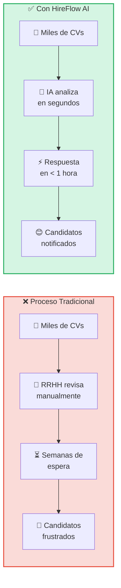
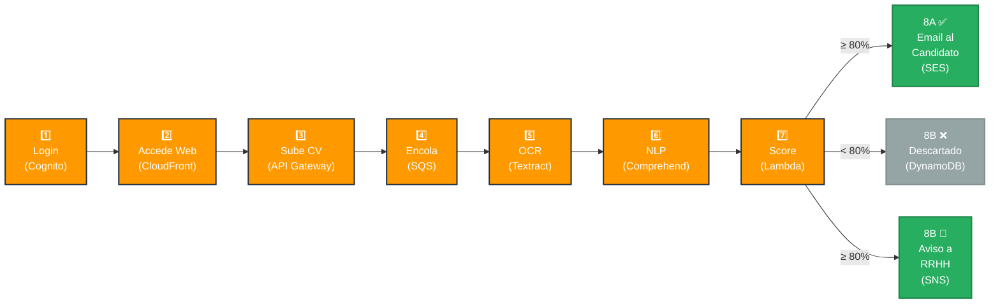
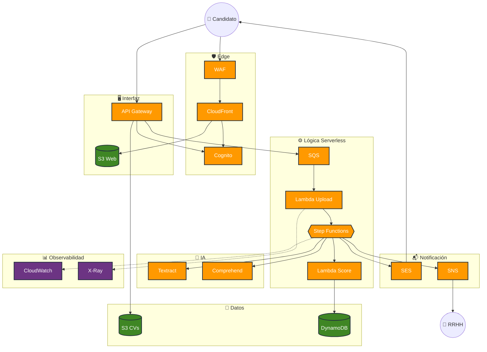
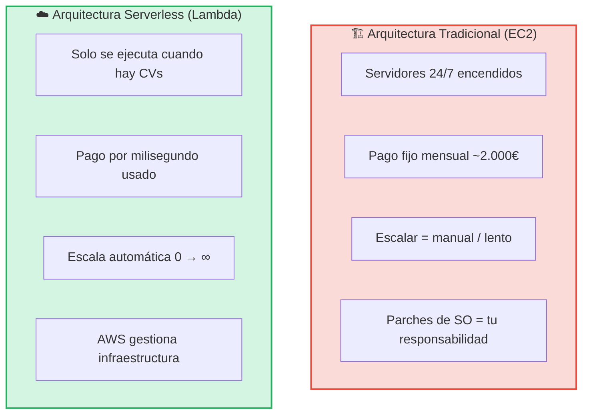
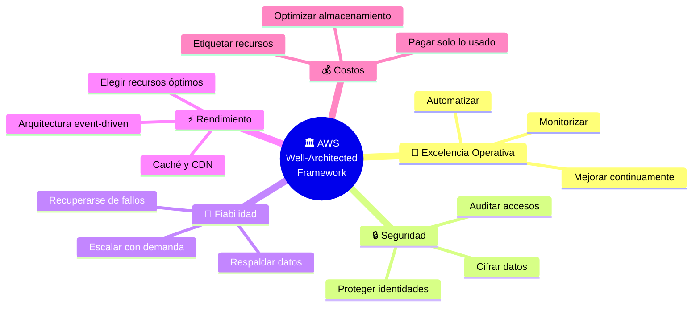
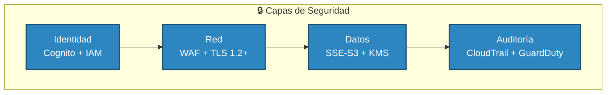
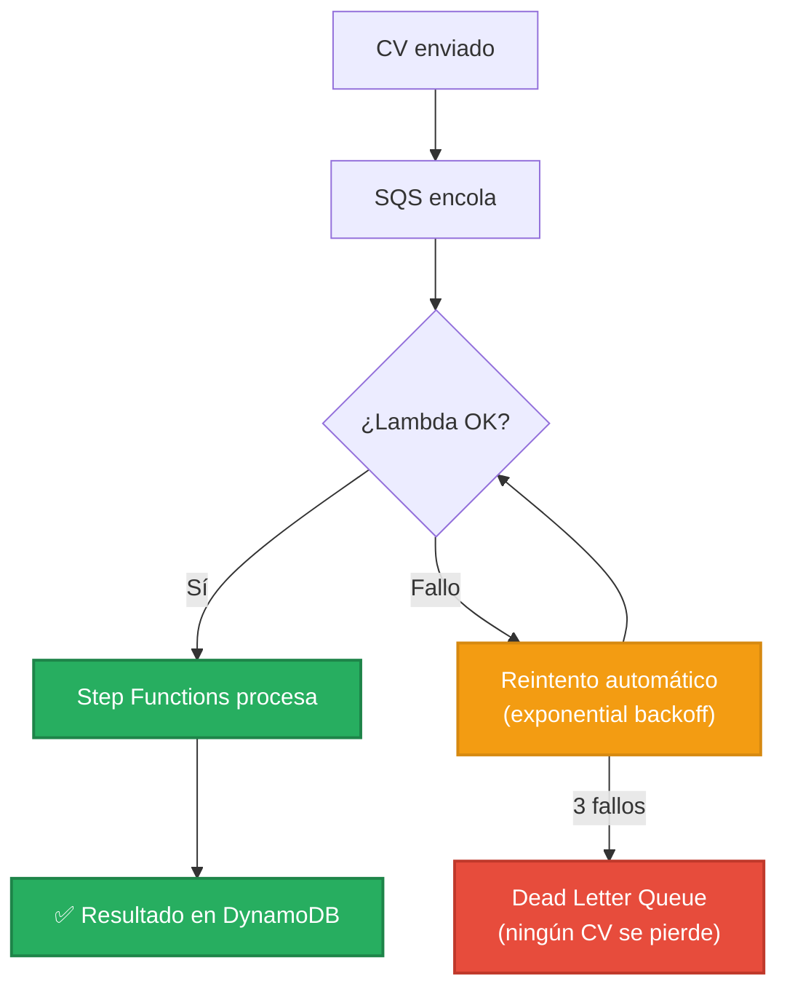
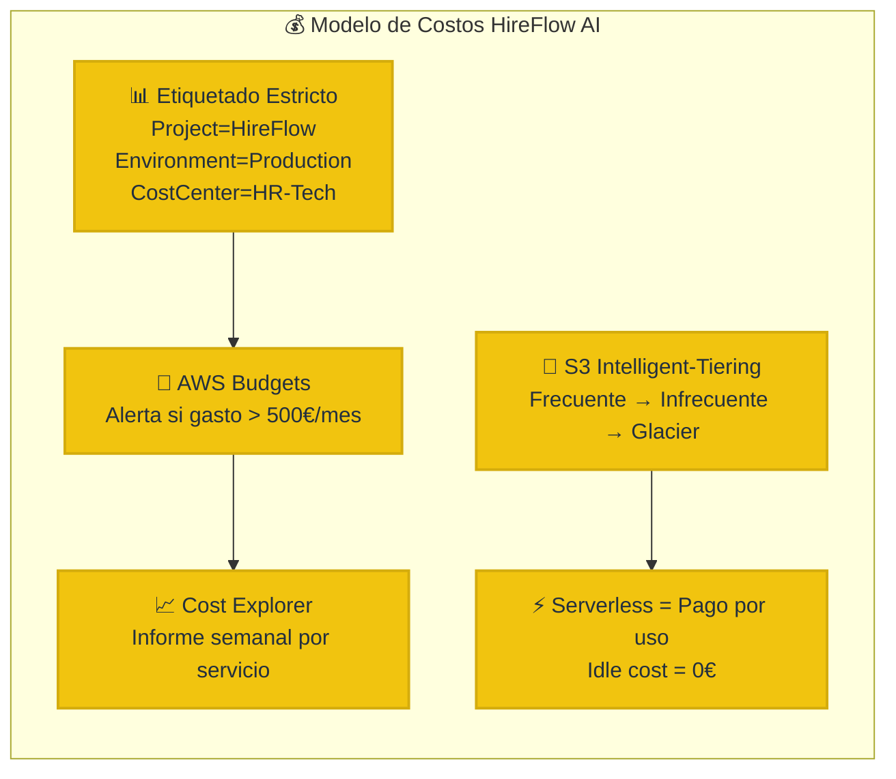
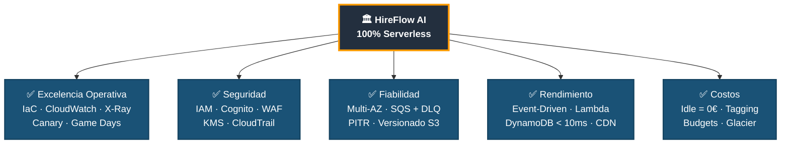

# Presentación — HireFlow AI

> **Guión de exposición · 10 diapositivas**  
> Cada sección indica: título de la diapositiva, contenido textual para mostrar, notas del ponente (lo que se dice en voz alta) y el visual/diagrama que debe acompañarla.

---

## Diapositiva 1 · Portada

**Título en pantalla:**

# HireFlow AI
### Plataforma de Contratación Automatizada con IA

**Subtítulo:**  
Arquitectura Serverless evaluada bajo el AWS Well-Architected Framework

**Pie de diapositiva:**  
Fundamentos de la Computación en la Nube · Módulo 9 — Práctica grupal

**Visual:** Fondo oscuro (#232F3E — color corporativo AWS) con el nombre del proyecto centrado en blanco y naranja (#FF9900). Logo de AWS Well-Architected a la derecha.

**Notas del ponente:**
> "Buenos días. Somos el equipo X y vamos a presentar HireFlow AI, una plataforma cloud-native que automatiza el proceso de contratación utilizando inteligencia artificial. Hemos diseñado la arquitectura íntegramente sobre AWS y la hemos evaluado contra los cinco pilares del Well-Architected Framework."

---

## Diapositiva 2 · El Problema y la Solución

**Título en pantalla:** El Problema que Resolvemos

**Contenido visual — Diagrama de contraste Antes vs. Después:**

**Bullet points en pantalla:**
- Una empresa recibe **+5 000 CVs** por oferta publicada
- Revisión manual = semanas de retraso, sesgo humano, candidatos sin respuesta
- **HireFlow AI:** IA extrae, analiza y puntúa cada CV automáticamente
- Respuesta al candidato en **< 1 hora** · RRHH solo ve talento ya filtrado

**Notas del ponente:**
> "Imaginad una empresa que publica una oferta y recibe cinco mil currículums en dos días. Con un proceso manual, RRHH tarda semanas en revisarlos, muchos candidatos nunca reciben respuesta, y el sesgo humano afecta a la selección. HireFlow AI resuelve esto: el candidato sube su CV, nuestra IA lo analiza en segundos, y si supera el 80% de idoneidad, recibe un email para agendar entrevista automáticamente. RRHH solo interactúa con talento ya filtrado."

---

## Diapositiva 3 · Flujo de Trabajo Completo

**Título en pantalla:** ¿Cómo funciona? — El Flujo en 8 Pasos

**Contenido visual — Diagrama de flujo del proceso:**

**Dato clave en pantalla:**  
> Todo el procesamiento (pasos 4-8) es **asíncrono**. El candidato recibe un "CV recibido" instantáneo.

**Notas del ponente:**
> "El flujo tiene ocho pasos. El candidato inicia sesión con Cognito, accede a la web servida por CloudFront, y sube su CV a través de API Gateway. A partir de ahí, todo es asíncrono: SQS encola la petición, Textract extrae el texto del PDF —incluso si está escaneado—, Comprehend analiza las habilidades con procesamiento de lenguaje natural, y una función Lambda calcula la puntuación. Si supera el 80%, SES envía un email con enlace para agendar entrevista y SNS notifica a RRHH. El candidato no espera: recibe confirmación instantánea."

---

## Diapositiva 4 · Diagrama de Arquitectura

**Título en pantalla:** Arquitectura Cloud — Vista Completa

**Contenido visual — Diagrama completo de la arquitectura por capas:**

**Leyenda en pantalla:**
- 🟠 Naranja = Servicios de cómputo/integración AWS
- 🟢 Verde = Almacenamiento (S3, DynamoDB)
- 🟣 Morado = Observabilidad (CloudWatch, X-Ray)

**Notas del ponente:**
> "Esta es la vista completa. La arquitectura se organiza en siete capas: edge y seguridad, interfaz, lógica serverless, inteligencia artificial, datos, notificación y observabilidad. Todo es 100% serverless: no hay ni un solo servidor EC2. Cada servicio tiene un propósito específico y están desacoplados entre sí mediante SQS y Step Functions. Fijaos en la capa morada de observabilidad: CloudWatch y X-Ray monitorizan todo el sistema de extremo a extremo."

---

## Diapositiva 5 · ¿Por qué Serverless? — Justificación Técnica

**Título en pantalla:** Decisión Arquitectónica Clave: 100% Serverless

**Contenido visual — Comparativa gráfica:**

**Dato impactante en pantalla:**

| Métrica | EC2 Tradicional | Serverless (Lambda) |
|---------|:-:|:-:|
| Coste en inactividad | ~2.000 €/mes | **0 €** |
| Tiempo de escalado | 5-10 min | **Instantáneo** |
| Parches de seguridad | Manual | **Automático** |
| CVs simultáneos máx. | Limitado por instancia | **Miles** |

**Notas del ponente:**
> "¿Por qué serverless? Porque el reclutamiento tiene picos brutales. Un lunes se publican ofertas y llegan miles de CVs; un domingo de madrugada, cero. Con EC2 pagaríamos dos mil euros al mes aunque no procesemos nada. Con Lambda, el coste de inactividad es literalmente cero. Además, escala instantáneamente y AWS se encarga de los parches de seguridad."

---

## Diapositiva 6 · Los Cinco Pilares del Well-Architected Framework

**Título en pantalla:** Evaluación: Los 5 Pilares del AWS Well-Architected Framework

**Contenido visual — Mindmap de los pilares:**

**Texto en pantalla:**  
> El framework proporciona **preguntas clave** por pilar para evaluar si una arquitectura sigue las mejores prácticas de AWS. Vamos a ver cómo HireFlow AI responde a cada uno.

**Notas del ponente:**
> "El AWS Well-Architected Framework define cinco pilares que toda arquitectura cloud debería cumplir. No es una checklist teórica: es un conjunto de preguntas prácticas que AWS te hace para validar tu diseño. Vamos a recorrer los cinco pilares y ver cómo los aplicamos en HireFlow AI."

---

## Diapositiva 7 · Pilares 1 y 2 — Excelencia Operativa y Seguridad

**Título en pantalla:** 🔧 Excelencia Operativa · 🔒 Seguridad

**Layout:** Pantalla dividida en dos columnas.

**Columna izquierda — Excelencia Operativa:**

| Estrategia | Implementación |
|---|---|
| **IaC** | SAM / CloudFormation |
| **Observabilidad** | CloudWatch + X-Ray |
| **Despliegues seguros** | Canary (10% → 100%) |
| **Simulacros** | Game Days con carga sintética |
| **Mejora continua** | Post-mortems tras incidentes |

**Columna derecha — Seguridad:**

**Dato clave:**  
> Principio de **mínimo privilegio**: cada Lambda tiene permisos exclusivos para las acciones que necesita. Cero credenciales hardcodeadas.

**Notas del ponente:**
> "Excelencia operativa: desplegamos toda la infraestructura como código con SAM, lo que nos permite recrear el entorno en minutos. Monitorizamos con CloudWatch y X-Ray, hacemos despliegues canary para validar cambios, y ejecutamos Game Days para simular picos de carga.

> En seguridad aplicamos defensa en profundidad en cuatro capas: identidad con Cognito e IAM —cada Lambda tiene permisos mínimos—, red con WAF y TLS obligatorio, datos cifrados con KMS, y auditoría total con CloudTrail y GuardDuty. No hay una sola contraseña almacenada en nuestro código."

---

## Diapositiva 8 · Pilares 3 y 4 — Fiabilidad y Rendimiento

**Título en pantalla:** 🔄 Fiabilidad · ⚡ Eficiencia del Rendimiento

**Layout:** Pantalla dividida en dos columnas.

**Columna izquierda — Fiabilidad:**

**Puntos clave Fiabilidad:**
- Servicios Multi-AZ por defecto
- S3 con versionado · DynamoDB con PITR (35 días)
- SQS + DLQ = **cero pérdida de CVs**

**Columna derecha — Rendimiento:**

| Decisión | Resultado |
|---|---|
| **Event-Driven** | Respuesta 200 OK instantánea |
| **Lambda** optimizada con Compute Optimizer | Balance velocidad/coste |
| **DynamoDB** | Latencia < 10 ms |
| **CloudFront** | Web en < 50 ms global |

**Notas del ponente:**
> "Fiabilidad: si una Lambda falla al procesar un CV, SQS lo reintenta automáticamente con backoff exponencial. Si falla tres veces, va a la Dead Letter Queue. Ningún CV se pierde jamás. Además, todos los servicios son Multi-AZ por defecto y los datos tienen backups: versionado en S3 y Point-in-Time Recovery en DynamoDB.

> En rendimiento, la clave es la arquitectura event-driven: el candidato recibe respuesta instantánea, el procesamiento de IA ocurre en segundo plano. DynamoDB responde en menos de 10 milisegundos y CloudFront sirve la web en menos de 50 milisegundos desde cualquier país."

---

## Diapositiva 9 · Pilar 5 — Optimización de Costos

**Título en pantalla:** 💰 Optimización de Costos — Pagar Solo lo que Usas

**Contenido visual — Gráfica conceptual del modelo de costos:**

**Cifras impactantes en pantalla:**

| Concepto | Valor |
|---|---|
| Coste por CV procesado | ~0,02 € (Lambda + Textract + Comprehend) |
| Coste en horas sin tráfico | **0 €** |
| Ahorro en almacenamiento tras 90 días | **Hasta 95%** (Glacier) |
| Control de gasto | Alertas automáticas con AWS Budgets |

**Notas del ponente:**
> "Quinto pilar: costos. La gran ventaja del modelo serverless es que el coste de inactividad es cero. Solo pagamos cuando un candidato sube un CV: unos dos céntimos por CV procesado. Etiquetamos todos los recursos para rastrear el gasto, configuramos alertas en AWS Budgets para evitar sorpresas, y usamos S3 Intelligent-Tiering: los CVs que llevan más de 90 días sin accederse se mueven automáticamente a Glacier, reduciendo el almacenamiento hasta un 95%. El coste de infraestructura escala linealmente con el éxito del negocio."

---

## Diapositiva 10 · Conclusión y Cierre

**Título en pantalla:** Conclusión

**Contenido visual — Resumen de pilares con check:**

**Frase de cierre en pantalla:**

> *"Un buen arquitecto cloud no solo diseña para el día 1, sino para el día 1000."*

**Texto final:**  
- Arquitectura **100% serverless** · **16 servicios AWS** · **5 pilares cumplidos**
- Revisión continua con **AWS Trusted Advisor** y **Well-Architected Tool**

**Notas del ponente:**
> "Para cerrar: HireFlow AI cumple los cinco pilares del Well-Architected Framework. No es solo una arquitectura que funciona el día 1, sino que está preparada para evolucionar. Utilizamos AWS Trusted Advisor para recibir recomendaciones automáticas y la Well-Architected Tool para revisiones trimestrales. El resultado es una plataforma segura, fiable, eficiente y que solo cuesta dinero cuando aporta valor. 

> ¿Alguna pregunta?"

---

## Resumen de Diapositivas

| # | Título | Tipo de visual |
|:-:|--------|---------------|
| 1 | Portada | Logo + título |
| 2 | El Problema y la Solución | Diagrama Antes vs. Después |
| 3 | Flujo de Trabajo en 8 Pasos | Diagrama de flujo horizontal |
| 4 | Arquitectura Cloud Completa | Diagrama de arquitectura por capas |
| 5 | ¿Por qué Serverless? | Comparativa EC2 vs. Lambda |
| 6 | Los 5 Pilares del Framework | Mindmap de pilares |
| 7 | Excelencia Operativa + Seguridad | Tabla + diagrama de capas de seguridad |
| 8 | Fiabilidad + Rendimiento | Diagrama de reintentos + tabla de métricas |
| 9 | Optimización de Costos | Diagrama de modelo de costos + cifras |
| 10 | Conclusión y Cierre | Diagrama resumen de 5 pilares + frase |

---

> **Tiempo estimado:** 10-12 minutos de exposición (1-1,5 min/diapositiva) + 3 min de preguntas.
