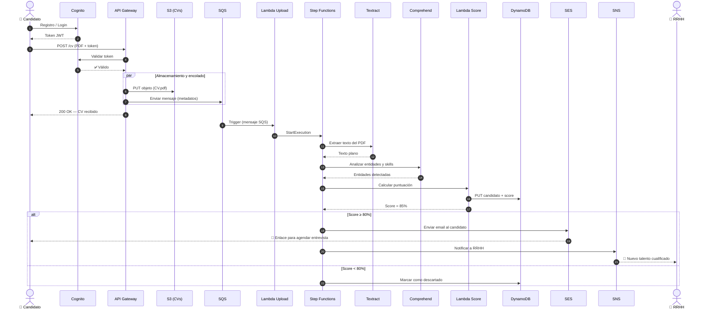
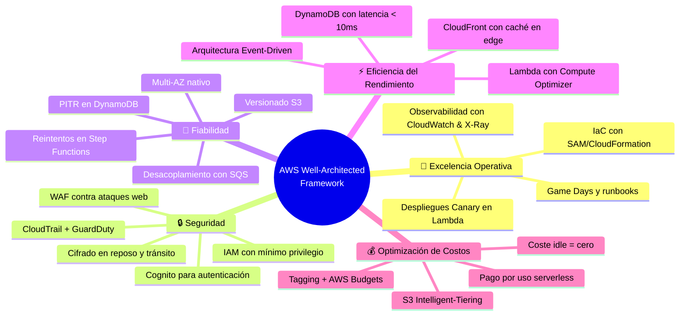
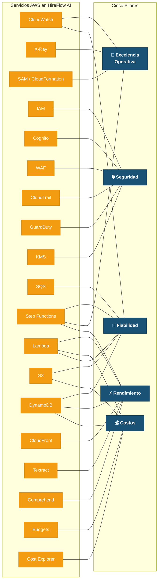

# HireFlow AI — Plataforma de Contratación Automatizada

> **Asignatura:** Fundamentos de la Computación en la Nube · Módulo 9  
> **Marco de referencia:** AWS Well-Architected Framework — Los Cinco Pilares  
> **Tipo:** Práctica grupal — Diseño y evaluación de arquitectura cloud

---

## Índice

1. [Resumen Ejecutivo](#1-resumen-ejecutivo)
2. [Descripción del Flujo de Trabajo](#2-descripción-del-flujo-de-trabajo)
3. [Diagrama de Arquitectura](#3-diagrama-de-arquitectura)
4. [Diagrama del Flujo de Procesamiento (Secuencia)](#4-diagrama-del-flujo-de-procesamiento-secuencia)
5. [Justificación de los Servicios Seleccionados](#5-justificación-de-los-servicios-seleccionados)
6. [Principios de Diseño en la Nube Aplicados](#6-principios-de-diseño-en-la-nube-aplicados)
7. [Evaluación por los Cinco Pilares del AWS Well-Architected Framework](#7-evaluación-por-los-cinco-pilares-del-aws-well-architected-framework)
   - 7.1 [Pilar 1 — Excelencia Operativa](#71-pilar-1--excelencia-operativa)
   - 7.2 [Pilar 2 — Seguridad](#72-pilar-2--seguridad)
   - 7.3 [Pilar 3 — Fiabilidad](#73-pilar-3--fiabilidad)
   - 7.4 [Pilar 4 — Eficiencia del Rendimiento](#74-pilar-4--eficiencia-del-rendimiento)
   - 7.5 [Pilar 5 — Optimización de Costos](#75-pilar-5--optimización-de-costos)
8. [Mapa de Relación entre Pilares y Servicios](#8-mapa-de-relación-entre-pilares-y-servicios)
9. [AWS Trusted Advisor y Well-Architected Tool](#9-aws-trusted-advisor-y-well-architected-tool)
10. [Conclusión](#10-conclusión)

---

## 1. Resumen Ejecutivo

**HireFlow AI** es una plataforma serverless de contratación automatizada construida íntegramente sobre AWS. Su propósito es resolver un problema real: las empresas reciben miles de currículums (CVs) por cada oferta publicada y carecen de capacidad para procesarlos manualmente con rapidez y objetividad.

La solución aplica inteligencia artificial (OCR + NLP) para extraer, analizar y puntuar CVs de forma automática, notificando tanto al candidato apto como al equipo de Recursos Humanos. La arquitectura ha sido diseñada y evaluada conforme a los **cinco pilares del AWS Well-Architected Framework**, garantizando excelencia operativa, seguridad, fiabilidad, rendimiento y optimización de costos.

---

## 2. Descripción del Flujo de Trabajo

El ciclo completo de procesamiento de un candidato sigue estos pasos:

| Paso | Acción | Servicio AWS clave |
|:----:|--------|-------------------|
| **1** | El candidato se registra/inicia sesión en la plataforma | Amazon Cognito |
| **2** | Accede a la interfaz web servida mediante CDN | CloudFront + S3 |
| **3** | Sube su CV en formato PDF a través de la API | API Gateway + S3 |
| **4** | La petición se encola para procesamiento asíncrono | Amazon SQS |
| **5** | Se extrae el texto del PDF (incluidos escaneados) | Amazon Textract |
| **6** | Se analizan habilidades y entidades del texto extraído | Amazon Comprehend |
| **7** | Se calcula una puntuación de idoneidad contra el puesto | AWS Lambda |
| **8a** | Si la puntuación ≥ 80 %: se envía email al candidato con enlace para agendar entrevista | Amazon SES |
| **8b** | Se notifica al equipo de RRHH del nuevo talento cualificado | Amazon SNS |

> **Principio clave:** Todo el procesamiento (pasos 4-8) es **asíncrono y desacoplado**. El candidato recibe confirmación inmediata de subida sin esperar a que la IA termine su análisis.

---

## 3. Diagrama de Arquitectura

```mermaid
graph TD
    %% ── Actores ──
    Candidato((👤 Candidato))
    RRHH((👔 Recursos Humanos))

    %% ── Capa Perimetral y de Entrega ──
    subgraph EDGE ["🛡️ Capa Perimetral · Edge"]
        WAF[AWS WAF<br/>Firewall de Aplicación]
        CloudFront[Amazon CloudFront<br/>CDN Global]
        Cognito[Amazon Cognito<br/>Autenticación & Autorización]
    end

    %% ── Capa de Interfaz ──
    subgraph INTERFACE ["🖥️ Capa de Interfaz"]
        S3Web[(Amazon S3<br/>Hosting Web SPA)]
        APIGW[Amazon API Gateway<br/>REST Endpoints]
    end

    %% ── Capa de Lógica y Orquestación ──
    subgraph LOGIC ["⚙️ Capa Lógica · Serverless"]
        SQS[Amazon SQS<br/>Cola de Subidas]
        StepFunctions{{AWS Step Functions<br/>Orquestador de Flujo HR}}
        LambdaUpload[AWS Lambda<br/>Subida & Validación]
        LambdaScore[AWS Lambda<br/>Evaluación de Perfil]
    end

    %% ── Capa de Inteligencia Artificial ──
    subgraph AI ["🧠 Capa de IA"]
        Textract[Amazon Textract<br/>OCR · Extracción de Texto]
        Comprehend[Amazon Comprehend<br/>NLP · Análisis de Entidades]
    end

    %% ── Capa de Datos ──
    subgraph DATA ["💾 Capa de Datos"]
        S3CVs[(Amazon S3<br/>Almacén de CVs)]
        DynamoDB[(Amazon DynamoDB<br/>Perfiles & Puntuaciones)]
    end

    %% ── Capa de Notificación ──
    subgraph NOTIFY ["📬 Capa de Notificación"]
        SNS[Amazon SNS<br/>Notificaciones a RRHH]
        SES[Amazon SES<br/>Emails a Candidatos]
    end

    %% ── Capa de Observabilidad ──
    subgraph OBS ["📊 Capa de Observabilidad"]
        CW[Amazon CloudWatch<br/>Métricas & Alarmas]
        XRay[AWS X-Ray<br/>Trazabilidad Distribuida]
        CloudTrail[AWS CloudTrail<br/>Auditoría de Accesos]
    end

    %% ════════════════════════════════════════
    %% ── Flujo Principal ──
    %% ════════════════════════════════════════
    Candidato -->|1 · Registro / Login| Cognito
    Candidato -->|2 · Accede a la Web| WAF
    WAF --> CloudFront --> S3Web
    Candidato -->|3 · Sube CV vía API| APIGW

    APIGW -->|4 · Valida token JWT| Cognito
    APIGW -->|5 · Encola metadatos| SQS
    APIGW -->|Almacena PDF crudo| S3CVs

    SQS -->|6 · Trigger| LambdaUpload
    LambdaUpload -->|7 · Inicia flujo| StepFunctions

    StepFunctions -->|Paso 1 · Extraer texto| Textract
    Textract -.->|Texto plano| StepFunctions

    StepFunctions -->|Paso 2 · Analizar habilidades| Comprehend
    Comprehend -.->|Entidades & Skills| StepFunctions

    StepFunctions -->|Paso 3 · Calcular Score| LambdaScore
    LambdaScore -->|Persistir resultados| DynamoDB

    StepFunctions -->|Paso 4A · Score ≥ 80%| SES
    SES -->|📧 Enlace entrevista| Candidato

    StepFunctions -->|Paso 4B · Notificar RRHH| SNS
    SNS -->|🔔 Nuevo talento| RRHH

    %% ── Observabilidad transversal ──
    APIGW -.-> CW
    LambdaUpload -.-> XRay
    LambdaScore -.-> XRay
    StepFunctions -.-> CW
    APIGW -.-> CloudTrail

    %% ── Estilos ──
    classDef aws fill:#FF9900,stroke:#232F3E,stroke-width:2px,color:#fff;
    classDef storage fill:#3F8624,stroke:#232F3E,stroke-width:2px,color:#fff;
    classDef obs fill:#6C3483,stroke:#232F3E,stroke-width:2px,color:#fff;
    classDef actor fill:#2C3E50,stroke:#1A252F,stroke-width:2px,color:#fff;

    class WAF,CloudFront,APIGW,Cognito,LambdaUpload,LambdaScore,StepFunctions,SQS,SNS,SES,Textract,Comprehend aws;
    class S3Web,S3CVs,DynamoDB storage;
    class CW,XRay,CloudTrail obs;
    class Candidato,RRHH actor;
```

---

## 4. Diagrama del Flujo de Procesamiento (Secuencia)

El siguiente diagrama muestra la interacción temporal entre componentes desde la perspectiva de un CV individual:

---

## 5. Justificación de los Servicios Seleccionados

La arquitectura es **100 % Serverless (Sin Servidor)**. Esta decisión responde a una realidad del negocio: el reclutamiento tiene **picos de demanda impredecibles** (miles de CVs al publicar una oferta un lunes por la mañana, prácticamente cero tráfico de madrugada). Mantener servidores encendidos 24/7 supondría un desperdicio directo de recursos.

| Servicio | Función en HireFlow AI | Razón de elección |
|----------|----------------------|-------------------|
| **Amazon S3** | Hosting del SPA (bucket público) + almacén de CVs (bucket privado) | Durabilidad 99,999999999 % (11 nueves), coste por GB mínimo, integración nativa con CloudFront |
| **Amazon CloudFront** | CDN para entregar la web globalmente con baja latencia | Caché en edge locations, reduce carga sobre S3 y mejora experiencia de usuario |
| **AWS WAF** | Firewall de capa 7 delante de CloudFront y API Gateway | Protección contra SQLi, XSS, bots y ataques DDoS de capa de aplicación |
| **Amazon Cognito** | Registro, login y gestión de tokens JWT | Evita gestionar bases de datos de contraseñas; cumple estándares OAuth 2.0 / OpenID Connect |
| **Amazon API Gateway** | Punto de entrada REST para subida de CVs | Throttling integrado, validación de esquema, autenticación por Cognito Authorizer |
| **Amazon SQS** | Cola de mensajes que desacopla la ingesta del procesamiento | Actúa de *buffer*: si llegan 10 000 CVs simultáneos, SQS los retiene sin perder ninguno |
| **AWS Step Functions** | Orquestación visual del flujo multi-paso (OCR → NLP → Score → Notificación) | Gestión automática de reintentos, timeouts y bifurcaciones condicionales |
| **Amazon Textract** | Extracción de texto de PDFs (incluidos escaneados vía OCR) | Servicio gestionado de IA, sin necesidad de entrenar modelos propios |
| **Amazon Comprehend** | Detección de entidades, habilidades clave y sentimiento | NLP pre-entrenado que identifica "Java", "5 años de experiencia", etc. |
| **AWS Lambda** | Lógica de validación de subida y cálculo de puntuación | Pago por milisegundo de ejecución; escala automáticamente a cero en inactividad |
| **Amazon DynamoDB** | Almacén de perfiles, puntuaciones y estado de candidatos | NoSQL, latencia < 10 ms a cualquier escala, esquema flexible (JSON) |
| **Amazon SES** | Envío de emails transaccionales al candidato (enlace de entrevista) | Alto volumen de envío, reputación de IP gestionada por AWS |
| **Amazon SNS** | Notificaciones push/email al equipo de RRHH | Fan-out: un solo evento puede notificar múltiples canales (email, SMS, webhook) |
| **Amazon CloudWatch** | Métricas, logs y alarmas de todos los servicios | Panel unificado: longitud de cola SQS, errores Lambda, ejecuciones Step Functions |
| **AWS X-Ray** | Trazabilidad distribuida de cada petición extremo a extremo | Permite medir latencia por segmento (API → Lambda → Textract → DynamoDB) |
| **AWS CloudTrail** | Registro inmutable de todas las llamadas API de la cuenta | Auditoría de seguridad y cumplimiento normativo |

---

## 6. Principios de Diseño en la Nube Aplicados

El AWS Well-Architected Framework establece una serie de **principios generales de diseño** que guían cualquier arquitectura cloud. A continuación, se muestra cómo HireFlow AI aplica cada uno:

| Principio de diseño | Aplicación en HireFlow AI |
|---------------------|---------------------------|
| **Dejar de adivinar las necesidades de capacidad** | No se aprovisionan servidores EC2 fijos. Lambda, SQS y DynamoDB escalan automáticamente según la demanda real. Si un lunes llegan 10 000 CVs y un domingo llegan 5, se paga únicamente por lo consumido. |
| **Probar los sistemas a escala de producción** | Se realizan *Game Days* inyectando miles de peticiones a API Gateway para validar que SQS amortigua correctamente y Lambda no alcanza límites de concurrencia. |
| **Automatizar para facilitar la experimentación arquitectónica** | Toda la infraestructura se define como código (IaC) con **AWS SAM / CloudFormation**. Un `sam deploy` recrea el entorno completo en minutos, permitiendo probar cambios sin riesgo. |
| **Permitir arquitecturas evolutivas** | Los servicios están desacoplados mediante SQS y Step Functions. Si mañana se sustituye Comprehend por un modelo personalizado en SageMaker, solo se modifica un paso del flujo sin afectar al resto. |
| **Construir basándose en datos** | CloudWatch y X-Ray recopilan métricas continuas. Las decisiones (ej. ajustar memoria de Lambda, cambiar umbral de Score) se toman con datos reales, no suposiciones. |
| **Mejorar a través de días de juego (*Game Days*)** | Se simulan escenarios de fallo: ¿qué pasa si Textract responde con error? Step Functions reintenta automáticamente. ¿Qué pasa si SQS se llena? Se activan alarmas de CloudWatch antes de alcanzar el límite. |

---

## 7. Evaluación por los Cinco Pilares del AWS Well-Architected Framework

A continuación se evalúa la arquitectura de HireFlow AI frente a las **preguntas clave** de cada pilar del marco, comparando la solución implementada frente a los desafíos de una arquitectura tradicional.

---

### 7.1 Pilar 1 — Excelencia Operativa

> **Objetivo:** Ejecutar y monitorizar sistemas para entregar valor empresarial, y mejorar continuamente los procesos y procedimientos de soporte.

**Principios de diseño del pilar:**
- Realizar operaciones como código
- Hacer cambios frecuentes, pequeños y reversibles
- Refinar los procedimientos operativos frecuentemente
- Anticipar los fallos
- Aprender de todos los fallos operativos

| Pregunta clave (Well-Architected) | Aplicación en HireFlow AI |
|---|---|
| **OPS 1 — ¿Cómo determina cuáles son sus prioridades?** | Se definen KPIs operativos claros: *tiempo medio de procesamiento de un CV* (< 30 s), *tasa de éxito de Step Functions* (> 99,5 %), y *longitud media de la cola SQS* (< 100 mensajes en espera). Estas métricas se alinean con el objetivo de negocio de responder al candidato en menos de 1 hora. |
| **OPS 4 — ¿Cómo diseña la carga de trabajo para comprender su estado?** | **Amazon CloudWatch** recopila métricas personalizadas: profundidad de la cola SQS, tasa de éxito/fallo de ejecuciones de Step Functions, duración de cada Lambda y errores de Textract. **AWS X-Ray** proporciona trazabilidad distribuida para rastrear el recorrido completo de un CV desde API Gateway hasta la escritura en DynamoDB, identificando cuellos de botella con precisión de milisegundos. |
| **OPS 6 — ¿Cómo mitiga los riesgos de implementación?** | Toda la infraestructura se despliega mediante **Infrastructure as Code (IaC)** con AWS SAM / CloudFormation. Las actualizaciones de funciones Lambda utilizan despliegues **Canary**: se envía un 10 % del tráfico a la nueva versión y se valida que la extracción OCR de Textract funciona correctamente mediante alarmas de CloudWatch antes de promover al 100 %. Si la alarma se dispara, se ejecuta un *rollback* automático. |
| **OPS 7 — ¿Cómo sabe que está preparado para admitir la carga?** | Se realizan **Game Days** (simulacros de carga) inyectando miles de peticiones sintéticas a API Gateway. Se verifica que SQS amortigua el tráfico correctamente, que Lambda no supera los límites de concurrencia reservados, y que Step Functions completa los flujos sin timeouts. Se documentan *runbooks* para cada escenario de fallo identificado. |
| **OPS 8 — ¿Cómo evoluciona la operación de la carga de trabajo?** | Tras cada incidente o Game Day, se realizan revisiones post-mortem (*post-incident reviews*). Los hallazgos se traducen en mejoras del template SAM, ajustes de alarmas o refinamiento de los umbrales de puntuación. La mejora continua es un proceso formal, no reactivo. |

---

### 7.2 Pilar 2 — Seguridad

> **Objetivo:** Proteger la información, los sistemas y los activos, a la vez que se entrega valor empresarial a través de evaluaciones de riesgo y estrategias de mitigación.

**Principios de diseño del pilar:**
- Implementar una base de identidad sólida
- Habilitar la trazabilidad
- Aplicar seguridad en todas las capas
- Automatizar las mejores prácticas de seguridad
- Proteger los datos en tránsito y en reposo
- Mantener a las personas alejadas de los datos
- Prepararse para eventos de seguridad

| Pregunta clave (Well-Architected) | Aplicación en HireFlow AI |
|---|---|
| **SEC 1 — ¿Cómo opera la carga de trabajo de forma segura?** | Se aplica el **principio de mínimo privilegio** estricto mediante **AWS IAM**. Cada función Lambda tiene un rol dedicado: la Lambda de *Upload* solo posee `s3:PutObject` sobre el bucket de CVs; la Lambda de *Score* solo tiene `s3:GetObject` + `dynamodb:PutItem`. Las credenciales de usuario se delegan completamente a **Amazon Cognito** (OAuth 2.0 / OpenID Connect), eliminando el almacenamiento de contraseñas en la aplicación. |
| **SEC 2 — ¿Cómo gestiona las identidades de personas y máquinas?** | Los **candidatos** se autentican mediante Cognito User Pools con MFA opcional. Los **servicios internos** (Lambda, Step Functions) asumen roles IAM con políticas de sesión temporales (STS). No existen credenciales de larga duración (*access keys*) hardcodeadas en ningún punto del sistema. |
| **SEC 4 — ¿Cómo detecta e investiga eventos de seguridad?** | **AWS CloudTrail** registra de forma inmutable toda llamada API de la cuenta. **Amazon GuardDuty** monitoriza continuamente la cuenta en busca de comportamientos anómalos: intentos de acceso desde IPs comprometidas, llamadas API inusuales, o exfiltración de datos desde S3. Las alertas se canalizan a SNS para notificación inmediata al equipo de operaciones. |
| **SEC 5 — ¿Cómo protege los datos en reposo?** | Los CVs almacenados en S3 se cifran con **SSE-S3** (cifrado del lado del servidor). La tabla DynamoDB utiliza **cifrado en reposo con AWS KMS**. Las claves de cifrado se gestionan centralmente y se rotan automáticamente cada 365 días. |
| **SEC 6 — ¿Cómo protege los datos en tránsito?** | Toda comunicación se realiza sobre **TLS 1.2+**. CloudFront fuerza HTTPS. API Gateway rechaza conexiones no cifradas. Las llamadas internas entre Lambda y servicios AWS viajan por la red interna de AWS con cifrado TLS. |
| **SEC 7 — ¿Cómo protege los recursos de cómputo?** | Al ser arquitectura Serverless, AWS gestiona la seguridad del sistema operativo y el hardware subyacente. La capa de aplicación se protege con **AWS WAF** delante de CloudFront y API Gateway, bloqueando inyecciones SQL (SQLi), Cross-Site Scripting (XSS) y ataques DDoS de capa 7. Se aplican reglas gestionadas de AWS + reglas personalizadas para limitar la tasa de peticiones por IP. |

---

### 7.3 Pilar 3 — Fiabilidad

> **Objetivo:** Asegurar que una carga de trabajo realice su función prevista correctamente y de manera consistente cuando se espera que lo haga. Incluye la capacidad de operar y probar la carga de trabajo a lo largo de su ciclo de vida total.

**Principios de diseño del pilar:**
- Recuperarse automáticamente ante fallos
- Probar los procedimientos de recuperación
- Escalar horizontalmente para incrementar la disponibilidad agregada
- Dejar de adivinar la capacidad
- Gestionar los cambios con automatización

| Pregunta clave (Well-Architected) | Aplicación en HireFlow AI |
|---|---|
| **REL 2 — ¿Cómo planifica la topología de red?** | Al utilizar exclusivamente servicios gestionados (S3, DynamoDB, SQS, API Gateway, Lambda), la topología es **inherentemente Multi-AZ** por defecto. AWS replica los datos y distribuye el cómputo en múltiples Zonas de Disponibilidad automáticamente. No hay necesidad de gestionar subredes, balanceadores de carga ni grupos de Auto Scaling. |
| **REL 5 — ¿Cómo diseña las interacciones en un sistema distribuido para prevenir fallos?** | El sistema está **desacoplado mediante SQS**. Si la Lambda de procesamiento falla, el mensaje permanece en la cola y se reintenta automáticamente (con *exponential backoff*). Step Functions gestiona reintentos con políticas configurables por paso. Se configura una **Dead Letter Queue (DLQ)** en SQS para capturar mensajes que fallen tras el máximo de reintentos, evitando pérdida silenciosa de CVs. |
| **REL 7 — ¿Cómo diseña la carga de trabajo para adaptarse a cambios en la demanda?** | Si llegan 5 000 CVs simultáneamente, API Gateway los acepta y SQS los encola. Lambda escala concurrentemente (hasta el límite configurado) para consumir mensajes a su propio ritmo. Si Textract se ralentiza, SQS retiene los mensajes sin perder ninguno. DynamoDB en modo *On-Demand* ajusta su capacidad de lectura/escritura automáticamente. **Ningún CV se pierde, ningún componente se satura.** |
| **REL 9 — ¿Cómo respalda los datos?** | Los CVs en S3 tienen **Versionado** activado para prevenir borrados accidentales o sobrescrituras. DynamoDB cuenta con **PITR (Point-in-Time Recovery)**, permitiendo restaurar la tabla de candidatos a cualquier segundo dentro de los últimos 35 días. Los templates de CloudFormation se almacenan en un repositorio Git versionado como respaldo adicional de la infraestructura. |
| **REL 10 — ¿Cómo utiliza el aislamiento de fallos para proteger la carga de trabajo?** | Cada paso del flujo de Step Functions es independiente. Si Comprehend falla en el paso de análisis NLP, el error se aísla y Step Functions ejecuta la lógica de reintento o la rama de error sin afectar a otros CVs que están siendo procesados en paralelo. La DLQ actúa como última línea de contención. |

---

### 7.4 Pilar 4 — Eficiencia del Rendimiento

> **Objetivo:** Utilizar los recursos de TI y de cómputo de manera eficiente para cumplir con los requisitos del sistema, y mantener dicha eficiencia a medida que cambia la demanda y evolucionan las tecnologías.

**Principios de diseño del pilar:**
- Democratizar las tecnologías avanzadas
- Ser global en minutos
- Usar arquitecturas serverless
- Experimentar con mayor frecuencia
- Tener empatía mecánica (*mechanical sympathy*)

| Pregunta clave (Well-Architected) | Aplicación en HireFlow AI |
|---|---|
| **PERF 1 — ¿Cómo selecciona la arquitectura con mejor rendimiento?** | Se eligió una **Arquitectura Basada en Eventos (Event-Driven)**. Analizar un CV con IA tarda varios segundos. En lugar de bloquear al candidato en una pantalla de carga, la arquitectura asíncrona (API → SQS → Lambda → Step Functions) devuelve un `200 OK` inmediato, procesando el archivo en segundo plano. Esto maximiza el throughput percibido por el usuario. |
| **PERF 2 — ¿Cómo selecciona la solución de cómputo?** | Se descarta EC2 porque el procesamiento es por **ráfagas** (*bursty*). Se selecciona **AWS Lambda** con configuración de memoria optimizada mediante **AWS Compute Optimizer**, que analiza métricas históricas y recomienda el balance exacto entre velocidad de ejecución y costo. Para la función de Score (CPU-intensiva), se asignan 1024 MB; para Upload (I/O-bound), 512 MB. |
| **PERF 3 — ¿Cómo selecciona la solución de almacenamiento?** | Se utilizan dos tipos de almacenamiento según el patrón de acceso: **S3** para objetos binarios (CVs en PDF), optimizado para escrituras masivas y lecturas infrecuentes; y **DynamoDB** para datos estructurados (perfiles y puntuaciones), optimizado para lecturas de alta frecuencia con latencia predecible. |
| **PERF 4 — ¿Cómo selecciona la solución de base de datos?** | Los esquemas de evaluación cambian por oferta. **DynamoDB** (NoSQL) permite documentos JSON flexibles con **latencia de un solo dígito de milisegundo** a cualquier escala. Las consultas de perfil se resuelven por clave primaria (candidato_id + oferta_id) sin necesidad de JOINs complejos. |
| **PERF 5 — ¿Cómo configura la solución de red?** | **CloudFront** con edge locations globales reduce la latencia de carga de la web a < 50 ms desde cualquier país. API Gateway con caché habilitada evita invocaciones Lambda redundantes para peticiones repetidas (ej. consultas de estado). |

---

### 7.5 Pilar 5 — Optimización de Costos

> **Objetivo:** Evitar costos innecesarios o subóptimos. Comprender y controlar dónde se gasta el dinero, seleccionar el número y tipo de recursos más adecuados, y escalar para satisfacer las necesidades empresariales sin gastar de más.

**Principios de diseño del pilar:**
- Implementar la gestión financiera en la nube
- Adoptar un modelo de consumo
- Medir la eficiencia general
- Dejar de gastar dinero en tareas pesadas indiferenciadas
- Analizar y atribuir el gasto

| Pregunta clave (Well-Architected) | Aplicación en HireFlow AI |
|---|---|
| **COST 1 — ¿Cómo implementa la gestión financiera en la nube?** | Se designa un responsable de FinOps dentro del equipo. Se revisa mensualmente el informe de **AWS Cost Explorer** para identificar tendencias de gasto por servicio. Se establecen reuniones trimestrales de revisión de costos alineadas con los ciclos de contratación del negocio. |
| **COST 2 — ¿Cómo controla el uso?** | Se implementa un esquema estricto de **Etiquetado (Tagging)**: `Environment=Production`, `Project=HireFlow`, `Team=Engineering`, `CostCenter=HR-Tech`. Se configuran alertas en **AWS Budgets** para notificar al equipo si el gasto proyectado a fin de mes supera el umbral (ej. 500 €), evitando sorpresas por picos inesperados de llamadas a Textract. |
| **COST 3 — ¿Cómo monitoriza el uso y el costo?** | **AWS Cost Explorer** con granularidad diaria permite ver el desglose: cuánto cuesta Lambda vs. Textract vs. DynamoDB. Se crean informes automáticos semanales enviados por SNS al responsable de FinOps. Si un servicio aumenta su costo > 20 % respecto a la semana anterior, se dispara una alerta. |
| **COST 6 — ¿Cómo selecciona el recurso en función del tipo, tamaño y cantidad?** | Gracias al modelo **Serverless**, el **costo de inactividad es literalmente cero**. Se paga por milisegundo de ejecución Lambda, por llamada a Textract/Comprehend, y por unidad de lectura/escritura en DynamoDB. El costo de infraestructura es **directamente proporcional** al volumen de candidatos procesados, alineando gasto con valor de negocio. |
| **COST 7 — ¿Cómo utiliza modelos de precios para reducir costos?** | Se aplica **S3 Intelligent-Tiering** para los CVs: los documentos recién subidos residen en la capa de acceso frecuente. Tras 30 días (cuando el proceso de selección concluye), S3 los mueve automáticamente a la capa de acceso infrecuente y, pasados 90 días, a **Glacier**, reduciendo el costo de almacenamiento hasta un 95 % sin intervención manual. Para DynamoDB, el modo **On-Demand** se utiliza en los primeros meses; al estabilizarse el patrón, se evalúa migrar a **Provisioned Capacity con Reserved** para reducir hasta un 75 % en lecturas/escrituras. |

---

## 8. Mapa de Relación entre Pilares y Servicios

El siguiente diagrama muestra qué servicio AWS contribuye a qué pilar del framework, evidenciando que muchos servicios satisfacen múltiples pilares simultáneamente:

---

## 9. AWS Trusted Advisor y Well-Architected Tool

Más allá del diseño, AWS proporciona **herramientas de revisión continua** que HireFlow AI utiliza para mantener la calidad de la arquitectura a lo largo del tiempo:

### 9.1 AWS Trusted Advisor

Servicio que inspecciona automáticamente la cuenta y emite recomendaciones en **cinco categorías** alineadas con los pilares:

| Categoría Trusted Advisor | Ejemplo de recomendación para HireFlow AI |
|---|---|
| **Optimización de costos** | Detectar si las funciones Lambda tienen más memoria asignada de la necesaria, o si el modo On-Demand de DynamoDB es más caro que Provisioned dada la estabilización del tráfico. |
| **Rendimiento** | Alertar si CloudFront no tiene caché habilitada, o si API Gateway no aprovecha la compresión de respuestas. |
| **Seguridad** | Avisar si un bucket S3 tiene permisos públicos accidentalmente, o si los roles IAM tienen políticas demasiado permisivas (`*` en Resource). |
| **Tolerancia a fallos** | Verificar que DynamoDB tiene PITR activado y que S3 tiene versionado habilitado. |
| **Límites de servicio** | Alertar cuando la concurrencia reservada de Lambda se acerca al límite de la cuenta (1 000 por defecto por región). |

### 9.2 AWS Well-Architected Tool

Herramienta interactiva de la consola de AWS que guía al equipo a través de las **preguntas formales** de cada pilar. Para HireFlow AI:

1. Se crea un **workload** llamado "HireFlow AI - Production" en la herramienta.
2. Se responde a cada pregunta de los 5 pilares documentando las decisiones (las mismas reflejadas en la sección 7 de este documento).
3. La herramienta genera un **informe de riesgos** con clasificación de Alto / Medio / Bajo.
4. Los riesgos altos se traducen en tareas del backlog de ingeniería y se priorizan en el siguiente sprint.
5. Se repite la revisión **trimestralmente** para capturar deuda técnica y evolucionar la arquitectura.

---

## 10. Conclusión

La arquitectura de **HireFlow AI** demuestra que es posible construir una plataforma de contratación inteligente, escalable y económica utilizando exclusivamente servicios gestionados de AWS bajo un modelo 100 % serverless.

La evaluación sistemática contra los **cinco pilares del AWS Well-Architected Framework** garantiza que:

- **Excelencia Operativa:** El sistema se monitoriza, despliega y mejora continuamente con IaC, observabilidad y simulacros de carga.
- **Seguridad:** Los datos de los candidatos están protegidos en todas las capas — identidad (Cognito + IAM), red (WAF + TLS), almacenamiento (KMS + SSE) y auditoría (CloudTrail + GuardDuty).
- **Fiabilidad:** La arquitectura desacoplada (SQS + Step Functions) con reintentos automáticos, DLQ y respaldos PITR asegura que ningún CV se pierda, incluso ante picos de 10 000 subidas simultáneas.
- **Eficiencia del Rendimiento:** La combinación event-driven + serverless + CDN ofrece una experiencia ágil al candidato (respuesta inmediata) y un procesamiento backend optimizado con Compute Optimizer.
- **Optimización de Costos:** El coste de inactividad es cero, el etiquetado y Budgets previenen sorpresas, y las políticas de ciclo de vida (S3 Intelligent-Tiering → Glacier) reducen el almacenamiento hasta un 95 %.

> *"Un buen arquitecto cloud no solo diseña para el día 1, sino para el día 1000."*  
> — Principio del AWS Well-Architected Framework