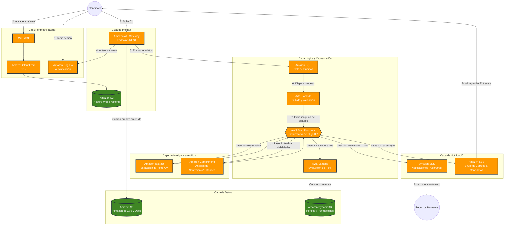

# Proyecto: HireFlow AI - Plataforma de Contratación Automatizada

## 1. Descripción del Flujo de Trabajo
HireFlow AI resuelve el problema de las empresas que reciben miles de currículums (CVs) para una sola oferta de trabajo. El flujo es el siguiente:
1. El candidato inicia sesión y sube su CV en PDF.
2. El sistema lo recibe, extrae el texto automáticamente mediante IA (OCR y procesamiento de lenguaje natural).
3. Evalúa las habilidades del candidato contra los requisitos del puesto.
4. Si la puntuación supera un umbral (ej. 80%), el sistema avisa a Recursos Humanos y envía un email automático al candidato con un enlace (Calendly/Booking) para agendar una entrevista.

## 2. Diagrama de Arquitectura

## 3. Justificación de los Servicios Seleccionados

He diseñado esta arquitectura puramente **Serverless (Sin Servidor)**. ¿Por qué? Porque el reclutamiento tiene picos masivos (ej. cuando se publica una oferta el lunes por la mañana hay miles de CVs, pero el domingo de madrugada no hay tráfico). Pagar por servidores encendidos 24/7 sería un desperdicio de dinero.

*   **Amazon S3 (Hosting y Almacenamiento):** Usamos dos buckets. Uno para alojar el código de la página web (React/Angular) de forma súper barata, y otro privado para almacenar los PDF de los CVs de forma segura.
*   **Amazon CloudFront & AWS WAF:** CloudFront entrega la web a gran velocidad globalmente. WAF es un firewall que nos protege contra ataques comunes (como inyecciones SQL o bots maliciosos que intenten saturar las ofertas de empleo).
*   **Amazon Cognito:** Gestiona el registro y login de usuarios. Nos ahorra programar bases de datos de contraseñas y cumple con estándares de seguridad modernos.
*   **Amazon API Gateway & SQS:** El API Gateway recibe la petición de subir el CV. En lugar de procesarlo al instante (lo que podría colgar el sistema si suben 10,000 a la vez), lo envía a una cola **SQS**. Esto actúa como un "amortiguador" (buffer) para que el sistema procese a su propio ritmo.
*   **AWS Step Functions:** Es el "director de orquesta". Dado que analizar un CV lleva varios pasos (leerlo, entenderlo, puntuarlo, enviar email), Step Functions coordina todo el flujo visualmente, gestionando reintentos si algún paso falla.
*   **Amazon Textract & Comprehend:** Los "cerebros". Textract lee el PDF y saca el texto (incluso si está escaneado). Comprehend lee el texto y extrae entidades clave (ej. "Conoce Java", "Tiene 5 años de experiencia").
*   **AWS Lambda:** Funciones de código pequeñas que solo se ejecutan cuando se las llama (ej. para calcular la puntuación final matemática).
*   **Amazon DynamoDB:** Base de datos NoSQL extremadamente rápida y autoescalable, perfecta para guardar los perfiles generados y las puntuaciones sin preocuparnos por administrar servidores de bases de datos.
*   **Amazon SES y SNS:** SES se encarga de enviar el correo estructurado al candidato que aprobó el filtro, y SNS envía notificaciones push al equipo de RRHH.

---

## 4. Evaluación de los Pilares del Marco AWS Well-Architected (Proyecto HireFlow AI)

A continuación, se detalla la justificación y aplicación de las preguntas clave de cada pilar del Marco de AWS Well-Architected, adaptadas específicamente a la arquitectura de la plataforma **HireFlow AI**, comparando el estado actual (la solución implementada) frente a los desafíos tradicionales.

### Pilar 1: Excelencia Operativa

*   **Operaciones 4: ¿Cómo diseña su carga de trabajo para poder comprender su estado?**
    *   **Estado en HireFlow AI:** El sistema utiliza **Amazon CloudWatch** y **AWS X-Ray**. CloudWatch recopila métricas personalizadas como la longitud de la cola SQS (cuántos CVs faltan por procesar) y la tasa de éxito de las ejecuciones de AWS Step Functions. X-Ray permite la trazabilidad distribuida para rastrear exactamente cuánto tiempo tarda una petición desde que entra por API Gateway hasta que se guarda en DynamoDB.
*   **Operaciones 6: ¿Cómo mitigar los riesgos de implementación?**
    *   **Estado en HireFlow AI:** Toda la infraestructura se despliega utilizando Infraestructura como Código (IaC) mediante **AWS Serverless Application Model (SAM)** o CloudFormation. Las actualizaciones de las funciones Lambda se realizan mediante despliegues "Canary" (enviando primero un 10% del tráfico a la nueva versión para validar que el OCR de Textract funciona correctamente antes de actualizar al 100%).
*   **Operaciones 7: ¿Cómo sabe si está preparado para admitir una carga de trabajo?**
    *   **Estado en HireFlow AI:** Se configuran **Alarmas de CloudWatch** automatizadas y se realizan "Game Days" (simulacros controlados de alta demanda, inyectando miles de peticiones falsas a API Gateway) para verificar que la cola SQS amortigua correctamente el tráfico sin saturar los límites de concurrencia de AWS Lambda.

### Pilar 2: Seguridad

*   **SECCIÓN 1: ¿Cómo opera la carga de trabajo de forma segura?**
    *   **Estado en HireFlow AI:** Se aplica el principio de mínimo privilegio estricto a través de **AWS IAM**. La Lambda de "Upload" solo tiene permiso de escritura en S3, mientras que la Lambda de "Score" solo tiene permisos de lectura en S3 y escritura en DynamoDB. Las credenciales de usuarios se gestionan de forma segura, delegando la autenticación totalmente a **Amazon Cognito**.
*   **SECCIÓN 4: ¿Cómo se detecta e investiga esos eventos de seguridad?**
    *   **Estado en HireFlow AI:** Todo acceso a las APIs y cambios en la infraestructura quedan registrados de manera inmutable en **AWS CloudTrail**. Se utiliza **Amazon GuardDuty** para monitorizar continuamente la cuenta en busca de comportamientos anómalos o intentos de acceso desde IPs comprometidas.
*   **SECCIÓN 6: ¿Cómo protege los recursos de cómputo?**
    *   **Estado en HireFlow AI:** Al ser una arquitectura Serverless (Lambda, Fargate), AWS gestiona la protección a nivel de sistema operativo y hardware. Para proteger la capa de aplicación, se despliega **AWS WAF** (Web Application Firewall) delante de CloudFront y API Gateway para bloquear ataques como inyecciones SQL (SQLi) o ataques de denegación de servicio (DDoS).

### Pilar 3: Fiabilidad

*   **FIA 2: ¿Cómo planifica la topología de red?**
    *   **Estado en HireFlow AI:** Al utilizar servicios gestionados (S3, DynamoDB, SQS, API Gateway), la topología es inherentemente **Multi-AZ** (Múltiples Zonas de Disponibilidad) por defecto. No hay necesidad de planificar subredes complejas ni gestionar balanceadores de carga tradicionales, ya que AWS asegura la replicación y disponibilidad de estos servicios a nivel regional.
*   **FIA 7: ¿Cómo diseña un sistema de trabajo para adaptarse a los cambios en demanda?**
    *   **Estado en HireFlow AI:** La arquitectura está **desacoplada**. Si una empresa publica una oferta y llegan 5.000 CVs de golpe, API Gateway los acepta instantáneamente y los encola en **Amazon SQS**. AWS Lambda escala de forma concurrente consumiendo los mensajes a su propio ritmo. Si Textract se ralentiza, SQS retiene los mensajes para que ningún CV se pierda.
*   **FIA 9: ¿Cómo hace respaldos de los datos?**
    *   **Estado en HireFlow AI:** Los currículums en S3 cuentan con **Control de Versiones** activado para evitar borrados accidentales o sobrescrituras. Para la base de datos **DynamoDB**, se habilita la recuperación en un momento dado (PITR - Point-in-Time Recovery), permitiendo restaurar la tabla de candidatos a cualquier segundo de los últimos 35 días en caso de error lógico o corrupción de datos.

### Pilar 4: Eficiencia del Rendimiento

*   **REND 1: ¿Cómo selecciona la arquitectura con mejor rendimiento?**
    *   **Estado en HireFlow AI:** Se eligió una **Arquitectura Basada en Eventos (Event-Driven)**. Analizar un CV con IA no es instantáneo (toma unos segundos). En lugar de mantener al candidato esperando en una pantalla de carga, la arquitectura asíncrona (API -> SQS -> Lambda) devuelve un "200 OK" inmediato al usuario, procesando el archivo en segundo plano orquestado por Step Functions.
*   **REND 2: ¿Cómo selecciona la solución de cómputo?**
    *   **Estado en HireFlow AI:** Se descarta el uso de servidores EC2, ya que el procesamiento es por ráfagas (bursty). Se selecciona **AWS Lambda** ajustando la memoria dinámicamente mediante *AWS Compute Optimizer* para encontrar el equilibrio exacto entre velocidad de ejecución y costo.
*   **REND 4: ¿Cómo selecciona la solución de base de datos?**
    *   **Estado en HireFlow AI:** Los esquemas de evaluación y las puntuaciones cambian constantemente según la oferta. Se utiliza **Amazon DynamoDB** (base de datos NoSQL) por su esquema flexible (documentos JSON) y su rendimiento de latencia de un solo dígito de milisegundo a cualquier escala, ideal para consultas de perfil ultra-rápidas.

### Pilar 5: Optimización de Costos

*   **COST 2: ¿Cómo controla el uso?**
    *   **Estado en HireFlow AI:** Se implementa un esquema estricto de **Etiquetado (Tagging)** (ej. `Environment=Production`, `Project=HireFlow`). Se configuran alertas en **AWS Budgets** para notificar al equipo por correo si el gasto proyectado a fin de mes supera el umbral establecido, evitando sorpresas en la factura por llamadas masivas a Textract.
*   **COST 6: ¿Cómo alcanza los objetivos de costo al seleccionar el recurso en función del tipo, tamaño y cantidad?**
    *   **Estado en HireFlow AI:** Gracias al modelo **Serverless**, el costo de "inactividad" (idle) es cero. Solo se paga por cada milisegundo que tarda la Lambda en procesar un CV y por cada llamada a la API de IA (Textract/Comprehend). Esto garantiza que el costo de infraestructura sea directamente proporcional al éxito de la plataforma.
*   **COST 7: ¿Cómo utiliza los modelos de precios para reducir los costos?**
    *   **Estado en HireFlow AI:** Se utiliza la política de **S3 Intelligent-Tiering** para los CVs. Los documentos recién subidos están en el nivel de acceso frecuente. Si después de 30 días el proceso de selección termina y no se vuelve a abrir ese CV, S3 lo mueve automáticamente a una capa de almacenamiento frío (Glacier), reduciendo los costos de almacenamiento sin intervención humana.