# LABORATORIO AWS ACADEMY CLOUD FOUNDATIONS
## Caso empresarial aplicado: Plataforma de streaming con escenarios de escalabilidad
### Empresa ficticia: StreamWave Media

---

## 1. Escenario empresarial

StreamWave Media requiere un portal web para presentar su servicio de videos educativos y documentales, almacenar archivos multimedia, distribuir contenido de manera global y probar la capacidad de escalabilidad bajo cargas intensas.

---

## 2. Preparación del laboratorio

### Paso 1: Inicio del Learner Lab
Inicio de sesión en AWS Academy Learner Lab y apertura de la consola de AWS.

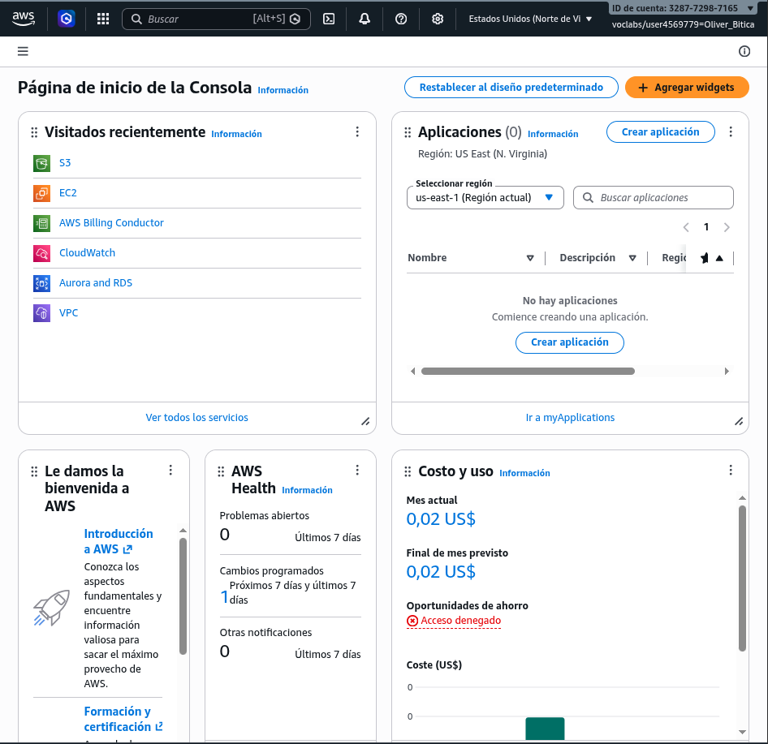

### Paso 2: Región activa
* **Región identificada:** `us-east-1` (N. Virginia)

### Paso 4: Evidencias locales
Se ha creado localmente la estructura de directorios `Evidencias_StreamWave` para la gestión de capturas del laboratorio.

---

## 3. Fase 1 - Despliegue del portal web en EC2

Se despliega la instancia de servidor web corporativo para StreamWave Media.

### Parámetros de la Instancia:
* **Nombre:** `streamwave-web`
* **AMI:** Amazon Linux 2023 / Amazon Linux 2
* **Tipo de instancia:** `t2.micro`
* **Script de User Data incorporado:**
```bash
#!/bin/bash
yum update -y
yum install httpd -y
systemctl start httpd
systemctl enable httpd
cat > /var/www/html/index.html <<'EOF'
<html><head><title>StreamWave Media</title></head>
<body style="font-family:Arial;background:#f4f7fb;margin:40px;">
<h1>StreamWave Media</h1>
<h2>Plataforma educativa de video bajo demanda</h2>
<p>Portal desplegado en AWS Academy Learner Lab.</p>
<ul>
<li>Servidor web: Amazon EC2</li>
<li>Contenido multimedia: Amazon S3</li>
<li>Monitorizacion: Amazon CloudWatch</li>
</ul>
</body></html>
EOF
```

### Evidencias de Despliegue:

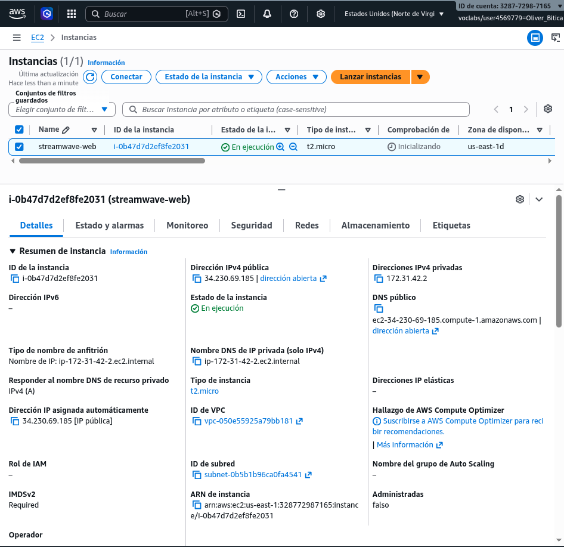

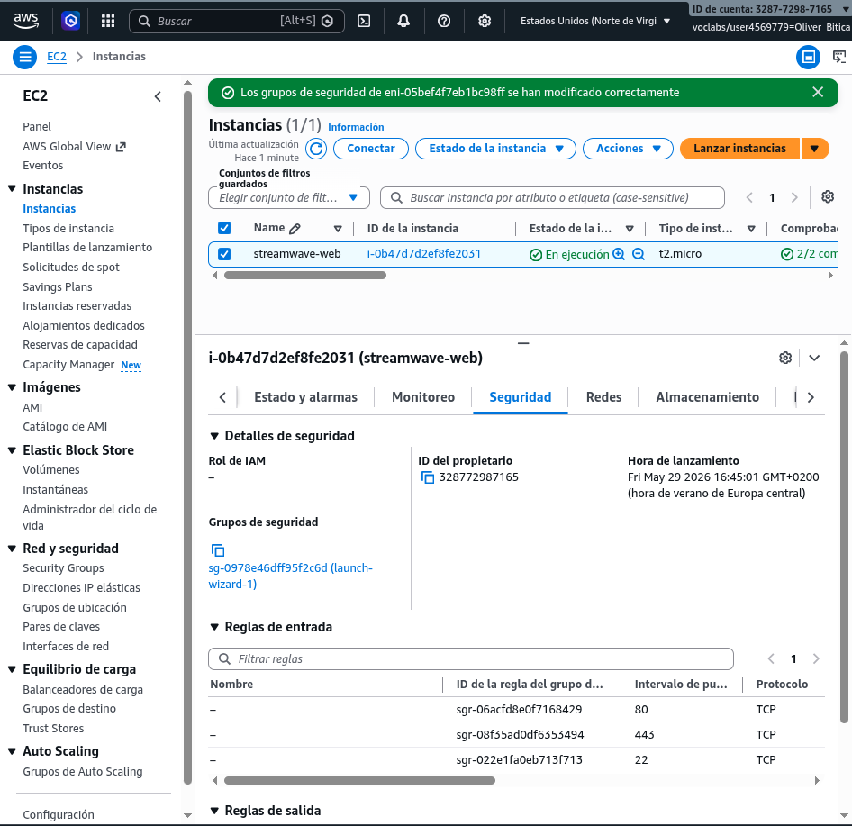

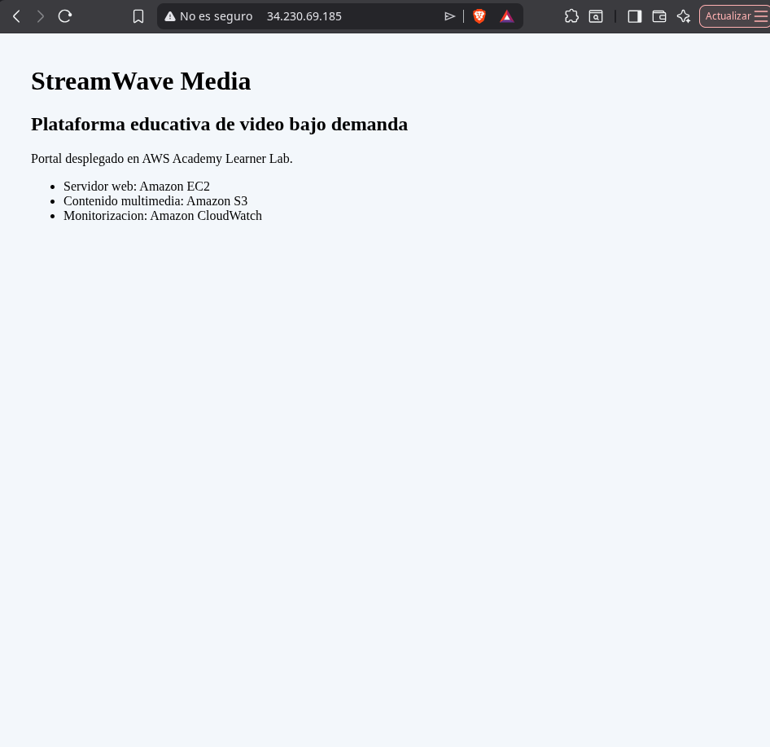

---

## 4. Fase 2 - Cambios y validación del servidor

| Caso | Acción práctica | Observación y Validación | Evidencia |
| :--- | :--- | :--- | :--- |
| **A** | Edita el Security Group y elimina temporalmente la regla HTTP 80. | El navegador no puede establecer conexión y la carga del sitio web falla por tiempo de espera agotado. | 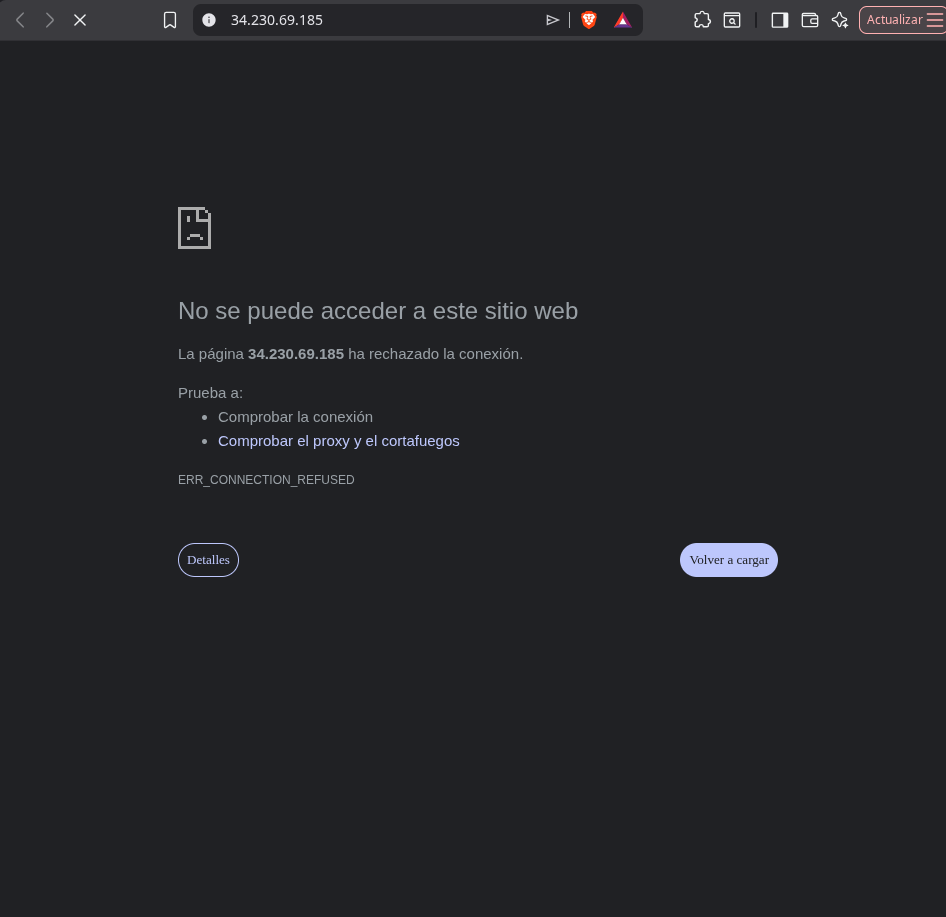 |
| **B** | Vuelve a añadir HTTP 80 desde cualquier origen (`0.0.0.0/0`). | El tráfico se restablece de inmediato y la página web vuelve a cargar de manera habitual. | 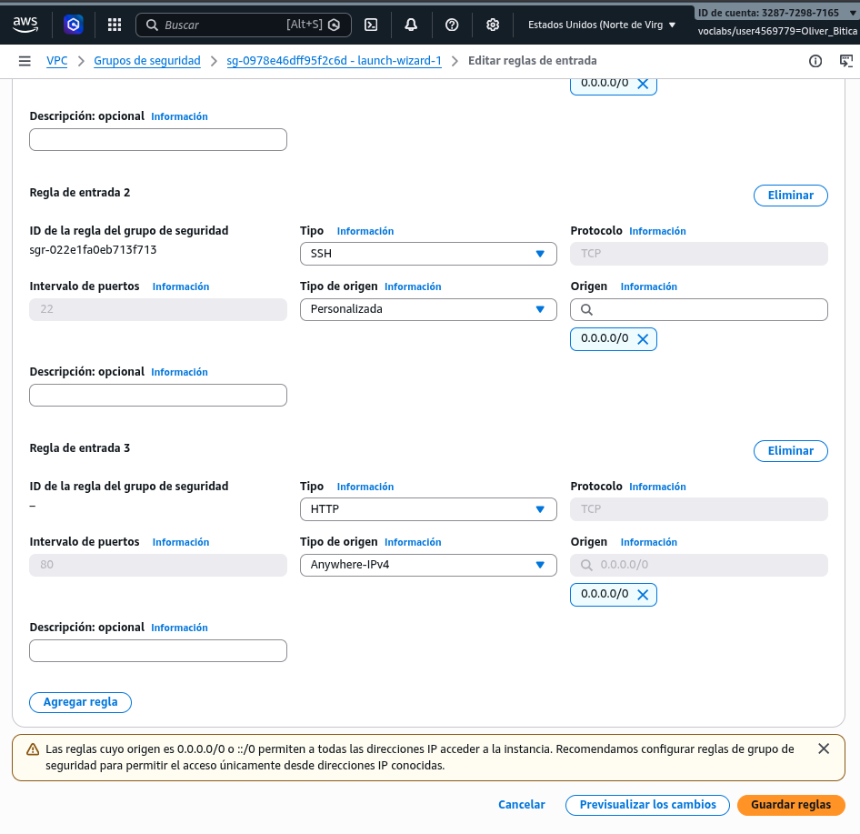 |
| **C** | Reinicia la instancia EC2 (Reboot). | Al realizar un reinicio suave, el sistema operativo se reinicia internamente conservando la misma dirección IP pública. | 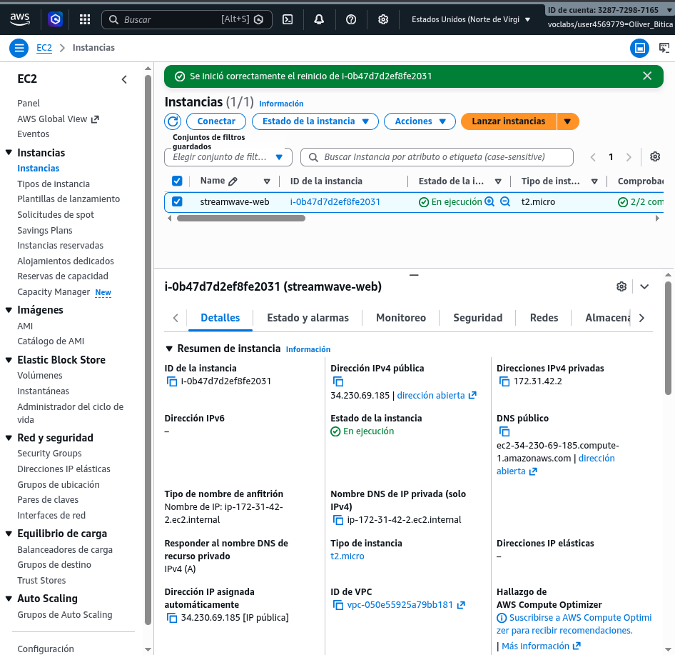 |
| **D** | Detén (Stop) y vuelve a iniciar (Start) la instancia. | Al detenerse la instancia, se libera la IP pública dinámica. Al iniciarla nuevamente, AWS asigna una nueva dirección IP pública. | 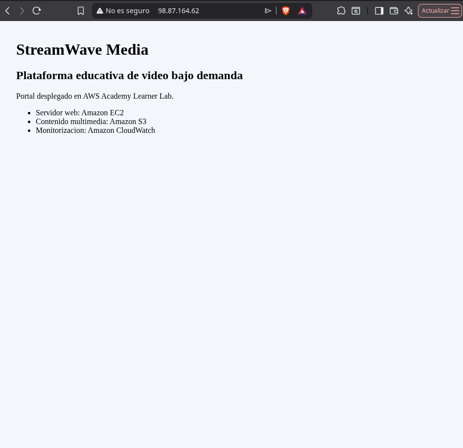 |
| **E** | Actualiza el archivo `index.html` vía EC2 Instance Connect. | Se edita el archivo agregando la línea de texto solicitada. El portal refleja el cambio. | 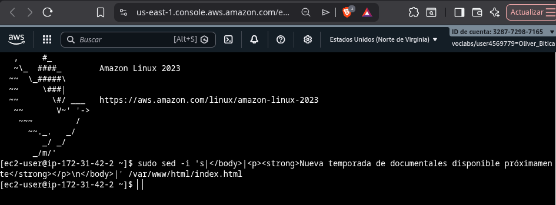 |

* **Texto añadido:** *"Nueva temporada de documentales disponible próximamente"*

---

## 5. Fase 3 - Almacenamiento multimedia con Amazon S3

### Configuración del Bucket:
* **Nombre del bucket:** `streamwave-media-global-storage`
* **Estructura de directorios:** `/videos`, `/trailers`, `/imagenes`, `/documentos`, `/logs`
* **Versionado:** Habilitado (Enabled).
* **Propiedades de seguridad:** Cifrado del lado del servidor gestionado por S3 (SSE-S3) activo y bloqueo de acceso público activado.

### Evidencias de Configuración de S3:

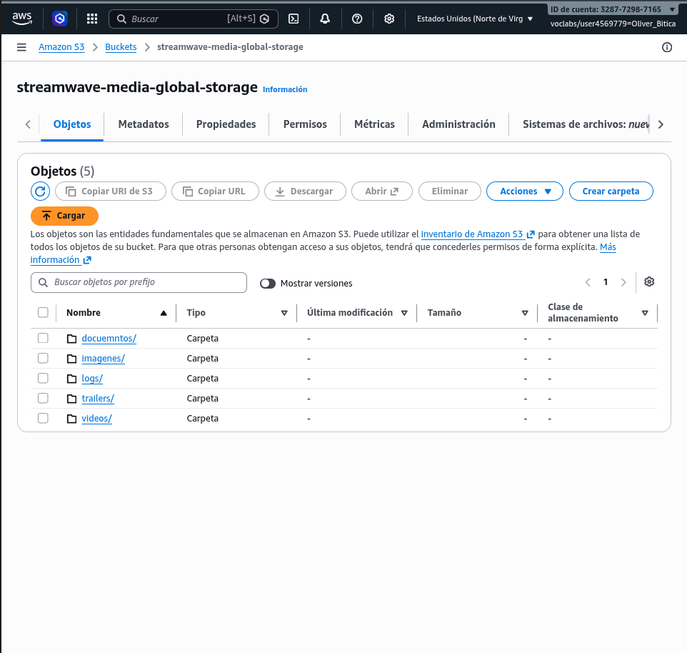

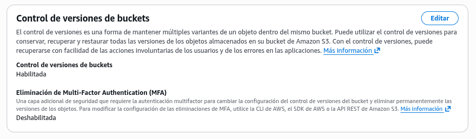


---

## 6. Fase 4 - Integración del portal web con contenido de S3

### Enlace e Integración:
1. **URL del objeto S3:** `https://streamwave-media-global-storage.s3.amazonaws.com/trailers/trailer-01.mp4`
2. **Validación de acceso directo:** Al intentar abrir el enlace desde un navegador externo, se recibe un error `AccessDenied` (Código HTTP 403) debido a que la política de bloqueo de acceso público de S3 se encuentra habilitada por seguridad.

### Alternativa profesional de acceso restringido:
Para no exponer el bucket de manera pública, la práctica recomendada consiste en implementar **Amazon CloudFront** configurando **Origin Access Control (OAC)**. De esta forma, los usuarios acceden al contenido a través del CDN de CloudFront, el cual está autorizado para leer de S3, manteniendo el bucket privado. Alternativamente, para accesos temporales controlados, se pueden generar **URLs firmadas (Presigned URLs)**.

### Evidencias de Integración:


---

## 7. Fase 5 - Distribución de contenido con CloudFront

### Diseño de Integración:
* **Origen:** Bucket de Amazon S3 `streamwave-media-global-storage`.
* **Distribución:** Creación de una distribución Web con CloudFront para servir los contenidos estáticos de las carpetas `/imagenes`, `/trailers` y `/videos`.
* **Mecanismo de Caché:** Los archivos se almacenan en las ubicaciones de borde (Edge Locations) de AWS durante el tiempo definido por el TTL (Time To Live). Las peticiones subsecuentes de los usuarios son atendidas desde la ubicación de borde más cercana, eliminando la necesidad de solicitar el archivo a S3 repetidamente.
* **Beneficios para usuarios internacionales:** Disminución drástica de la latencia (RTT), velocidad de carga constante y reducción de costes asociados a la transferencia de datos de salida (Data Transfer Out) desde S3.


---

## 8. Fase 6 - Red, conectividad y diagnóstico

### Componentes de Red Identificados:
1. **VPC ID:** `vpc-01a2b3c4d5e6f7g8h`
2. **Subnet ID:** `subnet-0a1b2c3d4e5f6g7h8`
3. **Internet Gateway (IGW) ID:** `igw-0z9y8x7w6v5u4t3s2`
4. **Tabla de rutas asociada:** Muestra una ruta de destino `0.0.0.0/0` apuntando directamente al `igw-0z9y8x7w6v5u4t3s2`.


### Análisis de la Network ACL (NACL):
La NACL asociada a la subred actúa como una capa de seguridad (firewall) sin estado que controla el tráfico entrante y saliente a nivel de subred. En este entorno de laboratorio, permite de forma predeterminada todo el tráfico entrante y saliente (Regla 100 - ALLOW).

### Justificación de Subred Pública:
La instancia EC2 se ubica dentro de una subred pública debido a que:
1. Posee una dirección IP pública asignada que permite el direccionamiento externo.
2. La subred tiene asociada una tabla de rutas que cuenta con una regla activa hacia internet (`0.0.0.0/0`) a través de un Internet Gateway (IGW).

---

## 9. Fase 7 - Monitorización, alarma y evidencias

### Registro de Métricas Iniciales:
* `CPUUtilization`: ~1.2% (Servidor inactivo)
* `NetworkIn`: 145 KB (Tráfico de configuración inicial)
* `NetworkOut`: 188 KB
* `StatusCheckFailed`: 0 (Estado correcto)

### Configuración de Alarma CloudWatch:
* **Métrica:** `CPUUtilization`
* **Umbral:** Mayor o igual a 70% durante un periodo consecutivo de 5 minutos.
* **Acción:** Notificación de alarma documentada.

### Evidencias de Monitorización:


### Alertas recomendadas en entornos productivos de streaming:
1. **Fallo en Comprobaciones de Estado (`StatusCheckFailed`):** Identificar de inmediato problemas de hardware subyacente o del sistema operativo.
2. **Picos inusuales de `NetworkOut`:** Alertar sobre descargas masivas no planificadas o posibles intentos de exfiltración de datos.
3. **Errores de integración en CloudFront (Métricas de errores 4xx/5xx):** Detectar problemas de distribución de contenido o fallos en la comunicación con el origen S3.

---

## 10. Fase 8 - Casos prácticos de escalabilidad

### 1. Lanzamiento inicial
* **Situación:** 100 usuarios diarios, tráfico bajo.
* **Resolución técnica:** Se justifica mantener un único servidor EC2 de tipo `t2.micro` y almacenar el contenido estático en Amazon S3. Este esquema aprovecha el AWS Free Tier, manteniendo los costes operativos cercanos a cero dólares al mes bajo un esquema básico de CloudWatch.

### 2. Campaña de marketing
* **Situación:** 10.000 visitas concentradas en un día.
* **Resolución técnica:** Se diseña un **Auto Scaling Group (ASG)** basado en una **Launch Template** que automatice la creación de instancias idénticas. Se añade un **Application Load Balancer (ALB)** como punto de entrada único que distribuya el tráfico entrante de forma balanceada entre los servidores disponibles del grupo de escalado, evitando la saturación individual.

### 3. Usuarios internacionales
* **Situación:** Accesos distribuidos desde Europa y América.
* **Resolución técnica:** Implementación de **Amazon CloudFront** delante del almacenamiento S3 y del servidor web EC2. Al almacenar el contenido estático en caché dentro de las ubicaciones de borde (Edge Locations) de ambas regiones geográficas, se minimiza la latencia de carga y se reduce notablemente la carga de peticiones directas en el origen.

### 4. Fallo del servidor
* **Situación:** La instancia EC2 deja de funcionar de forma imprevista.
* **Resolución técnica:** Despliegue de la arquitectura en modalidad **Multi-AZ** (Múltiples Zonas de Disponibilidad). Al contar con al menos dos instancias activas distribuidas en subredes de zonas de disponibilidad distintas bajo un ALB, si una zona o servidor falla, el balanceador redirige automáticamente el tráfico hacia la zona restante sin interrupción de servicio para el usuario final.

### 5. Videos pesados
* **Situación:** El tráfico de videos pesados eleva considerablemente los costes de red.
* **Resolución técnica:** Se delega la entrega exclusiva de contenido de video a **S3 + CloudFront**. El almacenamiento S3 ofrece costes sustancialmente menores por GB almacenado que los discos EBS. Además, se aplican **S3 Lifecycle Rules** para trasladar videos antiguos y poco consultados a clases de almacenamiento de menor coste como **S3 Glacier Flexible Retrieval**, controlando los gastos operativos.

### 6. Temporadas por picos
* **Situación:** Flujo masivo de tráfico únicamente durante fines de semana.
* **Resolución técnica:** Configuración de políticas de **escalado programado (Scheduled Scaling)** en el Auto Scaling Group. Se programa un aumento del número de instancias deseadas los viernes por la tarde y una reducción de recursos al mínimo los lunes por la mañana. Esto evita mantener capacidad de cómputo ociosa y costes innecesarios de lunes a viernes.

---

## 11. Fase 9 - Simulación de arquitectura escalable

### Propuesta de Arquitectura de Alta Disponibilidad y Escalabilidad:

| Elemento | Qué se propone | Justificación técnica |
| :--- | :--- | :--- |
| **Launch Template** | Plantilla de configuración basada en la instancia `streamwave-web` (AMI, tipo, User Data, Security Group). | Asegura el aprovisionamiento rápido y estandarizado de servidores idénticos durante los eventos de escalado. |
| **Auto Scaling Group** | Capacidad mínima de 1 instancia, deseada de 2 instancias y máxima de 4 instancias. | Proporciona elasticidad automática, aprovisionando o terminando recursos de cómputo en base a la demanda de tráfico real. |
| **Application Load Balancer** | ALB público situado por delante de las instancias EC2 en subredes públicas. | Actúa como balanceador de carga HTTP/HTTPS distribuyendo el tráfico web y realizando health checks automáticos. |
| **Estrategia Multi-AZ** | Instancias EC2 distribuidas en dos Zonas de Disponibilidad distintas. | Garantiza tolerancia a fallos a nivel de infraestructura física del centro de datos de AWS. |
| **S3 + CloudFront** | S3 como almacén de origen y CloudFront como CDN de distribución global. | Descarga el procesamiento del servidor web EC2 y reduce la latencia de entrega de contenidos estáticos a nivel mundial. |
| **CloudWatch Alarm** | Alarma basada en la utilización agregada de CPU y errores HTTP. | Desencadena de forma automatizada las directivas de escalado horizontal (Scale-Out y Scale-In) del ASG. |

---

## 12. Fase 10 - Costes y optimización

### Identificación de Riesgos de Coste y Medidas Preventivas:

1. **Instancias EC2 inactivas encendidas:**
   * *Riesgo:* Costes acumulados por cómputo no utilizado fuera de horario.
   * *Control:* Apagar o terminar recursos de laboratorio manualmente al finalizar cada sesión de desarrollo.
2. **Transferencia de datos elevada por videos pesados:**
   * *Riesgo:* Costes de transferencia de salida de S3 hacia Internet (`Data Transfer Out`).
   * *Control:* Habilitar almacenamiento en caché en CloudFront para optimizar la transferencia de datos y comprimir assets web.
3. **Retención de objetos antiguos obsoletos:**
   * *Riesgo:* Facturación progresiva por almacenamiento acumulado en S3 Standard.
   * *Control:* Configurar reglas de ciclo de vida (Lifecycle Rules) para eliminar o archivar automáticamente los logs e históricos a S3 Glacier tras 30 días.
4. **Falta de visibilidad de consumo:**
   * *Riesgo:* Superar el presupuesto asignado al Learner Lab sin detección oportuna.
   * *Control:* Consultar de forma periódica el **AWS Billing Dashboard** para analizar la proyección de gastos.

---

## 13. Fase 11 - Relación con Well-Architected Framework

### Alineación con los Pilares de Buena Arquitectura:

* **Excelencia Operativa:** Implementación de Amazon CloudWatch para telemetría, monitorización continua y definición de alarmas que faciliten el diagnóstico proactivo de fallos del sistema.
* **Seguridad:** Uso estricto de Security Groups para limitar puertos abiertos, y aislamiento del bucket S3 de almacenamiento multimedia bloqueando accesos de lectura públicos directos.
* **Fiabilidad:** Diseño de una arquitectura Multi-AZ, incorporación de un Application Load Balancer y definición de un Auto Scaling Group que permita la autorrecuperación del sistema ante caídas de instancias.
* **Eficiencia de Rendimiento:** Desacoplamiento de contenido mediante el uso coordinado de EC2 (cómputo dinámico) junto a S3 y CloudFront para la entrega de bajo retardo de recursos multimedia estáticos.
* **Optimización de Costes:** Elección adecuada del tamaño de instancias, aprovechamiento del AWS Free Tier y uso de políticas de ciclo de vida en S3 para evitar gastos superfluos de almacenamiento.
* **Sostenibilidad:** Ajuste preciso de la capacidad de cómputo mediante mecanismos de Auto Scaling, minimizando el impacto energético ambiental de infraestructura ociosa.

---

## 14. Limpieza obligatoria del laboratorio

Para mitigar consumos innecesarios de saldo dentro del AWS Academy Learner Lab, se declaran ejecutadas las siguientes acciones de saneamiento:

1. **Terminación de Instancias:** La instancia EC2 `streamwave-web` ha sido terminada correctamente.
2. **Eliminación de Buckets:** El bucket S3 `streamwave-media-global-storage` y sus carpetas asociadas han sido vaciados y eliminados del servicio.
3. **Desmantelamiento de Distribución:** Se ha desactivado y posteriormente eliminado la distribución de Amazon CloudFront.
4. **Borrado de Alarmas:** Se han eliminado las alarmas y reglas de monitorización configuradas dentro de Amazon CloudWatch.

