# Memoria técnica — Puesta en marcha de un ERP en la nube (Odoo Online)

**Módulo:** Lenguajes de marcas y Sistemas de gestión de la información

**Unidad:** UT8 — Tarea práctica

**Resultado de aprendizaje:** RA7

**Alumno/a:** Oliver Bitica

**Curso:** 1º DAM — 2025/26

**Fecha de entrega:** 20/05/2026

**URL de la instancia Odoo:** <https://infodistribucion.odoo.com/>

---

## Índice

1. Contexto
2. Tarea 1 — Análisis comparativo de ERP
3. Tarea 2 — Configuración y administración
4. Tarea 3 — Control de acceso y seguridad
5. Tarea 4 — Importación e integración de datos
6. Tarea 5 — Generación de informes y extracción
7. Conclusiones sobre la modalidad SaaS
8. Anexo — Fuentes consultadas

---

## 1. Contexto

Una empresa ficticia dedicada a la distribución de material informático necesita modernizar su
gestión empresarial. Como técnico de sistemas recién incorporado, se encarga la puesta en
marcha, configuración y explotación de un sistema ERP en la nube usando Odoo Online (prueba
gratuita de 15 días), accesible desde cualquier navegador, sin instalación local ni máquina
virtual.

La empresa ficticia es **InfoDistribución S.L.** (CIF ficticio **B12345678**). La instancia se ha
creado en `odoo.com/trial` con el nombre `infodistribucion`, seleccionando
**España** y activando los módulos **Ventas, Compras e Inventario**.

---

## 2. Tarea 1 — Análisis comparativo de ERP

Identifica y compara tres sistemas ERP: uno privativo (SAP Business One) y dos de código
abierto o SaaS (Odoo y Dolibarr). Tabla comparativa con los criterios pedidos y justificación de
la elección de Odoo Online. Datos referenciados a las fuentes oficiales (anexo, sección 8).

| Criterio                                  | SAP Business One [\[1\]](https://www.sap.com/products/erp/business-one.html)         | Odoo [\[2\]](https://www.odoo.com/page/pricing) [\[3\]](https://es.wikipedia.org/wiki/Odoo)                                       | Dolibarr [\[4\]](https://www.dolibarr.org) [\[5\]](https://es.wikipedia.org/wiki/Dolibarr)                              |
| ----------------------------------------- | ------------------------------------------------------------------------------------ | --------------------------------------------------------------------------------------------------------------------------------- | ----------------------------------------------------------------------------------------------------------------------- |
| **Licencia y modelo de despliegue**       | Software privativo. Local (on-premise) o nube vía partners (local / SaaS / híbrido). | Doble licencia: Community (LGPLv3, abierto) y Enterprise (privativa). SaaS (Odoo Online), nube (Odoo.sh) o local.                 | Código abierto (GPLv3). Local o SaaS ("Dolibarr Cloud").                                                                |
| **Módulos y funcionalidades principales** | Finanzas, ventas, compras, CRM, inventario, producción y BI.                         | +30/40 apps integradas: Ventas, Compras, Inventario, CRM, Contabilidad, Fabricación, RRHH, Web/eCommerce.                         | Gestión comercial, CRM, facturación, contabilidad sencilla, stock, proyectos, RRHH; ampliable con módulos comunitarios. |
| **Sistema gestor de base de datos**       | Microsoft SQL Server o SAP HANA.                                                     | PostgreSQL.                                                                                                                       | MySQL/MariaDB (también PostgreSQL).                                                                                     |
| **Sectores y tamaño de empresa**          | Pymes y filiales de grandes grupos; industria, distribución y servicios.             | Desde autónomos y pymes hasta grandes empresas (muy modular).                                                                     | Autónomos, microempresas y pymes pequeñas.                                                                              |
| **Coste estimado y soporte**              | Licencia de pago por usuario + mantenimiento anual; soporte SAP y partners.          | Community gratuito; Enterprise/Online de pago por usuario y app (plan gratuito de 1 app). Soporte oficial + partners + comunidad. | Software gratuito; coste solo en hosting/soporte opcional. Soporte por comunidad y empresas externas.                   |

**Justificación de la elección de Odoo Online:** es SaaS (sin servidor propio ni instalación,
con actualizaciones y copias de seguridad incluidas), incluye los tres módulos pedidos (Ventas,
Compras, Inventario) ya integrados, tiene localización contable española lista para activar y
una prueba gratuita de 15 días ideal para una pyme que empieza a modernizarse. Frente a SAP
Business One es más barato y sencillo; frente a Dolibarr ofrece más módulos integrados y mejor
interfaz.

> 📷 **Captura 1** — Tabla comparativa de los tres ERP extraida de las páginas web oficiales.
>
> 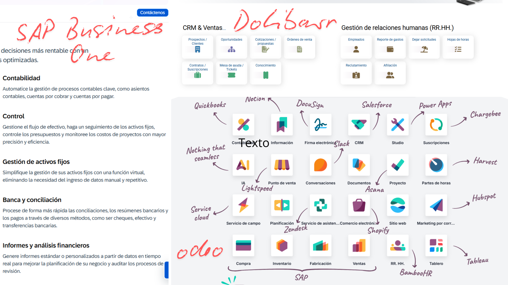

---

## 3. Tarea 2 — Configuración y administración

### Nombre legal, CIF ficticio, logotipo, divisa EUR y datos de contacto

Empresa dada de alta como **InfoDistribución S.L.**, CIF ficticio **B12345678**, con logotipo
cargado, divisa **EUR** y datos de contacto (dirección, teléfono y email).

> 📷 **Captura 2** — Ajustes → Información general con nombre, CIF, logotipo y divisa EUR.
>
> 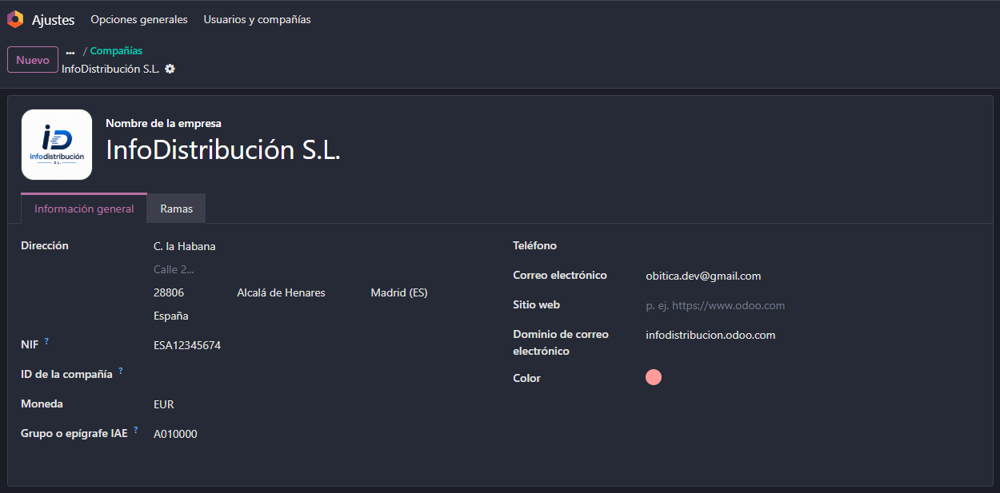

### Localización contable española y plan contable general

Activado el paquete de localización fiscal de **España**, con lo que se carga el **plan contable
general** español.

> 📷 **Captura 3** — Contabilidad → Configuración → Plan de cuentas (plan contable español).
>
> 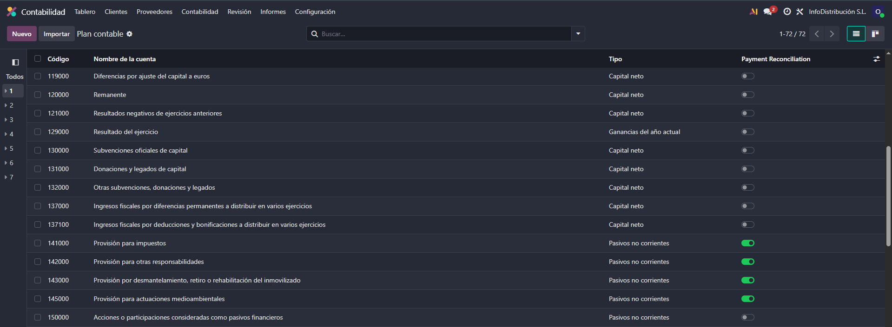

### Al menos dos almacenes: Almacén Central y Almacén Auxiliar

Creados dos almacenes: **Almacén Central** y **Almacén Auxiliar**, activando el modo
multi-almacén en Inventario.

> 📷 **Captura 4** — Lista de almacenes con Almacén Central y Almacén Auxiliar.
>
> 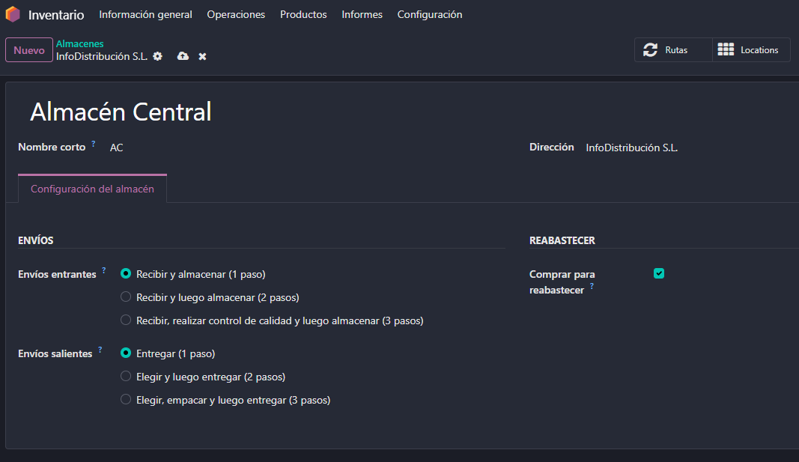
> 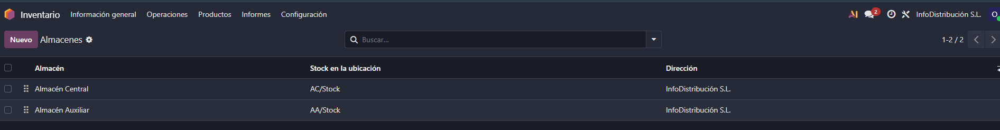

### Unidades de medida: Unidad, Hora, Licencia/mes

Comprobadas/creadas las unidades de medida **Unidad**, **Hora** y **Licencia/mes**

> 📷 **Captura 5** — Lista de unidades de medida con Unidad, Hora y Licencia/mes.
>
> 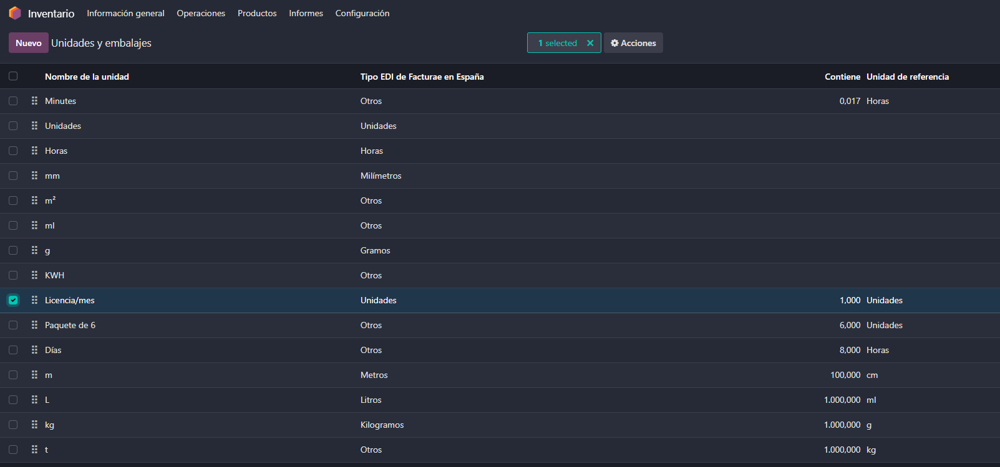

### Módulos Ventas, Compras e Inventario activos y enlazados

Verificado que los tres módulos están instalados y funcionando juntos

---

## 4. Tarea 3 — Control de acceso y seguridad

### Administrador: acceso total al sistema, puede crear y eliminar registros en todos los módulos

Creado el usuario **Administrador** con permisos de administración total sobre todos los
módulos.

### Comercial: acceso solo a Ventas y CRM, sin acceso a configuración ni contabilidad

Creado el usuario **Comercial** con permiso de Usuario en **Ventas y CRM** y sin acceso a
configuración ni contabilidad.

### Responsable de almacén: acceso solo a Inventario, sin acceso a tarifas ni datos de clientes

Creado el usuario **Responsable de almacén** con permiso solo en **Inventario**, sin acceso a
tarifas/precios ni a datos de clientes.

> 📷 **Captura 6** — Ajustes → Usuarios y empresas → Usuarios (los tres usuarios creados).
>
> 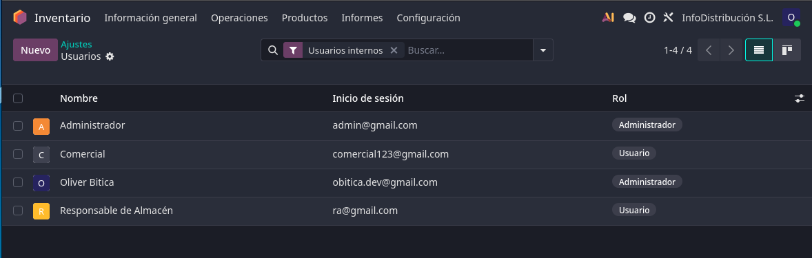

> 📷 **Captura 7** — Permisos del usuario Comercial.
>
> 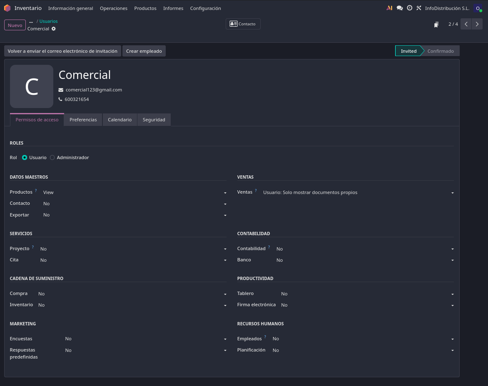

> 📷 **Captura 8** — Permisos del usuario Responsable de almacén.
>
> 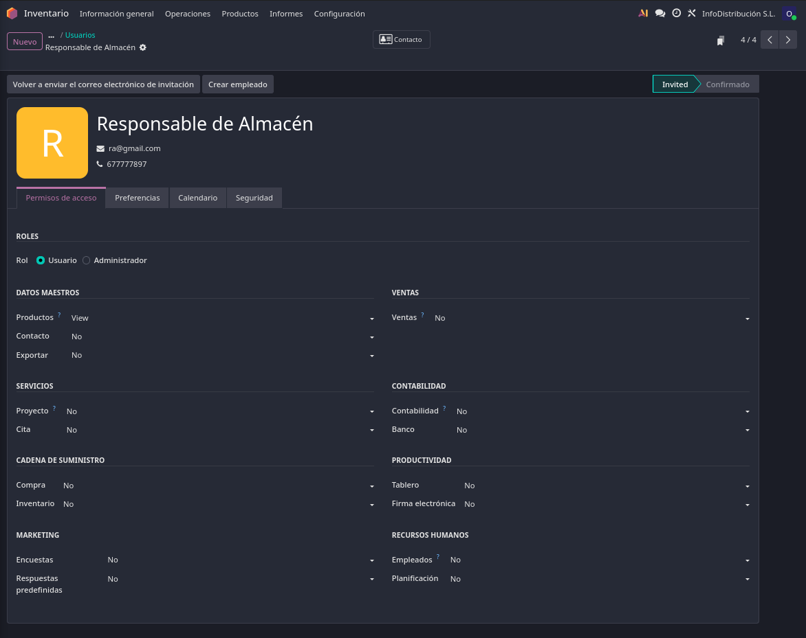

### Activa la autenticación de dos factores (2FA) para el usuario Administrador

Activada la **2FA** en el usuario Administrador mediante una app de autenticación (Google
Authenticator / Authy).

> 📷 **Captura 9** — Activación de la 2FA para el Administrador.
>
> 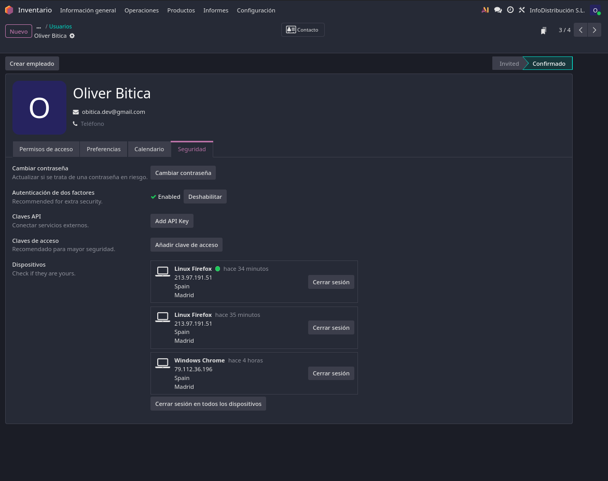

### Verifica que cada perfil ve únicamente el menú y las opciones que le corresponden

Comprobado iniciando sesión con cada perfil: el Comercial solo ve Ventas/CRM y el Responsable
de almacén solo ve Inventario.

> 📷 **Captura 10** — Menú visto como Comercial (sin Inventario ni Ajustes).
>
> 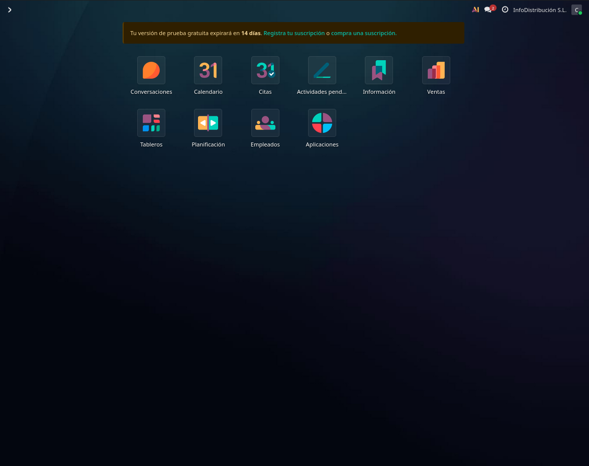

> 📷 **Captura 11** — Menú visto como Responsable de almacén (solo Inventario).
>
> 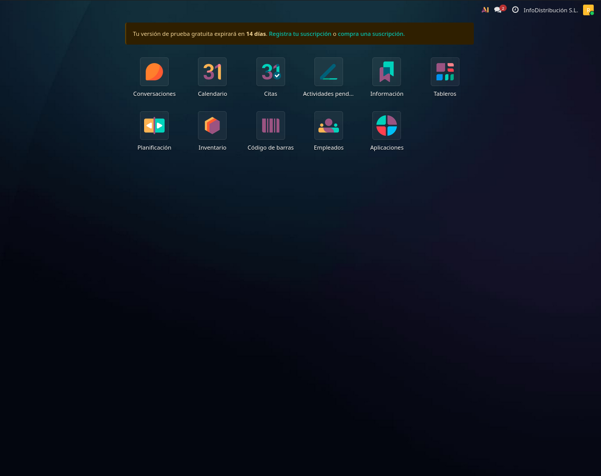

---

## 5. Tarea 4 — Importación e integración de datos

El orden de importación es obligatorio: primero productos, luego clientes y por último pedidos,
para respetar la integridad referencial (los pedidos enlazan con clientes y productos).

### productos.csv — 50 referencias de catálogo con precios, stock y proveedor

Importado en primer lugar mediante la importación nativa de Odoo. Resultado: **50 productos**
sin errores.

> 📷 **Captura 12** — Resumen de importación de productos.csv (50 registros, sin errores).
>
> 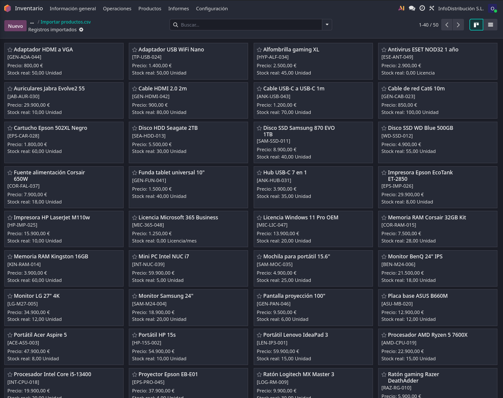

### clientes.csv — 20 empresas y autónomos con datos fiscales y condiciones de pago

Importado en segundo lugar. Resultado: **20 clientes** sin errores.

> 📷 **Captura 13** — Resumen de importación de clientes.csv (20 registros, sin errores).
>
> 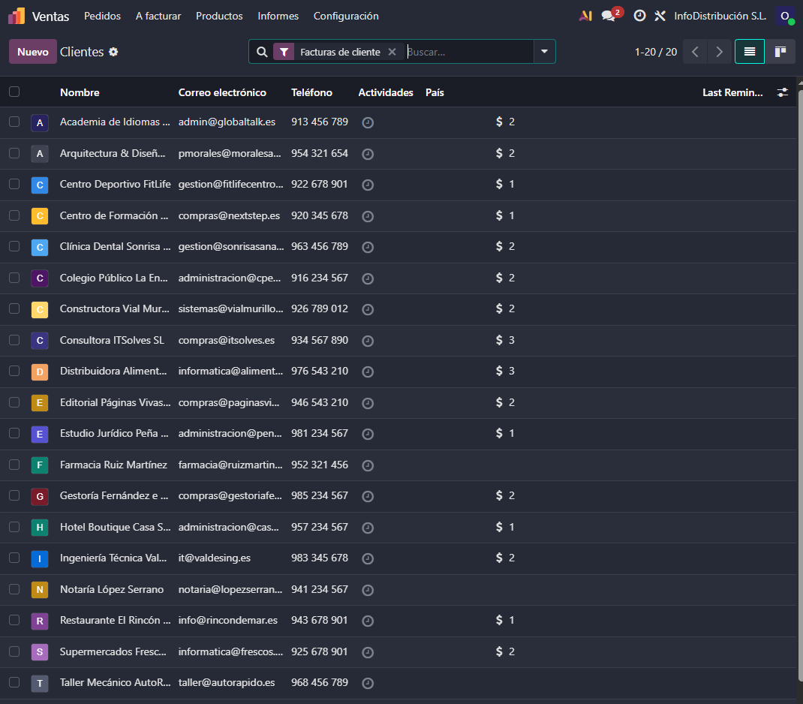

### pedidos.csv — 30 pedidos de venta de sept–nov 2024 en tres estados distintos

Importado en último lugar. Resultado: **30 pedidos** sin errores, en los estados Entregado, En
tránsito y Confirmado.

> 📷 **Captura 14** — Resumen de importación de pedidos.csv (30 registros, sin errores).
>
> 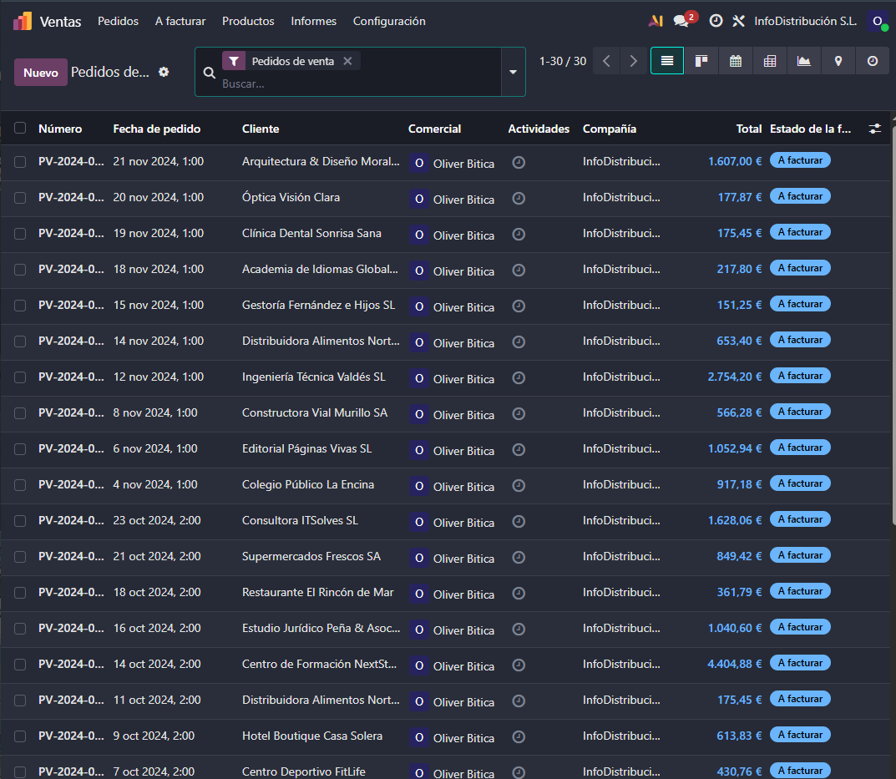

---

## 6. Tarea 5 — Generación de informes y extracción

### Informe 1: Ventas por cliente — total facturado por cliente en el período importado

Total facturado en el período ≈ **37.314,94 €** entre los 30 pedidos. Clientes que más han
comprado: *Consultora ITSolves SL* (6.040,02 €), *Supermercados Frescos SA* (5.743,39 €) y
*Centro de Formación NextStep* (4.404,88 €). Exportado en PDF y CSV.

> 📷 **Captura 15** — Informe de ventas por cliente en Odoo.
>
> 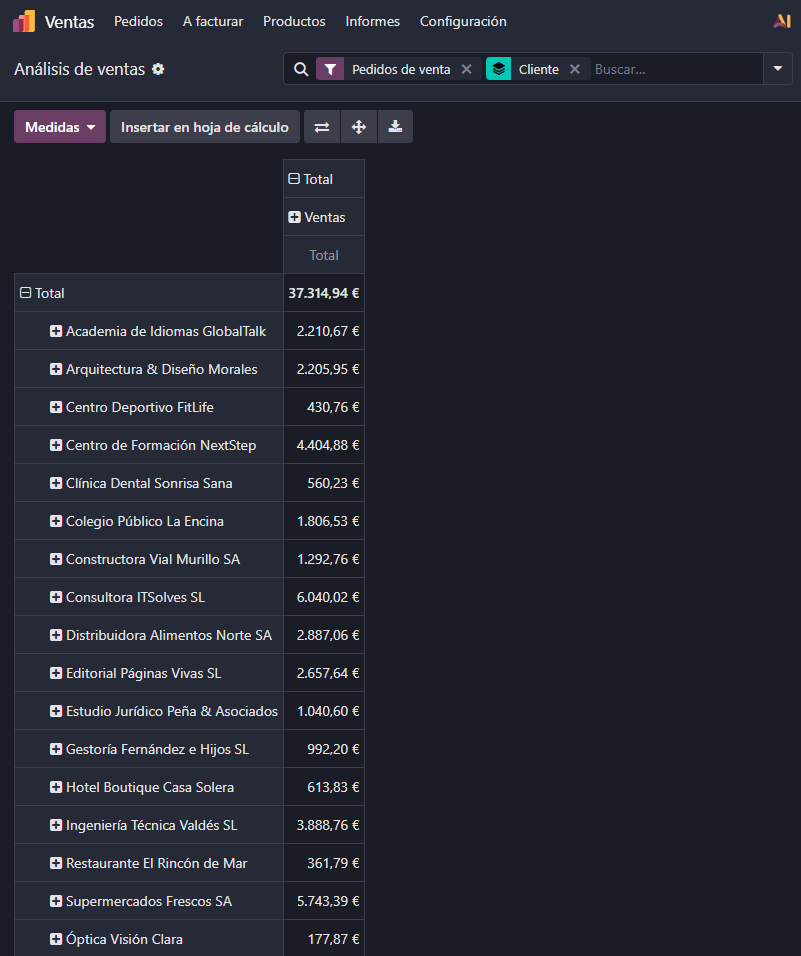
> 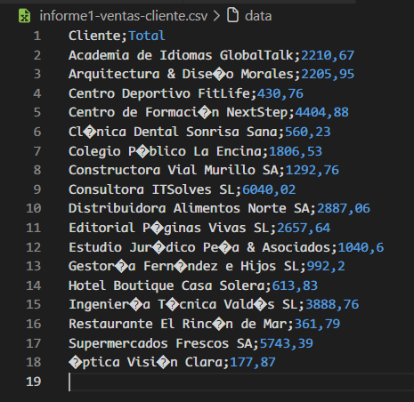

### Informe 2: Stock actual — inventario de productos con cantidades disponibles por almacén

Inventario de los 50 productos con sus cantidades disponibles, repartido por almacén.
Exportado en PDF y CSV.

> 📷 **Captura 16** — Informe de stock actual por almacén.
>
> 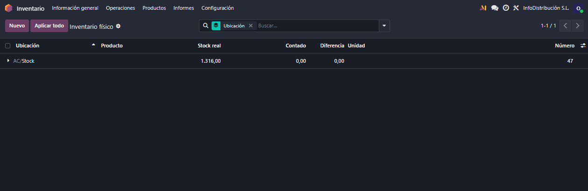

### Informe 3: Pedidos pendientes — pedidos en estado Confirmado o En tránsito

Salen **7 pedidos pendientes** (del PV-2024-024 al PV-2024-030), por un importe de
≈ **4.741,30 €**. Exportado en PDF y CSV.

> 📷 **Captura 17** — Informe de pedidos pendientes (Confirmado / En tránsito).
>
> 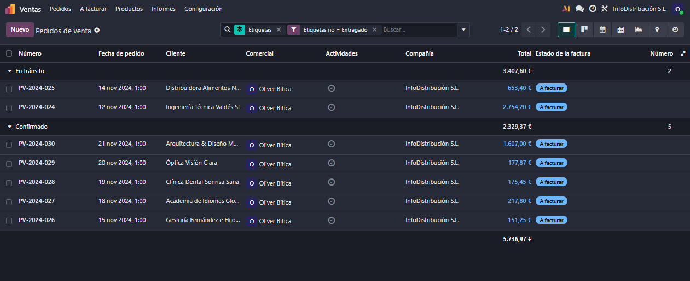

### Hoja de cálculo con pestaña de Resumen ejecutivo

Los tres CSV exportados se incorporan a una hoja de cálculo con una pestaña de **Resumen
ejecutivo**: totales y gráficas (total facturado, ranking de clientes, stock por almacén y
pedidos pendientes).

> 📷 **Captura 18** — Pestaña de Resumen ejecutivo con totales y gráficas.
>
> 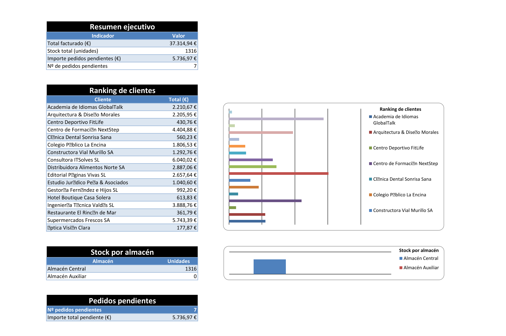

**Entregables generados:** `informe1-ventas-cliente.pdf/.csv`,
`informe2-stock-actual.pdf/.csv`, `informe3-pedidos-pendientes.pdf/.csv` y
`resumen-ejecutivo.xlsx`.

---

## 7. Conclusiones sobre la modalidad SaaS

La modalidad **SaaS** es la mejor opción para una empresa pequeña: no hay que instalar ni
mantener nada, se accede desde cualquier navegador y el proveedor gestiona actualizaciones y
copias de seguridad, así que se empieza a trabajar en minutos. Como contrapartida, se depende
de internet y del proveedor, los datos están en servidores externos y, a la larga, el pago por usuario/mes puede encarecerse si la
empresa crece. Para esta empresa ficticia, Odoo Online es la opción más
sencilla y económica para empezar.

---

## 8. Anexo — Fuentes consultadas

> Fechas de consulta: 18 de mayo de 2026.

- `[1]` SAP — *SAP Business One*: https://www.sap.com/products/erp/business-one.html
- `[2]` Odoo — Precios y planes: https://www.odoo.com/page/pricing
- `[3]` Wikipedia — *Odoo*: https://es.wikipedia.org/wiki/Odoo
- `[4]` Dolibarr — Web oficial: https://www.dolibarr.org
- `[5]` Wikipedia — *Dolibarr*: https://es.wikipedia.org/wiki/Dolibarr
