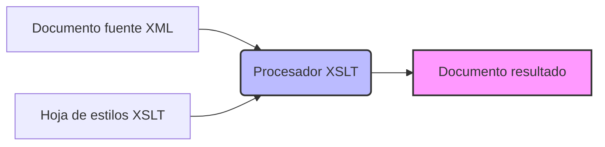
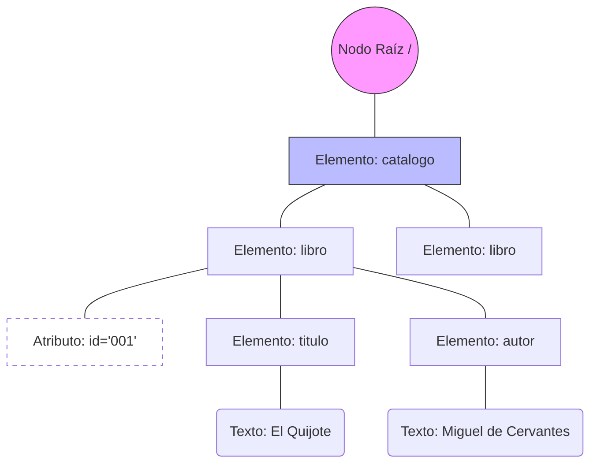
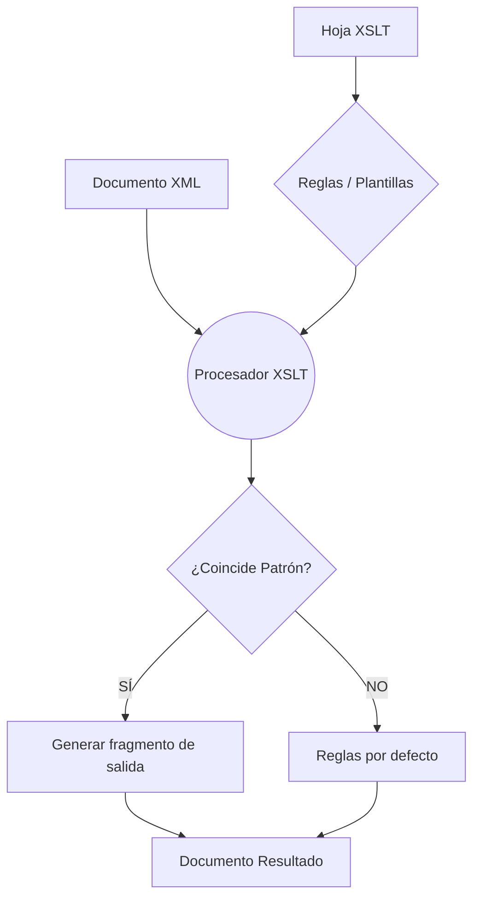
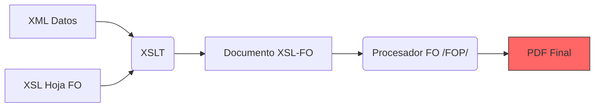
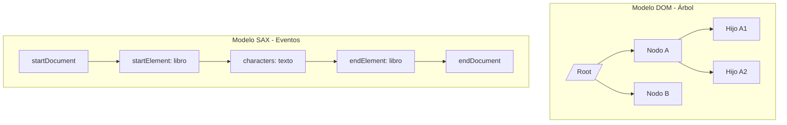
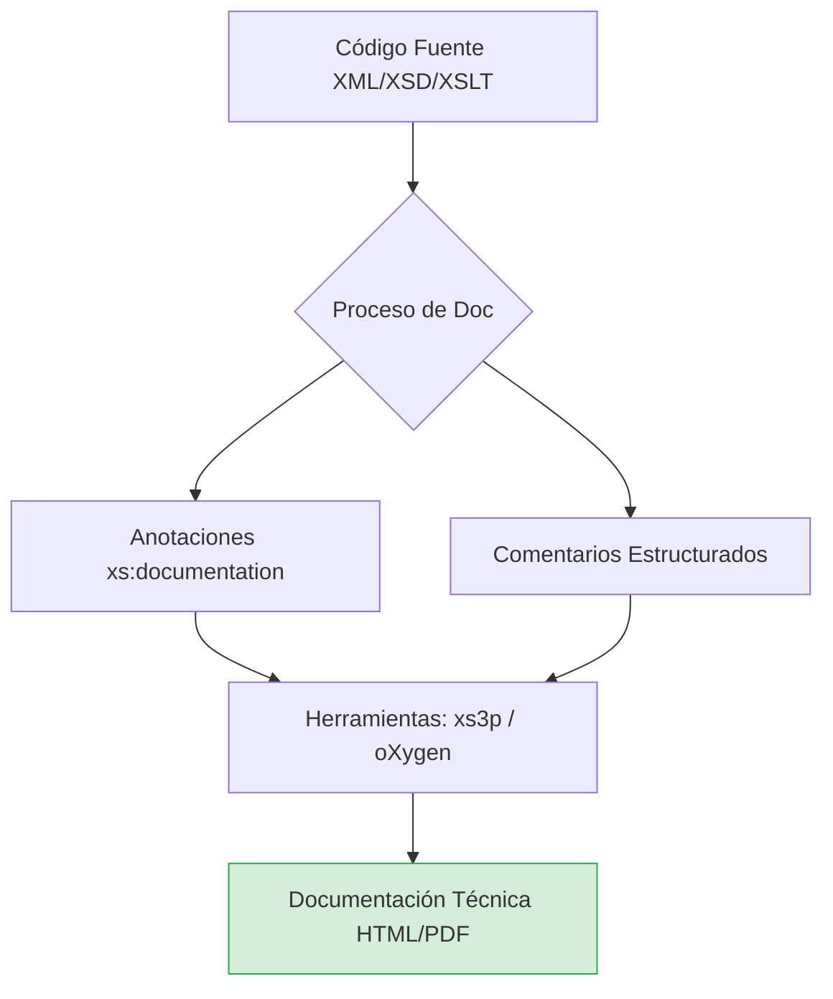

# UT6.1 — XPath y XSLT

## 01 Introducción a la Transformación de XML

XML (eXtensible Markup Language) es un formato universal para el almacenamiento e intercambio de datos. Sin embargo, los documentos XML en bruto no son directamente útiles para el usuario final: necesitan ser transformados, filtrados o presentados en distintos formatos.

**XPath** proporciona un lenguaje de consulta para navegar y seleccionar nodos dentro de un documento XML, mientras que **XSLT** (eXtensible Stylesheet Language Transformations) define reglas para transformar documentos XML en otros formatos: HTML, PDF, texto plano u otros dialectos XML.

> **Contexto tecnológico**  
> W3C publicó XSLT 1.0 en 1999, XSLT 2.0 en 2007 y XSLT 3.0 en 2017. XPath 1.0 se publicó en 1999 junto con XSLT 1.0. Forman parte de la familia **XSL** (eXtensible Stylesheet Language) junto con XSL-FO (para PDF).

---

## 02 Técnicas de Transformación de Documentos XML

La transformación de documentos XML se puede abordar mediante diversas estrategias técnicas, que pueden combinarse según las necesidades del proyecto.

### Estrategias Técnicas

*   **📄 XSLT (declarativo):** Estándar W3C. Un procesador XSLT toma un XML fuente y una hoja de estilos XSLT y produce un documento de salida.
*   **💻 DOM y SAX:** APIs de programación para Java, Python, C#… cuando XSLT no es suficiente (lógica de negocio, bases de datos).
*   **🔍 XQuery:** Lenguaje funcional de consulta para bases de datos XML. Complementario a XSLT, especialmente útil en bases de datos nativas XML.
*   **⚡ STX (Streaming):** Alternativa de bajo nivel que procesa XML en modo streaming sin cargar el árbol completo. Ideal para documentos de gran tamaño.

### Elementos del proceso XSLT

| Elemento | Descripción |
| :--- | :--- |
| Documento fuente | El XML con los datos que se desea transformar |
| Hoja de estilos XSLT | Define las reglas de transformación (también es XML) |
| Procesador XSLT | Motor que aplica las reglas: Saxon, Xalan, libxslt, MSXSL… |
| Documento resultado | HTML, XML, texto u otro formato de salida |


## 03 XPath — Lenguaje de Rutas en XML

XPath (XML Path Language) es un lenguaje de expresiones que permite navegar por los nodos de un documento XML y seleccionarlos. Es la base sobre la que se construye XSLT y otras tecnologías como XQuery y XPointer.

### Modelo de datos: el árbol XML

XPath ve un documento XML como un árbol de nodos. Tipos de nodos:

*   **Nodo raíz (root):** nodo padre de todos; representa el documento completo.
*   **Nodos elemento:** representan las etiquetas XML, p. ej. `<libro>`.
*   **Nodos atributo:** representan los atributos, p. ej. `id="001"`.
*   **Nodos texto:** representan el contenido textual dentro de un elemento.
*   **Nodos comentario:** representan los comentarios XML `<!-- ... -->`.
*   **Instrucciones de procesamiento:** representan `<?... ?>`.
*   **Nodos espacio de nombres:** representan declaraciones `xmlns`.



### Ejes de localización

Cada paso XPath tiene la forma: `eje::test-de-nodo[predicado]`

| Eje | Descripción | Ejemplo |
| :--- | :--- | :--- |
| child | Hijos directos del nodo contexto | `child::libro` / `libro` |
| parent | Nodo padre del contexto | `parent::catalogo` / `..` |
| self | El propio nodo contexto | `self::node()` / `.` |
| attribute | Atributos del nodo contexto | `attribute::id` / `@id` |
| ancestor | Todos los antecesores hasta la raíz | `ancestor::catalogo` |
| descendant | Todos los descendientes | `descendant::titulo` |
| following-sibling | Hermanos que siguen al nodo | `following-sibling::libro` |
| preceding-sibling | Hermanos que preceden al nodo | `preceding-sibling::libro` |
| following | Todos los nodos que siguen en el doc. | `following::nota` |
| preceding | Todos los nodos que preceden | `preceding::nota` |
| namespace | Nodos de espacio de nombres | `namespace::xs` |

### Expresiones abreviadas

| Abreviatura | Equivalente | Significado |
| :--- | :--- | :--- |
| / | Separador de pasos | Ruta desde la raíz o descendencia |
| // | `descendant-or-self::node()/` | Cualquier lugar del árbol |
| . | `self::node()` | Nodo actual |
| .. | `parent::node()` | Nodo padre |
| @nombre | `attribute::nombre` | Atributo nombre |
| * | `child::*` | Cualquier elemento hijo |
| @* | `attribute::*` | Cualquier atributo |
| node() | any node type | Cualquier tipo de nodo |
| text() | text nodes only | Solo nodos texto |

### Predicados

Los predicados filtran los nodos seleccionados. Se escriben entre corchetes `[ ]`:

```XPath
libro[1]                         → El primer elemento libro
libro[last()]                    → El último elemento libro
libro[@id]                       → Libros que tienen atributo id
libro[@id='001']                 → Libro cuyo id vale '001'
libro[precio > 20]              → Libros con precio mayor que 20
libro[autor='Cervantes']         → Libros de Cervantes
libro[position() mod 2 = 0]      → Libros en posición par
```

### Funciones XPath

| Categoría | Función | Descripción |
| :--- | :--- | :--- |
| Cadenas | `string(nodo)` | Convierte a cadena de texto |
| Cadenas | `concat(s1, s2, ...)` | Concatena cadenas |
| Cadenas | `contains(s, sub)` | ¿s contiene sub? |
| Cadenas | `starts-with(s, pre)` | ¿s empieza por pre? |
| Cadenas | `substring(s, pos, len)` | Subcadena |
| Cadenas | `string-length(s)` | Longitud de cadena |
| Cadenas | `normalize-space(s)` | Elimina espacios extra |
| Numéricas | `count(nodo-set)` | Cuenta nodos |
| Numéricas | `sum(nodo-set)` | Suma valores numéricos |
| Numéricas | `round(n)` | Redondea al entero más próximo |
| Numéricas | `floor(n)` / `ceiling(n)` | Suelo / techo |
| Booleanas | `not(expr)` | Negación lógica |
| Booleanas | `true() / false()` | Constantes booleanas |
| Conjunto | `last()` | Posición del último nodo |
| Conjunto | `position()` | Posición actual en el contexto |
| Conjunto | `id(s)` | Nodo con id dado |

### Ejemplos completos de expresiones XPath

Dado el siguiente documento XML de ejemplo:

```XML
<catalogo>
  <libro id="001" disponible="true">
    <titulo>El Quijote</titulo>
    <autor>Miguel de Cervantes</autor>
    <precio moneda="EUR">17.50</precio>
    <anio>1605</anio>
  </libro>
  <libro id="002" disponible="false">
    <titulo>Cien años de soledad</titulo>
    <autor>Gabriel García Márquez</autor>
    <precio moneda="EUR">22.00</precio>
    <anio>1967</anio>
  </libro>
</catalogo>
```

| Expresión XPath | Resultado |
| :--- | :--- |
| `/catalogo/libro` | Todos los elementos libro hijos de catalogo |
| `//titulo` | Todos los elementos titulo del documento |
| `/catalogo/libro[1]/titulo` | El titulo del primer libro: 'El Quijote' |
| `//libro/@id` | Todos los atributos id de libro: '001', '002' |
| `//libro[@disponible='true']` | Solo el libro con disponible=true |
| `//precio[@moneda='EUR']` | Todos los precios en euros |
| `count(//libro)` | Número total de libros: 2 |
| `sum(//precio)` | Suma de precios: 39.50 |
| `//libro[precio > 20]/titulo` | Títulos de libros con precio > 20 |
| `//autor[contains(.,'García')]` | Autores cuyo nombre contiene 'García' |
## 04 XSLT — Lenguaje de Transformaciones

XSLT (eXtensible Stylesheet Language Transformations) es un lenguaje declarativo basado en XML para transformar documentos XML. Una hoja de estilos XSLT es en sí misma un documento XML bien formado que contiene **plantillas (templates)** que definen las reglas de transformación.

### Estructura básica de una hoja XSLT

```xml
<?xml version="1.0" encoding="UTF-8"?>
<xsl:stylesheet version="1.0"
  xmlns:xsl="http://www.w3.org/1999/XSL/Transform">

  <!-- Declaración del método de salida -->
  <xsl:output method="html" encoding="UTF-8" indent="yes"/>

  <!-- Plantilla para el nodo raíz -->
  <xsl:template match="/">
    <!-- Contenido generado -->
  </xsl:template>

  <!-- Otras plantillas -->
  <xsl:template match="libro">
    <!-- Transformación de cada libro -->
  </xsl:template>

</xsl:stylesheet>
```

### xsl:output — Atributos

| Atributo | Valores posibles | Descripción |
| :--- | :--- | :--- |
| method | `html` \| `xml` \| `text` | Formato del documento de salida |
| encoding | UTF-8, ISO-8859-1… | Codificación de caracteres |
| indent | `yes` \| `no` | Sangría automática en la salida |
| doctype-public | Identificador público | DTD pública para HTML |
| doctype-system | URI del sistema | DTD del sistema |
| omit-xml-declaration | `yes` \| `no` | Omitir declaración XML |
| standalone | `yes` \| `no` | Documento standalone |
| media-type | `text/html`, `text/xml`… | Tipo MIME del resultado |

### xsl:template — Patrones match

```xml
<!-- Plantilla con match: se activa al encontrar el patrón -->
<xsl:template match="libro">
  <div class="libro">
    <h2><xsl:value-of select="titulo"/></h2>
    <p>Autor: <xsl:value-of select="autor"/></p>
    <p>Precio: <xsl:value-of select="precio"/> EUR</p>
  </div>
</xsl:template>

<!-- Plantilla con name: se llama con xsl:call-template -->
<xsl:template name="cabecera">
  <header><h1>Catálogo de libros</h1></header>
</xsl:template>
```

| Patrón match | Nodos a los que se aplica |
| :--- | :--- |
| `/` | Nodo raíz del documento |
| `*` | Cualquier elemento |
| `libro` | Elementos libro en cualquier posición |
| `catalogo/libro` | Elementos libro hijos directos de catalogo |
| `libro \| autor` | Elementos libro o autor |
| `libro[@disponible='true']` | Elementos libro con atributo disponible=true |
| `text()` | Nodos de texto |
| `@*` | Cualquier atributo |
| `processing-instruction()` | Instrucciones de procesamiento |

### Instrucciones de control de flujo

| Elemento | Uso y descripción |
| :--- | :--- |
| `xsl:value-of` | Extrae el valor de texto de un nodo XPath: `<xsl:value-of select="titulo"/>` |
| `xsl:apply-templates` | Aplica plantillas a los nodos seleccionados. Motor central del procesamiento. |
| `xsl:call-template` | Llama a una plantilla por su nombre: `<xsl:call-template name="cabecera"/>` |
| `xsl:for-each` | Itera sobre un conjunto de nodos: `<xsl:for-each select="libro">` |
| `xsl:if` | Condicional simple: `<xsl:if test="precio > 20">` |
| `xsl:choose / xsl:when / xsl:otherwise` | Condicional múltiple (equivale al switch-case) |
| `xsl:sort` | Ordena los nodos de una iteración: `<xsl:sort select="titulo"/>` |
| `xsl:variable` | Define una variable local: `<xsl:variable name="total" select="sum(//precio)"/>` |
| `xsl:param` | Define un parámetro (valor configurable externamente) |
| `xsl:with-param` | Pasa un parámetro al llamar una plantilla |
| `xsl:copy` | Copia el nodo actual sin sus hijos ni atributos |
| `xsl:copy-of` | Copia un nodo completo con hijos y atributos |
| `xsl:element` | Crea un elemento dinámico: `<xsl:element name="{@tipo}">` |
| `xsl:attribute` | Crea un atributo dinámico en el elemento en construcción |
| `xsl:text` | Emite texto literal, preservando espacios |
| `xsl:comment` | Genera un comentario XML en la salida |
| `xsl:message` | Emite un mensaje de diagnóstico (no va a la salida) |
| `xsl:include / xsl:import` | Incluye / importa otra hoja XSLT |


## 05 Formatos de Salida

XSLT puede generar distintos formatos de salida según el valor del atributo `method` en `xsl:output` y la estructura del contenido generado.

### Salida HTML
La salida más habitual. El procesador genera HTML directamente consumible por un navegador.

```xml
<xsl:stylesheet version="1.0" xmlns:xsl="http://www.w3.org/1999/XSL/Transform">
  <xsl:output method="html" encoding="UTF-8" indent="yes"/>

  <xsl:template match="/">
    <html><head><title>Catálogo</title></head>
    <body>
      <h1>Libros disponibles</h1>
      <table border="1">
        <tr><th>Título</th><th>Autor</th><th>Precio</th></tr>
        <xsl:for-each select="catalogo/libro">
          <xsl:sort select="titulo"/>
          <tr>
            <td><xsl:value-of select="titulo"/></td>
            <td><xsl:value-of select="autor"/></td>
            <td><xsl:value-of select="precio"/> EUR</td>
          </tr>
        </xsl:for-each>
      </table>
    </body></html>
  </xsl:template>
</xsl:stylesheet>
```

> **Nota:** Transforma el catálogo XML en una tabla HTML con libros ordenados alfabéticamente por título.

### Salida XML
La transformación XML→XML permite cambiar la estructura, filtrar elementos, renombrar etiquetas o combinar documentos. Útil en pipelines de integración de datos.

```xml
<xsl:output method="xml" version="1.0" encoding="UTF-8" indent="yes"/>

<xsl:template match="/">
  <libros-simplificados>
    <xsl:for-each select="catalogo/libro[@disponible='true']">
      <item>
        <xsl:attribute name="ref">
          <xsl:value-of select="@id"/>
        </xsl:attribute>
        <xsl:value-of select="titulo"/>
      </item>
    </xsl:for-each>
  </libros-simplificados>
</xsl:template>
```

### Salida PDF (XSL-FO)
Para generar PDF desde XML se utiliza **XSL-FO** (XSL Formatting Objects). El proceso es:
*   **Paso 1:** XSLT transforma el XML de datos en un documento XSL-FO.
*   **Paso 2:** Un procesador FO (Apache FOP, RenderX XEP, Antenna House) convierte el XSL-FO en PDF.



```xml
<fo:root xmlns:fo="http://www.w3.org/1999/XSL/Format">
  <fo:layout-master-set>
    <fo:simple-page-master master-name="A4"
      page-height="29.7cm" page-width="21cm" margin="2cm">
      <fo:region-body/>
    </fo:simple-page-master>
  </fo:layout-master-set>
  <fo:page-sequence master-reference="A4">
    <fo:flow flow-name="xsl-region-body">
      <fo:block font-size="14pt" font-weight="bold">
        Catálogo de libros
      </fo:block>
    </fo:flow>
  </fo:page-sequence>
</fo:root>
```

### Salida de texto plano
XSLT puede generar texto plano (CSV, JSON, SQL, código fuente) usando `method="text"`. Solo se emite el texto producido por `xsl:value-of` y `xsl:text`.

```xml
<xsl:output method="text" encoding="UTF-8"/>

<!-- Generar CSV a partir de XML -->
<xsl:template match="/">
  <xsl:text>titulo,autor,precio</xsl:text>
  <xsl:text>&#10;</xsl:text>
  <xsl:for-each select="catalogo/libro">
    <xsl:value-of select="titulo"/>
    <xsl:text>,</xsl:text>
    <xsl:value-of select="autor"/>
    <xsl:text>,</xsl:text>
    <xsl:value-of select="precio"/>
    <xsl:text>&#10;</xsl:text>
  </xsl:for-each>
</xsl:template>
```

---

## 06 Utilización de Plantillas — Técnicas Avanzadas

### Prioridad de plantillas
Cuando más de una plantilla puede aplicarse al mismo nodo, XSLT utiliza reglas de prioridad. A mayor especificidad del patrón, mayor prioridad:

| Tipo de patrón | Prioridad por defecto |
| :--- | :--- |
| `/` (raíz) | −0.5 |
| `*` o `node()` (cualquier nodo) | −0.5 |
| `nombre-elemento` (nombre simple) | 0 |
| `catalogo/libro` (camino) | 0.5 |
| `libro[@id]` (con predicado) | 0.5 |
| Conflicto con `priority="valor"` | Manual |

### Plantillas con modo (mode)
El atributo `mode` permite tener varias plantillas para el mismo nodo, aplicando cada una en un contexto diferente:

```xml
<!-- Modo resumen: solo muestra el título -->
<xsl:template match="libro" mode="resumen">
  <li><xsl:value-of select="titulo"/></li>
</xsl:template>

<!-- Modo detalle: muestra información completa -->
<xsl:template match="libro" mode="detalle">
  <article>
    <h2><xsl:value-of select="titulo"/></h2>
    <p><xsl:value-of select="autor"/> — <xsl:value-of select="anio"/></p>
  </article>
</xsl:template>

<!-- Uso: se indica el modo al aplicar -->
<xsl:apply-templates select="catalogo/libro" mode="resumen"/>
```

### Variables y parámetros

```xml
<!-- Variable: valor inmutable -->
<xsl:variable name="iva" select="0.21"/>
<xsl:variable name="precioConIva">
  <xsl:value-of select="precio * (1 + $iva)"/>
</xsl:variable>

<!-- Parámetro de hoja de estilos (configurable externamente) -->
<xsl:param name="idioma" select="'es'"/>

<!-- Pasar parámetros a una plantilla -->
<xsl:call-template name="formatearPrecio">
  <xsl:with-param name="valor" select="precio"/>
  <xsl:with-param name="moneda" select="@moneda"/>
</xsl:call-template>
```

### Inclusión e importación de hojas

```xml
<!-- xsl:include: incluye otra hoja; misma prioridad -->
<xsl:include href="comun/cabecera.xsl"/>
<xsl:include href="comun/pie.xsl"/>

<!-- xsl:import: importa con menor prioridad (overrideable) -->
<xsl:import href="base/plantillaBase.xsl"/>

<!-- Llamar explícitamente a la plantilla importada -->
<xsl:apply-imports/>
```

### Ejemplo integrador completo
Transformación del catálogo XML a HTML semántico con ordenación, filtrado y formato condicional:

```xml
<?xml version="1.0" encoding="UTF-8"?>
<xsl:stylesheet version="1.0" xmlns:xsl="http://www.w3.org/1999/XSL/Transform">
  <xsl:output method="html" encoding="UTF-8" indent="yes"/>
  <xsl:param name="precioMaximo" select="30"/>

  <xsl:template match="/">
    <html lang="es">
      <head><meta charset="UTF-8"/><title>Catálogo de Libros</title></head>
      <body>
        <xsl:call-template name="cabecera"/>
        <main>
          <xsl:apply-templates select="catalogo/libro">
            <xsl:sort select="autor"/>
          </xsl:apply-templates>
        </main>
      </body></html>
  </xsl:template>

  <xsl:template name="cabecera">
    <header><h1>Catálogo — <xsl:value-of select="count(//libro)"/> títulos</h1></header>
  </xsl:template>

  <xsl:template match="libro">
    <article>
      <xsl:choose>
        <xsl:when test="precio <= $precioMaximo">
          <xsl:attribute name="class">libro accesible</xsl:attribute>
        </xsl:when>
        <xsl:otherwise>
          <xsl:attribute name="class">libro premium</xsl:attribute>
        </xsl:otherwise>
      </xsl:choose>
      <h2><xsl:value-of select="titulo"/></h2>
      <p>Autor: <xsl:value-of select="autor"/></p>
      <p>Precio: <xsl:value-of select="precio"/> EUR</p>
      <xsl:if test="not(@disponible='true')">
        <p class="aviso">No disponible</p>
      </xsl:if>
    </article>
  </xsl:template>
</xsl:stylesheet>
```
## 07 Herramientas de Procesamiento XML

Además de XSLT, existen dos grandes APIs para procesar XML desde código: **DOM** y **SAX**. Cada una tiene un modelo diferente de acceso al documento.

### DOM — Document Object Model

DOM es una recomendación W3C que define un modelo de árbol en memoria. El procesador carga el documento completo y lo expone como un árbol de objetos manipulables.

*   **🌲 Árbol en memoria:** Carga el documento completo en memoria como árbol de nodos.
*   **🔀 Acceso aleatorio:** Permite navegar libremente hacia cualquier nodo en cualquier dirección.
*   **✏️ Modificación:** Permite leer, modificar, añadir y eliminar nodos bidireccionalmente.
*   **📦 Tamaño moderado:** Adecuado para documentos de tamaño moderado (megabytes, no gigabytes).

#### Interfaces DOM principales

| Interfaz DOM | Descripción |
| :--- | :--- |
| Node | Interfaz base de todos los nodos del árbol |
| Document | Representa el documento completo; nodo raíz del árbol |
| Element | Representa un elemento XML; tiene atributos e hijos |
| Attr | Representa un atributo de un elemento |
| Text | Nodo de texto; contenido textual de un elemento |
| NodeList | Lista viva de nodos (puede cambiar si se modifica el árbol) |
| NamedNodeMap | Colección de atributos de un elemento |
| DocumentFragment | Fragmento de árbol fuera del documento principal |

#### DOM en Java

```java
import javax.xml.parsers.*;
import org.w3c.dom.*;

DocumentBuilderFactory factory = DocumentBuilderFactory.newInstance();
DocumentBuilder builder = factory.newDocumentBuilder();
Document doc = builder.parse(new File("catalogo.xml"));
doc.getDocumentElement().normalize();

// Obtener todos los elementos libro
NodeList libros = doc.getElementsByTagName("libro");
for (int i = 0; i < libros.getLength(); i++) {
    Element libro = (Element) libros.item(i);
    String id = libro.getAttribute("id");
    String titulo = libro.getElementsByTagName("titulo")
                        .item(0).getTextContent();
    System.out.println(id + ": " + titulo);
}

// Añadir un nuevo elemento
Element nuevoLibro = doc.createElement("libro");
nuevoLibro.setAttribute("id", "003");
Element nuevoTitulo = doc.createElement("titulo");
nuevoTitulo.setTextContent("Don Juan Tenorio");
nuevoLibro.appendChild(nuevoTitulo);
doc.getDocumentElement().appendChild(nuevoLibro);
```

#### DOM en JavaScript (navegador)

```javascript
const xmlString = `<catalogo><libro id='001'><titulo>El Quijote</titulo></libro></catalogo>`;
const parser = new DOMParser();
const xmlDoc = parser.parseFromString(xmlString, 'application/xml');

// Navegar el árbol
const libros = xmlDoc.querySelectorAll('libro');
libros.forEach(libro => {
    console.log(libro.getAttribute('id'),
                libro.querySelector('titulo').textContent);
});

// Aplicar XSLT en el navegador
const xsltProcessor = new XSLTProcessor();
xsltProcessor.importStylesheet(xsltDoc);
const resultFragment = xsltProcessor.transformToFragment(xmlDoc, document);
document.body.appendChild(resultFragment);
```

### SAX — Simple API for XML

SAX es una API basada en eventos. El analizador lee el documento secuencialmente y lanza eventos que son capturados por un handler definido por el programador. No construye ningún árbol en memoria.

#### Comparativa de Ventajas

| DOM — Ventajas | SAX — Ventajas |
| :--- | :--- |
| ✓ Acceso aleatorio a nodos | ✓ Muy bajo consumo de memoria |
| ✓ Lectura y escritura | ✓ Procesa documentos enormes |
| ✓ API intuitiva y sencilla | ✓ Alta velocidad de lectura |
| ✓ Ideal para documentos pequeños | ✓ Streaming sin límite de tamaño |
| ✓ Relectura múltiple posible | ✓ Ideal para extracción masiva |

#### Tabla Comparativa: DOM vs SAX

| Criterio | DOM | SAX |
| :--- | :--- | :--- |
| Modelo | Árbol en memoria | Eventos (streaming) |
| Memoria | Alta (carga todo el doc.) | Muy baja (un nodo a la vez) |
| Velocidad | Más lenta (carga + árbol) | Muy rápida |
| Acceso | Aleatorio (cualquier nodo) | Secuencial (solo hacia adelante) |
| Modificación | Sí, fácil | No (solo lectura) |
| Facilidad de uso | Alta (API intuitiva) | Más compleja (estados manuales) |
| Tamaño de doc. | Pequeño/mediano (<100 MB) | Cualquier tamaño |
| Relectura | Sí (árbol persiste) | No (es un único paso) |
| Uso típico | Edición, transformación | Indexación, extracción masiva |



#### SAX en Java

```java
import org.xml.sax.*;
import org.xml.sax.helpers.DefaultHandler;

public class CatalogoHandler extends DefaultHandler {
    private boolean enTitulo = false;
    private int contadorLibros = 0;

    @Override
    public void startElement(String uri, String localName,
                              String qName, Attributes attrs) {
        if (qName.equals("libro")) {
            contadorLibros++;
            System.out.println("Libro ID: " + attrs.getValue("id"));
        }
        if (qName.equals("titulo")) enTitulo = true;
    }

    @Override
    public void characters(char[] ch, int start, int length) {
        if (enTitulo)
            System.out.println(" Título: " + new String(ch, start, length));
    }

    @Override
    public void endElement(String uri, String localName, String qName) {
        if (qName.equals("titulo")) enTitulo = false;
    }
}

// Ejecución:
SAXParser saxParser = SAXParserFactory.newInstance().newSAXParser();
saxParser.parse(new File("catalogo.xml"), new CatalogoHandler());
```

### Procesadores XSLT más utilizados

| Procesador | Plataforma | Versión XSLT | Notas |
| :--- | :--- | :--- | :--- |
| Saxon | Java / .NET | 1.0, 2.0, 3.0 | El más completo; Saxon-HE es open source |
| Xalan-Java | Java | 1.0 | Proyecto Apache XML; integrado en JDK |
| libxslt | C (librerías) | 1.0 | Muy rápido; base de xsltproc en Linux/macOS |
| MSXSL | Windows / .NET | 1.0 | Integrado en el motor XML de Windows |
| Apache FOP | Java | XSL-FO | Para generar PDF desde XSL-FO |
| Altova RaptorXML | Multiplataforma | 1.0, 2.0, 3.0 | Herramienta comercial de alto rendimiento |
## 08 Elaboración de Documentación

En proyectos que usan XML, XPath y XSLT, la documentación es esencial para garantizar el mantenimiento, la interoperabilidad y la comprensión del sistema.

### Documentación de esquemas (XSD)

El estándar XSD permite incluir anotaciones mediante `xs:annotation` y `xs:documentation`:

```xml
<xs:element name="libro">
  <xs:annotation>
    <xs:documentation xml:lang="es">
      Representa un libro del catálogo. Debe contener al menos
      título y autor. El atributo 'id' es obligatorio y único.
    </xs:documentation>
  </xs:annotation>
  <xs:complexType>
    <xs:sequence>
      <xs:element name="titulo" type="xs:string"/>
      <!-- ... -->
    </xs:sequence>
  </xs:complexType>
</xs:element>
```

### Comentarios en hojas XSLT

```xml
<!--
  Plantilla: libro
  Descripción: Genera una tarjeta HTML para cada libro del catálogo.
  Parámetros: ninguno
  Contexto: elemento 'libro' hijo directo de 'catalogo'
  Salida: elemento <article> con clase CSS según disponibilidad.
  Autor: Equipo de desarrollo / Fecha: 2025-01
-->
<xsl:template match="libro">
  <!-- ... -->
</xsl:template>
```

### Herramientas de documentación automática

| Herramienta | Descripción |
| :--- | :--- |
| xs3p | Genera documentación HTML desde esquemas XSD (es un XSLT) |
| oXygen XML Editor | IDE con generación automática de documentación de XSD y XSLT |
| Altova XMLSpy | Genera diagramas y documentación de esquemas XSD |
| DocFlex/XML | Genera documentación técnica completa en HTML, RTF o PDF |
| xsldoc | Genera documentación Javadoc-style para hojas XSLT |

### Buenas prácticas de documentación

*   **🏷️ Nombres descriptivos:** Nombrar plantillas y variables con nombres descriptivos en inglés o español de forma consistente.
*   **📝 Documentar plantillas:** Documentar cada plantilla con su propósito, contexto esperado, parámetros y formato de salida.
*   **📋 CHANGELOG:** Mantener un CHANGELOG en la hoja XSLT, en forma de comentario al inicio del fichero.
*   **🔖 xs:annotation en XSD:** Usar `xs:annotation` en los esquemas XSD para que la documentación sea inseparable del esquema.
*   **🗂️ Ejemplos de E/S:** Incluir ejemplos de entrada y salida en la documentación técnica para facilitar el uso.
*   **🔄 Control de versiones:** Versionar las hojas XSLT con Git y generar documentación automáticamente en CI/CD.



---

## 09 Resumen y Conceptos Clave

Los puntos esenciales de la unidad sobre XPath y XSLT:

*   **XPath** — Lenguaje de expresiones para navegar el árbol XML. Ejes, tests de nodo, predicados y funciones.
*   **XSLT** — Lenguaje declarativo XML para transformar documentos XML en HTML, XML, texto o PDF.
*   **xsl:template** — Unidad básica de XSLT. Puede tener `match` (pattern) o `name` (llamada explícita).
*   **xsl:apply-templates** — Activa el procesamiento recursivo; motor del paradigma declarativo XSLT.
*   **xsl:for-each + xsl:sort** — Iteración y ordenación sobre conjuntos de nodos.
*   **xsl:if / xsl:choose** — Lógica condicional en las transformaciones.
*   **Formatos de salida** — HTML (`method=html`), XML (`method=xml`), texto (`method=text`), PDF (via XSL-FO).
*   **DOM** — Árbol completo en memoria; acceso aleatorio; lectura y escritura; tamaños moderados.
*   **SAX** — Streaming basado en eventos; bajo consumo de memoria; solo lectura; cualquier tamaño.
*   **Documentación** — `xs:annotation` en XSD, comentarios en XSLT, herramientas automáticas (xs3p, oXygen).

> **Estándares:** XSLT 1.0/2.0/3.0 y XPath 1.0/2.0/3.1 — Publicados por el W3C como parte de la familia XSL (eXtensible Stylesheet Language).