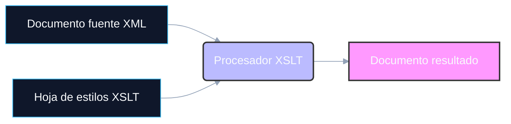
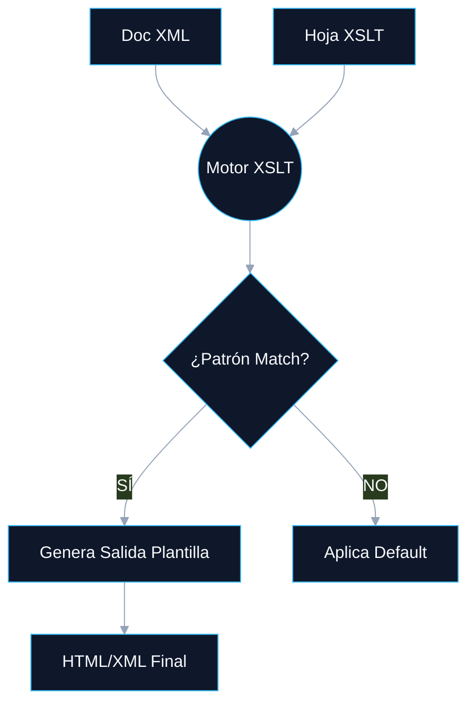

# <a id="indice"></a> 📚 Índice Dinámico: UT6.1 — XPath y XSLT

1. [Introducción a la Transformación de XML](#sec1)
2. [Técnicas de Transformación de Documentos XML](#sec2)
3. [XPath — Lenguaje de Rutas en XML](#sec3)
4. [XSLT — Lenguaje de Transformaciones](#sec4)
5. [Formatos de Salida](#sec5)
6. [Utilización de Plantillas — Técnicas Avanzadas](#sec6)
7. [Herramientas de Procesamiento XML (DOM vs SAX)](#sec7)
8. [Elaboración de Documentación](#sec8)
9. [Resumen y Conceptos Clave](#sec9)

---

## <a id="sec1"></a> 01 Introducción a la Transformación de XML

XML (eXtensible Markup Language) es universal para el almacenamiento e intercambio de datos, pero los datos en bruto requieren adaptación. **XPath** y **XSLT** trabajan juntos para transformar y dar formato a estos datos.

- **XPath**: Lenguaje de consulta. Navega y selecciona nodos dentro de un documento XML.
- **XSLT**: eXtensible Stylesheet Language Transformations. Define reglas para transformar un XML a HTML, PDF, texto plano, u otro XML.

> **💡 TIP Práctico:**
> Piensa en XPath como el "SQL pero para XML" y en XSLT como el motor que toma los resultados de esa consulta y genera la "vista" final o reporte.

> **🚀 COMPLEMENTO (Fuera de temario):**
> *NO ENTRA EN EXAMEN.* Actualmente, JSON ha desplazado a XML en muchas APIs web (REST), usando herramientas equivalentes como **JSONPath** en lugar de XPath, y **jq** en lugar de XSLT. Sin embargo, en arquitecturas empresariales (SOAP, Finanzas, Facturación Electrónica), XSLT y XPath siguen siendo líderes indiscutibles.

[🏠 Volver al Índice](#indice)

---

## <a id="sec2"></a> 02 Técnicas de Transformación de Documentos XML

### Estrategias Técnicas Disponibles

| Tecnología | Tipo | Caso de uso principal |
| :--- | :--- | :--- |
| **XSLT** | Declarativo | Transformación estándar de documentos y reportes (W3C). |
| **DOM / SAX** | APIs | Programación directa en código (Java, C#, etc.) para lógicas complejas. |
| **XQuery** | Funcional | Consultas avanzadas en Bases de Datos nativas XML. |
| **STX** | Streaming | Transformación de XML gigantes (Gigabytes) que no caben en memoria. |

### Flujo del Proceso XSLT



[🏠 Volver al Índice](#indice)

---

## <a id="sec3"></a> 03 XPath — Lenguaje de Rutas en XML

XPath ve un documento XML como un árbol de nodos (Raíz, elemento, atributo, texto, comentario, instrucción de procesamiento y espacio de nombres).

### Ejes de Localización y Expresiones Abreviadas

Cada paso XPath sigue la estructura: `eje::test-de-nodo[predicado]`

| Abreviatura | Eje Completo | Descripción |
| :--- | :--- | :--- |
| **.** | `self::node()` | Nodo actual. |
| **..** | `parent::node()` | Nodo padre. |
| **/** | - | Separador / Ruta desde la raíz. |
| **//** | `descendant-or-self::node()/`| Cualquier lugar en la descendencia. |
| **@nombre** | `attribute::nombre` | Llama a un atributo específico. |
| **\*** | `child::*` | Cualquier elemento hijo. |

### Predicados de Filtrado

Los predicados `[ ]` aplican lógica condicional para seleccionar nodos específicos:

```xpath
libro[1]                   <!-- Selecciona el primero -->
libro[last()]              <!-- Selecciona el último -->
libro[@id='001']           <!-- Filtrado por valor de atributo -->
libro[precio > 20]         <!-- Filtrado numérico -->
libro[position() mod 2 = 0]<!-- Filtrado posicional (pares) -->
```

> **💡 TIP Práctico:**
> ¡Cuidado con el índice! XPath utiliza **1-index** (empieza a contar desde 1), a diferencia de Java o JavaScript que utilizan **0-index** (empiezan desde 0). Así, `[1]` devuelve el primer elemento, no el segundo.

### Funciones Principales

- **Cadenas:** `string()`, `concat()`, `contains()`, `starts-with()`, `substring()`, `string-length()`
- **Numéricas:** `count()`, `sum()`, `round()`, `floor()`, `ceiling()`
- **Booleanas:** `not()`, `true()`, `false()`
- **Conjunto:** `last()`, `position()`, `id()`

[🏠 Volver al Índice](#indice)

---

## <a id="sec4"></a> 04 XSLT — Lenguaje de Transformaciones

XSLT es XML. Utiliza **plantillas (`<xsl:template>`)** desencadenadas por **patrones (`match="nodo"`)**.

### Estructura Base y xsl:output

```xml
<?xml version="1.0" encoding="UTF-8"?>
<xsl:stylesheet version="1.0" xmlns:xsl="http://www.w3.org/1999/XSL/Transform">
  
  <xsl:output method="html" encoding="UTF-8" indent="yes"/>

  <xsl:template match="/">
    <!-- Plantilla raíz que inicia el proceso -->
  </xsl:template>

</xsl:stylesheet>
```
*Atributos de `xsl:output`: method (html, xml, text), encoding, indent (yes/no).*

### Instrucciones de Control XSLT Imprescindibles

| Etiqueta | Función principal |
| :--- | :--- |
| `<xsl:value-of select="ruta"/>` | Extrae y muestra el texto de un nodo. |
| `<xsl:apply-templates/>` | Delega el proceso a otras plantillas (Magia XSLT). |
| `<xsl:for-each select="ruta">` | Bucle tradicional iterativo. |
| `<xsl:sort select="ruta"/>` | Ordena los nodos dentro de un bucle o apply. |
| `<xsl:if test="condicion">` | Renderizado condicional simple. |
| `<xsl:choose> / <xsl:when> / <xsl:otherwise>` | Condicional dinámico (como un `switch`). |

> **💡 TIP Práctico:**
> Usa `<xsl:apply-templates/>` cuando no sepas el orden del documento o quieras componentes reutilizables. Usa `<xsl:for-each>` si necesitas pintar rápidamente una simple tabla y conoces exactamente la estructura de datos.



[🏠 Volver al Índice](#indice)

---

## <a id="sec5"></a> 05 Formatos de Salida

XSLT cambia el modo de salida mediante `method` en `<xsl:output>`:

1. **`method="html"`:** Salida directa para navegadores web. Permite construir tablas, divs semánticos, inyectando datos.
2. **`method="xml"`:** Sirve para filtrar y reestructurar; como un middleware ("Pipeline") de datos.
3. **`method="text"`:** Produce CSV, código o JSON simple. Útil en integraciones de sistemas. Ignora las etiquetas y solo extrae valores con `xsl:value-of` o emite texto con `xsl:text`.

### PDF (XSL-FO)
Para generar un PDF no se hace directamente XSLT -> PDF. Requiere un paso intermedio:
1. XSLT -> transforma a **XSL-FO** (Formatting Objects).
2. Procesador FO (ej. Apache FOP) -> transforma **XSL-FO** a **PDF**.

> **🚀 COMPLEMENTO (Fuera de temario):**
> *NO ENTRA EN EXAMEN.* Actualmente, muchas empresas evitan XSL-FO por su curva de aprendizaje, prefiriendo bibliotecas HTML-to-PDF (como Puppeteer o wkhtmltopdf). Transforman XML a HTML con XSLT y luego imprimen el HTML a PDF usando motores Chromium.

[🏠 Volver al Índice](#indice)

---

## <a id="sec6"></a> 06 Utilización de Plantillas — Técnicas Avanzadas

### Prioridad de Plantillas (Especificidad)

Si hay conflicto (dos plantillas que encajan para el mismo nodo), prima la más **específica**:

| Patrón | Prioridad | Ejemplo |
| :--- | :--- | :--- |
| Predicado | 0.5 | `libro[@id]` |
| Camino | 0.5 | `catalogo/libro` |
| Nombre simple | 0.0 | `libro` |
| Comodín / Raíz | -0.5 | `*`, `/` |

### Parámetros, Variables, y Modos

*   **`mode`:** Permite reciclar plantillas (ej: `<xsl:template match="libro" mode="resumen">`).
*   **Variables:** `<xsl:variable name="iva" select="0.21"/>` Son inmutables.
*   **Parámetros:** `<xsl:param name="moneda"/>`. Permiten pasar argumentos en llamadas a plantillas.
*   **Import / Include:** 
    *   `<xsl:include href="...">`: Misma prioridad que la hoja actual.
    *   `<xsl:import href="...">`: Menor prioridad (se puede sobrescribir/override).

[🏠 Volver al Índice](#indice)

---

## <a id="sec7"></a> 07 Herramientas de Procesamiento XML (DOM vs SAX)

Cuando XSLT no es suficiente, se usan APIs desde lenguajes (Java, JS, etc.). Existen dos grandes familias:

### 1. DOM (Document Object Model)

*   **¿Cómo funciona?** Carga **TODO** el XML a la memoria RAM como un árbol interactivo.
*   **Ventajas:** Acceso aleatorio (puedes leer de abajo arriba), permite **modificación/inserción**.
*   **Desventajas:** Gran consumo de memoria. No apto para ficheros gigantes.
*   **Interfaces Clave (Java):** `Document`, `Element`, `Node`, `NodeList`.

### 2. SAX (Simple API for XML)

*   **¿Cómo funciona?** Lectura **Streaming orientada a eventos**. Carga línea a línea. No hay memoria del "todo".
*   **Ventajas:** Ultrarrápido, consumo de memoria casi nulo. Puede parsear un XML de 15GB en un portátil.
*   **Desventajas:** Solo lectura hacia adelante. NO permite modificar. Requiere lógica manual (guardar estados con booleanos en Java).
*   **Eventos Clave:** `startDocument()`, `startElement()`, `characters()`, `endElement()`.

### Tabla de Decisión Rápida

| ¿Qué necesitas? | Tecnología Elegida |
| :--- | :--- |
| Consultar y alterar atributos (Ej: Editor gráfico) | **DOM** |
| Extraer una lista de 1 millón de clientes (BD gigas) | **SAX** |
| Mostrar un catálogo en una página web estática | **XSLT** |

[🏠 Volver al Índice](#indice)

---

## <a id="sec8"></a> 08 Elaboración de Documentación

Al igual que Java usa Javadoc, el ecosistema XML tiene buenas prácticas de documentación.

- **Esquemas XSD:** Uso de etiquetas estructuradas `<xs:annotation>` y `<xs:documentation>` dentro del propio esquema de validación.
- **Hojas XSLT:** Se usan comentarios XML puros `<!-- ... -->`.
- **Generación Automática:** Herramientas como **xs3p** o editores profesionales comerciales como **oXygen XML Editor** generan manuales HTML similares a Javadoc a partir de estas anotaciones.

> **💡 TIP Práctico:**
> Acostúmbrate a crear un "CHANGELOG" o cabecera descriptiva multilínea `<!-- -->` en las hojas XSLT del proyecto informando sobre el autor, el nodo contexto, las variables requeridas y la salida esperada. Ahorrarás horas a tus compañeros de equipo.

[🏠 Volver al Índice](#indice)

---

## <a id="sec9"></a> 09 Resumen y Conceptos Clave

1.  **XPath** explora el documento; **XSLT** lo transforma.
2.  Formatos resultantes: **html, xml o text**. (PDF mediante XSL-FO intermedio).
3.  **XPath** se apoya en *ejes*, *predicados []* y *funciones predefinidas*.
4.  **`<xsl:template>`** se basa en un paradigma declarativo, disparado por **`<xsl:apply-templates>`**.
5.  **DOM** almacena todo el XML en un árbol en memoria (ideal para lectura/escritura en tamaños moderados).
6.  **SAX** funciona mediante captura de eventos en tiempo real (ideal para archivos inmensos, solo lectura).

[🏠 Volver al Índice](#indice)

---
