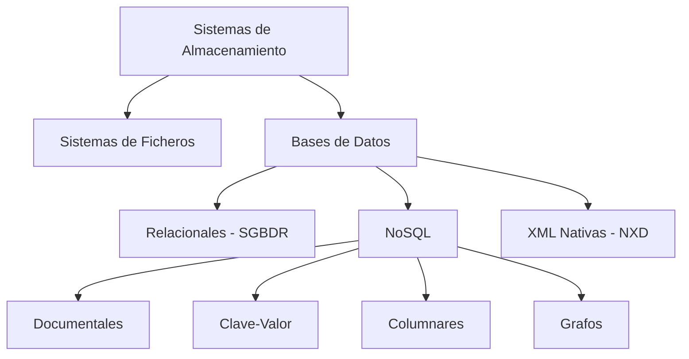
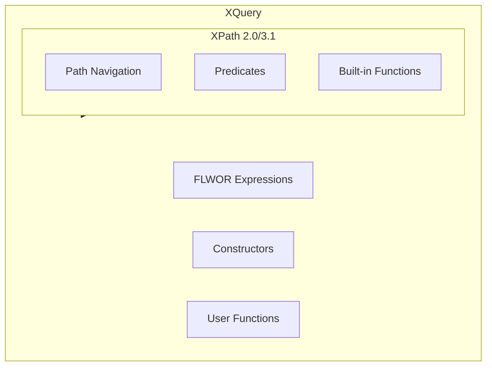
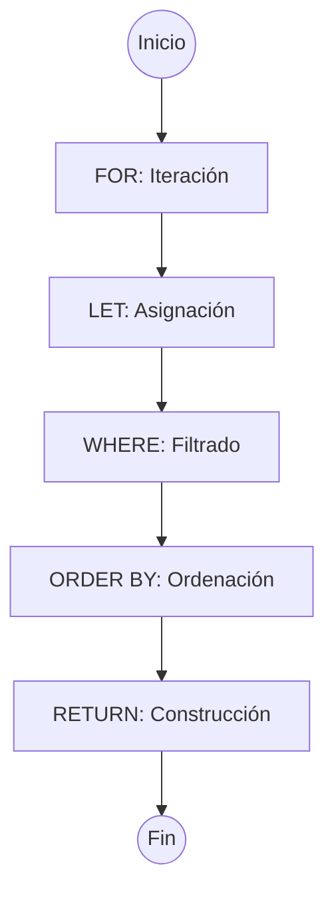
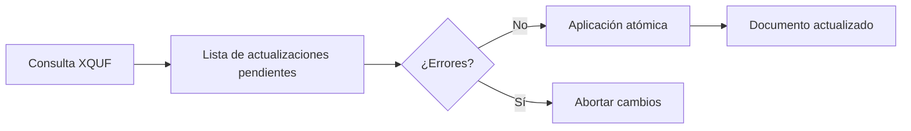
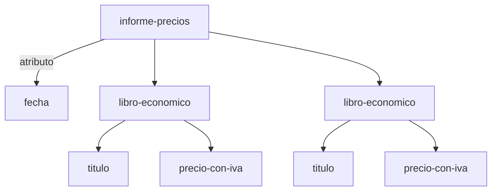
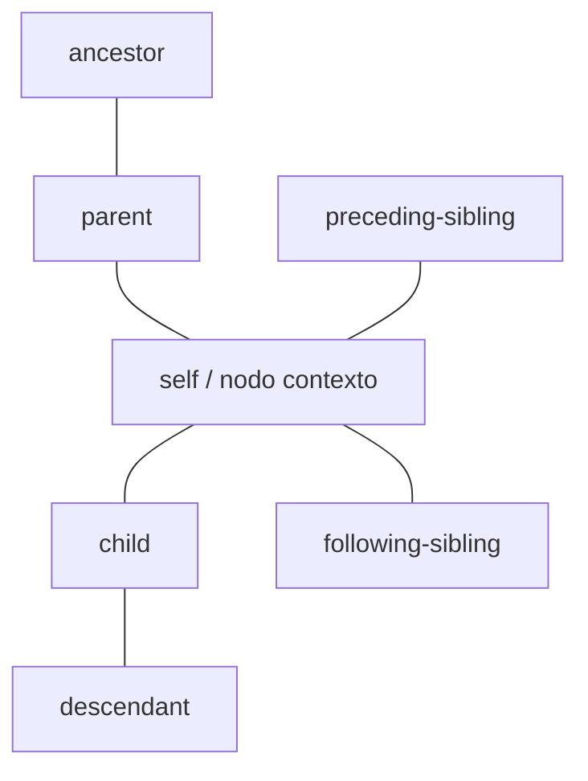
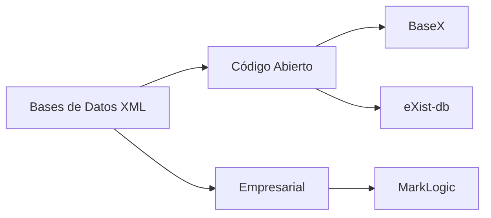
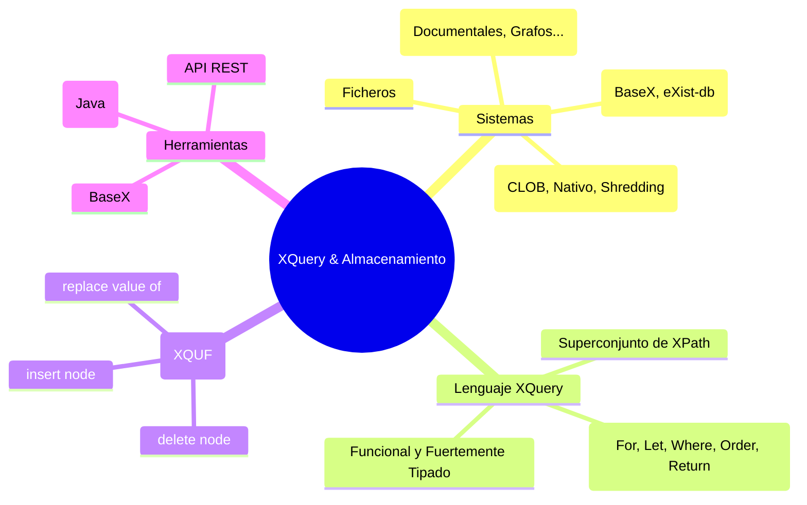

# UT7.1 — XQuery

## 01 Sistemas de Almacenamiento de Información

El almacenamiento de información es uno de los pilares fundamentales en el desarrollo de aplicaciones y sistemas informáticos modernos. Comprender los distintos modelos y tecnologías disponibles permite elegir la solución más adecuada en cada contexto, especialmente cuando se trabaja con datos estructurados en formato XML.

### Clasificación de los Sistemas de Almacenamiento
Los sistemas de almacenamiento de información pueden clasificarse en función de varios criterios: el modelo de datos que utilizan, la forma en que organizan la información y el tipo de acceso que permiten.



### Sistemas de Ficheros
El sistema de ficheros es la forma más básica de almacenamiento persistente. Los datos se guardan en archivos organizados en directorios jerárquicos dentro del sistema operativo.

*   **Ventajas:** sencillez, universalidad, bajo coste.
*   **Inconvenientes:** falta de mecanismos de consulta avanzada, difícil control de concurrencia, sin integridad referencial.
*   **Uso habitual para XML:** almacenamiento de archivos .xml individuales, configuraciones, intercambio de datos.

### Bases de Datos Relacionales (SGBDR)
Las bases de datos relacionales organizan la información en tablas con filas y columnas, usando SQL como lenguaje de consulta y manipulación. Son el modelo más extendido en aplicaciones empresariales.

| Característica | Descripción |
| :--- | :--- |
| **Modelo de datos** | Tablas relacionales (entidad-relación) |
| **Lenguaje de consulta** | SQL (Structured Query Language) |
| **Integridad** | Claves primarias, foráneas, restricciones |
| **Transacciones** | ACID (Atomicidad, Consistencia, Aislamiento, Durabilidad) |
| **Soporte XML** | Extensiones: XML columns, FOR XML (SQL Server), XMLType (Oracle) |
| **Ejemplos** | MySQL, PostgreSQL, Oracle, SQL Server, MariaDB |

### Bases de Datos NoSQL
Las bases de datos NoSQL surgieron para satisfacer necesidades de escalabilidad horizontal, esquemas flexibles y grandes volúmenes de datos no estructurados o semi-estructurados.

| Tipo NoSQL | Características | Ejemplos |
| :--- | :--- | :--- |
| **Documentales** | Almacenan documentos JSON/BSON/XML con esquema flexible | MongoDB, CouchDB, MarkLogic |
| **Clave-Valor** | Pares clave-valor, muy rápidas, sin estructura interna | Redis, DynamoDB, Riak |
| **Columnares** | Datos organizados por columnas, ideal para analytics | Cassandra, HBase, Bigtable |
| **Grafos** | Nodos y relaciones, consultas de caminos y redes | Neo4j, ArangoDB, Amazon Neptune |

### Bases de Datos XML Nativas (NXD)
Las bases de datos XML nativas están específicamente diseñadas para almacenar, recuperar y manipular documentos XML, preservando su estructura jerárquica original sin necesidad de mapear a un modelo relacional.

*   Almacenan el documento XML completo como unidad básica de almacenamiento.
*   Preservan el orden de los elementos, los comentarios y las instrucciones de procesamiento.
*   Utilizan XQuery y XPath como lenguajes nativos de consulta.
*   Soportan índices sobre nodos XML para mejorar el rendimiento de las consultas.
*   **Ejemplos:** eXist-db, BaseX, MarkLogic, Sedna.

> **Nota conceptual**
> Una base de datos XML nativa trata el documento XML como la unidad atómica de almacenamiento, en contraposición a los sistemas que descomponen el XML en tablas relacionales. Esto la hace ideal para documentos con estructura irregular o variable.

---

## 02 Almacenamiento de XML en Bases de Datos Relacionales

Cuando necesitamos almacenar datos XML en un SGBDR existen varias estrategias, cada una con sus ventajas e inconvenientes según el caso de uso.

### Almacenamiento como CLOB/texto
El documento XML se guarda íntegro en un campo de texto largo (CLOB: Character Large Object). Es la opción más simple pero no permite consultas eficientes sobre el contenido XML.

```sql
-- SQL Server: almacenar XML como texto
CREATE TABLE documentos (
    id        INT PRIMARY KEY,
    nombre    VARCHAR(100),
    contenido TEXT  -- o CLOB en Oracle
);
INSERT INTO documentos VALUES (
    1, 'catalogo',
    '<catalogo><producto id="1"><nombre>Libro</nombre></producto></catalogo>'
);
```

**Explicación:**
Este ejemplo muestra la forma más sencilla de guardar XML en una base de datos relacional. `CREATE TABLE documentos` crea una tabla con tres columnas; la columna `contenido` es de tipo `TEXT` (en SQL Server) o `CLOB` (en Oracle), permitiendo almacenar cadenas muy largas. El `INSERT` guarda el documento XML completo como una cadena de texto normal: el SGBD no "entiende" el XML.

*   ⚠️ **Limitación:** no se pueden hacer consultas sobre los elementos internos del XML sin extraerlo y procesarlo manualmente.
*   ✔️ **Ventaja:** es la opción más portable y simple; funciona en cualquier base de datos.

### Tipo de dato XML nativo en SGBDR
Los principales SGBDR modernos incorporan un tipo de dato XML específico que permite almacenar documentos bien formados y realizar consultas XPath/XQuery sobre ellos.

```sql
-- SQL Server: columna de tipo XML
CREATE TABLE pedidos (
    id        INT PRIMARY KEY,
    fecha     DATE,
    datos_xml XML
);
INSERT INTO pedidos VALUES (
    1, '2025-03-15',
    '<pedido><cliente>Ana García</cliente><total>250.00</total></pedido>'
);
-- Consulta con XQuery sobre columna XML (SQL Server)
SELECT datos_xml.query('/pedido/cliente/text()') AS cliente
FROM pedidos;
```

**Explicación:**
`datos_xml XML`: la columna se declara con el tipo XML específico del SGBD. El motor valida que el contenido esté bien formado antes de almacenarlo. `datos_xml.query('/pedido/cliente/text()')`: el método `.query()` acepta una expresión XQuery/XPath y la ejecuta directamente sobre el XML almacenado.

*   ✔️ **Ventaja frente a CLOB:** permite consultas eficientes sobre el contenido XML sin extraerlo manualmente. El motor puede crear índices XML para acelerar las búsquedas.

### Descomposición relacional (shredding)
Consiste en analizar la estructura del XML y mapear sus elementos y atributos a columnas de tablas relacionales. Permite consultas SQL eficientes pero pierde la estructura original del documento.

```sql
-- Ejemplo de shredding: XML de productos a tabla relacional
CREATE TABLE productos (
    id     INT PRIMARY KEY,
    nombre VARCHAR(100),
    precio DECIMAL(10,2)
);
-- En SQL Server, usando OPENXML para importar desde XML:
EXEC sp_xml_preparedocument @hdoc OUTPUT, @xml_doc
INSERT INTO productos
SELECT * FROM OPENXML(@hdoc, '/productos/producto', 1)
  WITH (id INT '@id', nombre VARCHAR(100) 'nombre', precio DECIMAL(10,2) 'precio')
```

**Explicación:**
`sp_xml_preparedocument`: analiza el documento XML referenciado por `@xml_doc` y devuelve un manejador interno `@hdoc` para usarlo con OPENXML. `OPENXML(@hdoc, '/productos/producto', 1)`: recorre los nodos que coinciden con la ruta XPath y los expone como filas. La cláusula `WITH` define la correspondencia entre nodos XML y columnas.

*   ⚠️ Este enfoque "destruye" la jerarquía del XML al convertirlo en filas planas.
*   ✔️ **Ventaja:** los datos resultantes son consultables con SQL estándar sin XQuery.
## 03 Introducción a XQuery

XQuery es el lenguaje estándar del W3C para consultar y transformar datos XML. Es a XML lo que SQL es a las bases de datos relacionales: permite seleccionar, filtrar, transformar y generar documentos XML de forma declarativa y potente.

> **Estándar W3C**  
> XQuery 1.0 fue publicado como recomendación del W3C en 2007. XQuery 3.1, la versión más reciente, añade soporte para mapas, arrays y datos JSON. XQuery se basa en XPath 2.0 (o 3.1 en versiones modernas) y extiende sus capacidades con expresiones de consulta completas.

| Versión | Año | Novedades principales |
| :--- | :--- | :--- |
| XQuery 1.0 | 2007 | Versión inicial: FLWOR, funciones, tipos XSD |
| XQuery 3.0 | 2014 | Funciones de orden superior, try-catch, switch |
| XQuery 3.1 | 2017 | Mapas, arrays, soporte JSON, operador ? |

### Relación con XPath
XQuery es un superconjunto de XPath: toda expresión XPath válida es también una expresión XQuery válida. XPath se usa para navegar por la estructura del documento XML, mientras XQuery añade la capacidad de formular consultas completas, declarar variables, iterar sobre secuencias y construir nuevos documentos.



> **Nota**  
> XQuery trabaja con el modelo de datos **XDM** (XQuery and XPath Data Model), que representa cualquier documento XML como un árbol de nodos. Los tipos de nodos son: documento, elemento, atributo, texto, comentario, instrucción de procesamiento y espacio de nombres.

---

## 04 Sintaxis Fundamental: Expresiones FLWOR

El núcleo de XQuery son las expresiones **FLWOR** (pronunciado "flower"), que permiten consultas complejas de forma estructurada. FLWOR es el acrónimo de sus cláusulas: **F**or, **L**et, **W**here, **O**rder by, **R**eturn.

| Cláusula | Función | Obligatoria |
| :--- | :--- | :--- |
| **FOR** | Itera sobre una secuencia de nodos o valores, vinculando cada uno a una variable | No (pero return sí) |
| **LET** | Asigna una expresión entera a una variable (sin iterar) | No |
| **WHERE** | Filtra los resultados mediante una condición booleana | No |
| **ORDER BY** | Ordena los resultados por una o más expresiones | No |
| **RETURN** | Define la estructura del resultado para cada iteración | **Sí** |

### Ejemplo completo de expresión FLWOR

```xquery
(: Consulta FLWOR: libros con precio mayor a 10€ ordenados por título :)
for $libro in doc('biblioteca.xml')/biblioteca/libro
let $precio := $libro/precio
where number($precio) > 10
order by $libro/titulo ascending
return
  <resultado>
    <titulo>{ $libro/titulo/text() }</titulo>
    <autor>{ $libro/autor/text() }</autor>
    <precio>{ $precio/text() }</precio>
  </resultado>
```

**Explicación:**

*   **`for $libro in doc('biblioteca.xml')/biblioteca/libro`**: itera sobre cada elemento `<libro>`. La variable `$libro` toma el valor de cada nodo en cada iteración. `doc()` carga el archivo XML.
*   **`let $precio := $libro/precio`**: a diferencia de `for`, `let` no itera: crea un alias para reutilizar la expresión.
*   **`where number($precio) > 10`**: filtra los libros cuyo precio, convertido a número, supera 10.
*   **`order by $libro/titulo ascending`**: ordena los resultados alfabéticamente (ascending = A→Z).
*   **`return <resultado>...</resultado>`**: construye el XML de salida. Las llaves `{}` insertan valores dinámicos.

**Resultado:** un `<resultado>` por cada libro con precio > 10, ordenados alfabéticamente.


## 05 Inserción y Actualización de Información

XQuery Update Facility (XQUF) es una extensión del W3C que añade capacidades de modificación a XQuery. Permite insertar, eliminar, reemplazar y renombrar nodos dentro de documentos XML. Las operaciones siguen un modelo de **evaluación pendiente**: todas las modificaciones se acumulan y se aplican al final, de forma atómica.



| Expresión | Función | Sintaxis básica |
| :--- | :--- | :--- |
| **insert node** | Inserta nuevos nodos | `insert node <nodo> into/after/before <destino>` |
| **delete node** | Elimina nodos | `delete node <expresión>` |
| **replace node** | Reemplaza un nodo completo | `replace node <nodo> with <nuevo-nodo>` |
| **replace value of** | Reemplaza el valor de un nodo | `replace value of <nodo> with <valor>` |
| **rename node** | Renombra un elemento o atributo | `rename node <nodo> as <nuevo-nombre>` |

### Expresión insert node
Permite añadir nuevos nodos a un documento XML existente. Se puede insertar antes, después, al principio o al final de un nodo.

```xquery
(: Ejemplo 1: Insertar un nuevo libro al final de la biblioteca :)
insert node
  <libro id='4'>
    <titulo>Fortunata y Jacinta</titulo>
    <autor>Galdós</autor>
    <precio>22.00</precio>
  </libro>
into doc('biblioteca.xml')/biblioteca

(: Ejemplo 2: Insertar un atributo en un nodo existente :)
insert node attribute stock { 'disponible' }
into doc('biblioteca.xml')/biblioteca/libro[@id='1']

(: Ejemplo 3: Insertar nodo después de un elemento :)
insert node <editorial>Anaya</editorial>
after doc('biblioteca.xml')/biblioteca/libro[@id='1']/titulo
```

**Explicación:**
*   **Ejemplo 1 — `into`:** añade el nodo `<libro id='4'>` como hijo de `<biblioteca>`. Por defecto `into` lo inserta al final (equivale a `as last into`).
*   **Ejemplo 2 — `attribute stock { 'disponible' }`:** forma especial para insertar un atributo. Tras ejecutarlo, ese libro tendrá `stock="disponible"`.
*   **Ejemplo 3 — `after`:** inserta `<editorial>` como hermano inmediatamente posterior a `<titulo>`. Otras posiciones: `before`, `as first into`, `as last into`.

### Expresión replace value of
Permite modificar el valor del contenido de un nodo sin cambiar su posición en el árbol del documento.

```xquery
(: Actualizar el precio de un libro :)
replace value of
    doc('biblioteca.xml')/biblioteca/libro[@id='2']/precio
with '14.50'

(: Actualizar el valor de un atributo :)
replace value of
    doc('biblioteca.xml')/biblioteca/libro[@id='1']/@id
with '10'
```

**Explicación:**
`replace value of` modifica el contenido de un nodo sin cambiar su posición. El Ejemplo 1 selecciona `<precio>` del libro con `id='2'` y reemplaza su texto por `'14.50'`. El Ejemplo 2 hace lo mismo sobre un atributo.

*   **Diferencia clave con `replace node`:** `replace value of` solo cambia el contenido; `replace node` sustituye el nodo completo (nombre, atributos e hijos incluidos).
*   ⚠️ Si la ruta devolviera varios nodos se producirá un error: solo se puede actualizar uno.

---

## 06 Extracción de Información

La extracción de información es la operación más frecuente en XQuery. A través de expresiones de ruta XPath y expresiones FLWOR podemos acceder a cualquier parte de un documento XML.

### Expresiones de Ruta (Path Expressions)

```xquery
(: Acceso a todos los títulos de libros :)
doc('biblioteca.xml')/biblioteca/libro/titulo/text()

(: Acceso con predicado: libro con id igual a '1' :)
doc('biblioteca.xml')/biblioteca/libro[@id='1']

(: Ruta abreviada con // (descendiente en cualquier nivel) :)
doc('biblioteca.xml')//titulo

(: Selección de atributo :)
doc('biblioteca.xml')/biblioteca/libro/@id

(: Función count para contar nodos :)
count(doc('biblioteca.xml')/biblioteca/libro)
```

**Explicación:**
*   **`/biblioteca/libro/titulo/text()`**: ruta absoluta desde la raíz. Cada `/` baja un nivel. `text()` extrae solo el contenido textual (sin etiquetas).
*   **`libro[@id='1']`**: el predicado `[]` filtra nodos. `@id` accede al atributo.
*   **`//titulo`**: el doble barra significa "en cualquier nivel de profundidad". Es cómodo pero puede ser lento en documentos grandes.
*   **`count(...)`**: función de agregación que cuenta cuántos nodos coinciden con la expresión.

### Construcción de Resultados XML
XQuery permite construir nuevos documentos XML como resultado de una consulta, mezclando contenido extraído con estructuras XML definidas directamente en la consulta.

```xquery
(: Generar un nuevo documento XML con los datos extraídos :)
<informe-precios fecha='{current-date()}'>
{
  for $libro in doc('biblioteca.xml')/biblioteca/libro
  where number($libro/precio) < 15
  return
    <libro-economico>
      <titulo>{ data($libro/titulo) }</titulo>
      <precio-con-iva>{ number($libro/precio) * 1.21 }</precio-con-iva>
    </libro-economico>
}
</informe-precios>
```

**Explicación:**
*   `<informe-precios fecha='{current-date()}'>`: el atributo `fecha` se rellena dinámicamente. Las llaves `{}` dentro de atributos permiten expresiones XQuery.
*   `data($libro/titulo)`: extrae el valor tipado (el texto) de un nodo. Similar a `text()` pero más robusta con tipos XSD.
*   `number($libro/precio) * 1.21`: calcula el precio con IVA (21%) directamente en el `return`.

**Resultado:** un `<informe-precios>` con un `<libro-economico>` por cada libro con precio < 15€, mostrando título y precio con IVA calculado.


## 07 Técnicas de Búsqueda de Información en Documentos XML

La búsqueda eficiente de información en documentos XML requiere conocer en profundidad las distintas técnicas y funciones que ofrece XQuery, así como los mecanismos de indexación disponibles en las bases de datos XML nativas.

### XPath y los Ejes de Navegación
Los ejes de XPath son los mecanismos fundamentales para navegar por la estructura árbol de un documento XML. Cada eje define una dirección o relación de parentesco respecto al nodo de contexto.



| Eje | Abreviatura | Descripción | Ejemplo |
| :--- | :--- | :--- | :--- |
| **child** | (defecto) | Hijos directos del nodo de contexto | `libro/titulo` |
| **attribute** | @ | Atributos del nodo de contexto | `@id` |
| **descendant** | // | Todos los descendientes (hijos, nietos, etc.) | `//titulo` |
| **parent** | .. | Nodo padre del nodo de contexto | `../autor` |
| **self** | . | El propio nodo de contexto | `.` |
| **ancestor** | (explícito) | Todos los ancestros hasta la raíz | `ancestor::biblioteca` |
| **following-sibling** | (explícito) | Hermanos que le siguen en el documento | `following-sibling::precio` |
| **preceding-sibling** | (explícito) | Hermanos que le preceden en el documento | `preceding-sibling::titulo` |

```xquery
(: Eje ancestor: encontrar el libro que contiene un título específico :)
doc('biblioteca.xml')//titulo[.='Don Quijote']/ancestor::libro

(: Eje following-sibling: obtener el precio de cada libro :)
doc('biblioteca.xml')/biblioteca/libro/titulo/following-sibling::precio

(: Eje descendant: todos los elementos de texto dentro de un libro :)
doc('biblioteca.xml')/biblioteca/libro[@id='1']/descendant::text()
```

**Explicación:**
*   **`//titulo[.='Don Quijote']/ancestor::libro`**: busca el `<titulo>` con texto 'Don Quijote' y sube por `ancestor` hasta encontrar `<libro>`. Muy útil cuando se conoce el valor de un hijo pero se necesita el padre o abuelo.
*   **`/titulo/following-sibling::precio`**: desde `<titulo>`, selecciona los hermanos que vienen después (mismo padre, posición posterior).
*   **`/libro[@id='1']/descendant::text()`**: el eje `descendant` selecciona todos los descendientes. `text()` filtra solo los nodos de texto.

### Predicados y Condiciones de Búsqueda
Los predicados son expresiones entre corchetes que filtran los nodos seleccionados por una expresión de ruta. Pueden ser condiciones booleanas, comparaciones, posiciones o llamadas a funciones.

```xquery
(: Predicados de posición :)
doc('biblioteca.xml')/biblioteca/libro[1]           (: primer libro :)
doc('biblioteca.xml')/biblioteca/libro[last()]      (: último libro :)
doc('biblioteca.xml')/biblioteca/libro[position()<=2] (: primeros dos :)

(: Operadores de valor: eq, ne, lt, gt, le, ge :)
doc('biblioteca.xml')/biblioteca/libro[precio/text() eq '18.50']

(: Operadores generales: =, !=, <, >, <=, >= :)
doc('biblioteca.xml')/biblioteca/libro[precio > 15]

(: Predicados combinados con and / or :)
doc('biblioteca.xml')/biblioteca/libro[precio > 10 and precio < 20]

(: Predicado de existencia de nodo hijo :)
doc('biblioteca.xml')/biblioteca/libro[editorial]

(: Búsqueda por atributo :)
doc('biblioteca.xml')/biblioteca/libro[@stock='disponible']
```

**Explicación:**
*   **Operadores de valor** (`eq, ne, lt, gt, le, ge`): comparan valores atómicos uno a uno. Requieren que ambos lados sean un único valor.
*   **Operadores generales** (`=, !=, <, >`): comparan secuencias. Son más permisivos con secuencias de nodos.
*   **`[editorial]`**: predicado de existencia. Verdadero si el elemento `<editorial>` existe como hijo.
*   **`[@stock='disponible']`**: filtra por valor de atributo.

### Funciones de Cadena para Búsqueda

| Función | Descripción | Ejemplo |
| :--- | :--- | :--- |
| **contains(s, sub)** | Comprueba si s contiene la subcadena sub | `contains($titulo, 'Java')` |
| **starts-with(s, pre)** | Comprueba si s empieza por pre | `starts-with($nombre, 'A')` |
| **ends-with(s, suf)** | Comprueba si s termina por suf | `ends-with($fichero, '.xml')` |
| **substring(s, ini, len)** | Extrae una parte de la cadena | `substring($texto, 1, 5)` |
| **string-length(s)** | Devuelve la longitud de la cadena | `string-length($nombre)` |
| **upper-case(s)** | Convierte a mayúsculas | `upper-case($titulo)` |
| **lower-case(s)** | Convierte a minúsculas | `lower-case($titulo)` |
| **normalize-space(s)** | Elimina espacios extras | `normalize-space($descripcion)` |
| **matches(s, regex)** | Comprueba si s cumple la expresión regular | `matches($isbn, '[0-9]{13}')` |
| **replace(s, regex, rep)** | Sustituye según expresión regular | `replace($texto, '\s+', ' ')` |
| **tokenize(s, regex)** | Divide la cadena por el separador | `tokenize($lista, ',')` |

```xquery
(: Búsqueda de libros cuyo título contiene 'Quijote' :)
for $libro in doc('biblioteca.xml')/biblioteca/libro
where contains(lower-case($libro/titulo), 'quijote')
return $libro/titulo

(: Búsqueda con expresión regular: ISBN con formato correcto :)
for $libro in doc('catalogo.xml')//libro
where matches($libro/@isbn, '^[0-9]{3}-[0-9]{10}$')
return $libro
```

**Explicación:**
*   **`contains(lower-case($libro/titulo), 'quijote')`**: `lower-case()` convierte el título a minúsculas para hacer la búsqueda insensible a mayúsculas/minúsculas.
*   **`matches($libro/@isbn, '^[0-9]{3}-[0-9]{10}$')`**: `^` = inicio de cadena, `[0-9]{3}` = exactamente 3 dígitos, `-` = guión literal, `[0-9]{10}` = exactamente 10 dígitos, `$` = fin de cadena.
*   ✔️ Usar `lower-case()` junto con `contains()` es una práctica recomendable para búsquedas más robustas.

### Funciones Numéricas y de Agregación

| Función | Categoría | Descripción |
| :--- | :--- | :--- |
| **count()** | Agregación | Cuenta el número de ítems de una secuencia |
| **sum()** | Agregación | Suma los valores numéricos de una secuencia |
| **avg()** | Agregación | Calcula la media aritmética de una secuencia |
| **max()** | Agregación | Devuelve el valor máximo de una secuencia |
| **min()** | Agregación | Devuelve el valor mínimo de una secuencia |
| **abs()** | Numérica | Devuelve el valor absoluto de un número |
| **ceiling()** | Numérica | Redondea hacia arriba al entero más cercano |
| **floor()** | Numérica | Redondea hacia abajo al entero más cercano |
| **round()** | Numérica | Redondea al entero más próximo |
| **number()** | Numérica / Conv. | Convierte un valor a tipo numérico |

```xquery
let $precios := doc('biblioteca.xml')/biblioteca/libro/precio/text()
return
  <estadisticas>
    <total>{ sum($precios) }</total>
    <minimo>{ min($precios) }</minimo>
    <maximo>{ max($precios) }</maximo>
    <media>{ avg($precios) }</media>
    <cantidad>{ count($precios) }</cantidad>
  </estadisticas>

(: Suma condicional: solo libros disponibles :)
sum(
  for $libro in doc('biblioteca.xml')//libro[@stock='disponible']
  return number($libro/precio)
)
```

### Joins (Uniones) en XQuery
A diferencia de SQL, XQuery no tiene una cláusula JOIN explícita, pero podemos realizar uniones entre documentos usando variables anidadas en expresiones FLWOR.

```xquery
(: Join entre dos documentos XML: libros.xml y autores.xml :)
for $libro in doc('libros.xml')//libro
let $autor := doc('autores.xml')//autor[@id = $libro/@id-autor]
where exists($autor)
return
  <resultado>
    <titulo>{ data($libro/titulo) }</titulo>
    <autor-nombre>{ data($autor/nombre) }</autor-nombre>
    <autor-nacionalidad>{ data($autor/nacionalidad) }</autor-nacionalidad>
  </resultado>
```

**Explicación:**
*   **`let $autor := doc('autores.xml')//autor[@id = $libro/@id-autor]`**: para cada libro, busca en `autores.xml` el autor cuyo `@id` coincide con el `@id-autor` del libro. Esta es la "clave foránea" que une los dos documentos.
*   **`where exists($autor)`**: filtra los libros que tienen autor correspondiente. Sin esta cláusula, `$autor` podría ser vacío y generaría error al acceder a sus hijos.
*   ✔️ Este patrón (`for + let` con búsqueda en otro doc + `where exists`) es el Join estándar en XQuery.

---

## 08 XQuery como Lenguaje Completo

XQuery es un lenguaje funcionalmente completo: además de consultas, permite declarar funciones, módulos, variables globales y gestionar errores, lo que lo convierte en un lenguaje de programación de propósito general orientado al procesamiento de datos XML.

### Prólogo de la Consulta
El prólogo es la sección inicial opcional de una consulta XQuery donde se declaran versión, espacios de nombres, funciones, variables y opciones de configuración.

```xquery
xquery version '3.1';

declare default element namespace 'http://www.ejemplo.com/biblioteca';
declare namespace lib = 'http://www.ejemplo.com/biblioteca';

(: Declaración de variables globales :)
declare variable $IVA as xs:decimal := 0.21;
declare variable $RUTA as xs:string := 'datos/';

(: Declaración de función de usuario :)
declare function local:precio-con-iva($precio as xs:decimal) as xs:decimal {
    $precio * (1 + $IVA)
};

(: Cuerpo de la consulta :)
for $libro in doc(concat($RUTA, 'biblioteca.xml'))//libro
return
  <libro-iva precio='{ local:precio-con-iva(number($libro/precio)) }'>
    { data($libro/titulo) }
  </libro-iva>
```

**Explicación:**
*   **`xquery version '3.1'`**: declara la versión del estándar usada. Garantiza compatibilidad.
*   **`declare variable $IVA as xs:decimal := 0.21`**: constante global tipada. El tipo `xs:decimal` pertenece al esquema XML (XSD).
*   **`declare function local:precio-con-iva(...)`**: define una función reutilizable en el espacio de nombres `local`.

### Tipos de Datos en XQuery
XQuery es un lenguaje fuertemente tipado. Sus tipos se basan en el esquema XML (XSD) y en el modelo de datos XDM.

| Categoría | Tipos | Ejemplos de uso |
| :--- | :--- | :--- |
| **Numéricos** | `xs:integer, xs:decimal, xs:float, xs:double` | `xs:integer('42'), number($nodo)` |
| **Cadenas** | `xs:string, xs:normalizedString` | `xs:string($nodo), string($valor)` |
| **Fechas** | `xs:date, xs:time, xs:dateTime, xs:duration` | `xs:date('2025-03-15'), current-date()` |
| **Booleanos** | `xs:boolean` | `xs:boolean('true'), boolean($nodo)` |
| **Nodos** | `element(), attribute(), text(), node()` | `element libro, attribute id` |
| **Secuencias** | `item()*, xs:integer+, xs:string?` | `(1, 2, 3), ($a, $b)` |

### Expresiones Condicionales y Control de Flujo

| Expresión | Tipo | Descripción |
| :--- | :--- | :--- |
| **if-then-else** | Condicional | Evaluación condicional básica; la rama `else` es obligatoria |
| **for** | Iteración | Itera sobre una secuencia de nodos o valores (cláusula FLWOR) |
| **let** | Asignación | Liga un valor a una variable; no modifica el estado global |
| **where** | Filtrado | Filtra los ítems de la iteración según una condición booleana |
| **order by** | Ordenación | Ordena el resultado según criterios ascendentes o descendentes |
| **some/every ... satisfies** | Cuantificadores | Comprueban si algún o todos los ítems cumplen una condición |
| **typeswitch** | Condicional | Ramifica la ejecución según el tipo XQuery de un valor |

```xquery
(: Expresión if-then-else :)
for $libro in doc('biblioteca.xml')//libro
return
  if (number($libro/precio) > 20)
  then <libro tipo='premium'>{ data($libro/titulo) }</libro>
  else <libro tipo='estandar'>{ data($libro/titulo) }</libro>

(: Expresión switch (XQuery 3.0+) :)
for $libro in doc('biblioteca.xml')//libro
return switch($libro/@categoria)
  case 'novela'    return <genero>Narrativa</genero>
  case 'poesia'    return <genero>Lírica</genero>
  case 'ensayo'    return <genero>No Ficción</genero>
  default          return <genero>Sin clasificar</genero>

(: Manejo de errores: try-catch (XQuery 3.0+) :)
try {
    let $doc := doc('archivo.xml')
    return $doc//titulo
} catch * {
    <error codigo='{ $err:code }'>{ $err:description }</error>
}
```

### Funciones de Usuario y Módulos
XQuery permite definir bibliotecas de funciones reutilizables mediante módulos de biblioteca.

```xquery
(: Archivo: lib-utilidades.xqm - Módulo de biblioteca :)
module namespace util = 'http://mi-empresa.com/utilidades';

declare function util:formato-precio($precio as xs:decimal) as xs:string {
    concat(format-number($precio, '#,##0.00'), ' €')
};

declare function util:aplicar-descuento(
    $precio as xs:decimal,
    $porcentaje as xs:decimal) as xs:decimal {
    $precio * (1 - $porcentaje div 100)
};

(: ---- En la consulta principal: ---- :)
xquery version '3.1';
import module namespace util = 'http://mi-empresa.com/utilidades'
    at 'lib-utilidades.xqm';

for $libro in doc('biblioteca.xml')//libro
return
  <precio-oferta>{ util:formato-precio(util:aplicar-descuento($libro/precio, 10)) }</precio-oferta>
```

**Explicación:**
*   **`module namespace util = 'URI'`**: declara que el archivo es un módulo (`.xqm`).
*   **`import module ... at '...'`**: la URI debe coincidir exactamente con la declarada en el módulo.
*   ✔️ Los módulos evitan duplicar código: varias consultas pueden importar las mismas funciones.
## 09 Herramientas de Tratamiento y Almacenamiento

El ecosistema XQuery cuenta con una amplia variedad de herramientas para diferentes contextos: desde bases de datos nativas hasta procesadores embebidos en lenguajes de programación.

### Bases de Datos XML Nativas



*   **BaseX:** Código abierto (BSD). Soporte XQuery 3.1 completo, XQUF, Full-Text. Interfaz GUI, CLI, REST y WebDAV. Ideal para aprendizaje y proyectos profesionales.
*   **eXist-db:** Código abierto (LGPL). IDE web eXide, almacenamiento en árbol B+ binario. Integración con Apache Lucene para búsqueda full-text. Entorno completo de apps XML.
*   **MarkLogic:** Uso empresarial. XQuery + JavaScript + SPARQL + SQL. Arquitectura distribuida y escalable. Muy utilizado en publicación, salud y gobierno.

| Característica | BaseX |
| :--- | :--- |
| **Licencia** | BSD (código abierto) |
| **Lenguaje** | Java |
| **Soporte XQuery** | XQuery 3.1 completo, XQUF, Full-Text, Update |
| **Interfaz** | GUI, línea de comandos, API HTTP REST, WebDAV |
| **Índices** | Texto, atributos, rutas, rango, full-text |
| **Despliegue** | Embebido en aplicación Java o servidor independiente |

```bash
# Instalación y uso básico de BaseX
# Iniciar BaseX en modo interactivo
basex

# Crear base de datos desde un archivo XML
basex -c 'CREATE DB mibd archivo.xml'

# Ejecutar una consulta XQuery directamente
basex -c "OPEN mibd; XQUERY for \$x in //libro return \$x/titulo"

# Ejecutar un archivo .xq
basex consulta.xq

# Iniciar servidor HTTP (para API REST)
basexhttp
# Acceso REST: http://localhost:8984/rest/mibd?query=//titulo
```

### Editores y Entornos de Desarrollo XQuery

| Herramienta | Tipo | Características destacadas |
| :--- | :--- | :--- |
| **oXygen XML Editor** | IDE comercial completo | Editor XQuery, depurador, validación, XPath inspector, integración con BaseX/eXist |
| **BaseX GUI** | IDE integrado gratuito | Editor con resaltado, ejecutor, visor de resultados, árbol XML, gestión de BD |
| **eXide** | IDE web (en eXist-db) | Accesible desde navegador, gestión de colecciones, depuración básica |
| **VS Code + extensiones** | Editor gratuito extensible | Extensión XML Tools, resaltado XQuery, autocompletado básico |
| **Altova XMLSpy** | IDE comercial completo | Editor WYSIWYG, validación XSD, depurador XSLT/XQuery, generación de esquemas |
| **Stylus Studio** | IDE comercial | Diseño visual de consultas XQuery, depurador, integración con XSLT |

### Procesadores XQuery Embebidos: Java (Saxon)
Saxon es el procesador XSLT/XQuery más completo y estándar disponible para Java. Desarrollado por Michael Kay, soporta XQuery 3.1, XSLT 3.0 y XPath 3.1.

```java
import net.sf.saxon.s9api.*;

public class EjemploXQuery {
    public static void main(String[] args) throws Exception {
        Processor processor = new Processor(false);
        XQueryCompiler compiler = processor.newXQueryCompiler();

        // Compilar la consulta
        XQueryExecutable executable = compiler.compile(
            "for $x in doc('biblioteca.xml')//libro " +
            "return $x/titulo/text()"
        );

        // Ejecutar y obtener resultados
        XQueryEvaluator evaluator = executable.load();
        for (XdmItem item : evaluator) {
            System.out.println(item.getStringValue());
        }
    }
}
```

**Explicación:**
*   **`new Processor(false)`**: crea el motor Saxon. El parámetro `false` indica Saxon-HE (Home Edition, gratuita). Con `true` se activarían características Enterprise.
*   **`compiler.compile("...")`**: compilar una vez y ejecutar muchas veces es más eficiente que compilar en cada llamada.
*   **`for (XdmItem item : evaluator)`**: Saxon implementa `Iterable<XdmItem>`, permitiendo iterar directamente con for-each de Java.
*   ✔️ Saxon es el procesador XQuery/XSLT más utilizado en Java empresarial. Soporta XQuery 3.1, XSLT 3.0 y XPath 3.1 con plena conformidad al estándar W3C.

### Procesadores XQuery Embebidos: Python
Python dispone de dos enfoques principales: **lxml** (XPath nativo de alto rendimiento) y el **BaseX Python Client** (XQuery completo vía protocolo cliente-servidor).

```python
# Uso de lxml para XPath en Python
from lxml import etree

tree = etree.parse('biblioteca.xml')
root = tree.getroot()

libros_caros = root.xpath('//libro[precio > 15]')
for libro in libros_caros:
    titulo = libro.find('titulo').text
    precio = libro.find('precio').text
    print(f'{titulo}: {precio}€')

# Uso de BaseX Python Client para XQuery completo
# pip install basexclient
from BaseXClient import Session

session = Session('localhost', 1984, 'admin', 'admin')
consulta = session.query("""
    for $libro in db:open('biblioteca')//libro
    order by $libro/titulo
    return data($libro/titulo)""")

for item in consulta.iter():
    print(item)

session.close()
```

**Explicación:**
*   **lxml (XPath):** `root.xpath()` ejecuta XPath y devuelve una lista Python. lxml soporta XPath 1.0 completo pero no XQuery completo (sin FLWOR, funciones de usuario ni XQUF).
*   **BaseX Python Client (XQuery completo):** `Session('localhost', 1984, ...)` conecta con el servidor BaseX. El puerto 1984 es el TCP de cliente (distinto del HTTP 8984). `.iter()` devuelve resultados en streaming sin cargar todo en memoria.
### Integración con Aplicaciones Web: API REST

```bash
# Ejecutar una consulta XQuery via GET
curl 'http://localhost:8984/rest/biblioteca?query=//libro/titulo'

# Consulta con parámetros externos
curl 'http://localhost:8984/rest/biblioteca?query=doc()//libro[@id=$id]&$id=1'

# Añadir un documento via PUT
curl -X PUT -H 'Content-Type: application/xml' \
     -d '<libro id="7"><titulo>Nuevo Libro</titulo></libro>' \
     'http://localhost:8984/rest/biblioteca/libro7.xml'

# Eliminar un documento
curl -X DELETE 'http://localhost:8984/rest/biblioteca/libro7.xml'

# Ejecutar XQuery con cuerpo POST (para consultas largas)
curl -X POST -H 'Content-Type: application/xml' \
     -d '<query><text>for $x in //libro return $x/titulo</text></query>' \
     'http://localhost:8984/rest/biblioteca'
```

**Explicación:**
La API REST sigue el paradigma REST: **GET** (consultar), **PUT** (crear/actualizar), **DELETE** (eliminar), **POST** (operaciones complejas).

*   **GET con `$id=1`**: BaseX acepta variables XQuery como parámetros de URL prefijados con `$`. Permite consultas parametrizadas sin concatenación de strings.
*   **POST con `<query>`**: para consultas largas que no caben en una URL. El cuerpo envía un XML con el elemento `<text>` conteniendo la consulta XQuery completa.

### Comparativa: Selección de Herramienta según el Contexto

| Escenario | Herramienta recomendada | Justificación |
| :--- | :--- | :--- |
| Aprendizaje y práctica | BaseX (GUI) | Gratuito, fácil instalación, estándar completo, interfaz intuitiva |
| Proyectos de aula | BaseX o eXist-db | Código abierto, documentación abundante, comunidad activa |
| Aplicaciones Java empresariales | Saxon + MarkLogic/BaseX | Saxon para procesamiento, MarkLogic para escala empresarial |
| Aplicaciones web con Python | lxml + BaseX REST | lxml para XPath básico, BaseX API para XQuery completo |
| Publicación digital | eXist-db + oXygen | eXist para repositorio de contenidos, oXygen para edición |
| Big Data XML | MarkLogic | Escalabilidad horizontal, búsqueda avanzada, soporte empresarial |
| Integración de servicios | BaseX REST + Saxon | APIs REST ligeras para microservicios, Saxon para transformaciones |

---

## 10 Resumen y Conceptos Clave

Los puntos esenciales de la unidad sobre Almacenamiento de Información y XQuery:



*   **Sistemas de almacenamiento** — Ficheros, SGBDR, NoSQL y BD XML nativas. Cada uno con fortalezas distintas según el tipo de dato y acceso requerido.
*   **BD XML nativas (NXD)** — Tratan el documento XML como unidad atómica. Ejemplos: eXist-db, BaseX, MarkLogic. Usan XQuery y XPath de forma nativa.
*   **XML en SGBDR** — Tres estrategias: CLOB/texto (simple), tipo XML nativo (consultas XPath), y shredding (mapeo a tablas relacionales).
*   **XQuery** — Estándar W3C para consulta y transformación de XML. Superconjunto de XPath. Versión actual: XQuery 3.1 (2017).
*   **Expresiones FLWOR** — For, Let, Where, Order by, Return. Núcleo de XQuery para consultas complejas. Solo `return` es obligatorio.
*   **XQUF** — XQuery Update Facility: `insert node`, `delete node`, `replace node`, `replace value of`, `rename node`. Modelo de evaluación pendiente.
*   **Funciones de cadena** — `contains()`, `matches()`, `lower-case()`, `tokenize()`… para búsquedas avanzadas en contenido textual.
*   **Funciones de agregación** — `count()`, `sum()`, `avg()`, `max()`, `min()` sobre secuencias XDM.
*   **Joins en XQuery** — Se implementan con `for + let + where exists()`: equivalente funcional al JOIN de SQL entre documentos.
*   **Herramientas** — BaseX y eXist-db para entornos open source; Saxon para Java; lxml + BaseX Client para Python; API REST para integración web.

> **Estándares: XQuery 1.0/3.0/3.1** — Publicados por el W3C. XQuery 3.1 añade soporte para mapas, arrays y datos JSON, acercándose a lenguajes de propósito general para el procesamiento de información semi-estructurada.