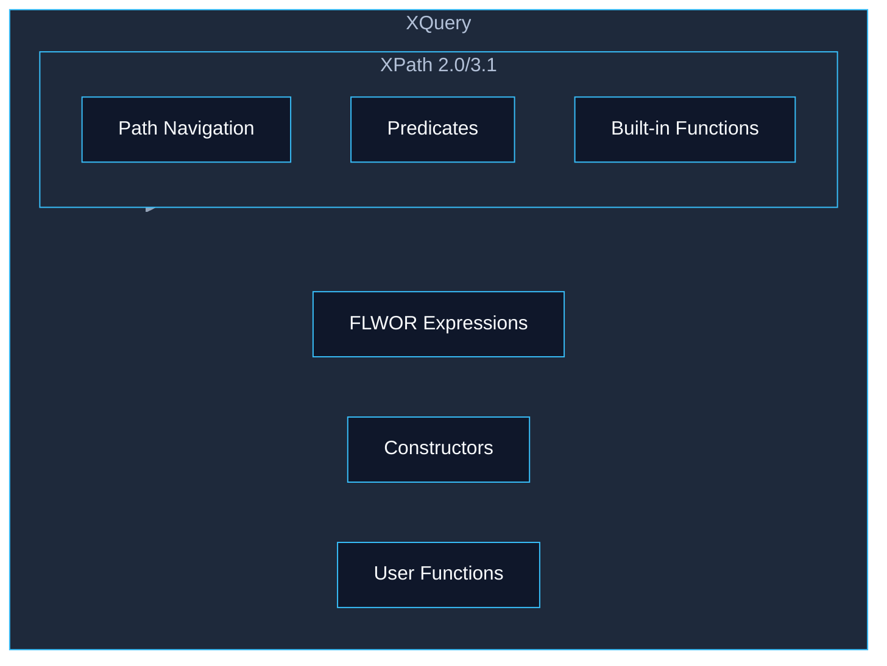
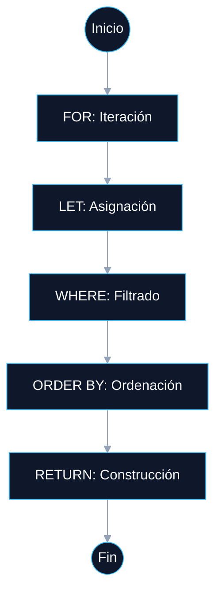

# <a id="indice"></a> 📚 Índice Dinámico: UT7.1 — XQuery

1. [Sistemas de Almacenamiento de Información](#sec1)
2. [Almacenamiento de XML en Bases de Datos Relacionales](#sec2)
3. [Introducción a XQuery](#sec3)
4. [Sintaxis Fundamental: Expresiones FLWOR](#sec4)
5. [Inserción y Actualización de Información (XQUF)](#sec5)
6. [Extracción de Información](#sec6)
7. [Técnicas de Búsqueda de Información en Documentos XML](#sec7)
8. [XQuery como Lenguaje Completo](#sec8)
9. [Herramientas de Tratamiento y Almacenamiento](#sec9)
10. [Resumen y Conceptos Clave](#sec10)

---

## <a id="sec1"></a> 01 Sistemas de Almacenamiento de Información

Los sistemas de almacenamiento se clasifican según el modelo de datos que usan:

| Tipo | Características | Ejemplos |
| :--- | :--- | :--- |
| **Ficheros** | Sencillo, universal, sin consultas avanzadas | Archivos `.xml` individuales |
| **SGBDR** | Tablas SQL, ACID, soporte XML opcional | MySQL, PostgreSQL, Oracle |
| **NoSQL Documental** | Esquema flexible, JSON/BSON/XML | MongoDB, CouchDB, MarkLogic |
| **NoSQL Otros** | Clave-valor, columnar, grafos | Redis, Cassandra, Neo4j |
| **NXD (XML Nativas)** | XML como unidad atómica, XQuery nativo | BaseX, eXist-db, MarkLogic |

> **💡 TIP Práctico:**
> Las **Bases de Datos XML Nativas (NXD)** preservan el orden de los elementos, los comentarios y las instrucciones de procesamiento del XML original, algo que los SGBDR convencionales no pueden garantizar. Si el documento XML tiene estructura irregular o variable, una NXD es la elección natural.

[🏠 Volver al Índice](#indice)

---

## <a id="sec2"></a> 02 Almacenamiento de XML en Bases de Datos Relacionales

Cuando hay que guardar XML en un SGBDR, existen tres estrategias:

1. **CLOB / Texto:** XML completo como cadena de texto. Simple y portable, pero **no permite consultas internas** sin extracción manual.
2. **Tipo XML nativo:** Columna de tipo `XML`. El motor valida que esté bien formado y permite ejecutar **XPath/XQuery** directamente con `.query()`. Soporta índices XML.
3. **Shredding (descomposición relacional):** Los elementos y atributos XML se mapean a columnas de tablas. Permite SQL estándar, pero **destruye la jerarquía** original del documento.

| Estrategia | Consulta interna | Preserva estructura | Complejidad |
| :--- | :--- | :--- | :--- |
| CLOB | ❌ | ✔️ | Baja |
| Tipo XML nativo | ✔️ | ✔️ | Media |
| Shredding | ✔️ (SQL) | ❌ | Alta |

> **💡 TIP Práctico:**
> Regla rápida de decisión: si solo necesitas guardar y recuperar el XML completo → **CLOB**; si necesitas hacer consultas sobre partes del XML → **tipo XML nativo**; si los datos XML acaban siendo siempre tabulares → **shredding**.

[🏠 Volver al Índice](#indice)

---

## <a id="sec3"></a> 03 Introducción a XQuery

XQuery es el lenguaje estándar del W3C para consultar y transformar XML. Es a XML lo que SQL es a las bases de datos relacionales.

- **XQuery es un superconjunto de XPath:** toda expresión XPath válida es también una expresión XQuery válida.
- Trabaja con el modelo de datos **XDM** (XQuery and XPath Data Model): árbol de nodos.
- Versión actual: **XQuery 3.1** (2017). Añade soporte para mapas, arrays y JSON.



> **🚀 COMPLEMENTO (Fuera de temario):**
> *NO ENTRA EN EXAMEN.* En el mundo moderno, JSON domina las APIs REST. XQuery 3.1 añadió soporte nativo para mapas y arrays JSON, intentando cerrar esa brecha. Sin embargo, en sectores como la sanidad (HL7 CDA), la publicación (DITA/DocBook) y la facturación electrónica (FacturaE, UBL), XQuery sigue siendo insustituible.

[🏠 Volver al Índice](#indice)

---

## <a id="sec4"></a> 04 Sintaxis Fundamental: Expresiones FLWOR

**FLWOR** (pronunciado "flower") es el núcleo de XQuery. Acrónimo de sus cláusulas:

| Cláusula | Función | ¿Obligatoria? |
| :--- | :--- | :--- |
| **FOR** | Itera sobre una secuencia, vinculando cada nodo a `$variable` | No |
| **LET** | Asigna una expresión a una variable sin iterar | No |
| **WHERE** | Filtra resultados con una condición booleana | No |
| **ORDER BY** | Ordena los resultados | No |
| **RETURN** | Define la estructura del resultado | **Sí** |

```xquery
(: Ejemplo FLWOR: libros con precio > 10, ordenados por título :)
for $libro in doc('biblioteca.xml')/biblioteca/libro
let $precio := $libro/precio
where number($precio) > 10
order by $libro/titulo ascending
return
  <resultado>
    <titulo>{ $libro/titulo/text() }</titulo>
    <precio>{ $precio/text() }</precio>
  </resultado>
```



> **💡 TIP Práctico:**
> La diferencia clave entre `for` y `let`: `for $x in secuencia` genera **una iteración por nodo** (como un bucle). `let $x := secuencia` asigna **toda la secuencia a la variable** de una sola vez, sin iterar. Confundirlos es el error más común al empezar con FLWOR.

[🏠 Volver al Índice](#indice)

---

## <a id="sec5"></a> 05 Inserción y Actualización de Información (XQUF)

**XQuery Update Facility (XQUF)** es la extensión del W3C que añade modificación a XQuery. Las operaciones se acumulan y se aplican de forma **atómica** al final (modelo de evaluación pendiente).

| Expresión | Función |
| :--- | :--- |
| `insert node <nodo> into/after/before <destino>` | Inserta nuevos nodos |
| `delete node <expresión>` | Elimina nodos |
| `replace node <nodo> with <nuevo>` | Reemplaza el nodo completo (nombre, atributos e hijos) |
| `replace value of <nodo> with <valor>` | Reemplaza solo el contenido del nodo |
| `rename node <nodo> as <nuevo-nombre>` | Renombra un elemento o atributo |

> **💡 TIP Práctico:**
> La distinción crítica para el examen: `replace node` sustituye el **nodo completo** (equivale a borrarlo y crear uno nuevo). `replace value of` solo cambia el **contenido textual** del nodo, manteniendo su posición y nombre en el árbol. Si la expresión devuelve más de un nodo, `replace value of` lanza un error.

[🏠 Volver al Índice](#indice)

---

## <a id="sec6"></a> 06 Extracción de Información

La extracción es la operación más frecuente en XQuery. Se realiza mediante **expresiones de ruta XPath** y **expresiones FLWOR**.

### Expresiones de ruta esenciales

```xquery
doc('biblioteca.xml')/biblioteca/libro/titulo/text()   (: Todos los títulos :)
doc('biblioteca.xml')/biblioteca/libro[@id='1']        (: Libro con id='1' :)
doc('biblioteca.xml')//titulo                          (: Cualquier <titulo> :)
count(doc('biblioteca.xml')/biblioteca/libro)          (: Contar libros :)
```

- Las llaves `{}` dentro del `return` insertan **valores dinámicos** en el XML de salida.
- `data($nodo)` extrae el valor tipado (similar a `text()`, pero más robusto con tipos XSD).
- `current-date()` genera la fecha actual para usarla en atributos dinámicos.

> **💡 TIP Práctico:**
> `//elemento` es cómodo pero puede ser **lento en documentos grandes** porque recorre todo el árbol. En producción, usa siempre rutas absolutas con la estructura completa (`/raiz/padre/hijo`) para aprovechar los índices de la base de datos XML.

[🏠 Volver al Índice](#indice)

---

## <a id="sec7"></a> 07 Técnicas de Búsqueda de Información en Documentos XML

### Ejes de Navegación XPath

| Eje | Abreviatura | Descripción |
| :--- | :--- | :--- |
| **child** | (defecto) | Hijos directos |
| **attribute** | `@` | Atributos del nodo de contexto |
| **descendant** | `//` | Todos los descendientes |
| **parent** | `..` | Nodo padre |
| **self** | `.` | El propio nodo |
| **ancestor** | (explícito) | Todos los ancestros hasta la raíz |
| **following-sibling** | (explícito) | Hermanos posteriores en el documento |
| **preceding-sibling** | (explícito) | Hermanos anteriores en el documento |

### Predicados

- **Posición:** `libro[1]`, `libro[last()]`, `libro[position()<=2]`
- **Valor:** `libro[precio > 15]`, `libro[@id='001']`
- **Combinados:** `libro[precio > 10 and precio < 20]`
- **Existencia:** `libro[editorial]` (verdadero si el hijo `<editorial>` existe)
- **Operadores de valor** (`eq, ne, lt, gt, le, ge`): comparan valores atómicos individuales.
- **Operadores generales** (`=, !=, <, >`): comparan secuencias, más permisivos.

### Funciones de Cadena Clave

- **`contains(s, sub)`**, **`starts-with(s, pre)`**, **`ends-with(s, suf)`**
- **`upper-case(s)`**, **`lower-case(s)`**, **`normalize-space(s)`**
- **`matches(s, regex)`**: comprueba expresiones regulares (ISBN, formatos, etc.)
- **`tokenize(s, regex)`**: divide la cadena por un separador.

### Funciones de Agregación

`count()`, `sum()`, `avg()`, `max()`, `min()` operan sobre secuencias de nodos.

### Joins en XQuery

XQuery no tiene `JOIN` explícito. Se implementa con el patrón `for + let + where exists()`:

```xquery
for $libro in doc('libros.xml')//libro
let $autor := doc('autores.xml')//autor[@id = $libro/@id-autor]
where exists($autor)
return <resultado>...</resultado>
```

> **💡 TIP Práctico:**
> Combina siempre `lower-case()` con `contains()` para búsquedas insensibles a mayúsculas: `contains(lower-case($libro/titulo), 'quijote')`. Sin `lower-case()`, "Quijote", "QUIJOTE" y "quijote" serían resultados diferentes.

[🏠 Volver al Índice](#indice)

---

## <a id="sec8"></a> 08 XQuery como Lenguaje Completo

XQuery es funcionalmente completo: permite declarar funciones, módulos, variables globales y gestionar errores.

### Prólogo de la Consulta

El prólogo es la sección inicial opcional donde se declaran versión, espacios de nombres, variables globales y funciones de usuario:

```xquery
xquery version '3.1';
declare variable $IVA as xs:decimal := 0.21;

declare function local:precio-con-iva($precio as xs:decimal) as xs:decimal {
    $precio * (1 + $IVA)
};
```

### Tipos de Datos Principales

- **Numéricos:** `xs:integer`, `xs:decimal`, `xs:float`, `xs:double`
- **Cadenas:** `xs:string`
- **Fechas:** `xs:date`, `xs:dateTime`, `xs:duration`
- **Booleanos:** `xs:boolean`
- **Secuencias:** `item()*`, `xs:integer+`, `xs:string?`

### Control de Flujo

- **`if-then-else`**: la cláusula `else` es **obligatoria** (a diferencia de otros lenguajes).
- **`switch`** (XQuery 3.0+): ramifica por valor de una expresión.
- **`some/every ... satisfies`**: cuantificadores existencial y universal.
- **`try-catch`** (XQuery 3.0+): gestión de errores.
- **`typeswitch`**: ramifica según el tipo XQuery de un valor.

### Módulos de Biblioteca

```xquery
(: En lib-utilidades.xqm :)
module namespace util = 'http://mi-empresa.com/utilidades';
declare function util:formato-precio($precio as xs:decimal) as xs:string { ... };

(: En la consulta principal :)
import module namespace util = 'http://mi-empresa.com/utilidades'
    at 'lib-utilidades.xqm';
```

> **💡 TIP Práctico:**
> El `else` en `if-then-else` es obligatorio porque XQuery es un lenguaje de expresiones: toda expresión debe retornar un valor. Si no necesitas hacer nada en el caso `else`, usa `else ()` (secuencia vacía).

[🏠 Volver al Índice](#indice)

---

## <a id="sec9"></a> 09 Herramientas de Tratamiento y Almacenamiento

### Bases de Datos XML Nativas

| Herramienta | Tipo | Soporte XQuery |
| :--- | :--- | :--- |
| **BaseX** | Open source (BSD) | XQuery 3.1 completo, XQUF, Full-Text |
| **eXist-db** | Open source (LGPL) | XQuery + IDE web eXide + Lucene |
| **MarkLogic** | Empresarial | XQuery + JS + SPARQL + SQL, distribuido |

**BaseX** es la herramienta recomendada para aprendizaje y aula: gratuita, fácil instalación, GUI, CLI y API REST.

```bash
basex -c 'CREATE DB mibd archivo.xml'   # Crear base de datos
basex consulta.xq                        # Ejecutar archivo .xq
basexhttp                                # Iniciar servidor HTTP REST
# REST: http://localhost:8984/rest/mibd?query=//titulo
```

### Procesadores Embebidos

- **Saxon (Java):** Procesador XQuery 3.1 / XSLT 3.0 más completo y estándar. Saxon-HE es la edición gratuita.
- **lxml (Python):** XPath 1.0 de alto rendimiento. *No soporta FLWOR completo*.
- **BaseX Python Client:** XQuery completo vía protocolo TCP (puerto 1984).

### API REST de BaseX

| Método HTTP | Operación |
| :--- | :--- |
| `GET ?query=...` | Ejecutar consulta XQuery |
| `PUT` | Crear / actualizar documento |
| `DELETE` | Eliminar documento |
| `POST` | Consultas largas (cuerpo XML `<query>`) |

### Tabla de Decisión Rápida

| Escenario | Herramienta recomendada |
| :--- | :--- |
| Aprendizaje / aula | **BaseX GUI** |
| Java empresarial | **Saxon + MarkLogic/BaseX** |
| Python | **lxml** (XPath) o **BaseX Client** (XQuery) |
| Integración web / microservicios | **BaseX REST + Saxon** |

> **🚀 COMPLEMENTO (Fuera de temario):**
> *NO ENTRA EN EXAMEN.* BaseX expone también una API WebDAV, lo que permite montarlo como una unidad de red y editar los documentos XML directamente desde el explorador de archivos del sistema operativo, sin necesidad de ningún cliente especial.

[🏠 Volver al Índice](#indice)

---

## <a id="sec10"></a> 10 Resumen y Conceptos Clave

1. **Sistemas de almacenamiento** — Ficheros, SGBDR, NoSQL y NXD. Las NXD tratan el documento XML como unidad atómica y usan XQuery y XPath de forma nativa.
2. **XML en SGBDR** — Tres estrategias: CLOB (simple, sin consultas), tipo XML nativo (XPath/XQuery directo) y shredding (SQL estándar, destruye jerarquía).
3. **XQuery** — Superconjunto de XPath. Estándar W3C (XQuery 3.1, 2017). Lenguaje funcional y fuertemente tipado.
4. **Expresiones FLWOR** — `for`, `let`, `where`, `order by`, `return`. Solo `return` es obligatorio. `for` itera; `let` asigna sin iterar.
5. **XQUF** — XQuery Update Facility: `insert node`, `delete node`, `replace node`, `replace value of`, `rename node`. Modelo de evaluación pendiente (atómico).
6. **Extracción** — Rutas XPath + FLWOR. `data()` para valores tipados; `{}` para insertar expresiones en XML de salida.
7. **Búsqueda avanzada** — Ejes XPath, predicados combinados, `contains()` + `lower-case()`, `matches()` con regex, funciones de agregación (`count`, `sum`, `avg`, `max`, `min`).
8. **Joins** — Patrón `for + let + where exists()` sobre múltiples documentos. Equivalente funcional al JOIN de SQL.
9. **Lenguaje completo** — Prólogo, variables globales tipadas (`xs:decimal`), funciones de usuario, módulos `.xqm`, `if-then-else` (else obligatorio), `try-catch`.
10. **Herramientas** — BaseX (aprendizaje y REST), Saxon (Java), lxml + BaseX Client (Python). MarkLogic para entornos empresariales de gran escala.

[🏠 Volver al Índice](#indice)

---
