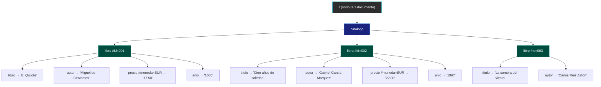
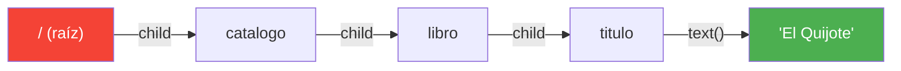
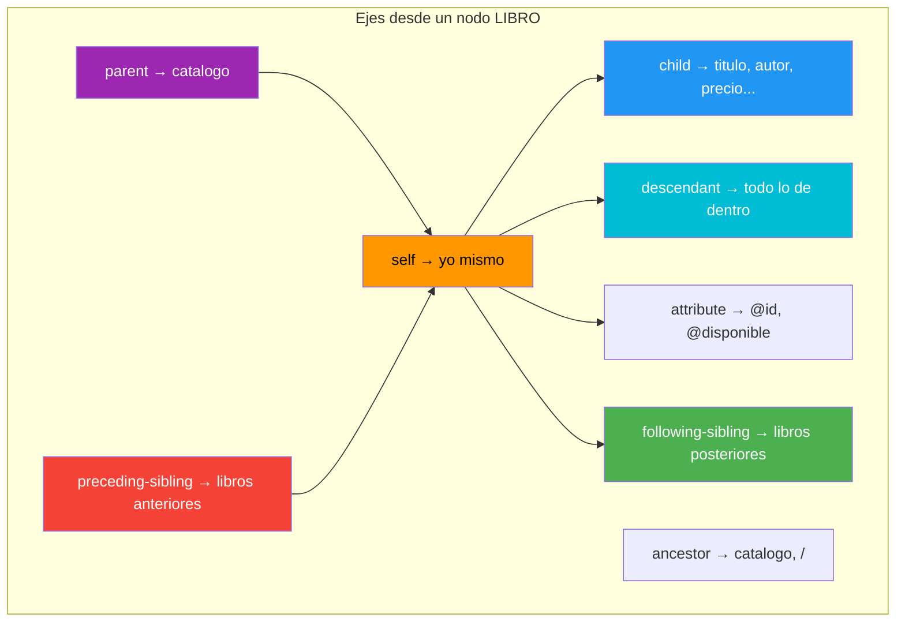
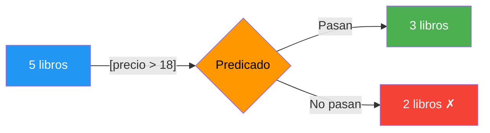

# 📘 Resumen Ultrarrápido — XPath

> **Tiempo de lectura:** 10 minutos  
> **Objetivo:** dominar XPath para el examen de mañana

---

## 1. ¿Qué es XPath?

XPath es un lenguaje para **apuntar a nodos** dentro de un documento XML.  
No transforma, no modifica — solo **selecciona**.

---

## 2. El Árbol de Nodos XML

XPath ve todo XML como un **árbol**. Así ve `catalogo.xml`:



**Tipos de nodos:**

| Tipo | Ejemplo | Acceso |
|------|---------|--------|
| Nodo raíz `/` | El documento completo | `/` |
| Elemento | `<libro>`, `<titulo>` | Por nombre |
| Atributo | `id="001"` | `@id` |
| Texto | `El Quijote` | `text()` |
| Comentario | `<!-- ... -->` | `comment()` |

---

## 3. Rutas de Navegación



| Tipo | Empieza | Ejemplo |
|------|---------|---------|
| **Absoluta** | `/` | `/catalogo/libro/titulo` |
| **Relativa** | nombre | `libro/titulo` |

**Abreviaciones CLAVE:**

| Abrev. | Significado | Ejemplo |
|--------|-------------|---------|
| `/` | Separador / un nivel | `/catalogo/libro` |
| `//` | Cualquier profundidad | `//titulo` |
| `.` | Nodo actual | `.` |
| `..` | Nodo padre | `../autor` |
| `@` | Atributo | `@id` |
| `*` | Cualquier elemento | `libro/*` |
| `@*` | Cualquier atributo | `libro/@*` |
| `text()` | Contenido textual | `titulo/text()` |

---

## 4. Los 10 Ejes



| Eje | Dirección | Abrev. |
|-----|-----------|--------|
| `child` | Hijos directos | (defecto) |
| `attribute` | Atributos | `@` |
| `parent` | Padre | `..` |
| `self` | Yo mismo | `.` |
| `descendant` | Todos dentro | |
| `descendant-or-self` | Dentro + yo | `//` |
| `ancestor` | Todos arriba | |
| `following-sibling` | Hermanos después | |
| `preceding-sibling` | Hermanos antes | |
| `following` | Todo después en doc | |

---

## 5. Predicados `[ ]`

Filtran nodos. Solo pasan los que cumplen la condición.



| Tipo | Ejemplo |
|------|---------|
| Posición | `libro[1]`, `libro[last()]`, `libro[position() mod 2 = 0]` |
| Existencia atributo | `libro[@id]` |
| Valor atributo | `libro[@id='001']` |
| Valor elemento | `libro[precio > 18]` |
| Compuesto AND | `libro[@disponible='true' and precio < 20]` |
| Compuesto OR | `libro[precio > 15 or @id='001']` |
| Negación | `libro[not(@disponible='false')]` |
| Con función | `libro[contains(autor, 'García')]` |

---

## 6. Funciones

### Numéricas

| Función | Ejemplo | Resultado |
|---------|---------|-----------|
| `count(nodos)` | `count(//libro)` | 5 |
| `sum(nodos)` | `sum(//precio)` | 86.95 |
| `round(n)` | `round(17.50)` | 18 |
| `floor(n)` | `floor(17.90)` | 17 |
| `ceiling(n)` | `ceiling(17.10)` | 18 |

### De cadena

| Función | Ejemplo |
|---------|---------|
| `contains(s, sub)` | `contains(autor, 'García')` → true |
| `starts-with(s, pre)` | `starts-with(@id, '00')` → true |
| `substring(s, ini, len)` | `substring('Quijote', 1, 3)` → "Qui" |
| `string-length(s)` | `string-length('abc')` → 3 |
| `normalize-space(s)` | `normalize-space('  Ana  ')` → "Ana" |
| `concat(a, b, ...)` | `concat('a', '-', 'b')` → "a-b" |
| `translate(s, de, a)` | `translate('abc', 'abc', 'ABC')` → "ABC" |

### Booleanas y posición

| Función | Uso |
|---------|-----|
| `not(expr)` | Niega |
| `position()` | Posición actual |
| `last()` | Último del conjunto |

---

## 7. Chuleta de Supervivencia

```
¿Quiero TODOS los X?              → //X
¿Quiero X hijos directos de Y?    → Y/X
¿Quiero el atributo A de X?       → X/@A
¿Quiero filtrar?                   → X[condición]
¿Quiero el texto?                  → X/text()
¿Quiero contar?                    → count(//X)
¿Quiero el padre?                  → X/..
¿Quiero hermanos después?         → X/following-sibling::Y
```

---

*Resumen basado en Bloques 1-5 de la guía teórica · Lenguaje de Marcas T6*
