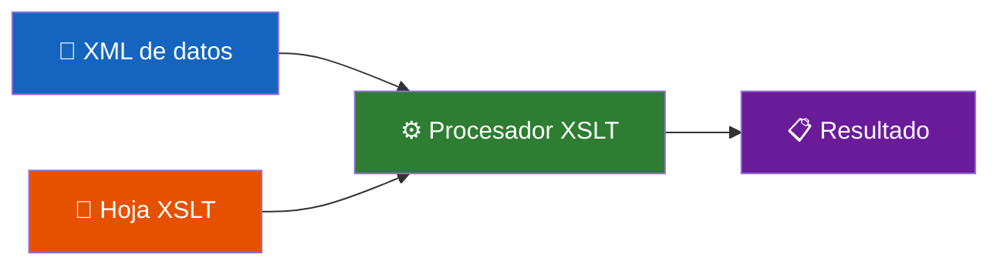
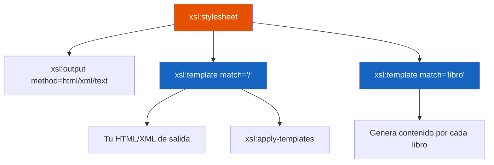
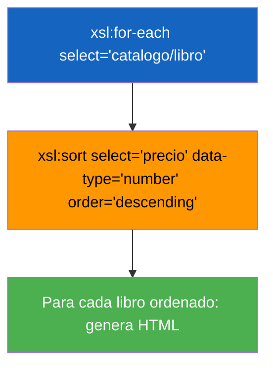
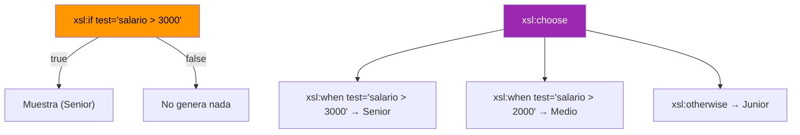
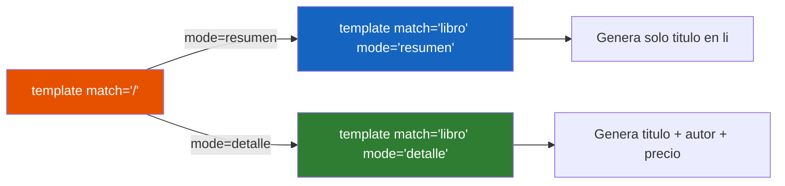

# 📘 Resumen Ultrarrápido — XSLT

> **Tiempo de lectura:** 12 minutos  
> **Objetivo:** dominar XSLT para transformar XML en HTML, CSV o XML

---

## 1. ¿Qué es XSLT?

XSLT transforma un XML de datos en **otro formato** (HTML, texto, XML...).



---

## 2. Anatomía de una Hoja XSLT

```xml
<?xml version="1.0" encoding="UTF-8"?>
<xsl:stylesheet version="1.0"
  xmlns:xsl="http://www.w3.org/1999/XSL/Transform">

  <xsl:output method="html" encoding="UTF-8" indent="yes"/>

  <xsl:template match="/">
    <!-- Punto de entrada: aquí empieza todo -->
  </xsl:template>

</xsl:stylesheet>
```



---

## 3. Instrucciones Clave

| Instrucción | Qué hace |
|-------------|----------|
| `xsl:value-of select="ruta"` | Extrae el texto de un nodo |
| `xsl:apply-templates` | Activa el procesamiento de los hijos |
| `xsl:apply-templates select="ruta"` | Solo para ciertos nodos |
| `xsl:for-each select="ruta"` | Itera sobre los nodos |
| `xsl:sort select="campo"` | Ordena (dentro de for-each o apply-templates) |
| `xsl:if test="condición"` | Condicional simple (sin else) |
| `xsl:choose / when / otherwise` | Condicional múltiple (switch) |
| `xsl:variable name="x" select="..."` | Variable inmutable |
| `xsl:param name="x" select="..."` | Parámetro (sobreescribible desde fuera) |
| `xsl:call-template name="nombre"` | Llama a una plantilla nombrada |
| `xsl:text` | Emite texto literal preservando espacios |
| `xsl:element name="..."` | Crea un elemento con nombre dinámico |
| `xsl:attribute name="..."` | Crea un atributo dinámico |

---

## 4. for-each + sort



**Atributos de xsl:sort:**

| Atributo | Valores | Cuidado |
|----------|---------|---------|
| `select` | Expresión XPath | Campo por el que ordenar |
| `order` | `ascending` / `descending` | Defecto: ascending |
| `data-type` | `text` / `number` | ⚠️ Sin `number`, ordena como texto |

---

## 5. Condicionales



> ⚠️ `xsl:if` NO tiene else. Si necesitas else → usa `xsl:choose`.

---

## 6. Variables y Parámetros

```xml
<!-- Variable: inmutable, se referencia con $ -->
<xsl:variable name="iva" select="0.21"/>
<xsl:value-of select="precio * (1 + $iva)"/>

<!-- Parámetro: tiene valor por defecto, sobreescribible -->
<xsl:param name="precioLimite" select="30"/>
```

> ⚠️ En atributos XSLT: `<` se escribe `&lt;` y `<=` se escribe `&lt;=`

---

## 7. Plantillas con mode



Mismo nodo, presentación distinta según el modo.

---

## 8. Plantillas Nombradas

```xml
<!-- Se define con name="" -->
<xsl:template name="cabecera">
  <header><h1>Mi App</h1></header>
</xsl:template>

<!-- Se llama explícitamente -->
<xsl:call-template name="cabecera"/>
```

| | `match="libro"` | `name="cabecera"` |
|-|------------------|-------------------|
| Se activa | Automáticamente al llegar a `<libro>` | Solo con `call-template` |
| Uso | Procesar nodos concretos | Reutilizar bloques de HTML |

---

## 9. Formatos de Salida

| `method` | Para qué | Clave |
|----------|----------|-------|
| `html` | Páginas web | Optimiza etiquetas HTML |
| `xml` | Otro XML | Mantiene declaración XML |
| `text` | CSV, texto plano | Solo emite texto, sin etiquetas |

Para CSV usa `xsl:text` y `&#10;` (salto de línea).

---

## 10. Elementos y Atributos Dinámicos

```xml
<!-- Valor de atributo con {} (AVT) -->
<div class="{categoria}">...</div>

<!-- Atributo dinámico con xsl:attribute -->
<article>
  <xsl:attribute name="class">agotado</xsl:attribute>
</article>
```

> ⚠️ `xsl:attribute` SIEMPRE antes del contenido del elemento.

---

## 11. Chuleta de Supervivencia

```
¿Quiero iterar?              → xsl:for-each select="..."
¿Quiero ordenar?             → xsl:sort select="..." (dentro del for-each)
¿Quiero un if simple?        → xsl:if test="..."
¿Quiero if/else?             → xsl:choose + xsl:when + xsl:otherwise
¿Quiero guardar un valor?    → xsl:variable name="x" select="..."
¿Quiero un parámetro?        → xsl:param name="x" select="..."
¿Quiero reutilizar HTML?     → xsl:template name="..." + xsl:call-template
¿Quiero dos vistas?          → mode="resumen" / mode="detalle"
¿Quiero CSV?                 → method="text" + xsl:text + &#10;
```

---

*Resumen basado en Bloques 6-13 de la guía teórica · Lenguaje de Marcas T6*
