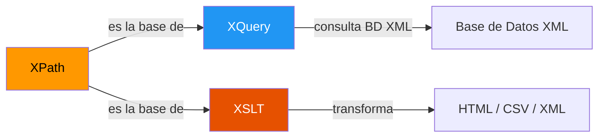
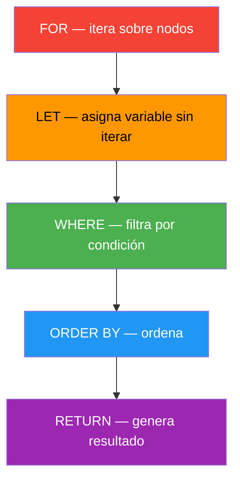
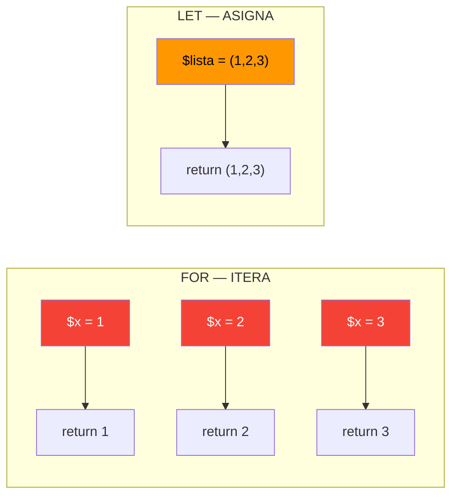
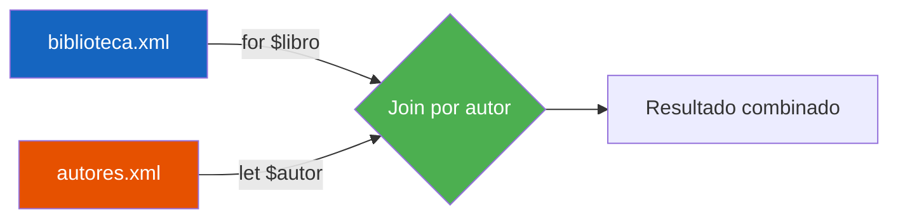

# 📘 Resumen Ultrarrápido — XQuery

> **Tiempo de lectura:** 12 minutos  
> **Objetivo:** dominar XQuery para consultar y modificar XML

---

## 1. ¿Qué es XQuery?

XQuery es el **SQL de los documentos XML**. Consulta, filtra, ordena y modifica datos XML.



**Todo XPath válido es XQuery válido.** XQuery añade FLWOR, funciones y modificación.

---

## 2. Consulta Simple (solo XPath)

```xquery
doc('biblioteca.xml')/biblioteca/libro/titulo
```

`doc('archivo.xml')` carga el documento. A partir de ahí, XPath puro.

---

## 3. FLWOR — El Corazón de XQuery



**Equivalencia SQL ↔ FLWOR:**

| SQL | FLWOR |
|-----|-------|
| `FROM libros` | `for $libro in //libro` |
| `WHERE precio > 10` | `where number($libro/precio) > 10` |
| `ORDER BY titulo` | `order by $libro/titulo` |
| `SELECT titulo` | `return $libro/titulo` |

**Ejemplo completo:**

```xquery
for $libro in doc('biblioteca.xml')/biblioteca/libro
let $precio := number($libro/precio)
where $precio > 10
order by $libro/titulo ascending
return
  <resultado>
    <titulo>{ $libro/titulo/text() }</titulo>
    <precio>{ $precio }</precio>
  </resultado>
```

> Las `{ }` insertan valores dinámicos dentro de XML construido.

---

## 4. `for` vs `let` — La diferencia clave



| | `for` | `let` |
|-|-------|-------|
| Comportamiento | Itera: return se ejecuta N veces | Asigna: return se ejecuta 1 vez |
| Ejemplo | `for $x in (1,2,3)` | `let $lista := (1,2,3)` |

---

## 5. Funciones de Cadena

| Función | Qué hace |
|---------|----------|
| `contains(s, sub)` | ¿s contiene sub? |
| `starts-with(s, pre)` | ¿s empieza por pre? |
| `ends-with(s, suf)` | ¿s termina por suf? |
| `lower-case(s)` | A minúsculas |
| `upper-case(s)` | A mayúsculas |
| `matches(s, regex)` | Regex |
| `tokenize(s, sep)` | Divide por separador |
| `string-length(s)` | Longitud |

---

## 6. Funciones de Agregación

| Función | Ejemplo |
|---------|---------|
| `count(//libro)` | Cuenta nodos |
| `sum(//precio)` | Suma valores |
| `avg(//precio)` | Media aritmética |
| `min(//precio)` | Mínimo |
| `max(//precio)` | Máximo |

---

## 7. Joins — Cruzar Dos Documentos



**Patrón:**

```xquery
for $libro in doc('biblioteca.xml')//libro
let $autor := doc('autores.xml')//autor[nombre = $libro/autor]
where exists($autor)
return
  <resultado>
    <titulo>{ data($libro/titulo) }</titulo>
    <nacionalidad>{ data($autor/nacionalidad) }</nacionalidad>
  </resultado>
```

> ⚠️ Siempre usa `where exists($autor)` para evitar errores con coincidencias vacías.

---

## 8. XQUF — Modificar XML

Las 5 operaciones de XQuery Update Facility:


| Operación | Sintaxis |
|-----------|----------|
| Insertar | `insert node <nuevo/> into //padre` |
| Borrar | `delete node //libro[@id='3']` |
| Reemplazar nodo | `replace node //viejo with <nuevo/>` |
| Reemplazar valor | `replace value of //precio with '19.99'` |
| Renombrar | `rename node //viejo as 'nuevo'` |

**Insertar atributo:**

```xquery
insert node attribute disponible { 'true' }
into //libro[1]
```

---

## 9. Prólogo y Funciones Propias

```xquery
xquery version '3.1';

declare variable $IVA as xs:decimal := 0.21;

declare function local:con-iva($precio as xs:decimal) as xs:decimal {
    $precio * (1 + $IVA)
};

for $libro in //libro
return local:con-iva(number($libro/precio))
```

**if-then-else** (el else es OBLIGATORIO):

```xquery
if (number($libro/precio) > 20)
then <caro>{ data($libro/titulo) }</caro>
else <normal>{ data($libro/titulo) }</normal>
```

---

## 10. Chuleta de Supervivencia

```
¿Consulta simple?         → doc('file.xml')//ruta/xpath
¿Iterar y filtrar?         → for $x in ... where ... return ...
¿Guardar sin iterar?       → let $lista := ...
¿Buscar texto?             → contains(lower-case($x/titulo), 'quijote')
¿Estadísticas?             → count(), sum(), avg(), min(), max()
¿Cruzar 2 documentos?     → for + let + exists()
¿Insertar?                 → insert node ... into ...
¿Borrar?                   → delete node ...
¿Actualizar valor?         → replace value of ... with ...
¿Función propia?           → declare function local:nombre(...) { ... };
¿if sin else?              → NO: else es obligatorio → else ()
```

---

*Resumen basado en Bloques 15-21 de la guía teórica · Lenguaje de Marcas T7*
