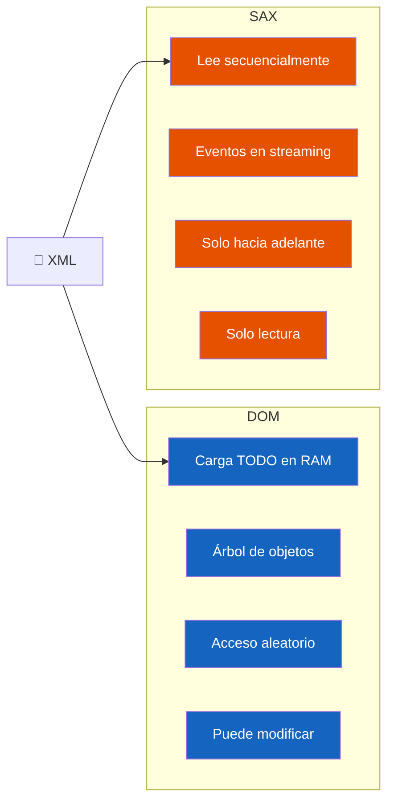
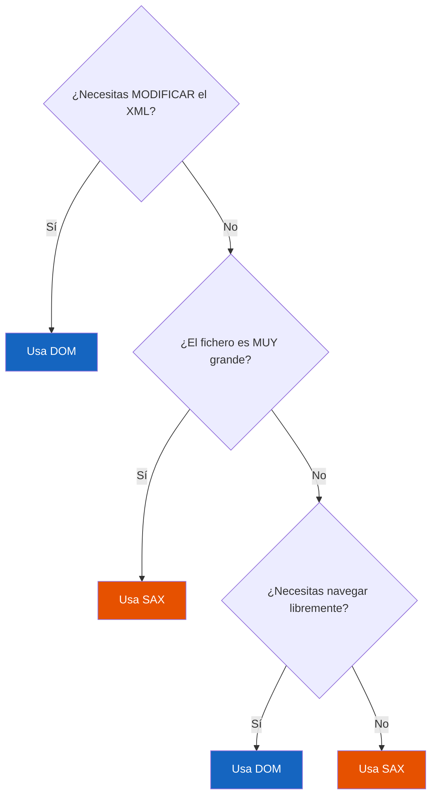

# 📘 Resumen Ultrarrápido — DOM vs SAX

> **Tiempo de lectura:** 3 minutos  
> **Objetivo:** saber cuándo usar cada uno en el examen

---

## Dos Formas de Procesar XML desde Código

---

## Tabla Comparativa (la que cae en examen)

| Criterio | DOM | SAX |
|----------|-----|-----|
| **Modelo** | Árbol completo en memoria | Eventos en streaming |
| **Memoria** | Alta (carga todo) | Muy baja |
| **Velocidad** | Más lenta al cargar | Muy rápida |
| **Acceso** | Aleatorio (cualquier nodo) | Secuencial (solo adelante) |
| **Modificación** | ✅ Sí, fácil | ❌ No (solo lectura) |
| **Facilidad** | Alta (API intuitiva) | Más compleja |
| **Tamaño recomendado** | Pequeño/mediano (<100 MB) | Cualquier tamaño |
| **Relectura** | Sí (el árbol persiste) | No (un único paso) |
| **Caso típico** | Edición, transformación, XSLT | Indexación, extracción masiva |

---

## Regla de Oro para el Examen

**Analogías:**
- **DOM** = cargar un libro entero en RAM y saltar a cualquier página.
- **SAX** = leer el libro página a página, reaccionando sobre la marcha.

---

*Resumen basado en Bloque 14 de la guía teórica · Lenguaje de Marcas T6*
