# 📘 Nivel 01 — Fundamentos de Arrays en Java

---

## 1. ¿Qué es un Array?

Un **array** es una estructura de datos que almacena una colección de elementos del **mismo tipo** en posiciones de memoria **contiguas**. Cada elemento se identifica por un **índice numérico** que comienza en `0`.

En Java, un array es un **objeto** que se aloja en el **Heap**, aunque la variable que lo referencia vive en el **Stack**.

### Características fundamentales:
- **Tamaño fijo**: una vez creado, su longitud NO puede cambiar.
- **Tipo homogéneo**: todos los elementos deben ser del mismo tipo.
- **Acceso directo O(1)**: acceder a cualquier posición por índice es instantáneo.
- **Indexación base-0**: el primer elemento está en la posición `0`, el último en `length - 1`.

---

## 2. Ciclo de Vida de un Array

```mermaid
stateDiagram-v2
    [*] --> Declaracion: int[] miArray
    Declaracion --> Dimensionamiento: miArray = new int[5]
    Dimensionamiento --> Inicializacion: miArray[0] = 10
    Inicializacion --> Acceso: int x = miArray[0]
    Acceso --> Recorrido: for (int i = 0; ...)
    Recorrido --> FinDeVida: miArray = null
    FinDeVida --> [*]: GC libera memoria
```

> **Declaración**: se crea la REFERENCIA en el Stack, pero no se reserva memoria para datos.
> **Dimensionamiento**: se reserva un bloque contiguo en el Heap. Valores por defecto asignados automáticamente.

---

## 3. Declaración vs Inicialización

Existen dos fases diferenciadas que muchos programadores confunden:

### Fase 1 — Declaración (solo referencia)
```
int[] numeros;        // Estilo Java preferido
int numeros[];        // Estilo C (válido, no recomendado)
```
En este punto, la variable `numeros` existe en el Stack pero vale `null`. No apunta a ningún bloque de memoria.

### Fase 2 — Dimensionamiento/Inicialización
```
numeros = new int[5];             // Con new: 5 posiciones, valores = 0
int[] datos = {10, 20, 30};      // Literal: tamaño inferido, valores asignados
```

### Modelo de memoria Stack → Heap

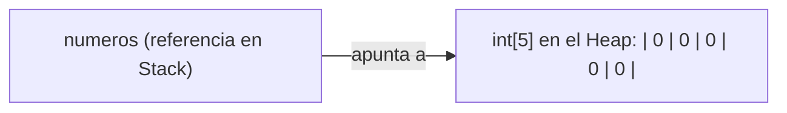

---

## 4. Valores por Defecto según Tipo

Cuando se crea un array con `new`, la JVM inicializa **automáticamente** todas las posiciones con un valor por defecto que depende del tipo:

| Tipo del Array | Valor por Defecto | Ejemplo |
|---|---|---|
| `byte[]` | `0` | `new byte[3]` → `{0, 0, 0}` |
| `short[]` | `0` | `new short[3]` → `{0, 0, 0}` |
| `int[]` | `0` | `new int[3]` → `{0, 0, 0}` |
| `long[]` | `0L` | `new long[3]` → `{0, 0, 0}` |
| `float[]` | `0.0f` | `new float[3]` → `{0.0, 0.0, 0.0}` |
| `double[]` | `0.0` | `new double[3]` → `{0.0, 0.0, 0.0}` |
| `boolean[]` | `false` | `new boolean[3]` → `{false, false, false}` |
| `char[]` | `'\u0000'` | `new char[3]` → `{'\0', '\0', '\0'}` |
| `String[]` | `null` | `new String[3]` → `{null, null, null}` |
| `Object[]` | `null` | `new Object[3]` → `{null, null, null}` |

> ⚠️ **Trampa frecuente**: un `String[]` recién creado NO contiene cadenas vacías `""`, contiene **`null`**. Acceder a `miArray[0].length()` lanzará `NullPointerException`.

---

## 5. Acceso por Índice y Bounds Checking

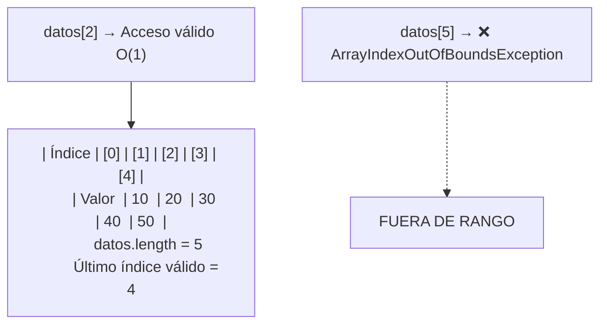

- **Acceso válido**: `datos[0]` hasta `datos[datos.length - 1]`
- **Acceso inválido**: cualquier índice `< 0` o `>= datos.length` lanza `ArrayIndexOutOfBoundsException`
- La propiedad `.length` es un campo (`field`), no un método. Se accede SIN paréntesis.

---

## 6. Patrones de Recorrido

### 6.1 — Recorrido con `for` clásico (acceso por índice)
El recorrido más versátil: tienes acceso al índice, puedes recorrer en cualquier dirección, saltar posiciones, etc.

### 6.2 — Recorrido con `for-each` (enhanced for)
Más limpio sintácticamente, pero NO tienes acceso al índice ni puedes modificar el array.

### 6.3 — Recorrido inverso
Recorrer desde `length - 1` hasta `0` decrementando. Útil para operaciones de desplazamiento.

#### Diagrama — Recorrido hacia adelante

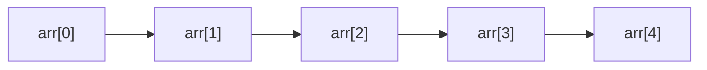

#### Diagrama — Recorrido hacia atrás

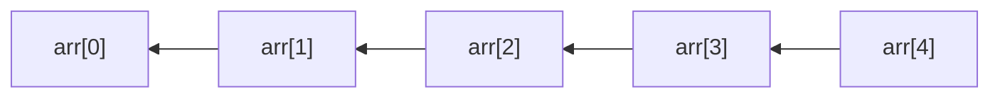

---

## 7. Inserción y Eliminación en Arrays

Al ser de **tamaño fijo**, insertar o eliminar requiere **desplazar elementos**.

### 7.1 Insertar en posición `p`

#### Paso 1 — Estado inicial

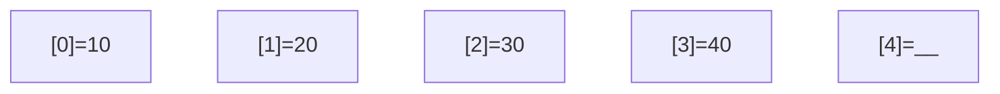

#### Paso 2 — Desplazar elementos a la DERECHA (desde el final)

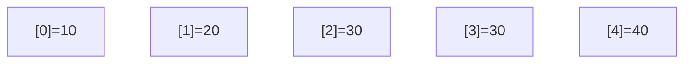

#### Paso 3 — Escribir el nuevo valor (99) en posición 2

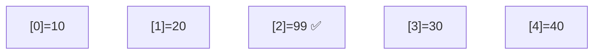

> **Concepto clave**: el desplazamiento se hace de derecha a izquierda (desde el final) para no sobreescribir datos.

### 7.2 Eliminar de posición `p`

#### Antes — Eliminar posición 1 (valor 20)

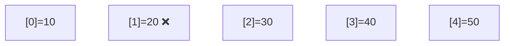

#### Después — Desplazar elementos a la IZQUIERDA


> El desplazamiento en eliminación va de izquierda a derecha. La última posición queda "vacía" (valor por defecto).

---

## 8. Tamaño Lógico vs Tamaño Físico

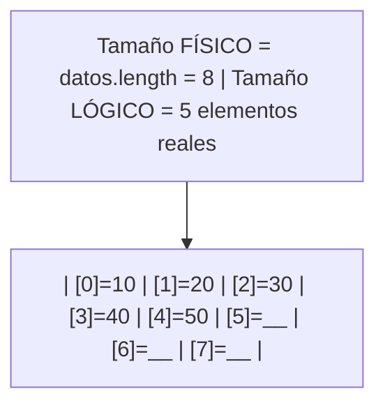

- **Tamaño físico** (`datos.length`): la capacidad total del array en memoria.
- **Tamaño lógico**: la cantidad de elementos "reales" que hemos insertado. Lo gestionamos nosotros con una variable `int size`.
- Las posiciones desde `size` hasta `length - 1` están "vacías" (contienen el valor por defecto).

Este concepto es **fundamental** para implementar inserción, eliminación y redimensionado manual.

---

## 9. Inversión In-Place

La técnica de inversión con **dos punteros** (swap) es un patrón esencial:

#### Paso 1 — swap(arr[0], arr[4])

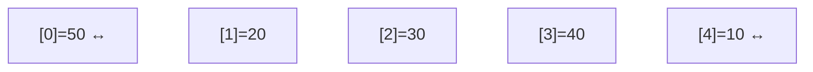

#### Paso 2 — swap(arr[1], arr[3])

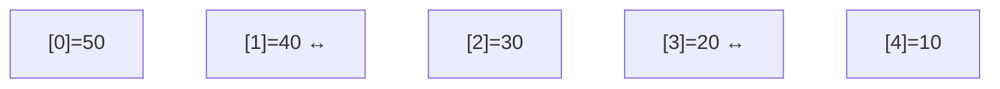

#### Resultado — El centro no se toca

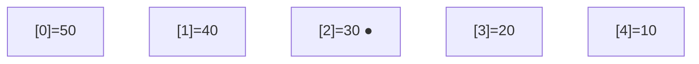

**Algoritmo**:
- Puntero `izq` empieza en `0`, puntero `der` empieza en `length - 1`.
- En cada iteración: swap y mover ambos punteros hacia el centro.
- Se detiene cuando `izq >= der`.
- Complejidad: **O(n/2)** swaps = **O(n)** tiempo, **O(1)** espacio.

---

## Referencia de Ejercicios

| Ejercicio | Archivo | Concepto Principal |
|---|---|---|
| 01 | `Ej01_DeclaracionInicializacion.java` | Crear, dimensionar, valores por defecto |
| 02 | `Ej02_RecorridoYOperaciones.java` | Recorridos y cálculos (suma, media, max, min) |
| 03 | `Ej03_InsercionEnPosicion.java` | Insertar desplazando elementos |
| 04 | `Ej04_EliminacionEnPosicion.java` | Eliminar desplazando elementos |
| 05 | `Ej05_InversionDeArray.java` | Invertir in-place con swap |
