# 📘 Nivel 02 — Redimensionado y Copia de Arrays

---

## 1. El Problema Fundamental: Tamaño Fijo

En Java, un array tiene **tamaño inmutable** tras su creación. No existe operación nativa para "agrandar" o "encoger" un array. Para simular dinamismo, debemos:

1. Crear un **nuevo array** con la capacidad deseada.
2. **Copiar** los elementos del array original al nuevo.
3. **Reasignar** la referencia para que apunte al nuevo array.

#### Paso 1 — Array original lleno

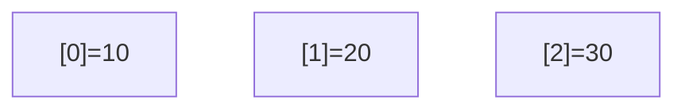

#### Paso 2 — Crear nuevo array con más capacidad

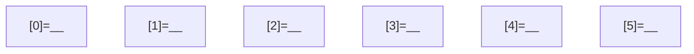

#### Paso 3 — Copiar elementos y reasignar

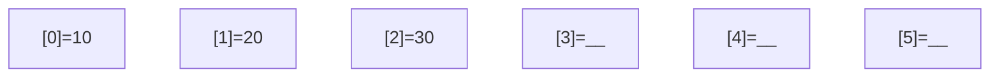

> Tras la copia: `datos = nuevoArray;` — la referencia apunta al nuevo bloque.

---

## 2. Copia Manual (Elemento a Elemento)

La forma más básica de copiar un array es iterar posición por posición:

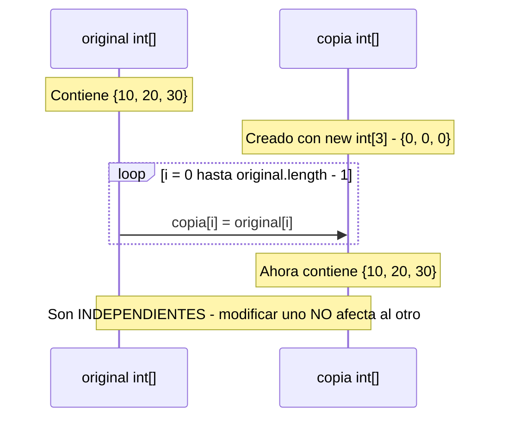

### Copia parcial
Puedes copiar solo un rango:
- Desde el índice `a` hasta el índice `b` (inclusive o exclusive, según convenio).
- El nuevo array tendrá tamaño `b - a` (o `b - a + 1` si incluyes `b`).

---

## 3. System.arraycopy — La Copia Nativa

Java ofrece un método nativo (implementado en C/C++ dentro de la JVM) para copiar bloques de memoria de forma eficiente:

```
System.arraycopy(origen, posOrigen, destino, posDestino, longitud)
```

| Parámetro | Significado |
|---|---|
| `origen` | Array fuente |
| `posOrigen` | Índice de inicio en el array fuente |
| `destino` | Array destino |
| `posDestino` | Índice de inicio en el destino |
| `longitud` | Cantidad de elementos a copiar |

#### Ejemplo visual

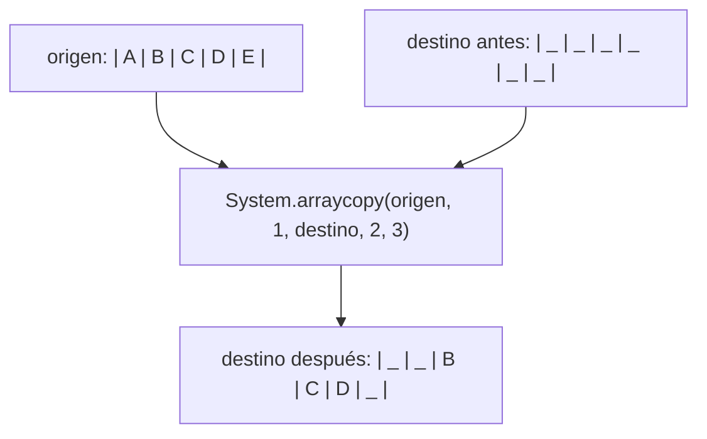

> `System.arraycopy` es significativamente más rápido que un bucle manual porque opera a nivel de bloques de memoria (memcpy nativo).

---

## 4. Crecimiento Geométrico (Estrategia de Duplicación)

Cuando un array se llena y necesitamos más espacio, ¿cuánto lo agrandamos?

### Estrategia Lineal (mala)
Agregar 1 posición cada vez → Cada inserción requiere copiar TODO el array. Coste acumulado: **O(n²)**.

### Estrategia Geométrica (óptima)
Duplicar la capacidad (×2) cuando se llena → Las copias son infrecuentes. Coste amortizado por inserción: **O(1)**.

#### Evolución del array con crecimiento ×2

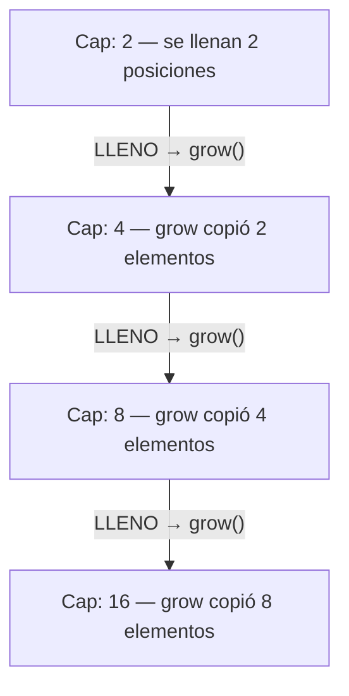

### ¿Por qué ×2?

> Total de copias tras n inserciones: `1 + 2 + 4 + 8 + ... + n/2 ≈ n`
> Total de inserciones: `n`
> **Coste amortizado por add(): O(n) / n = O(1)**
>
> Es la misma estrategia que usa internamente `java.util.ArrayList`. Nosotros la implementamos desde cero.

---

## 5. Reducción de Capacidad (Shrink)

Si eliminamos muchos elementos, el array puede quedar sobredimensionado (mucha memoria reservada para pocos datos).

**Regla de reducción**: cuando el tamaño lógico cae al **25%** de la capacidad, reducimos a la **mitad**.

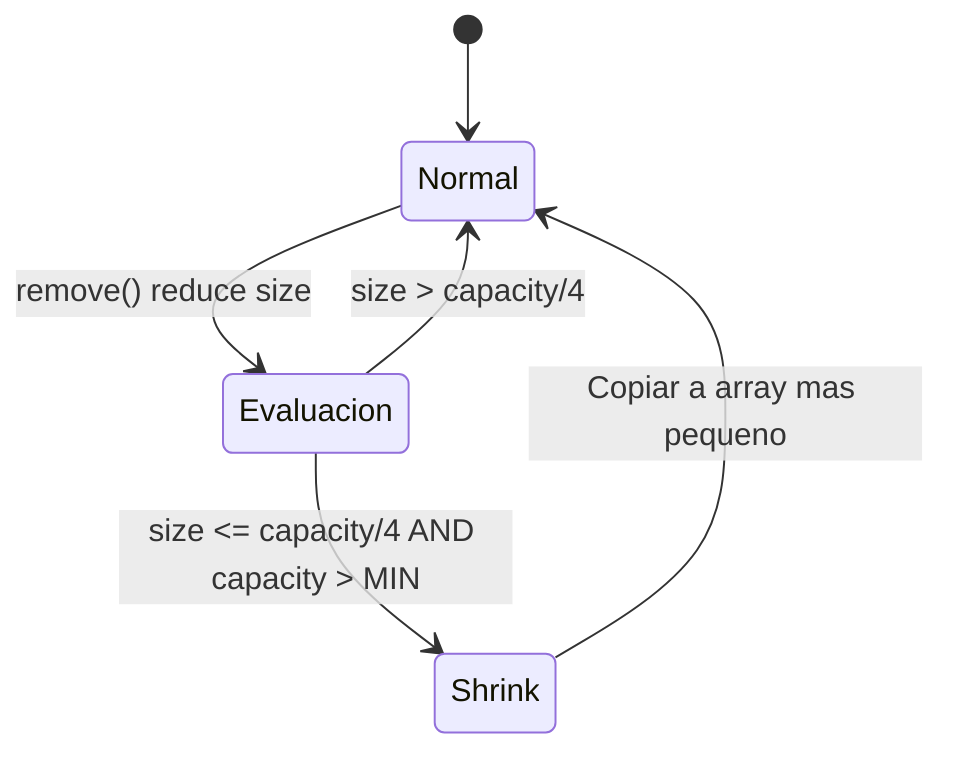

> Nunca reducir por debajo de una capacidad mínima (ej. 4 o 8).

---

## 6. Array Dinámico Completo — Arquitectura

Combinando crecimiento y reducción, podemos construir nuestro propio "ArrayList" sin usar `java.util`:

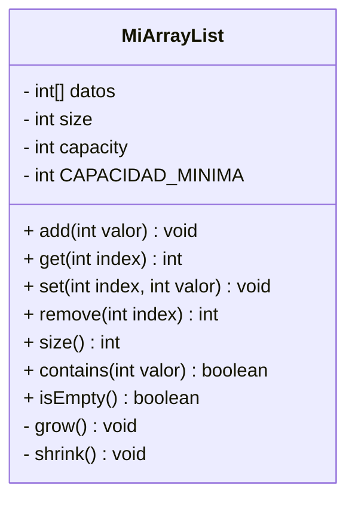

**Invariantes:**
1. `size <= capacity`
2. `capacity >= CAPACIDAD_MINIMA`
3. `datos.length == capacity`
4. `grow()` cuando `size == capacity`
5. `shrink()` cuando `size <= capacity/4`

### Flujo de add(valor)

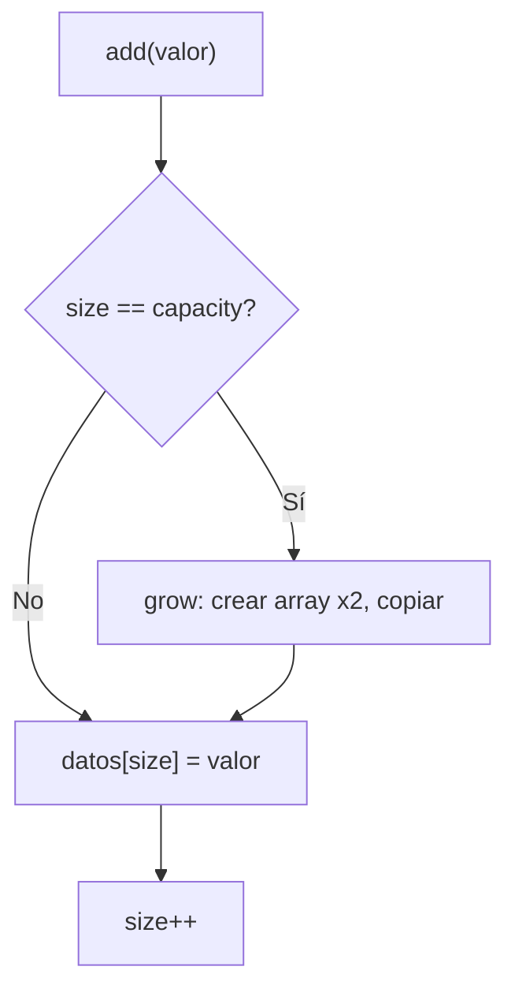

### Flujo de remove(index)

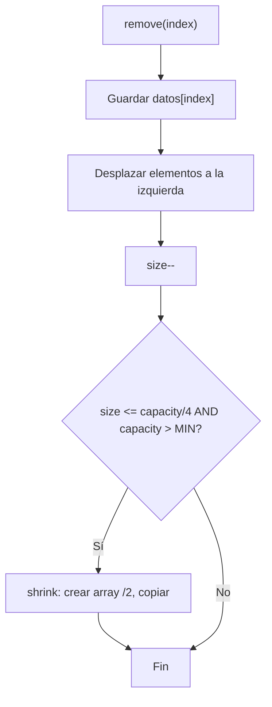

---

## 7. Independencia de Copias

Un error común es creer que al copiar un array, ambos son independientes. Esto es cierto para **tipos primitivos**, pero cuidado con **arrays de objetos**:

### Tipos primitivos — Copia INDEPENDIENTE

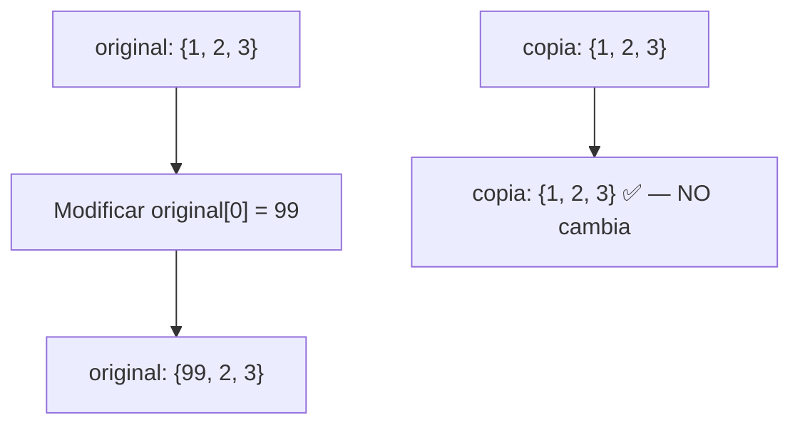

### Arrays de objetos — Copia SHALLOW

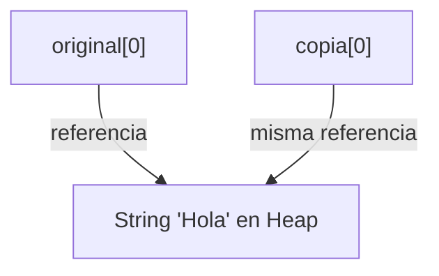

> Para arrays de tipos primitivos (`int[]`, `double[]`, etc.), la copia elemento-a-elemento produce independencia total. Para arrays de objetos, la copia es **shallow** (ambos apuntan a los mismos objetos).

---

## Referencia de Ejercicios

| Ejercicio | Archivo | Concepto Principal |
|---|---|---|
| 06 | `Ej06_CopiaManual.java` | Copia elemento a elemento, independencia |
| 07 | `Ej07_SystemArraycopy.java` | System.arraycopy, offset, concatenación |
| 08 | `Ej08_CrecimientoGeometrico.java` | Auto-grow con duplicación de capacidad |
| 09 | `Ej09_ReduccionDeCapacidad.java` | Auto-shrink al 25% de ocupación |
| 10 | `Ej10_ArrayDinamicoCompleto.java` | MiArrayList completo desde cero |
