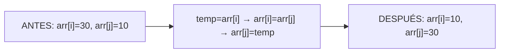
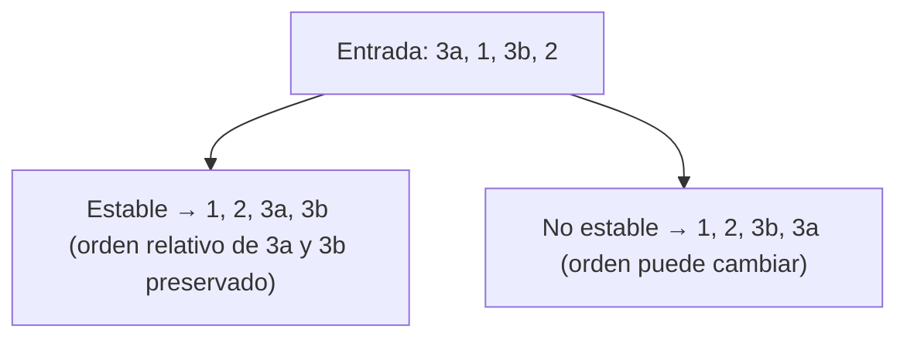
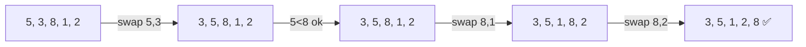
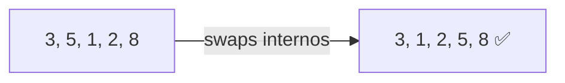
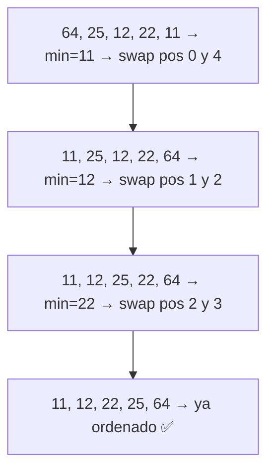
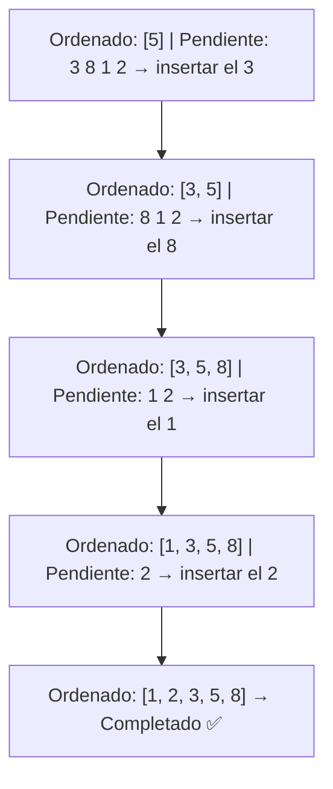
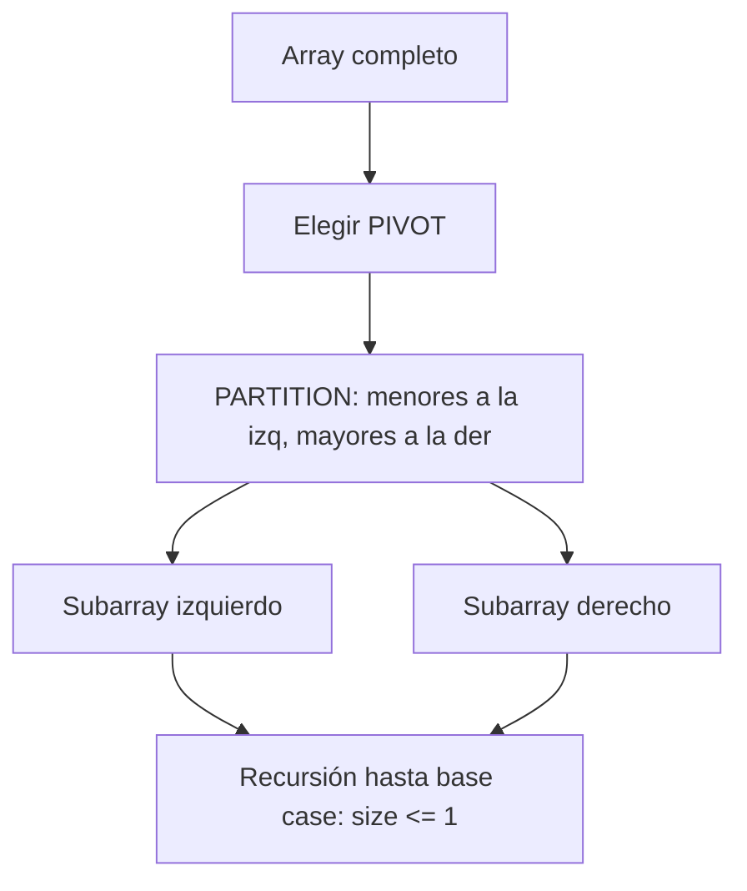
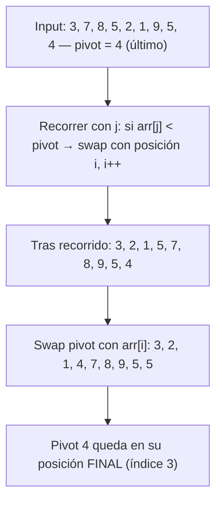
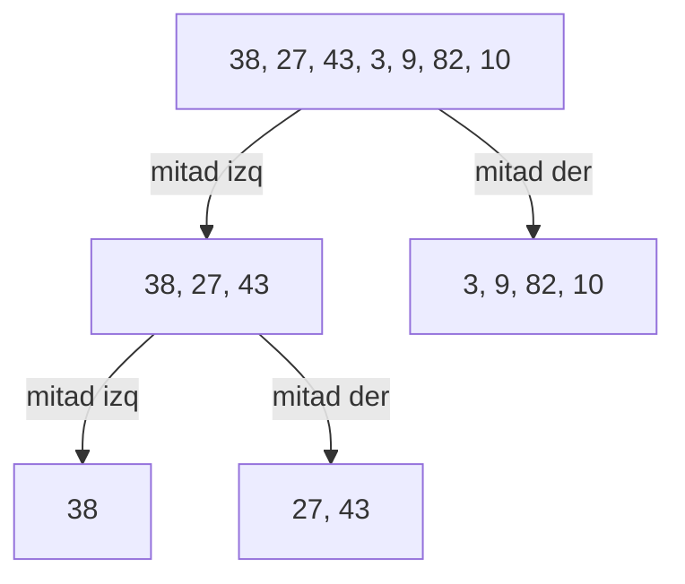
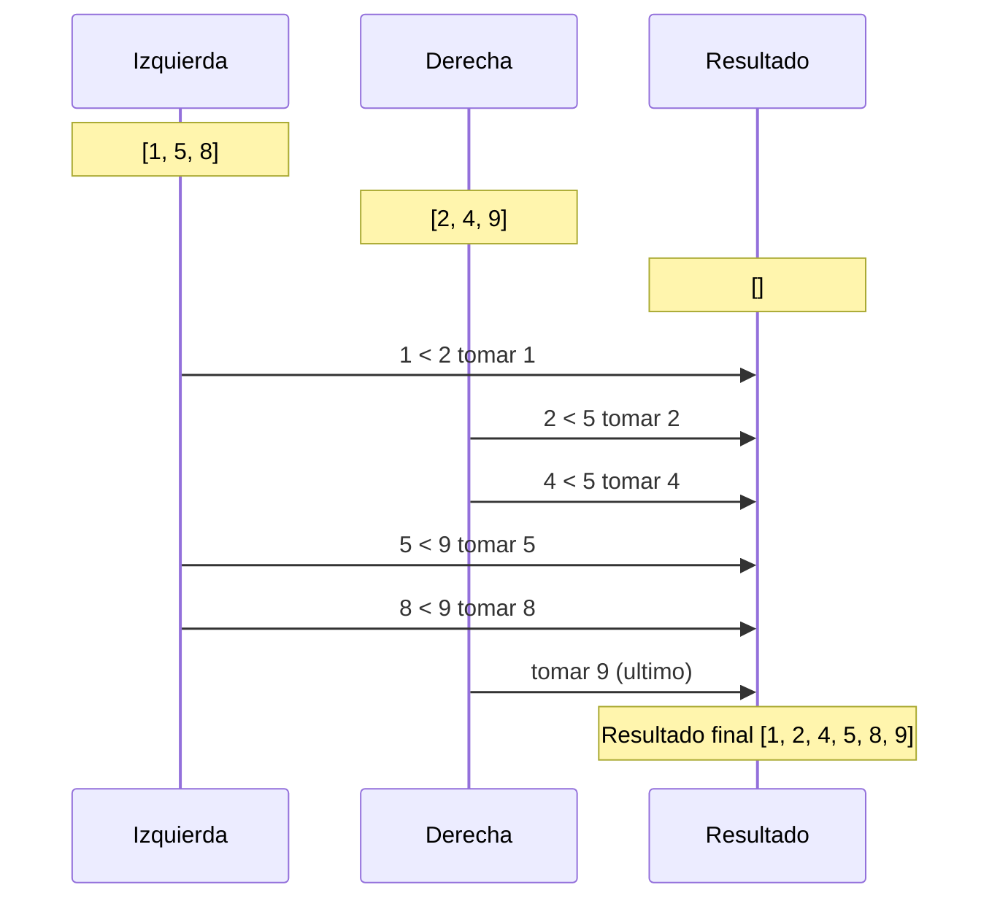

# 📘 Nivel 03 — Ordenación sobre Arrays

---

## 1. ¿Por qué ordenar?

Ordenar un array es una de las operaciones más fundamentales en programación. Un array ordenado permite:
- **Búsqueda binaria** O(log n) en vez de lineal O(n).
- **Eliminación de duplicados** en un solo recorrido.
- **Merge de arrays** de forma eficiente.
- **Presentación de datos** al usuario de forma legible.

En este nivel implementaremos **cinco algoritmos de ordenación desde cero**, sin usar `Arrays.sort()`.

---

## 2. Conceptos Comunes a Todos los Algoritmos

### 2.1 Operación de Swap

La operación más elemental: intercambiar dos elementos usando una variable temporal.

### 2.2 In-place vs Con espacio extra

| Categoría | Algoritmos | Descripción |
|---|---|---|
| **In-place** (O(1) espacio) | BubbleSort, SelectionSort, InsertionSort, QuickSort | Ordenan modificando el propio array |
| **Con espacio extra** (O(n)) | MergeSort | Necesita un array auxiliar del mismo tamaño |

### 2.3 Estabilidad

Un algoritmo es **estable** si mantiene el orden relativo de elementos con el mismo valor.

### 2.4 Tabla comparativa de complejidad

| Algoritmo | Estable | In-place | Mejor caso | Caso medio | Peor caso | Espacio |
|---|---|---|---|---|---|---|
| Bubble Sort | ✅ Sí | ✅ Sí | O(n) | O(n²) | O(n²) | O(1) |
| Selection Sort | ❌ No | ✅ Sí | O(n²) | O(n²) | O(n²) | O(1) |
| Insertion Sort | ✅ Sí | ✅ Sí | O(n) | O(n²) | O(n²) | O(1) |
| QuickSort | ❌ No | ✅ Sí | O(n log n) | O(n log n) | O(n²) | O(log n) |
| MergeSort | ✅ Sí | ❌ No | O(n log n) | O(n log n) | O(n log n) | O(n) |

---

## 3. Bubble Sort — El Burbujeo

El elemento más grande "burbujea" hasta el final en cada pasada.

#### Pasada 1 — El mayor llega al final

#### Pasada 2 — El segundo mayor

**Optimización clave**: si en una pasada no se hace NINGÚN swap, el array ya está ordenado → salir con flag `swapped = false`.

---

## 4. Selection Sort — Selección del Mínimo

En cada iteración, busca el **mínimo** del subarray no ordenado y lo coloca en su posición.

**Característica**: siempre hace exactamente n-1 swaps (uno por iteración), aunque hace O(n²) comparaciones.

---

## 5. Insertion Sort — Inserción en Lugar

Simula cómo ordenarías una mano de cartas: tomas cada carta y la insertas en su lugar correcto entre las ya ordenadas.

**Ventaja**: es el más rápido de los O(n²) para arrays **casi ordenados** (mejor caso O(n)).

---

## 6. QuickSort — Divide y Vencerás con Pivot

### 6.1 Esquema general

### 6.2 Partición Lomuto

**Peor caso**: pivot siempre es el mínimo o máximo → O(n²). Se mitiga con "median-of-three" o pivot aleatorio.

---

## 7. MergeSort — Divide, Ordena, Fusiona

### 7.1 Fase de división

### 7.2 Operación Merge (fusión de dos mitades ordenadas)

---

## 8. Ordenación de Strings

Los mismos algoritmos funcionan con `String[]` si reemplazamos la comparación `<` / `>` con `compareTo()`:
- `a.compareTo(b) < 0` → a va antes que b (lexicográficamente).
- `a.compareTo(b) > 0` → a va después que b.
- `a.compareTo(b) == 0` → son iguales.

Para ignorar mayúsculas: `a.compareToIgnoreCase(b)`.

---

## Referencia de Ejercicios

| Ejercicio | Archivo | Concepto Principal |
|---|---|---|
| 11 | `Ej11_BubbleSort.java` | Burbujeo con optimización de flag |
| 12 | `Ej12_SelectionSort.java` | Selección del mínimo |
| 13 | `Ej13_InsertionSort.java` | Inserción en posición correcta |
| 14 | `Ej14_QuickSort.java` | Partición Lomuto, recursión |
| 15 | `Ej15_MergeSort.java` | Dividir, ordenar, fusionar |
| 16 | `Ej16_OrdenacionStrings.java` | Aplicar algoritmos a String[] |
