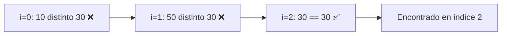
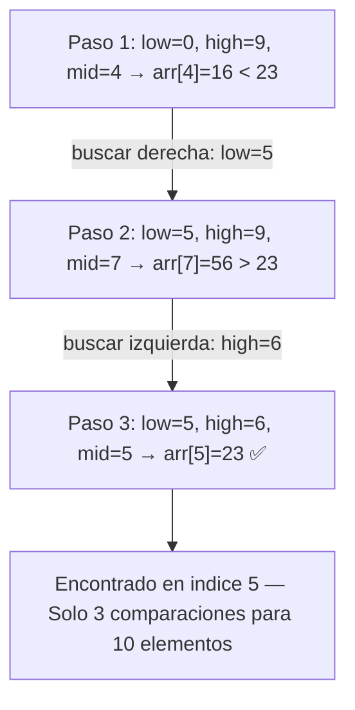
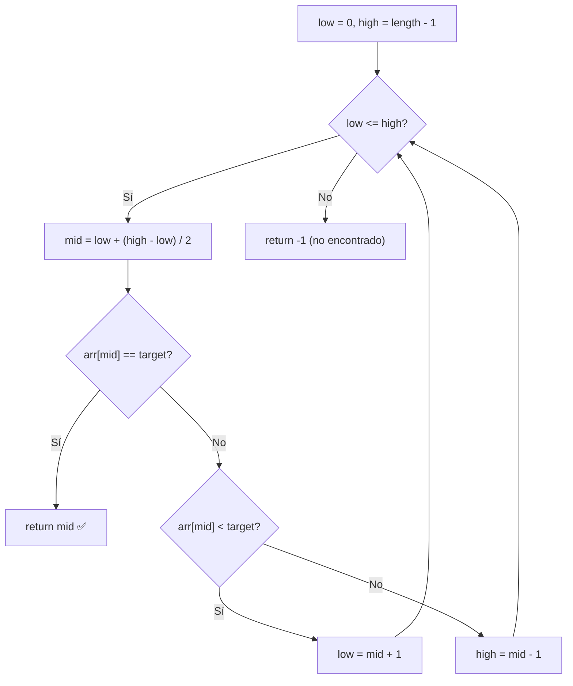
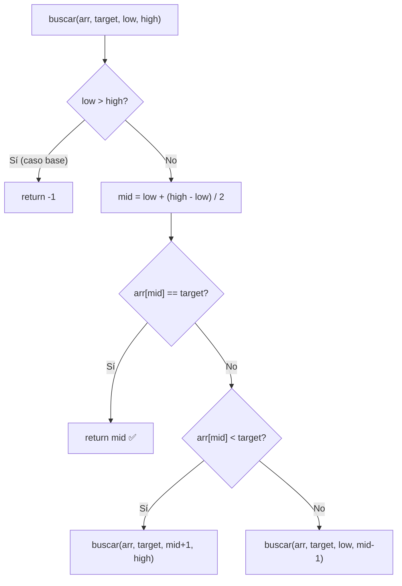
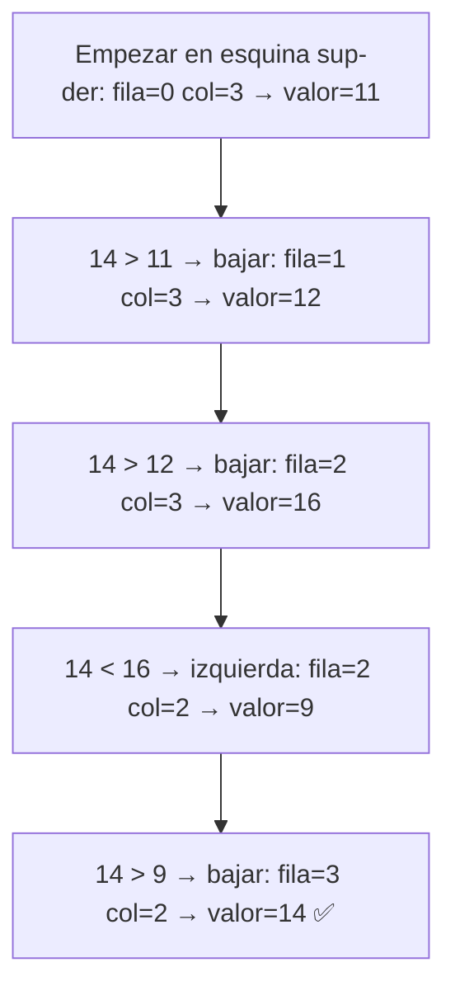

# 📘 Nivel 04 — Búsqueda en Arrays

---

## 1. Búsqueda Lineal vs Búsqueda Binaria

La búsqueda es la operación más frecuente sobre arrays. Elegir el algoritmo correcto marca la diferencia entre O(n) y O(log n).

| Aspecto | Búsqueda Lineal | Búsqueda Binaria |
|---|---|---|
| **Complejidad** | O(n) | O(log n) |
| **Requisito** | Ninguno (funciona en desordenados) | Array ORDENADO |
| **Estrategia** | Recorrer uno a uno | Dividir el espacio a la mitad |

### Comparación de rendimiento

| n elementos | Lineal (peor caso) | Binaria (peor caso) |
|---|---|---|
| 10 | 10 comparaciones | 4 comparaciones |
| 100 | 100 | 7 |
| 1.000 | 1.000 | 10 |
| 1.000.000 | 1.000.000 | 20 |
| 1.000.000.000 | 1.000.000.000 | 30 |

---

## 2. Búsqueda Lineal — Paso a Paso

### Variantes de búsqueda lineal

| Variante | Descripción |
|---|---|
| **Primera ocurrencia** | Devolver el primer índice donde aparece |
| **Última ocurrencia** | Recorrer de derecha a izquierda |
| **Todas las ocurrencias** | Devolver un array con todos los índices |
| **Contar ocurrencias** | Contar cuántas veces aparece |

---

## 3. Búsqueda Binaria — El Poder de Dividir

**Requisito obligatorio**: el array DEBE estar **ordenado**.

### 3.1 Ejemplo paso a paso

Buscar `23` en `{2, 5, 8, 12, 16, 23, 38, 56, 72, 91}`:

### 3.2 Fórmula segura del punto medio

| Fórmula | Segura | Problema |
|---|---|---|
| `mid = (low + high) / 2` | ❌ | `low + high` puede causar **overflow** con enteros grandes |
| `mid = low + (high - low) / 2` | ✅ | Aritméticamente segura, nunca desborda |

### 3.3 Versión iterativa

### 3.4 Versión recursiva

---

## 4. Variantes de Búsqueda Binaria

### 4.1 Primera y última ocurrencia

Cuando hay **duplicados**, la búsqueda binaria estándar puede devolver cualquier ocurrencia. Las variantes permiten encontrar la **primera** o la **última**.

Dado `arr = {1, 3, 3, 3, 3, 5, 7}`:

| Operación | Resultado |
|---|---|
| Primera ocurrencia de `3` | Índice **1** |
| Última ocurrencia de `3` | Índice **4** |
| Lower bound de `3` | Índice **1** (primer `>= 3`) |
| Upper bound de `3` | Índice **5** (primer `> 3`) |

### 4.2 Tabla de comportamiento

| Variante | Descripción | Si encontramos target |
|---|---|---|
| **Primera ocurrencia** | Primer índice con ese valor | Guardar resultado y seguir buscando a la **izquierda** |
| **Última ocurrencia** | Último índice con ese valor | Guardar resultado y seguir buscando a la **derecha** |
| **Lower bound** | Primer índice con valor `>= target` | Si `arr[mid] >= target` → `high = mid - 1` |
| **Upper bound** | Primer índice con valor `> target` | Si `arr[mid] <= target` → `low = mid + 1` |

---

## 5. Búsqueda en Matriz 2D Ordenada

Cuando una matriz tiene filas y columnas **ordenadas** (cada fila está ordenada de izquierda a derecha, y cada columna de arriba a abajo), se puede buscar desde la **esquina superior derecha**.

### 5.1 Ejemplo: buscar 14

Matriz de ejemplo:

| | Col 0 | Col 1 | Col 2 | Col 3 |
|---|---|---|---|---|
| **Fila 0** | 1 | 4 | 7 | 11 |
| **Fila 1** | 2 | 5 | 8 | 12 |
| **Fila 2** | 3 | 6 | 9 | 16 |
| **Fila 3** | 10 | 13 | 14 | 17 |

### 5.2 Algoritmo Staircase paso a paso

**Complejidad**: O(filas + columnas) — mucho mejor que O(filas × columnas).

### 5.3 Reglas del algoritmo

| Condición | Acción |
|---|---|
| Valor actual **== target** | ¡Encontrado! |
| Valor actual **> target** | Moverse a la **izquierda** (col--) |
| Valor actual **< target** | Moverse **abajo** (row++) |
| Fuera de límites | No encontrado → devolver null |

---

## Referencia de Ejercicios

| Ejercicio | Archivo | Concepto Principal |
|---|---|---|
| 17 | `Ej17_BusquedaLineal.java` | Búsqueda secuencial y variantes |
| 18 | `Ej18_BusquedaBinaria.java` | Binaria iterativa y recursiva |
| 19 | `Ej19_BusquedaBinariaVariantes.java` | Primera/última ocurrencia, lower/upper bound |
| 20 | `Ej20_BusquedaEnMatriz.java` | Búsqueda staircase en matriz 2D ordenada |
