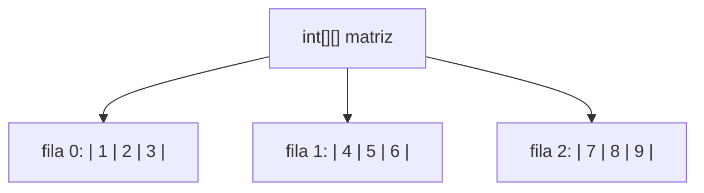
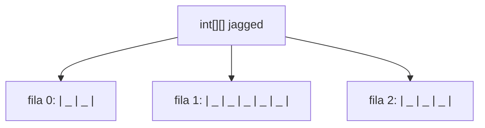
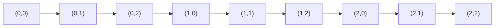
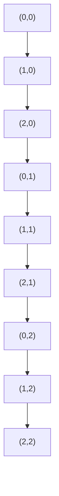
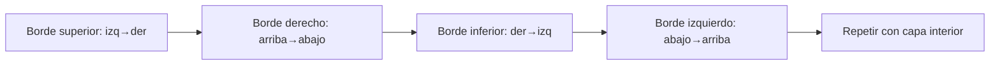
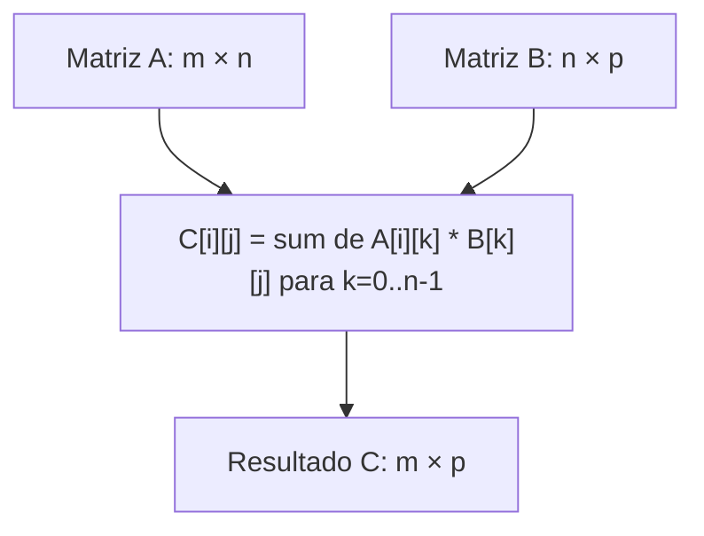

# 📘 Nivel 05 — Matrices Bidimensionales (2D)

---

## 1. ¿Qué es una Matriz 2D?

Un array bidimensional es un **array de arrays**. Se accede con dos índices: `matriz[fila][columna]`.

En Java, un `int[][]` es un objeto en el Heap que contiene **referencias** a arrays de `int[]`, cada uno representando una fila.



### Propiedades clave

| Propiedad | Acceso | Valor para 3×4 |
|---|---|---|
| Número de filas | `matriz.length` | 3 |
| Número de columnas de fila `i` | `matriz[i].length` | 4 |
| Elemento en fila 1, columna 2 | `matriz[1][2]` | — |

---

## 2. Creación e Inicialización

### 2.1 Con `new`

```
int[][] m = new int[3][4];  // 3 filas × 4 columnas, todo a 0
```

### 2.2 Con literal

```
int[][] m = {
    {1, 2, 3},
    {4, 5, 6},
    {7, 8, 9}
};
```

### 2.3 Jagged arrays (filas de distinto tamaño)

```
int[][] jagged = new int[3][];
jagged[0] = new int[2];   // fila 0 tiene 2 columnas
jagged[1] = new int[5];   // fila 1 tiene 5 columnas
jagged[2] = new int[3];   // fila 2 tiene 3 columnas
```



---

## 3. Patrones de Recorrido en Matrices

### 3.1 Recorrido por filas (Row-major)

Recorre de izquierda a derecha, fila por fila. Es el patrón más eficiente en Java por la **localidad de caché**.



### 3.2 Recorrido por columnas (Column-major)

Recorre de arriba a abajo, columna por columna. Menos eficiente en caché.



### 3.3 Recorrido diagonal

Para matrices cuadradas: `matriz[i][i]` recorre la diagonal principal.

### 3.4 Recorrido en espiral

Recorrido perímetro → siguiente capa interior → ... hasta el centro.



---

## 4. Transposición de Matriz

La **transposición** intercambia filas por columnas: `T[j][i] = M[i][j]`.

### Antes (3×3)

| | Col 0 | Col 1 | Col 2 |
|---|---|---|---|
| **Fila 0** | 1 | 2 | 3 |
| **Fila 1** | 4 | 5 | 6 |
| **Fila 2** | 7 | 8 | 9 |

### Después (transpuesta)

| | Col 0 | Col 1 | Col 2 |
|---|---|---|---|
| **Fila 0** | 1 | 4 | 7 |
| **Fila 1** | 2 | 5 | 8 |
| **Fila 2** | 3 | 6 | 9 |

Para matrices **cuadradas** se puede hacer in-place: solo recorrer el triángulo superior (`j > i`) y hacer swap.

---

## 5. Operaciones Aritméticas con Matrices

| Operación | Fórmula | Requisito |
|---|---|---|
| **Suma** | `C[i][j] = A[i][j] + B[i][j]` | Mismas dimensiones |
| **Resta** | `C[i][j] = A[i][j] - B[i][j]` | Mismas dimensiones |
| **Multiplicación** | `C[i][j] = Σ A[i][k] * B[k][j]` | cols(A) == filas(B) |
| **Escalar** | `C[i][j] = A[i][j] * k` | Cualquiera |

### Multiplicación de matrices



> La multiplicación de matrices NO es conmutativa: `A × B ≠ B × A`.

---

## 6. Identidad y Simetría

| Concepto | Definición |
|---|---|
| **Matriz identidad** | Diagonal principal = 1, resto = 0 |
| **Matriz simétrica** | `M[i][j] == M[j][i]` para todo i, j |
| **Diagonal principal** | Posiciones donde `i == j` |
| **Diagonal secundaria** | Posiciones donde `i + j == n - 1` |

---

## Referencia de Ejercicios

| Ejercicio | Archivo | Concepto Principal |
|---|---|---|
| 21 | `Ej21_CreacionRecorrido2D.java` | Crear, recorrer filas/columnas/diagonales |
| 22 | `Ej22_OperacionesMatrices.java` | Suma, resta, multiplicación, escalar |
| 23 | `Ej23_TransposicionYSimetria.java` | Transponer, verificar simetría, identidad |
| 24 | `Ej24_RecorridoEspiral.java` | Espiral, perímetro, capas concéntricas |
| 25 | `Ej25_JaggedArrays.java` | Arrays irregulares, triángulos de Pascal |
