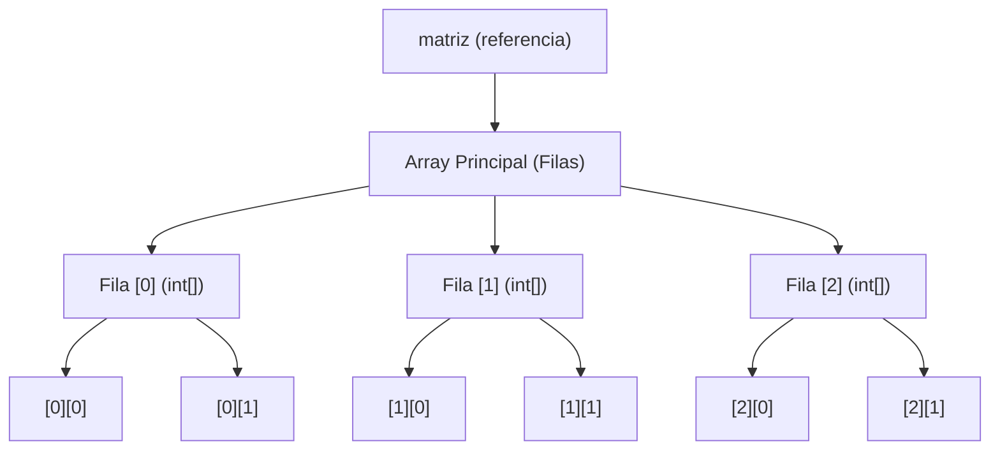
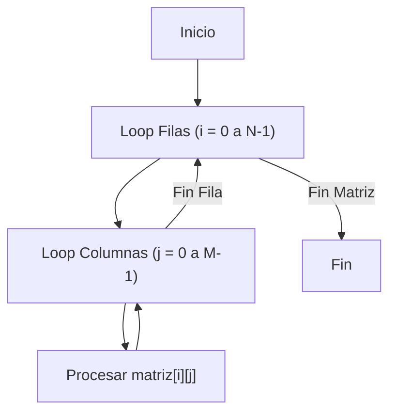
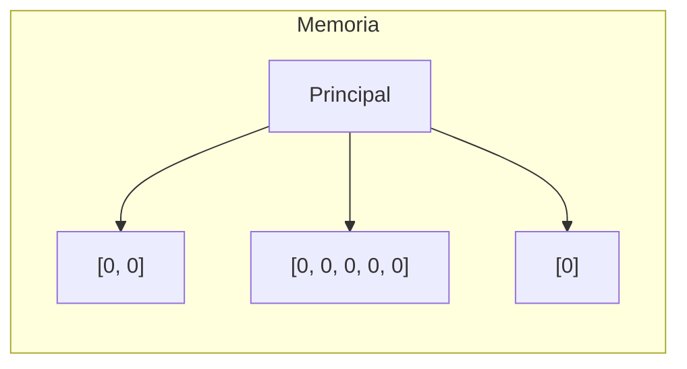
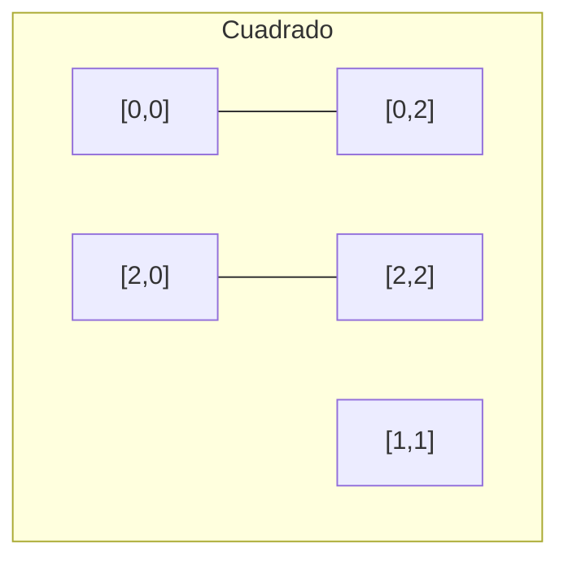
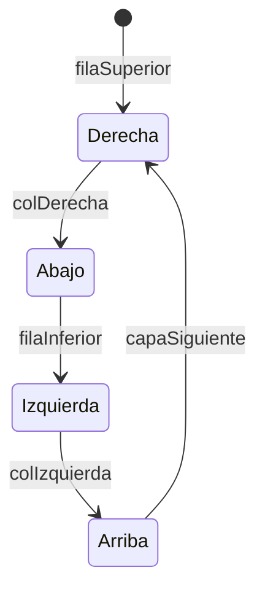

# 📘 Nivel 05 — Matrices Bidimensionales en Java

---

## 1. ¿Qué es una Matriz en Java?

A diferencia de otros lenguajes donde una matriz es un bloque de memoria rectangular rígido, en **Java** una matriz es un **array de arrays**.

Esto significa que `int[][] matriz` es un array donde cada posición guarda una **referencia** a otro array de tipo `int[]`.

### Estructura en Memoria (Heap)



---

## 2. Declaración e Inicialización

Existen varias formas de declarar una matriz según el conocimiento previo de los datos:

### 2.1 — Conociendo dimensiones (Vacía)
```java
int[][] grid = new int[3][4]; // 3 filas, 4 columnas. Todas a 0.
```

### 2.2 — Conociendo los datos (Literal)
```java
int[][] datos = {
    {1, 2, 3},  // Fila 0
    {4, 5, 6},  // Fila 1
    {7, 8, 9}   // Fila 2
};
```

> ⚠️ **Propiedad .length**: `datos.length` devuelve el número de **filas**. `datos[i].length` devuelve el número de **columnas** de esa fila específica.

---

## 3. Acceso y Recorrido (Row-Major Order)

El acceso se realiza mediante dos corchetes: `matriz[fila][columna]`. Por defecto, en Java recorremos de forma **Row-Major** (Fila a Fila).

### Algoritmo de Recorrido



---

## 4. Jagged Arrays (Arrays Irregulares)

Como una matriz es un array de arrays, las filas **no tienen por qué tener el mismo tamaño**. Esto se conoce como **Jagged Array**.

### Ejemplo: Triángulo de Ventas
```java
int[][] irregular = new int[3][];
irregular[0] = new int[2]; // Fila 0 tiene 2 cols
irregular[1] = new int[5]; // Fila 1 tiene 5 cols
irregular[2] = new int[1]; // Fila 2 tiene 1 col
```

### Representación Visual Jagged



---

## 5. Operaciones de Diagonales

En matrices **cuadradas** (Filas == Columnas), las diagonales son elementos clave.

| Diagonal | Condición de Índice | Ejemplo (3x3) |
| :--- | :--- | :--- |
| **Principal** | `i == j` | `(0,0), (1,1), (2,2)` |
| **Secundaria** | `j == (N - 1 - i)` | `(0,2), (1,1), (2,0)` |

### Visualización Diagonales


---

## 6. Patrones de Recorrido Avanzado

### 6.1 — Recorrido en Serpiente (Zig-Zag)
Consiste en recorrer filas pares de izquierda a derecha y filas impares de derecha a izquierda.

### 6.2 — Recorrido en Espiral (Caracol)
Se procesa el marco exterior y se reduce progresivamente hacia el centro. Requiere 4 índices de control: `top`, `bottom`, `left`, `right`.



---

## Referencia de Ejercicios

| Ejercicio | Archivo | Concepto Principal |
|---|---|---|
| 21 | `Ej21_CreacionYRecorrido2D.java` | Iteración anidada básica |
| 22 | `Ej22_SumaFilasColumnasMedias.java` | Reducción de datos por ejes |
| 23 | `Ej23_DiagonalesPrincipalSecundaria.java` | Lógica de índices en matrices cuadradas |
| 24 | `Ej24_MatrizIdentidadYSimetrica.java` | Verificación de propiedades matemáticas |
| 25 | `Ej25_JaggedArrays.java` | Gestión de filas con tamaños variables |
| 26 | `Ej26_MatrizEspiralRecorrido.java` | Algoritmos de recorrido complejos |
