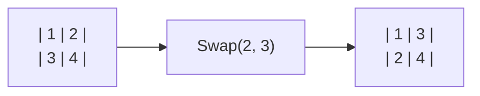
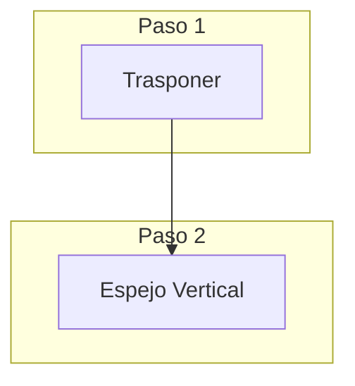
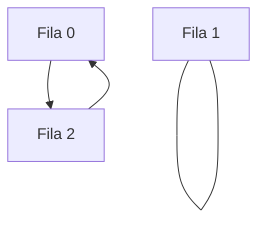
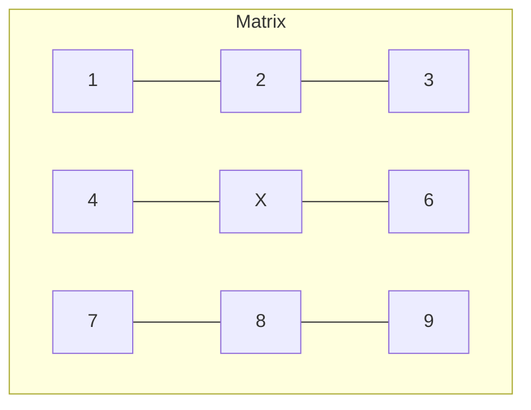

# 📘 Nivel 06 — Transformaciones de Matrices

---

## 1. ¿Qué es una Transformación?

Una transformación sobre una matriz es una operación que altera la disposición de sus elementos basándose en reglas geométricas. Son esenciales en procesamiento de imágenes, motores gráficos y álgebra lineal.

---

## 2. Transposición de Matrices

La **transposición** consiste en convertir las filas en columnas y viceversa. Matemáticamente: $A[i][j] \rightarrow A[j][i]$.

### Tipos de Transposición

| Tipo | Método | Memoria |
| :--- | :--- | :--- |
| **Cuadrada** | In-place (swap) | O(1) extra |
| **Rectangular** | Crear nueva [C][F] | O(F*C) extra |

### Diagrama: Transposición Cuadrada In-place

> **Nota**: En una trasposición in-place, solo recorremos la mitad superior (encima de la diagonal principal) para evitar trasponer dos veces el mismo elemento y dejarlo igual.

---

## 3. Rotaciones de 90 Grados

Rotar una matriz 90° es una operación compuesta. No es una simple asignación; requiere entender el movimiento de los ejes.

### 3.1 — Rotación Horaria (90°)
**Algoritmo**: 
1. Trasponer la matriz.
2. Invertir el orden de los elementos en cada fila (**Espejo Vertical**).

### 3.2 — Rotación Anti-horaria (-90°)
**Algoritmo**:
1. Trasponer la matriz.
2. Invertir el orden de las filas (**Espejo Horizontal**).

---

## 4. Espejos (Flipping)

Los espejos son inversiones de orden sobre un eje específico.

### 4.1 — Espejo Horizontal
Invertimos el orden de las **filas**. La primera pasa a ser la última.

### 4.2 — Espejo Vertical
Invertimos el orden de las **columnas** dentro de cada fila. El elemento `[i][0]` pasa a ser `[i][M-1]`.

---

## 5. Rotaciones de 180 y 270 Grados

Son derivaciones de las rotaciones básicas:

- **180°**: Equivale a dos rotaciones de 90° o a aplicar Espejo Horizontal + Espejo Vertical simultáneamente.
- **270°**: Equivale a una rotación de 90° anti-horaria.

---

## 6. Manipulación de Submatrices y Marcos

### 6.1 — Extracción de Submatriz
Consiste en definir una "ventana" mediante coordenadas de inicio `(r1, c1)` y fin `(r2, c2)`.

### 6.2 — El Marco (Borde)
El marco son todos los elementos `[i][j]` donde `i == 0`, `i == n-1`, `j == 0` o `j == m-1`.

---

## Referencia de Ejercicios

| Ejercicio | Archivo | Concepto Principal |
|---|---|---|
| 27 | `Ej27_Transposicion.java` | Cambio de ejes FxC a CxF |
| 28 | `Ej28_Rotacion90Grados.java` | Combinación de Trasposición + Inversión |
| 29 | `Ej29_Rotacion180Y270.java` | Transformaciones compuestas |
| 30 | `Ej30_EspejoHorizontalVertical.java` | Inversiones sobre ejes axiales |
| 31 | `Ej31_SubmatrizYMarco.java` | Ventaneo y procesamiento de bordes |
| 32 | `Ej32_SumaMultiplicacionMatrices.java` | Álgebra de matrices (A*B) |
