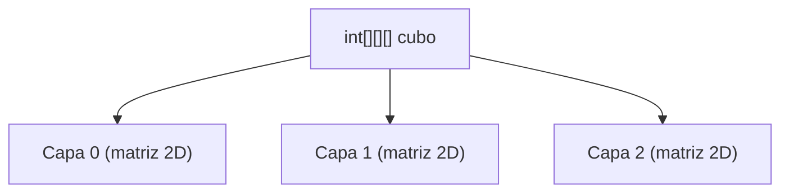
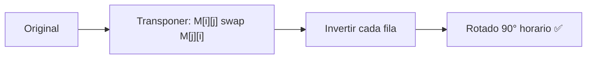
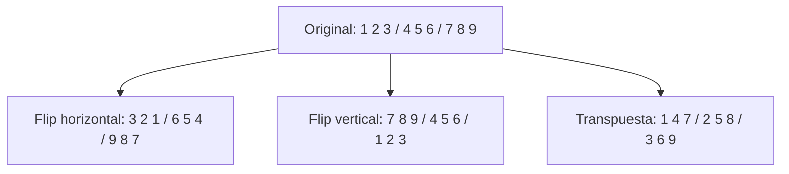
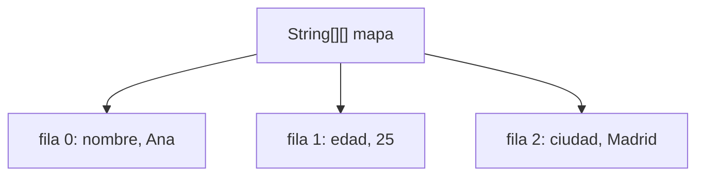

# 📘 Nivel 06 — Matrices 3D y Rotaciones

---

## 1. Arrays Tridimensionales (3D)

Un array 3D es un **array de matrices**: `int[capa][fila][columna]`.



### Acceso

| Dimensión | Propiedad | Ejemplo |
|---|---|---|
| Número de capas | `cubo.length` | 3 |
| Filas de capa `c` | `cubo[c].length` | 4 |
| Columnas de fila `f` en capa `c` | `cubo[c][f].length` | 5 |
| Elemento específico | `cubo[c][f][col]` | — |

### Recorrido de un array 3D

```
for (int c = 0; c < cubo.length; c++)          // capas
    for (int f = 0; f < cubo[c].length; f++)    // filas
        for (int col = 0; col < cubo[c][f].length; col++)  // columnas
            // procesar cubo[c][f][col]
```

---

## 2. Rotación de Matrices 2D

### 2.1 Rotación 90° en sentido horario

La rotación 90° horaria de una matriz n×n se logra en **dos pasos**:

**Paso 1**: Transponer la matriz (`M[i][j]` ↔ `M[j][i]`).
**Paso 2**: Invertir cada fila horizontalmente.

#### Ejemplo

| Paso | Matriz |
|---|---|
| **Original** | `1 2 3` / `4 5 6` / `7 8 9` |
| **Tras transponer** | `1 4 7` / `2 5 8` / `3 6 9` |
| **Tras invertir filas** | `7 4 1` / `8 5 2` / `9 6 3` |



### 2.2 Rotación 90° en sentido antihorario

**Paso 1**: Transponer la matriz.
**Paso 2**: Invertir cada **columna** verticalmente.

También se puede hacer así:
**Paso 1**: Invertir cada fila horizontalmente.
**Paso 2**: Transponer.

### 2.3 Rotación 180°

Equivale a aplicar la rotación 90° **dos veces**, o bien:
- Invertir todas las filas verticalmente (flip vertical).
- Invertir cada fila horizontalmente (flip horizontal).

### 2.4 Tabla resumen de rotaciones

| Rotación | Método |
|---|---|
| **90° horario** | Transponer + invertir cada fila |
| **90° antihorario** | Transponer + invertir cada columna |
| **180°** | Invertir filas + invertir cada fila (o rotar 90° × 2) |
| **270° horario** | = 90° antihorario |

---

## 3. Reflexiones (Flip)

| Reflexión | Operación |
|---|---|
| **Flip horizontal** | Invertir cada fila: `swap(M[i][j], M[i][n-1-j])` |
| **Flip vertical** | Invertir las filas: `swap(fila i, fila n-1-i)` |
| **Flip diagonal** | Transponer: `swap(M[i][j], M[j][i])` |



---

## 4. Simulación de Estructuras con Arrays Paralelos

### 4.1 Simular un Map con dos arrays

Usar dos arrays del mismo tamaño: uno para **claves** y otro para **valores**.

| Índice | claves[] | valores[] |
|---|---|---|
| 0 | "nombre" | "Ana" |
| 1 | "edad" | "25" |
| 2 | "ciudad" | "Madrid" |

**Operaciones**:
- `put(clave, valor)`: buscar si la clave existe; si sí, actualizar; si no, añadir al final.
- `get(clave)`: buscar la clave linealmente y devolver el valor en el mismo índice.
- `remove(clave)`: buscar, eliminar desplazando en ambos arrays.
- `size()`: tamaño lógico (mismo para ambos arrays).

### 4.2 Simular un Map con un array 2D

Usar un `String[][]` donde cada fila es un par `{clave, valor}`.



---

## 5. Uso Práctico: Tableros de Juego

Las matrices 2D modelan naturalmente:
- **Tableros de ajedrez** (8×8)
- **Tableros de sudoku** (9×9)
- **Mapas de videojuegos** (n×m)
- **Imágenes en escala de grises** (píxeles como int[alto][ancho])

---

## Referencia de Ejercicios

| Ejercicio | Archivo | Concepto Principal |
|---|---|---|
| 26 | `Ej26_Rotacion90Grados.java` | Rotar 90°/180°/270° con transponer+invertir |
| 27 | `Ej27_ArrayTridimensional.java` | Crear, recorrer, buscar en 3D |
| 28 | `Ej28_SimularMapConArrays.java` | Map con arrays paralelos y 2D |
| 29 | `Ej29_TableroDeJuego.java` | Tablero n×m con operaciones de juego |
| 30 | `Ej30_TransformacionesMatriz.java` | Flip, espejo, operaciones combinadas |
