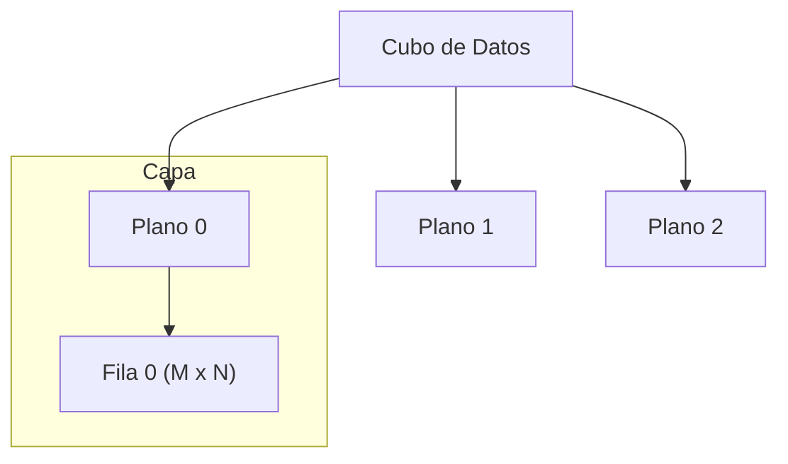
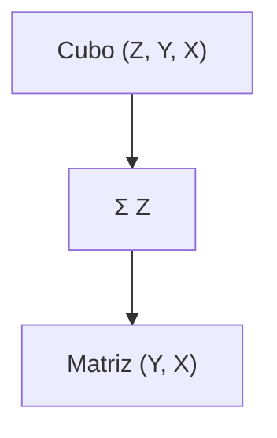
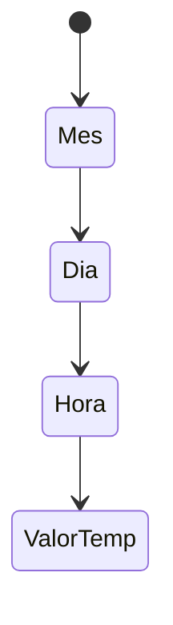

# 📘 Nivel 07 — Arrays Tridimensionales (3D)

---

## 1. El Concepto del Cubo

Un array 3D añade una dimensión extra de **Profundidad (Depth)**. En Java, se declara como `int[][][] cubo`. 

Podemos visualizarlo como una **pila de libros** o un **edificio**:
- **Piso (Capa/Plano)**: Dimensión 0 (`[z]`).
- **Fila**: Dimensión 1 (`[y]`).
- **Columna**: Dimensión 2 (`[x]`).

### Representación Conceptual



---

## 2. Declaración y Acceso

```java
// Un "cubo" de 5x10x10
int[][][] datos = new int[5][10][10];

// Acceso al elemento
int valor = datos[2][4][1]; // Plano 2, Fila 4, Col 1
```

### Límites de los Índices
- `datos.length`: Número de **planos** (profundidad).
- `datos[0].length`: Número de **filas** del plano 0.
- `datos[0][0].length`: Número de **columnas** de la fila 0 del plano 0.

---

## 3. Recorrido de Tres Niveles

Para procesar un cubo entero, necesitamos tres bucles anidados. El orden influye drásticamente en el rendimiento debido a la caché.

```java
for (int z = 0; z < planos; z++) {
    for (int i = 0; i < filas; i++) {
        for (int j = 0; j < columnas; j++) {
            // Operación sobre cubo[z][i][j]
        }
    }
}
```

---

## 4. Planos y "Flattening" (Colapsado)

A menudo necesitamos extraer un plano 2D del cubo para procesarlo por separado.

### 4.1 — Extracción de Capa
Es simple en Java porque `cubo[z]` ya es una referencia a una matriz `int[][]`.

### 4.2 — Colapsado por Suma (Proyección)
Consiste en "aplastar" el cubo en una matriz 2D sumando todos los valores que coinciden en `(i, j)`.



---

## 5. Rotaciones 3D

Rotar en 3D es más complejo porque se puede rotar sobre tres ejes:

| Eje | Descripción |
| :--- | :--- |
| **Eje Z** | Rotar cada plano 2D de forma independiente. |
| **Eje X** | Las filas "suben" o "bajan" entre planos. |
| **Eje Y** | Las columnas se mueven entre planos. |

---

## 6. Caso de Uso: Serie Temporal 3D

Imagina un sensor térmico en una fábrica:
- `meses[12]`
- `dias[31]`
- `horas[24]`

`temperaturas[mes][dia][hora]` permite consultas complejas como:
- "Media de temperatura a las 14:00 durante todo el año".
- "El día más caluroso de cada mes".



---

## Referencia de Ejercicios

| Ejercicio | Archivo | Concepto Principal |
|---|---|---|
| 33 | `Ej33_Creacion3DRecorrido.java` | Estructuras de 3 niveles |
| 34 | `Ej34_OperacionesPorCapas.java` | Manipulación de planos individuales |
| 35 | `Ej35_CuboRotaciones.java` | Rotaciones espaciales sobre ejes |
| 36 | `Ej36_TablaTridimensional.java` | Modelado de datos del mundo real |
| 31 (L7) | `Ej31_ManipulacionBits.java` | (Opcional - Avanzado) |
