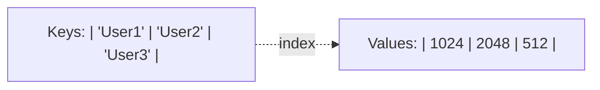
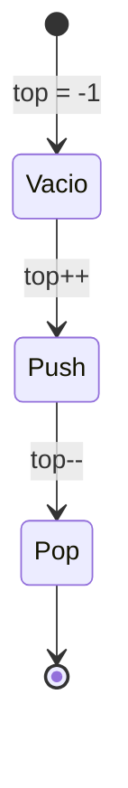
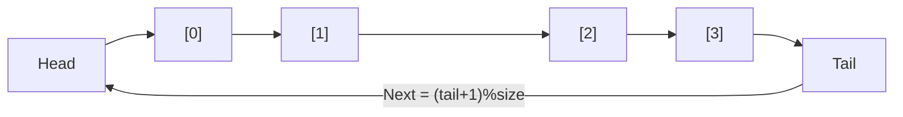
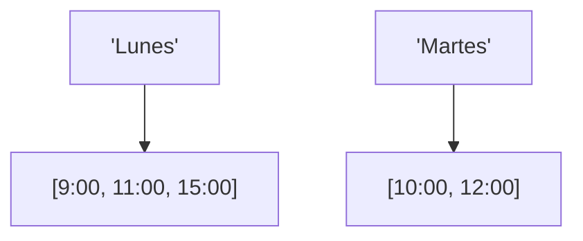

# 📘 Nivel 08 — Simulación de Estructuras con Arrays

---

## 1. Arrays como Bloques de Memoria RAW

Antes de las APIs modernas (`ArrayList`, `HashMap`), los arrays eran la única forma de organizar datos. Simular estructuras de alto nivel sobre arrays permite entender cómo funcionan realmente las colecciones por dentro.

---

## 2. Simulación de MAP (Diccionario)

Un **Map** asocia una Clave con un Valor. 

### 2.1 — Método de Arrays Paralelos
Usamos dos arrays de igual tamaño coordinados por índice.

### 2.2 — Método de Array 2D (Tabla)
Usamos una matriz `String[N][2]` donde `[i][0]` es la clave y `[i][1]` el valor.

---

## 3. Estructuras Lineales: Stack y Queue

### 3.1 — Stack (Pila - LIFO)
Se gestiona con un único puntero `top` que indica el último elemento insertado.

### 3.2 — Queue (Cola - FIFO)
Requiere dos punteros: `head` (salida) y `tail` (entrada). Para optimizar, se usa la **Aritmética Circular**.

---

## 4. Simulación de SET (Conjunto)

Un **Set** es un array que garantiza la **unicidad**. 
- Cada inserción requiere una búsqueda previa ($O(n)$).
- Si el elemento ya existe, se ignora.

---

## 5. MultiMap (Uno a Muchos)

En un MultiMap, una clave tiene un array de valores asociado. Esto se implementa con **Jagged Arrays** coordinados.

---

## 6. Gestión de Memoria Dinámica Manual

Cuando simulemos estas estructuras, el array es de **tamaño fijo**. Si se llena, debemos:
1. Crear un nuevo array con el doble de tamaño.
2. Copiar los datos del antiguo al nuevo (`System.arraycopy`).
3. Reasignar la referencia.

---

## Referencia de Ejercicios

| Ejercicio | Archivo | Concepto Principal |
|---|---|---|
| 37 | `Ej37_MapConArraysParalelos.java` | Asociación clave-valor simple |
| 38 | `Ej38_MapConArray2D.java` | Diccionarios en matrices String |
| 39 | `Ej39_StackSobreArray.java` | Lógica LIFO (Last In First Out) |
| 40 | `Ej40_QueueSobreArray.java` | Lógica FIFO y Buffer Circular |
| 41 | `Ej41_SetSobreArray.java` | Garantía de unicidad manual |
| 42 | `Ej42_MultiMapParalelo.java` | Arrays irregulares para multi-valor |
| 43 | `Ej43_TablaRegistros.java` | Simulación de tabla de base de datos |
