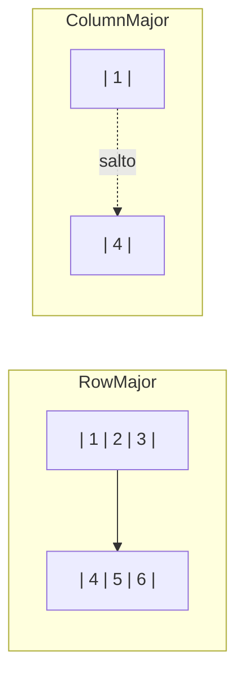
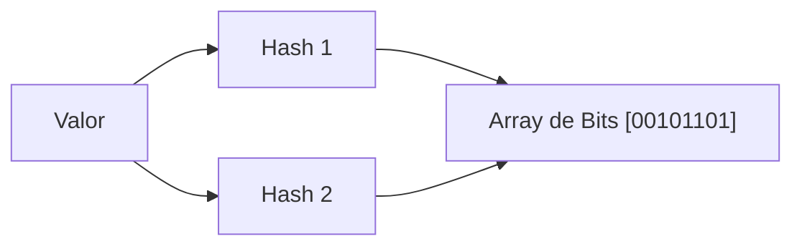
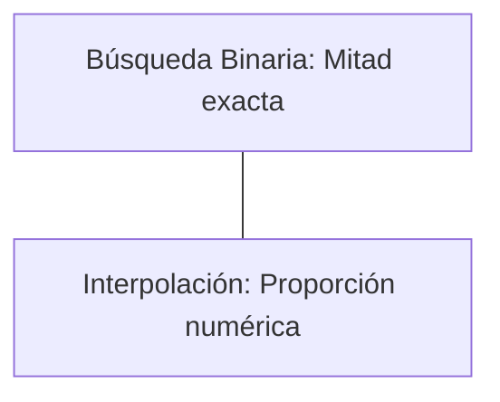
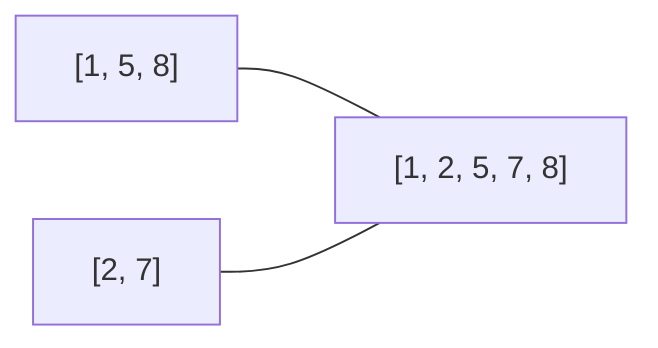

# 📘 Nivel 09 — Patrones Avanzados y Rendimiento

---

## 1. Localidad de Datos y Caché de CPU

La CPU es órdenes de magnitud más rápida que la RAM. Para mitigar esto, usa la **Caché L1/L2/L3**.

### 1.1 — Cache Lines
Cuando pides un dato (ej: `array[0]`), la CPU carga los siguientes **64 bytes** (aprox) por si acaso. Si tu array es contiguo, los siguientes datos ya están en caché.

### 1.2 — El Problema del Recorrido por Columnas
En Java, recorrer una matriz por columnas (`[j][i]`) rompe la localidad de datos, obligando a la CPU a buscar en RAM constantemente (**Cache Miss**).



---

## 2. Bit-Packing (Ahorro Extremo de Memoria)

Podemos guardar múltiples datos pequeños dentro de un tipo más grande. 
- Ejemplo: Guardar cuatro `byte` (8 bits) dentro de un solo `int` (32 bits).

### Empaquetado de Bytes
```java
int packed = (b1 << 24) | (b2 << 16) | (b3 << 8) | b4;
```

---

## 3. Estructuras Probabilísticas: Filtro de Bloom

Un Filtro de Bloom nos dice si un elemento **"posiblemente está"** o **"definitivamente no está"** en un conjunto. Usa un array de bits y múltiples funciones Hash.



---

## 4. Algoritmos de Búsqueda de Alto Desempeño

### 4.1 — Jump Search (Búsqueda por Saltos)
Divide el array en bloques de tamaño $\sqrt{n}$. Salta bloques hasta que encuentra uno donde el elemento podría estar, y luego hace búsqueda lineal dentro.

### 4.2 — Interpolation Search (Búsqueda de Interpolación)
Calcula la posición estimada basándose en los valores de los extremos.
- **Eficiencia**: En datos uniformes, alcanza $O(\log(\log n))$.



---

## 5. Mezcla de Arrays (Merge Step)

El fundamento de algoritmos como MergeSort. Consiste en unir dos arrays **ya ordenados** en uno nuevo sin perder el orden, en tiempo lineal $O(n + m)$.



---

## Referencia de Ejercicios

| Ejercicio | Archivo | Concepto Principal |
|---|---|---|
| 44 | `Ej44_CacheDataLocality.java` | Impacto de la memoria caché en el rendimiento |
| 45 | `Ej45_BytePacking.java` | Manipulación de bits y empaquetado |
| 46 | `Ej46_BloomFilter.java` | Estructuras probabilísticas de datos |
| 47 | `Ej47_JumpSearch.java` | Salto de bloques en arrays ordenados |
| 48 | `Ej48_InterpolationSearch.java` | Búsqueda por estimación proporcional |
| 49 | `Ej49_MezclaOrdenada.java` | Fusión de secuencias (Merge Algorithm) |
