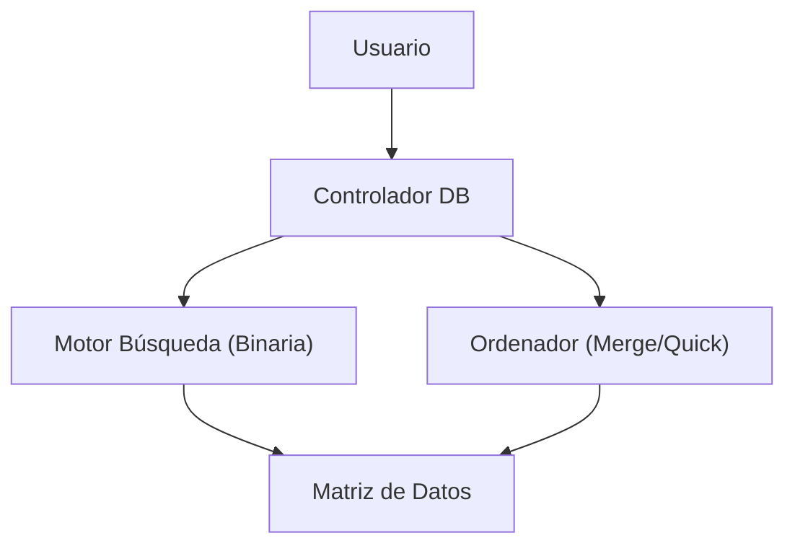
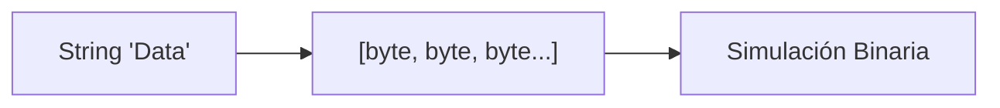

# 📘 Nivel 10 — Master Challenge: Boss Final

---

## 1. El Desafío Final: Arquitectura de Datos

Has recorrido desde la simple declaración de un array hasta la manipulación de cubos 3D y optimización de caché. El **Boss Final** consiste en construir un **SGBD (Sistema de Gestión de Base de Datos)** minimalista pero funcional, operando exclusivamente sobre memoria estática.

---

## 2. Componentes del Sistema

Para superar este reto, deberás integrar los siguientes conocimientos:

### 2.1 — El Almacén (Storage)
Uso de matrices `String[][]` para simular filas y columnas. Implementación de redimensionado manual coordinado con `System.arraycopy`.

### 2.2 — El Motor de Búsqueda (Query Engine)
Uso de **Búsqueda Binaria** o **Interpolación** sobre el campo ID para respuestas en tiempo logarítmico.

### 2.3 — El Optimizador (Sorting)
Implementación de un algoritmo de ordenamiento eficiente ($O(n \log n)$) para mantener la base de datos lista para búsquedas.

---

## 3. Persistencia y Serialización RAW

Un reto adicional de este nivel es la simulación de guardado en disco. Transformarás los registros de la matriz de Strings a un flujo de **bytes empaquetados**, aplicando técnicas de **Byte Packing**.

---

## 4. Checkpoint de Maestría

Si has llegado hasta aquí y tus tests pasan, dominas:
- [x] Gestión de punteros implícitos y referencias.
- [x] Gestión manual de la memoria (Heap).
- [x] Algoritmia avanzada de búsqueda y ordenado.
- [x] Transformaciones geométricas de datos.
- [x] Optimización de bajo nivel (Cache friendly).

¡Enhorabuena, Arquitecto!

---

## Referencia de Ejercicios

| Ejercicio | Archivo | Concepto Principal |
|---|---|---|
| 50 | `Ej50_BossFinalDB.java` | Proyecto Integrador de Maestría en Arrays |
