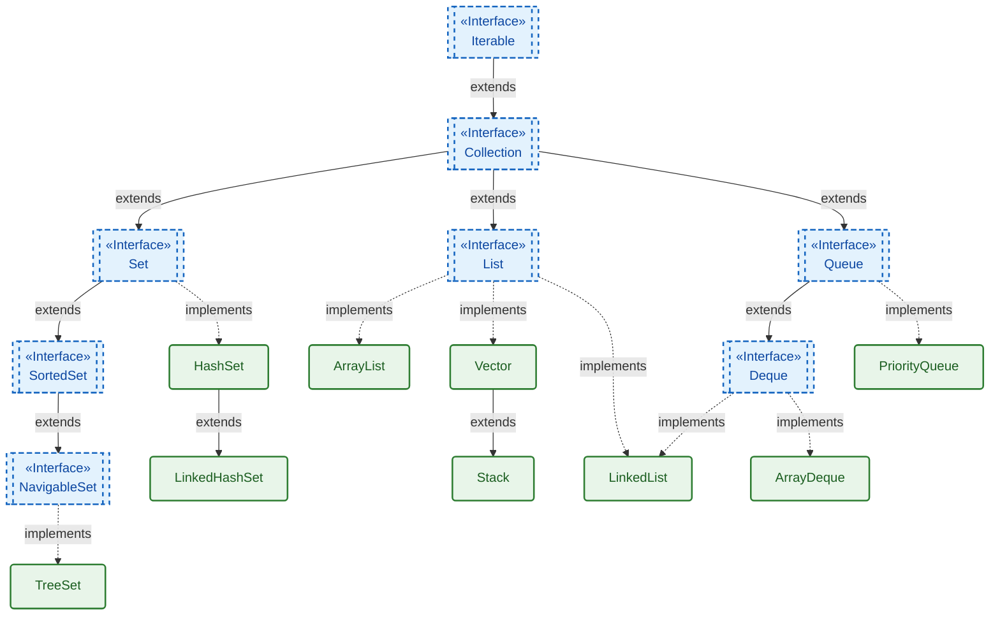

```mermaid
flowchart TD
    %% Definición de estilos profesionales (Colores armonizados)
    classDef interface fill:#e3f2fd,stroke:#1565c0,stroke-width:2px,color:#0d47a1,stroke-dasharray: 5 5,rx:8,ry:8
    classDef classNode fill:#e8f5e9,stroke:#2e7d32,stroke-width:2px,color:#1b5e20,rx:4,ry:4

    %% Nodos Principales (Interfaces)
    Iterable[["«Interface»<br/>Iterable"]]:::interface
    Collection[["«Interface»<br/>Collection"]]:::interface
    
    %% Nodos Secundarios (Interfaces)
    Set[["«Interface»<br/>Set"]]:::interface
    List[["«Interface»<br/>List"]]:::interface
    Queue[["«Interface»<br/>Queue"]]:::interface
    Deque[["«Interface»<br/>Deque"]]:::interface
    SortedSet[["«Interface»<br/>SortedSet"]]:::interface
    NavigableSet[["«Interface»<br/>NavigableSet"]]:::interface

    %% Nodos (Clases)
    HashSet["HashSet"]:::classNode
    LinkedHashSet["LinkedHashSet"]:::classNode
    TreeSet["TreeSet"]:::classNode
    ArrayList["ArrayList"]:::classNode
    LinkedList["LinkedList"]:::classNode
    Vector["Vector"]:::classNode
    Stack["Stack"]:::classNode
    PriorityQueue["PriorityQueue"]:::classNode
    ArrayDeque["ArrayDeque"]:::classNode

    %% Relaciones de Herencia (Interfaces)
    Iterable -->|extends| Collection

    Collection -->|extends| Set
    Collection -->|extends| List
    Collection -->|extends| Queue

    Set -->|extends| SortedSet
    SortedSet -->|extends| NavigableSet
    Queue -->|extends| Deque

    %% Relaciones de Implementación y Herencia (Clases)
    Set -.->|implements| HashSet
    HashSet -->|extends| LinkedHashSet
    NavigableSet -.->|implements| TreeSet

    List -.->|implements| ArrayList
    List -.->|implements| Vector
    Vector -->|extends| Stack
    
    %% LinkedList es especial, implementa List y Deque
    List -.->|implements| LinkedList
    Deque -.->|implements| LinkedList

    Queue -.->|implements| PriorityQueue
    Deque -.->|implements| ArrayDeque
```