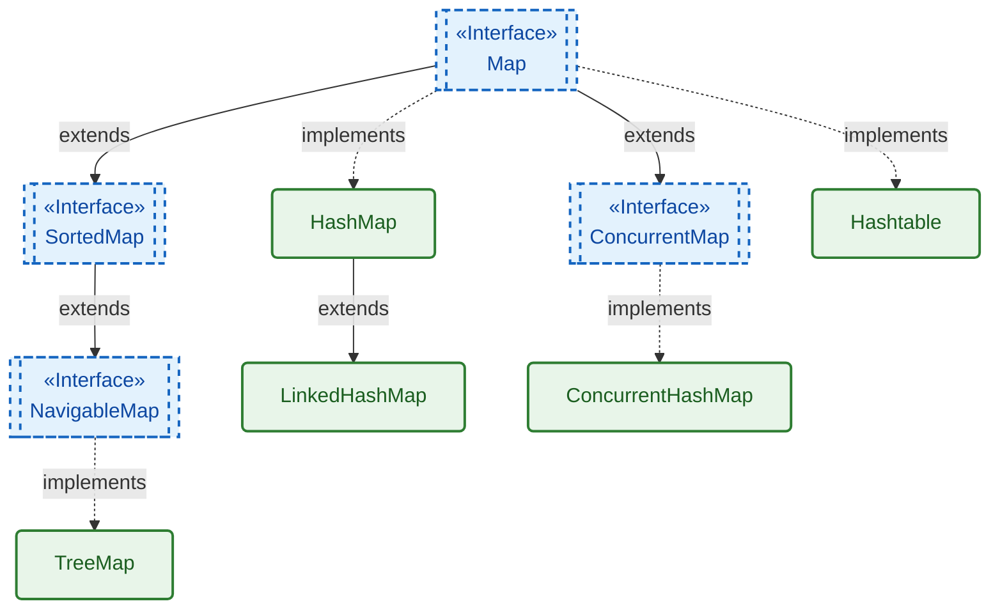

```mermaid
flowchart TD
    %% Definición de estilos profesionales (Colores armonizados)
    classDef interface fill:#e3f2fd,stroke:#1565c0,stroke-width:2px,color:#0d47a1,stroke-dasharray: 5 5,rx:8,ry:8
    classDef classNode fill:#e8f5e9,stroke:#2e7d32,stroke-width:2px,color:#1b5e20,rx:4,ry:4

    %% Nodos (Interfaces)
    Map[["«Interface»<br/>Map"]]:::interface
    SortedMap[["«Interface»<br/>SortedMap"]]:::interface
    NavigableMap[["«Interface»<br/>NavigableMap"]]:::interface
    ConcurrentMap[["«Interface»<br/>ConcurrentMap"]]:::interface

    %% Nodos (Clases)
    HashMap["HashMap"]:::classNode
    LinkedHashMap["LinkedHashMap"]:::classNode
    Hashtable["Hashtable"]:::classNode
    TreeMap["TreeMap"]:::classNode
    ConcurrentHashMap["ConcurrentHashMap"]:::classNode

    %% Relaciones de Herencia (Interfaces)
    Map -->|extends| SortedMap
    SortedMap -->|extends| NavigableMap
    Map -->|extends| ConcurrentMap

    %% Relaciones de Implementación y Herencia (Clases)
    Map -.->|implements| HashMap
    HashMap -->|extends| LinkedHashMap
    Map -.->|implements| Hashtable

    NavigableMap -.->|implements| TreeMap
    ConcurrentMap -.->|implements| ConcurrentHashMap

```

