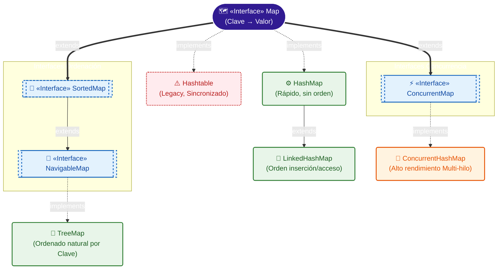

# Esquema Completo del Java Collections Framework (Mapas)

---

## Leyenda y Guía de Referencia

### 1. Interfaces Principales

#### `Map<K, V>`
- **Definición**: Representa un mapeo entre "Clave/Llave" (Key) a un "Valor" (Value). Un Mapa no tolera llaves clonadas y cada llave puede identificar a máximo 1 valor (como un DNI al ciudadano). NOTA: Visualmente son colecciones, pero `Map` como tal **no hereda de Collection** internamente en Java por concepto purista.
- **Casos de Uso**: Representar directores indexados de BBDD que relacionan IDs frente a entidades gigantes, uso de Diccionarios y censos generalistas.
- **Métodos Principales**:
  - 🔸 `put(K key, V value)`: Agrega la asociación al mapa. Si había una misma llave lo pisa y reescribe al nuevo valor.
  - 🔸 `get(Object key)`: Retorna al instante el "Valor" a quién pertenece la llave indicada o `null`.
  - 🔸 `getOrDefault(Object key, V defaultValue)`: Igual que `get` pero si no halla la llave, devuelve un valor comodín que configures tú en vez de devolver el peligroso `null`.
  - 🔸 `containsKey(Object key)` / `containsValue(Object value)`: Examina si dicho nombre de llavero o valor almacenado residen ahora en la matriz.
  - 🔸 `remove(Object key)`: Evapora y borra la llave dada (y lógicamente al mismo su valor asignado acompañante).
  - 🔸 `putAll(Map<? extends K,? extends V> m)`: Vuelca de un plumazo todo otro mapa entero dentro del principal.
  - 🔸 `clear()` / `size()` / `isEmpty()`: Operaciones de limpieza y estado del mapa general.
  - 🔸 `keySet()`: Extrae todas las claves (Keys) sin valores y las retorna de puro golpe modeladas como un tipo `Set`.
  - 🔸 `values()`: Extrae todos los "Values" desvinculados de su clave en formato `Collection`.
  - 🔸 `entrySet()`: Retorna su forma empaquetada real `Map.Entry`, clave y valor ligados útiles si deseas aplicar iteraciones y sentencias For completas por encima del mapa sin separar su unión.
  - 🔸 `putIfAbsent(K key, V value)`: (Java 8+) Solo introduce al mapa la llave si ésta no existía o si su valor actual asociado figuraba como nulo.
  - 🔸 `replace(K key, V value)`: Solo logra reemplazar y mutar si la llave SÍ estaba dada de alta.
  - 🔸 `forEach(BiConsumer<? super K,? super V> action)`: Itera aplicando una lambda directamente a todas las duplas llave-valor.

#### `SortedMap<K, V>` y `NavigableMap<K, V>`
- **Definición**: Las interfaces especializadas de este campo imponen y supervisan orden estricto natural sobre cada Key introducida, `Navigable` aporta facilidades de investigación.
- **Métodos Principales**:
  - 🔹 `firstKey()` / `lastKey()`: Adjudica el extremo menor bajo o el altísimo.
  - 🔹 `lowerKey(K key)` / `higherKey(K key)`: Búsquedas aproximadas muy óptimas que consiguen llaves directamente vecinas.
  - 🔹 `ceilingKey(K key)` / `floorKey(K key)`: Obtiene la clave más pequeña que sea mayor-o-igual / la clave más grande que sea menor-o-igual a la consultada.
  - 🔹 `subMap(K fromKey, K toKey)`: Construye un mini-mapa cortando o delimitando extractos al ser capaz de saber el orden interno exacto.
  - 🔹 `headMap(K toKey)`: Retorna toda la fracción del mapa "desde el principio" estricto hasta la llave indicada.
  - 🔹 `tailMap(K fromKey)`: Retorna toda la fracción libre "desde tu llave" hasta que acabe el mapa entero.
  - 🔹 `descendingMap()`: Genera una vista del mapa leyendo todo a la inversa (útil para TreeMaps).

#### `ConcurrentMap<K, V>`
- **Definición**: Interfaz experta de multi-hilos segura (Thread-safe) optimizada.
- **Métodos Exclusivos Atómicos**:
  - 🔹 `putIfAbsent(K key, V value)`: Operación ininterrumpible. Introduce valor y llave solo bajo seguridad extrema si esa otra llave no yacía alojada antes.
  - 🔹 `replace(K key, V oldValue, V newValue)`: Reemplaza asegurándose que antes el valor anterior coincida de raíz de que nadie más se nos haya interpuesto temporalmente.

---

### 2. Implementaciones concretas (Clases)

#### `HashMap<K, V>`
- **Qué hace**: Su pilar central depende del cálculo Hash numérico de la "Key". Carece de garantías organizativas ni de iteración futura controlable. Es permitido guardar hasta un Key de valor puramente `null` e infinitos "Valores" nulos.
- **Cuándo usarla**: La cabecera central recomendada de cualquier software estándar. Opcioón más ligera de un mapa de coste $\mathcal{O}(1)$ generalizado. Funcional en la mayoría de escenarios corrientes y casuísticas diarias al buscar una Clave ID.
- **Métodos Destacados**: Posee en pleno todos los genéricos de `Map<K, V>`.

#### `LinkedHashMap<K, V>`
- **Qué hace**: Integra un enlazado constante detrás que cose y retiene memorizado un registro estático del acceso al momento de crear, salvaguardando lo indeseable organizativo que resulta el simple `HashMap` clásico.
- **Cuándo usarla**: Siempre que se disponga o interese de exportar todo o imprimir del Mapa su volumen total manteniendo el modelo formal donde los objetos introducidos primero aparezcan siempre primero. Se implementa además muy asiduamente para montarse mecánicas de *caché con purga por antigüedad (LRU)*.
- **Métodos Exclusivos de Construcción**:
  - 🔸 Su constructor especial `LinkedHashMap(int initialCapacity, float loadFactor, boolean accessOrder)` permite configurar si el elemento debe irse al "final" de la cola de impresión simplemente porque lo hayas *tocado/consultado*, lo cual es la base ideal de cachés LRU.

#### `TreeMap<K, V>`
- **Qué hace**: Implementa `NavigableMap` haciendo sostén al Mapa completo recubriéndose en forma de estructura de "Red-Black tree" garantizando tiempo ordenado logarítmico sobre toda mutación o consulta básica.
- **Cuándo usarla**: Cuando precisemos indexarlo TODO al vuelo o exijamos hacerle llamadas continuas de aproximaciones (tipo: dame qué clientes tienen el ID de la cuenta justo mayor a 400).
- **Métodos Destacados**: Ejecuta a pleno rendimiento todos los citados en `NavigableMap` como `firstEntry()`, `lastEntry()`, `pollFirstEntry()` (saca la pareja Map.Entry más liviana ordenadamente), y visualizaciones como `descendingKeySet()`.

#### `Hashtable<K, V>`
- **Qué hace**: La antítesis vieja de `HashMap`. Sincronizada y a prueba de asincronía (Multi-Threading Thread Safe) en exclusividad básica. Al revés que el HashMap no tolerará en la vida claves `null`.
- **Cuándo usarla**: Es una colección puramente identificada de **Legacy Class**. Su rendimiento de cuellos de botella forjó a dejar de usarse. No implementar modernamente.

#### `ConcurrentHashMap<K, V>`
- **Qué hace**: Modernización suprema nacida para abarcar la multiturbo asincronía en aplicaciones. Segmenta pedazos separados de su diccionario y deja leer en uno o editar por otro lado en hilos distintos (Lock-Striping).
- **Cuándo usarla**: El "Must Have" obligatorio para variables globales Multi-Hilo.
- **Métodos de Apoyo y Agregados Atómicos**:
  - 🔸 `compute(K key, BiFunction mappingFunction)`: Atómicamente intenta recalcular/editar la llave. Si dos usuarios de un servidor tocan a la misma milésima sobre una key llamada "Visitas", el ConcurrentHashMap asegurará que internamente procesa uno y luego al otro sin pisar los números sumados ni colapsar.
  - 🔸 `mappingCount()`: Sustituye o mejora recomendablemente a `size()` porque es capaz de proveer contabilidades `long` inmensas en aplicaciones masivas que superan los millones.
