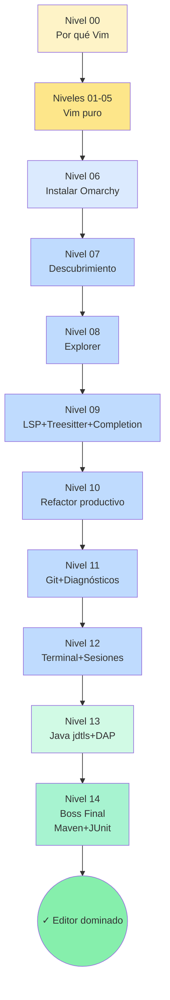

# 🗺️ Sílabo — Neovim + Omarchy Masterclass

**14 niveles · ~70 ejercicios · Cero ratón · De `:q` a IDE Java profesional**

---

## Filosofía pedagógica

Tres principios rigen el bootcamp:

1. **Vim puro primero (Niveles 00-05).** No tocamos un solo plugin hasta dominar la gramática nativa: modos, operadores, text objects, ventanas, macros y marks. Esto es lo que te durará 20 años y lo que hace que TODOS los plugins de LazyVim parezcan triviales después.

2. **Plugins uno a uno (Niveles 06-12).** Cada nivel instala (o "despierta") **un grupo de plugins relacionados** y los practica hasta el automatismo. No saltamos al siguiente hasta que el actual está integrado.

3. **Proyecto real (Niveles 13-14).** El bootcamp termina con un proyecto Maven completo, con JUnit y debug, trabajado íntegramente desde Neovim. Si no puedes hacerlo del tirón sin ratón, no has terminado.

---

## Restricción fundamental

> [!CAUTION]
> **El ratón está PROHIBIDO** durante todo el bootcamp. Si te encuentras tocándolo, vuelve al ejercicio anterior.
> **Editar la config de LazyVim/Omarchy** solo se permite donde el ejercicio lo pida explícitamente.
> **Mirar `solucion/` antes de intentar** anula el aprendizaje — el script `verificar.sh` la usa para comparar; tú no.

---

## Tabla maestra de niveles

### Parte 0 — Vim puro (no requiere plugins)

| Nivel | Tema | Concepto principal | Ejercicios |
|---|---|---|---|
| **00** | Por qué Vim y cómo salir | Filosofía modal · `:q/:wq/ZZ` · primer archivo | 3 |
| **01** | Movimiento | `hjkl` · `wbe` · `0$^g_` · `gg/G/{n}G` · `f/t/;,` · `/?nN` | 5 |
| **02** | Edición y operadores | Insert vs Normal · `x/dd/dw/D` · `y/p/P` + registros · `c/cc/cw` · `u/Ctrl-R` · `.` | 5 |
| **03** | Text objects y visual | operador+movimiento · `iw/aw/ip/ap/i"/a[` · `v/V/Ctrl-V` · `>/</=` | 5 |
| **04** | Buffers, ventanas, tabs | `:e/:b/:ls` · `:sp/:vsp` + `Ctrl-W` · `:tabnew/gt` · `:q/:wq/:wa` · args | 5 |
| **05** | Ex avanzado, macros y marks | `:s///g` · `:g/` · rangos `:1,10s` `:%s` `:'a,'bs` · macros `qa…q @a` · marks `ma 'a ``` | 5 |

**Subtotal Parte 0: 28 ejercicios.**

---

### Parte 1 — Aterrizaje en Omarchy / LazyVim

| Nivel | Tema | Concepto principal | Ejercicios |
|---|---|---|---|
| **06** | Instalación y anatomía LazyVim | Instalar config Omarchy según OS · primer arranque · `:Lazy` · `:checkhealth` · estructura `lua/plugins/` · `:Mason` | 5 |

**Subtotal Parte 1: 5 ejercicios.**

---

### Parte 2 — Plugins de Omarchy uno a uno

| Nivel | Tema | Plugins cubiertos | Ejercicios |
|---|---|---|---|
| **07** | Descubrimiento y navegación rápida | `which-key`, `snacks.picker` (o `telescope`), `flash.nvim` | 5 |
| **08** | Exploración de proyectos | file explorer (`snacks.explorer` / `neo-tree`), buffer line, gestión de buffers | 5 |
| **09** | Inteligencia de código | `nvim-treesitter`, `mason`, `nvim-lspconfig`, `blink.cmp` (o `nvim-cmp`), snippets | 5 |
| **10** | Refactor productivo | `mini.ai`, `mini.surround`, `mini.pairs`, `conform.nvim`, `nvim-lint`, `grug-far`, `todo-comments` | 5 |
| **11** | Git y diagnósticos | `gitsigns`, `lazygit` (vía snacks), `trouble.nvim` | 5 |
| **12** | Terminal embebida y sesiones | `snacks.terminal`, scratch buffer, persist-sessions, multiventana profesional | 5 |

**Subtotal Parte 2: 30 ejercicios.**

---

### Parte 3 — Java IDE + Boss Final

| Nivel | Tema | Plugins/herramientas | Ejercicios |
|---|---|---|---|
| **13** | Java en Neovim | `nvim-jdtls`, `jdtls` vía Mason, `nvim-dap` + `java-debug-adapter`, `nvim-dap-ui`, `java-test` | 5 |
| **14** | **Boss Final — Proyecto Maven completo** | Todo lo anterior aplicado a un proyecto real con JUnit, debug y push con lazygit | 5 |

**Subtotal Parte 3: 10 ejercicios.**

---

## Boss Final (nivel 14) — qué construirás

Un **proyecto Maven multinivel** estilo Masterclass:

```
ejercicios/nivel14_boss_final/
├── pom.xml                        (Java 21+, JUnit 5, AssertJ)
├── README_BOSS.md                 (consignas del proyecto)
└── src/
    ├── main/java/com/bootcamp/finale/
    │   ├── modelo/Usuario.java     (TODOs)
    │   ├── servicio/UsuarioServicio.java  (TODOs)
    │   └── repositorio/UsuarioRepositorio.java  (TODOs)
    └── test/java/com/bootcamp/finale/
        ├── modelo/UsuarioTest.java
        ├── servicio/UsuarioServicioTest.java
        └── repositorio/UsuarioRepositorioTest.java
```

Los **5 ejercicios** del Boss Final son fases:

| Ej | Fase | Validación |
|---|---|---|
| 14.01 | Abrir el proyecto en nvim+jdtls, ejecutar tests (rojos), navegar entre símbolos con `gd`/`<leader>cr` | `mvn test` corre, `:LspInfo` muestra jdtls activo |
| 14.02 | Implementar `Usuario` (modelo) | tests de `UsuarioTest` en verde |
| 14.03 | Implementar `UsuarioRepositorio` (almacén en memoria) | tests de `UsuarioRepositorioTest` en verde |
| 14.04 | Implementar `UsuarioServicio` + debug con DAP de un caso límite | tests de `UsuarioServicioTest` en verde |
| 14.05 | Refactor con `mini.surround`/`mini.ai`, formatear con `conform`, commit y push con `lazygit` | `mvn clean test` global verde + commit visible en log |

---

## Mapa visual del progreso



---

## Cómo se verifica cada ejercicio

| Tipo de ejercicio | Mecanismo |
|---|---|
| Edición de texto (Niveles 01-05, 07-12) | `diff` entre `ejercicios/.../ejNN.txt` y `solucion/.../ejNN.txt` (script `verificar.sh`/`.ps1`) |
| Configuración / instalación (Nivel 06, parte de 09 y 13) | El ejercicio deja una "huella" en un archivo de evidencia (ej: salida de `:checkhealth` redirigida); se compara con la solución |
| Código Java (Niveles 13-14) | `mvn test` — los tests son la única verdad |

Detalles de uso del verificador → ver `README_GUIA_TERMINAL.md`.

---

## Ritmo recomendado

- **Niveles 00-05** (Vim puro): 1 nivel cada 1-2 días de práctica activa. **Hazlo en una semana** sin saltar.
- **Nivel 06** (Instalación): 1 sesión, no debería llevar más de 2 horas.
- **Niveles 07-12** (Plugins): 1 nivel cada 2-3 días. Practica los plugins varios días después de "completar" el nivel, hasta que sean automáticos.
- **Niveles 13-14** (Java + Boss): 1-2 semanas. El Boss Final se hace cuando los demás son automáticos.

Tiempo total estimado: **6-10 semanas de práctica regular** (30-60 min/día).

---

## Lo que NO cubre este bootcamp (y por qué)

- **Crear tu propia config de Neovim desde cero.** El objetivo es dominar la opinión de Omarchy. Una vez la dominas, modificarla es trivial — pero ese es otro proyecto.
- **Plugins fuera del ecosistema Omarchy/LazyVim** (avante, copilot, etc.). Mantén el alcance acotado.
- **Vim script.** Solo Lua donde sea estrictamente necesario (Nivel 06).
- **Hyprland / desktop tiling.** Asumimos que ya manejas tu WM/terminal.

---

*Fin del sílabo — listo para empezar por `teoria/00_Por_Que_Vim_Y_Omarchy.md`.*
