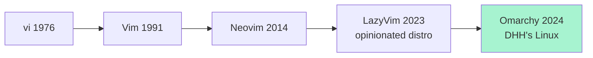
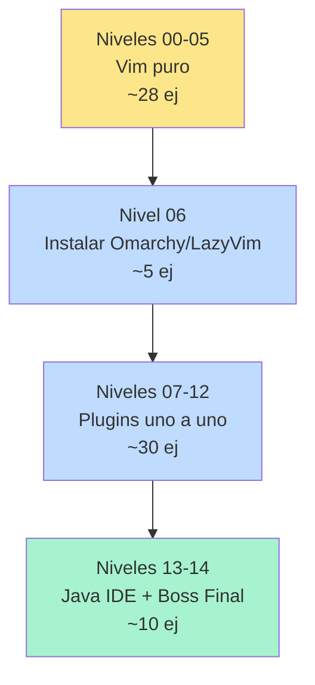

# 📘 Nivel 00 — Por qué Vim, y por qué Omarchy lo usa

---

## 1. La historia corta

Vim es un **editor modal** descendiente de `vi` (1976). Su idea revolucionaria era esta: en lugar de tener un cursor que escribe, tienes **un lenguaje de comandos** que actúa sobre el texto. El teclado, sin desplazar las manos a un ratón ni a las flechas, basta para todo.

Neovim es la reescritura moderna de Vim (2014): mismo lenguaje, mejor arquitectura, scripting en Lua, plugins asíncronos, LSP integrado.

**Omarchy** (DHH, 2024) es una distribución Linux opinada que monta Hyprland + LazyVim como editor por defecto. La filosofía: **"opiniones excelentes pre-configuradas, no infinitas elecciones"**. Toda la configuración de plugins ya viene hecha y tuneada — tú solo aprendes a usarla.



---

## 2. ¿Por qué aprender esto en 2026?

Tres razones objetivas:

1. **Velocidad de edición.** Una vez interiorizas los operadores, eres 2-3× más rápido que con un editor "normal" para tareas repetitivas (refactor masivo, manipulación de bloques, edición sin mirar la pantalla).
2. **Universalidad.** Vim está en TODOS los servidores Linux, en todos los contenedores Docker, en todos los SSH. Aprender Vim es aprender a editar en cualquier máquina del mundo.
3. **Curva mental.** Vim te obliga a pensar en operadores + objetos en lugar de en pulsaciones individuales. Esto luego se transfiere a tu forma de leer código.

**¿Cuándo NO usar Vim?** Cuando tu trabajo dependa fuertemente de herramientas que NO viven en el editor (Figma, Photoshop, DAW). Para programar y editar texto, no hay caso en que sea peor que un IDE — solo curva inicial.

---

## 3. Cómo está estructurado este bootcamp



**Regla cardinal del bootcamp:** no avances al siguiente nivel hasta que el actual sea **automático**. La velocidad de Vim sólo aparece cuando dejas de pensar en las teclas.

---

## 4. La filosofía modal — lo único que tienes que entender HOY

A diferencia de Notepad, VS Code, Word…  donde escribes letras directamente, en Vim **el teclado significa cosas distintas según el modo en el que estés**.

| Modo | Para qué sirve | Cómo entras | Cómo sales |
|---|---|---|---|
| **Normal** (por defecto) | Mover, borrar, copiar, ejecutar comandos | `Esc` o `Ctrl-[` desde cualquier otro modo | — (es el modo base) |
| **Insert** | Escribir texto como en cualquier editor | `i`, `a`, `o`, `I`, `A`, `O` | `Esc` |
| **Visual** | Seleccionar texto | `v` (char), `V` (líneas), `Ctrl-V` (bloque) | `Esc` |
| **Command** | Comandos `:` (guardar, salir, buscar/reemplazar global) | `:` desde Normal | `Enter` o `Esc` |

```mermaid
stateDiagram-v2
    [*] --> Normal
    Normal --> Insert: i a o I A O
    Insert --> Normal: Esc
    Normal --> Visual: v V Ctrl-V
    Visual --> Normal: Esc
    Normal --> Command: :
    Command --> Normal: Enter/Esc
```

> **La clave mental:** En Vim pasas el **99% del tiempo en modo Normal**. Insert es donde escribes letras, sí, pero apenas. Tu cerebro debe entender Normal como "el modo donde Vim espera órdenes" y tratar las letras-de-comandos como un idioma, no como "letras que se escriben".

> **Error típico del principiante:** Quedarse en Insert para todo. Si te ves pulsando flechas en Insert, salte a Normal con `Esc` y muévete desde ahí. La velocidad está en Normal.

---

## 5. Salir de Vim sin pánico — lo primero a memorizar

Mucha gente queda atrapada en Vim por no saber salir. Aquí está la chuleta:

| Quiero… | Comando |
|---|---|
| Salir si no he tocado nada | `:q` + Enter |
| Salir descartando mis cambios | `:q!` + Enter |
| Guardar y salir | `:wq` + Enter (o `ZZ`) |
| Salir sin guardar (atajo Normal) | `ZQ` |
| Solo guardar (sin salir) | `:w` + Enter |
| Guardar TODOS los buffers abiertos | `:wa` + Enter |

> **Truco mental:** `:` abre la línea de comandos. `q` es "quit". `!` es "fuerza, sé que lo que pides es destructivo". `w` es "write". Combínalos.

---

## 6. La ayuda integrada — tu mejor aliada

Vim tiene una de las mejores documentaciones integradas de cualquier programa:

```vim
:help                    " página índice
:help i                  " ayuda del comando 'i'
:help :w                 " ayuda del comando ':w'
:help text-objects       " ayuda del tema "text objects"
:helpgrep palabra        " grep dentro de toda la ayuda
```

Para salir de la ayuda: `:q` (cierra la ventana de ayuda y vuelves a tu archivo).

Externa: `vimtutor` (comando de terminal) es el tutorial oficial de 30 minutos. Hazlo si no lo has hecho.

---

## 7. ¿Y Omarchy qué pinta?

Omarchy no te enseña Vim. Lo que hace es traerte **una opinión pre-cocida** de Neovim + plugins (basada en LazyVim) lista para usar, con:

- Tema integrado con el resto del sistema (Hyprland matching).
- Atajos del sistema (`Super+Shift+N` abre nvim).
- Manual oficial de DHH sobre cómo usarlo en el día a día.

Para este bootcamp, **da igual que estés en Omarchy real o en Windows con la config portada**: la mecánica del editor es la misma. Lo único que cambia es el `INSTALL_BY_OS.md`.

---

## Referencia de Ejercicios

| Ejercicio | Archivo | Concepto |
|---|---|---|
| 00.01 | `ej01_abrir_y_salir.txt` | Abrir Vim, identificar el modo, salir sin guardar |
| 00.02 | `ej02_modal_editing.txt` | Alternar Normal ↔ Insert · pulsaciones que son comandos vs letras |
| 00.03 | `ej03_primer_archivo.txt` | Editar texto real, guardar, verificar |

Lee este archivo al menos dos veces antes de empezar el Nivel 01. Si una sola palabra te chirría, repásala — los Niveles 01-05 asumen que has interiorizado esta página.
