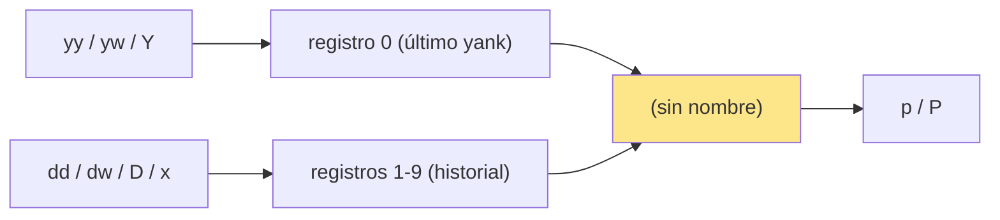
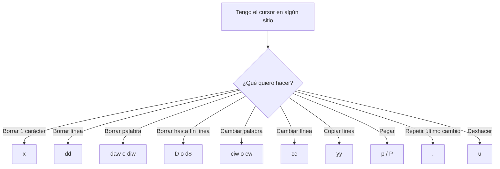

# 📘 Nivel 02 — Edición y operadores

---

## 1. La gramática Vim — operador + movimiento (o text object)

Lo más importante que aprenderás en este bootcamp. Cada acción de edición sigue esta fórmula:

```
[contador] [operador] [movimiento o text object]
   3          d           w                          → borra 3 palabras
              c           $                          → cambia hasta fin de línea
   2          y           y                          → copia 2 líneas
```

> **La clave mental:** los operadores son SUSTANTIVOS de tu lenguaje (lo que harás). Los movimientos/text objects son COMPLEMENTOS (sobre qué lo harás). Si entiendes esto, ya hablas Vim.

---

## 2. Los operadores fundamentales

| Operador | Qué hace | Trucos |
|---|---|---|
| `d` | borrar (delete) — guarda en registro | `dd` borra línea entera, `D` borra hasta fin de línea (= `d$`) |
| `c` | cambiar (change) — borra y entra en Insert | `cc` cambia línea, `C` cambia hasta fin de línea (= `c$`) |
| `y` | copiar (yank) — no modifica el texto | `yy` copia línea entera, `Y` copia línea (= `yy` por compatibilidad) |
| `p` / `P` | pegar (paste) — después / antes del cursor | El contenido viene del registro `"` por defecto |
| `>` / `<` | indentar / des-indentar | `>>` indenta línea actual |
| `=` | auto-formatear / re-indentar | `==` formatea línea actual |
| `gU` / `gu` | a MAYÚSCULAS / a minúsculas | `gUiw` palabra entera a MAYÚSCULAS |
| `~` | invierte mayúsculas/minúsculas | sobre el carácter del cursor |

> **Diferencia crucial d vs c:** `d` te deja en Normal después. `c` te mete en Insert. Por eso `cw` reemplaza una palabra de un golpe (borra + Insert) y `dw` solo la borra.

---

## 3. Borrar — atajos cotidianos

| Comando | Qué borra |
|---|---|
| `x` | el carácter bajo el cursor |
| `X` | el carácter antes del cursor (como Backspace) |
| `dd` | la línea entera (queda guardada en registro) |
| `dw` | de aquí al siguiente inicio de palabra |
| `daw` | la palabra completa + el espacio adyacente (delete a word) |
| `diw` | la palabra completa SIN tocar espacios (delete inner word) |
| `D` o `d$` | de aquí al fin de línea |
| `d0` | de aquí al inicio de línea (columna 0) |
| `dgg` | de aquí hasta el inicio del archivo |
| `dG` | de aquí hasta el fin del archivo |
| `3dd` | borra 3 líneas |

> **Truco:** todo lo que borras se guarda. Es decir, `dd` es CORTAR (cut), no borrar irrecuperablemente. Lo recuperas con `p` o `P`.

---

## 4. Copiar (yank) — y la asimetría con borrar

El yank funciona igual: `y` + movimiento.

| Comando | Qué copia |
|---|---|
| `yy` | línea entera |
| `yw` | de aquí al inicio de la siguiente palabra |
| `yaw` / `yiw` | palabra completa (con / sin espacios) |
| `y$` o `Y` | de aquí al fin de línea |
| `3yy` | 3 líneas |
| `yip` | párrafo entero |

> **La asimetría:** `yy` NO copia el `\n` final de forma "limpia". Cuando pegas con `p`, el contenido se pega DEBAJO de la línea actual (porque incluye el `\n`). Esto es DIFERENTE de copiar parte de línea con `yw`/`y$`, que pega en línea actual.

---

## 5. Pegar — p mayúsculo y minúsculo

| Comando | A dónde pega |
|---|---|
| `p` | DESPUÉS del cursor / DEBAJO de la línea actual (si copiaste línea entera) |
| `P` | ANTES del cursor / ENCIMA de la línea actual |
| `]p` / `[p` | pega ajustando la indentación al contexto |

> **Para el examen:** después de `dd` (borrar línea), pulsar `p` pega esa línea DEBAJO de donde tengas el cursor ahora — útil para **mover líneas**: `dd` → mover cursor → `p`.

---

## 6. Registros — el portapapeles múltiple de Vim

Vim no tiene UN portapapeles. Tiene **decenas**. Cada uno se llama "registro" y se identifica con una letra o símbolo.

| Registro | Qué contiene |
|---|---|
| `"` (sin nombre) | lo último que copiaste/borraste |
| `0` | lo último que YANKEASTE (no se sobrescribe con borrar) |
| `1` a `9` | historia de borrados (los últimos 9) |
| `a` a `z` | registros de usuario — los pones tú a mano |
| `"+` | portapapeles del SISTEMA operativo |
| `"*` | selección X11 (Linux) |
| `"%` | nombre del archivo actual (solo lectura) |
| `"#` | nombre del archivo alterno |
| `".` | lo último que escribiste en Insert |
| `":` | el último comando `:` que ejecutaste |

**Cómo se usan:**

```vim
"ayy        copia esta línea al registro 'a'
"ap         pega lo que está en 'a'
"+y         copia al portapapeles del sistema
"+p         pega del portapapeles del sistema
:reg        muestra el contenido de todos los registros
```

> **Truco profesional:** cuando borras algo y luego copias otra cosa, el "borrado" sigue accesible en `"1`, `"2`, etc. Para pegar lo penúltimo: `"1p`. Esto te salva muchas veces.



---

## 7. Cambiar — c, cc, C, cw, ciw

`c` es `d` + `i`. Borra y entra en Insert.

| Comando | Qué cambia |
|---|---|
| `cw` | palabra desde el cursor |
| `ciw` | palabra completa (no toca espacios) |
| `caw` | palabra completa + un espacio |
| `cc` | línea entera (mantiene indentación) |
| `C` o `c$` | de aquí al fin de línea |
| `ci"` | el contenido entre comillas dobles (Nivel 03) |
| `s` | borra un carácter y entra en Insert (= `cl`) |
| `S` | borra línea y entra en Insert (= `cc`) |

> **Súper utilidad:** `ciw` desde cualquier punto de una palabra reemplaza esa palabra entera. No necesitas ir al principio.

---

## 8. Undo y redo — y el dot

| Comando | Qué hace |
|---|---|
| `u` | deshace el último cambio |
| `U` | deshace todos los cambios en la línea actual (raro) |
| `Ctrl-R` | rehace |
| `.` (dot) | **REPITE el último cambio** — el comando más infravalorado |

> **El comando `.` es magia.** Acabas de hacer `cwhola<Esc>`? Ahora pulsa `.` en otra palabra y se convertirá también en "hola". Acabas de hacer `dd`? `.` borra la línea actual. La regla: combina movimientos rápidos con `.` para hacer cambios masivos sin esfuerzo.

### Patrón clásico: cambio repetido con / + .

```vim
/palabra<Enter>       buscas la palabra
cw nueva <Esc>        cambias la palabra por "nueva"
n                     siguiente coincidencia
.                     repite el cambio
n .                   y así sucesivamente
```

Esto es 10× más cómodo que `:s/palabra/nueva/g` cuando QUIERES revisar uno por uno.

---

## 9. Contadores — escalando los operadores

Cualquier operador o movimiento acepta un contador delante:

| Ejemplo | Qué hace |
|---|---|
| `5dd` | borra 5 líneas |
| `3w` | salta 3 palabras adelante |
| `2yy` | copia 2 líneas |
| `10j` | baja 10 líneas |
| `3.` | repite el último cambio 3 veces |
| `5x` | borra 5 caracteres |

> **Combinación favorita:** `3,5d` con `:` también funciona, pero `j 3dd` (baja una línea, borra 3) es más rápido si ya estás navegando.

---

## 10. Diagrama mental del Nivel 02



---

## Referencia de Ejercicios

| Ejercicio | Archivo | Concepto |
|---|---|---|
| 02.01 | `ej01_borrar_basico.txt` | x X dd dw daw diw D |
| 02.02 | `ej02_yank_y_paste.txt` | yy yw p P + reordenar líneas |
| 02.03 | `ej03_registros.txt` | "ay "ap "+y "+p :reg |
| 02.04 | `ej04_change_y_dot.txt` | cw ciw cc C + . (dot repetir) |
| 02.05 | `ej05_contadores_integrador.txt` | Contadores + macros simples + integrador completo |
