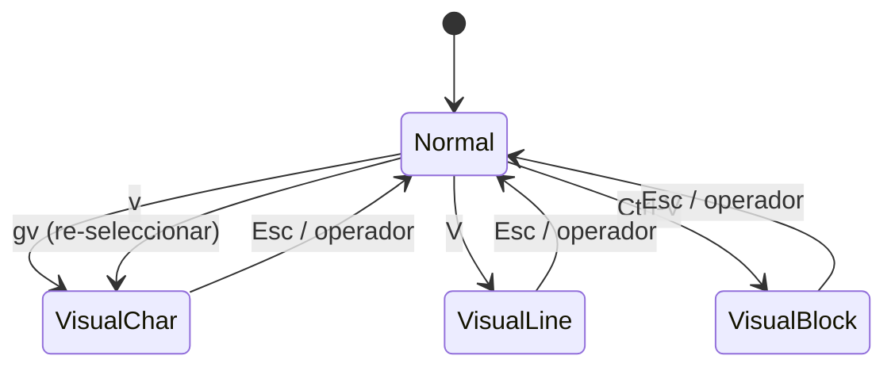

# 📘 Nivel 03 — Text objects y modo Visual

---

## 1. La joya de Vim

Los **text objects** son lo que hace a Vim genuinamente único. La gramática estándar:

```
[operador]   [a | i]   [objeto]
    c          i          w        →  cambia "inner word"
    d          a          "        →  borra "around quote" (incluye comillas)
    y          i          {        →  copia "inner brace" (sin las llaves)
```

- **`i` (inner)**: solo el contenido, sin los delimitadores.
- **`a` (around)**: el contenido **+ los delimitadores** (y a veces un espacio).

> **La clave mental:** una vez interiorizas text objects, ya no piensas en cursores ni posiciones. Piensas en **"esta palabra", "este párrafo", "lo de dentro de las comillas"** — y Vim lo hace.

---

## 2. Tabla maestra de text objects

| Objeto | `i` (inner) | `a` (around) |
|---|---|---|
| Palabra | `iw` solo la palabra | `aw` palabra + espacio |
| WORD (incluye puntuación) | `iW` | `aW` |
| Frase (separada por `.` `!` `?`) | `is` | `as` |
| Párrafo (líneas en blanco) | `ip` | `ap` |
| Comilla doble | `i"` | `a"` |
| Comilla simple | `i'` | `a'` |
| Backtick | `` i` `` | `` a` `` |
| Paréntesis `(...)` | `i(` o `ib` | `a(` o `ab` |
| Llaves `{...}` | `i{` o `iB` | `a{` o `aB` |
| Corchetes `[...]` | `i[` | `a[` |
| Angulares `<...>` | `i<` | `a<` |
| Tag HTML/XML `<p>…</p>` | `it` | `at` |

> **Ejemplos en código (los más usados a diario):**
> - `ci"` cambia el contenido entre comillas dobles (no las comillas).
> - `da(` borra los paréntesis y todo lo de dentro.
> - `vi{` selecciona el cuerpo de una función.
> - `cit` cambia el contenido de un tag HTML.
> - `yip` copia un párrafo entero.

> **Truco de oro:** no necesitas estar dentro del objeto. Desde CUALQUIER punto de la línea/párrafo, `dap` borra todo el párrafo. Vim busca el objeto más cercano.

---

## 3. El modo Visual — selección con teclado

Modo Visual = "haz una selección, luego decide qué hacerle". Tres sabores:

| Comando | Tipo |
|---|---|
| `v` | Visual **carácter** — selecciona desde el cursor letra a letra |
| `V` | Visual **línea** — selecciona líneas enteras |
| `Ctrl-V` | Visual **bloque** — selección rectangular (columnas) |

Mientras estás en Visual:
- Te mueves con cualquier comando de movimiento (`w`, `$`, `G`, `/...`, `i{`, …).
- Pulsas un operador (`d`, `y`, `c`, `>`, `=`, …) y se ejecuta sobre la selección.
- `o` cambia el cursor del extremo activo al otro.
- `gv` (en Normal, después) re-selecciona la última selección Visual.



---

## 4. Visual bloque — el modo que VS Code nunca tendrá bien

`Ctrl-V` permite seleccionar una **caja rectangular**. Aplicar un operador a esa caja afecta a todas las líneas implicadas a la vez.

```
" Texto:
"   foo = 1
"   foo = 2
"   foo = 3
"
" Quiero cambiar 'foo' por 'bar' en las 3:
"   1) Cursor en la 'f' de la primera línea
"   2) Ctrl-V
"   3) 2j (baja 2 líneas, seleccionas la 'f' de las 3)
"   4) e (extiende selección hasta el final de 'foo' en las 3)
"   5) c (borra y entra en Insert — solo borra de la primera)
"   6) Escribes "bar"
"   7) Esc — y entonces se replica en TODAS las líneas
```

Otros usos clásicos:
- **Insertar texto en una columna**: `Ctrl-V` + `j…j` + `I` + texto + `Esc` → texto en N líneas.
- **Añadir comillas a un bloque**: `Ctrl-V` selecciona inicios, `I"` + Esc, mover al fin, `A"` + Esc.
- **Borrar una columna**: `Ctrl-V` + `l/h` para ancho + `j…j` + `d`.

---

## 5. Operadores que cobran sentido en Visual

| Operador en Visual | Qué hace |
|---|---|
| `d` | borra la selección |
| `c` | cambia la selección (entra a Insert) |
| `y` | copia la selección |
| `>` | indenta una vez |
| `<` | des-indenta una vez |
| `=` | re-indenta automáticamente |
| `u` / `U` | a minúsculas / a MAYÚSCULAS |
| `gU` / `gu` | igual pero desde Normal: `gUiw` palabra a mayúsculas |
| `~` | invierte caso de la selección |
| `J` | une las líneas seleccionadas (las junta en una) |

> **Para el examen:** `=G` re-formatea desde la línea actual hasta el final. `gg=G` re-formatea TODO el archivo. Útil con código mal indentado.

---

## 6. Combinaciones canónicas (memoriza estas)

| Acción | Combinación |
|---|---|
| Cambiar contenido entre comillas dobles | `ci"` |
| Borrar contenido entre paréntesis (sin paréntesis) | `di(` |
| Borrar paréntesis Y contenido | `da(` |
| Copiar la palabra bajo el cursor | `yiw` |
| Seleccionar la función entera (cuerpo `{...}`) | `vi{` o `va{` |
| Cambiar texto de un tag HTML | `cit` |
| Borrar la línea entera (todo y line break) | `dd` (no es text object pero equivale) |
| Seleccionar párrafo | `vip` o `vap` |
| Mayúsculas a la palabra | `gUiw` |
| Re-indentar la función entera | `=i{` |

Estas 10 son el 80% de tus edits diarios en código.

---

## 7. Diferencia crucial — `iw` vs `aw`, `i"` vs `a"`

```
"  esta es la palabra
"  ^^^^^^^^^^^^^^^^
"  diw → borra "palabra"
"  daw → borra " palabra" (el espacio inicial incluido)
```

```
"  "el contenido"
"   ^^^^^^^^^^^^
"  ci" → cambia 'el contenido' (deja las comillas)
"  ca" → cambia '"el contenido"' (borra todo, incluidas comillas)
```

> **Cuándo usar uno u otro:** `i` cuando quieres reemplazar el CONTENIDO conservando el envoltorio. `a` cuando quieres eliminar/cambiar el envoltorio TAMBIÉN.

---

## 8. Diagrama mental del Nivel 03

```mermaid
flowchart TD
    A[Quiero operar sobre X] --> B{X es...}
    B -->|una palabra| C[iw / aw]
    B -->|entre comillas| D[i\" / a\"]
    B -->|entre paréntesis| E[i( / a(]
    B -->|entre llaves| F[i{ / a{]
    B -->|un tag HTML| G[it / at]
    B -->|un párrafo| H[ip / ap]
    B -->|una selección visual| I[v / V / Ctrl-V]
    
    C --> J[Combina con operador: d c y]
    D --> J
    E --> J
    F --> J
    G --> J
    H --> J
    I --> J
```

---

## Referencia de Ejercicios

| Ejercicio | Archivo | Concepto |
|---|---|---|
| 03.01 | `ej01_text_objects_palabra_parrafo.txt` | iw aw is as ip ap |
| 03.02 | `ej02_text_objects_delim.txt` | i" a" i( a( i{ a{ i[ a[ |
| 03.03 | `ej03_visual_char_y_linea.txt` | v V con operadores d c y > < |
| 03.04 | `ej04_visual_bloque.txt` | Ctrl-V edición rectangular |
| 03.05 | `ej05_text_objects_integrador.txt` | Integrador con código tipo Java |
