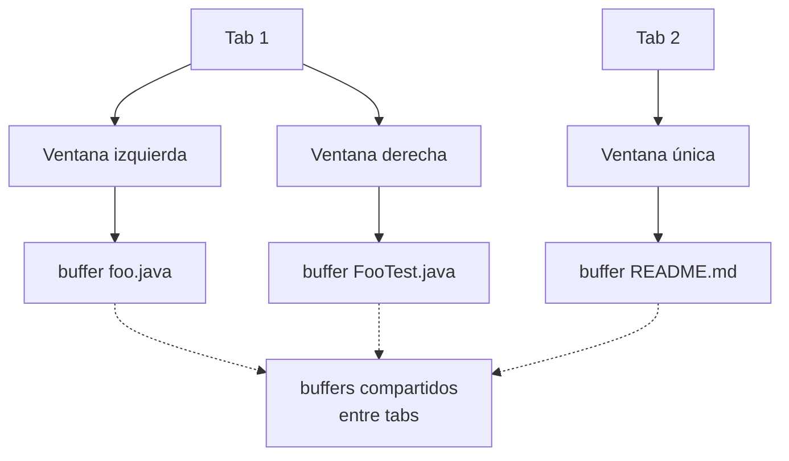
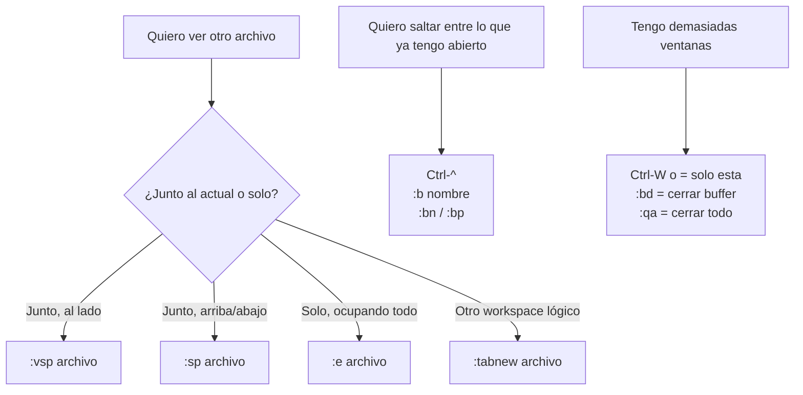

# 📘 Nivel 04 — Buffers, ventanas y tabs

---

## 1. La diferencia que NADIE explica el primer día

Vim distingue tres conceptos que mucha gente confunde:

| Concepto | Qué es | Analogía |
|---|---|---|
| **Buffer** | Un archivo cargado en memoria | Una pestaña de Chrome (existe aunque no la veas) |
| **Ventana** (window) | Un viewport (panel) que muestra un buffer | Una ventana del SO mostrando una pestaña |
| **Tab** (tabpage) | Un conjunto de ventanas con layout propio | Un workspace/escritorio virtual |



> **La clave mental:** los buffers son globales (existen una vez). Las ventanas y tabs son la forma en que los **enseñas**. Cerrar una ventana NO cierra el buffer.

> **Error típico:** "voy a usar tabs como en VS Code" — NO. En Vim los tabs son LAYOUTS, no archivos. Para "pestañas de archivo" usa **buffers** (con plugins tipo bufferline si quieres verlos, Nivel 08).

---

## 2. Buffers — el almacén

| Comando | Qué hace |
|---|---|
| `:e ruta` | abre el archivo (crea buffer + lo muestra en ventana actual) |
| `:e %:h/` | abre algo en el directorio del archivo actual (`%:h` = head = directorio) |
| `:ls` o `:buffers` | lista todos los buffers cargados |
| `:b nombre` | salta al buffer cuyo nombre contiene "nombre" (admite tab-completion) |
| `:b 3` | salta al buffer número 3 (los números los ves en `:ls`) |
| `:bn` `:bp` | siguiente / anterior buffer |
| `Ctrl-^` | alterna entre el buffer actual y el "alterno" (el previo) |
| `:bd` | borra el buffer (lo descarga de memoria, cierra ventanas que lo muestren) |
| `:bw` | borra y olvida (más radical) |

Indicadores en `:ls`:
- `%` buffer actual · `#` alterno · `a` activo · `h` oculto · `+` modificado.

> **Patrón de oro:** trabaja con TODOS tus archivos como buffers. Abrir un archivo nuevo con `:e` no cierra el anterior — ambos viven, navegas entre ellos con `Ctrl-^` (alterno) o `:b nombre`.

---

## 3. Ventanas — splits

| Comando | Qué hace |
|---|---|
| `:sp` o `:split` | divide horizontalmente (nueva ventana arriba con el mismo buffer) |
| `:sp archivo` | divide y carga `archivo` en la nueva |
| `:vsp` o `:vsplit` | divide verticalmente |
| `:new` / `:vnew` | divide y abre un buffer vacío |
| `Ctrl-W s` | igual que `:sp` |
| `Ctrl-W v` | igual que `:vsp` |
| `Ctrl-W q` | cierra la ventana actual |
| `Ctrl-W o` | "only" — cierra TODAS las demás ventanas (te deja solo) |
| `Ctrl-W h/j/k/l` | mueve cursor a la ventana izquierda/abajo/arriba/derecha |
| `Ctrl-W H/J/K/L` | MUEVE la ventana entera a izda/abajo/arriba/dcha |
| `Ctrl-W =` | iguala el tamaño de todas las ventanas |
| `Ctrl-W _` | maximiza altura de la actual |
| `Ctrl-W |` | maximiza anchura de la actual |
| `Ctrl-W +` / `Ctrl-W -` | aumenta/disminuye altura |
| `Ctrl-W >` / `Ctrl-W <` | aumenta/disminuye anchura |
| `:resize 20` o `:vertical resize 80` | tamaño exacto |

```
" Layout típico de trabajo:
"
"  +-----------------+--------------------+
"  |                 |                    |
"  |  Foo.java       |  FooTest.java      |
"  |                 |                    |
"  +-----------------+--------------------+
"  |  terminal o output                   |
"  +--------------------------------------+
```

> **Truco indispensable:** memoriza `Ctrl-W h j k l` antes que nada. Una vez fluyen, los splits dejan de ser un estorbo.

---

## 4. Tabs — workspaces

Los tabs son útiles cuando trabajas en cosas **completamente distintas** dentro de la misma sesión. Por ejemplo: tab 1 con tu código, tab 2 con tu documentación, tab 3 con un script ad-hoc.

| Comando | Qué hace |
|---|---|
| `:tabnew` | nueva tab vacía |
| `:tabnew archivo` | nueva tab con archivo |
| `:tabe archivo` | igual que `:tabnew archivo` |
| `:tabc` | cierra la tab actual |
| `:tabo` | "only" — cierra todas las demás tabs |
| `gt` o `:tabn` | siguiente tab |
| `gT` o `:tabp` | tab anterior |
| `{n}gt` | salta a la tab número n |
| `:tabmove +1` / `:tabmove 0` | reordenar |

> **Filosofía Omarchy/LazyVim:** se usan POCO los tabs. Buffer + ventana + `<leader>ff` (picker) es más rápido. Pero saber que existen es necesario para emergencias y para entender layouts complejos.

---

## 5. Argumentos en línea de comandos

```bash
nvim foo.txt bar.txt baz.txt
nvim *.java
nvim .                  # abre el directorio actual con explorer
nvim -O foo.txt bar.txt # abre con splits verticales lado a lado
nvim -o foo.txt bar.txt # abre con splits horizontales
nvim -p *.txt           # abre cada archivo en su propia tab
nvim +42 foo.txt        # abre foo.txt y va a la línea 42
nvim +/patron foo.txt   # abre y busca 'patron'
nvim -R foo.txt         # READ-ONLY (solo lectura)
nvim -d a.txt b.txt     # MODO DIFF: comparación visual
```

| Comando dentro | Para |
|---|---|
| `:next` / `:N` | siguiente / anterior archivo del arglist |
| `:args` | ver el arglist |
| `:argadd archivo` | añadir un archivo al arglist |
| `:argdo comando` | ejecuta `comando` en cada archivo del arglist |

---

## 6. Guardado y salida con múltiples buffers/ventanas

| Comando | Efecto |
|---|---|
| `:w` | guarda el buffer actual |
| `:wa` | guarda **todos** los buffers modificados |
| `:q` | cierra ventana actual (si era la última, sale) |
| `:wq` | guarda actual y cierra ventana |
| `:wqa` | guarda todos y sale |
| `:qa` | sale (avisa si hay sin guardar) |
| `:qa!` | sale a la fuerza (descarta cambios) |
| `ZZ` / `ZQ` | atajos sin `:` para `:wq` / `:q!` |

> **Para el examen mental:**
> `qa` cierra TODO. `qa!` cierra TODO descartando cambios sin preguntar — peligro.

---

## 7. Diagrama mental del Nivel 04



---

## Referencia de Ejercicios

| Ejercicio | Archivo | Concepto |
|---|---|---|
| 04.01 | `ej01_buffers.md` | :e :ls :b :bn :bd Ctrl-^ |
| 04.02 | `ej02_splits_horizontales_y_verticales.md` | :sp :vsp Ctrl-W navegación |
| 04.03 | `ej03_tabs.md` | :tabnew gt gT {n}gt |
| 04.04 | `ej04_argumentos_cli.md` | nvim file1 file2, -O -o -p, +N |
| 04.05 | `ej05_integrador_workflow_real.md` | Layout 2x2 + buffers + save-all |

> Estos ejercicios son **mixtos**: la edición concreta dentro de cada archivo es pequeña — lo importante es practicar la **navegación** entre buffers/ventanas/tabs. Cada ejercicio te indica abrir más de un archivo a la vez.
